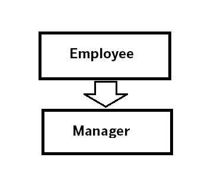
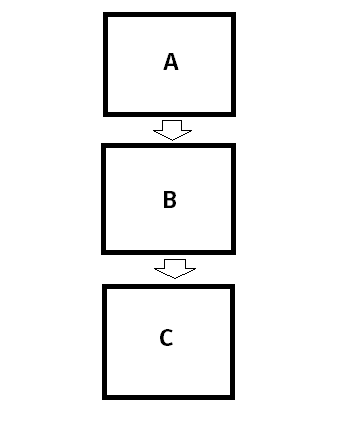
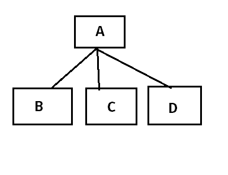
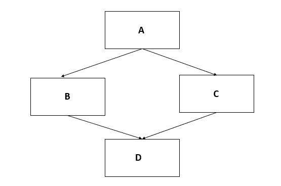

# Java 继承

> 原文： [https://howtodoinjava.com/oops/java-inheritance/](https://howtodoinjava.com/oops/java-inheritance/)

Java 中的**继承[IS-A 关系]** 是指子对象继承或从父对象获取所有属性和行为的能力。 在面向对象的编程中，继承用于提升代码的可重用性。

在本 Java 教程中，我们将学习 Java 支持的**继承类型**和 Java 应用程序中**如何实现继承**。

```java
Table of Contents

1\. What is inheritance
2\. Types of Inheritance in Java
    - 2.1\. Single Inheritance
    - 2.2\. Multilevel Inheritance
    - 2.3\. Hierarchical Inheritance
    - 2.4\. Multiple inheritance
3\. Accessing Inherited Super Class Members
    - 3.1\. Constructors
    - 3.2\. Fields
    - 3.3\. Methods
4\. Summary
```

## 1\. Java 中的继承是什么

如前所述，继承就是通过派生类（子类或子类）继承父类（超类）的**公共状态和行为**。 默认情况下，子类可以继承超类的所有**非私有成员**。

在 Java 中，**扩展了**关键字，用于类之间的继承。 我们来看一个快速继承的例子。

#### 1.1 Java 继承示例

假设我们有`Employee`类。 雇员类具有组织中所有雇员必须具有的所有公共属性和方法。 也可以有其他专业员工，例如 `Manager`。 经理是组织的正式员工，但与其他员工相比，他们的属性却很少。 他们有报告人或下属。

让我们设计以上类。

```java
public class Employee 
{   
    private Long id;
    private String firstName;
    private String lastName;

    public Long getId() {
        return id;
    }
    public void setId(Long id) {
        this.id = id;
    }
    public String getFirstName() {
        return firstName;
    }
    public void setFirstName(String firstName) {
        this.firstName = firstName;
    }
    public String getLastName() {
        return lastName;
    }
    public void setLastName(String lastName) {
        this.lastName = lastName;
    }
    @Override
    public String toString() {
        return "Employee [id=" + id + ", firstName=" + firstName + ", lastName=" + lastName + "]";
    }
}

```

```java
import java.util.List;

public class Manager extends Employee 
{
    private List<Employee> subordinates;

    public List<Employee> getSubordinates() {
        return subordinates;
    }

    public void setSubordinates(List<Employee> subordinates) {
        this.subordinates = subordinates;
    }

    @Override
    public String toString() {
        return "Manager [subordinates=" + subordinates + ", details=" + super.toString() + "]";
    }
}

```

在上述实现中，员工具有`id`，`firstName`和`lastName`之类的公共属性； 而经理仅具有专门的`subordinates`属性。 要从`Employee`类继承所有非私有成员（在本例中为获取器和设置器方法），请使用`Manager extends Employee`。

让我们看看它是如何工作的？

```java
public class Main 
{
    public static void main(String[] args) 
    {
        Manager mgr = new Manager();

        mgr.setId(1L);
        mgr.setFirstName("Lokesh");
        mgr.setLastName("Gupta");

        System.out.println(mgr);
    }
}

```

程序输出。

```java
Manager [subordinates=null, details=Employee [id=1, firstName=Lokesh, lastName=Gupta]]

```

显然，`Manager`类可以使用`Employee`类的成员。 这种行为称为继承。 很简单，不是吗？

现在考虑是否不使用继承。 然后，我们将在两个类中都定义 id，firstName 和 lastName。 这会导致代码重复，这总是在代码维护中造成问题。

## 2\. Java 中的继承类型

在 Java 中，继承可以是**四种类型**之一-取决于类层次结构。 让我们了解所有四种继承。

#### 2.1 单继承

这很简单。 有一个家长班和一个孩子班。 **一个子类扩展了一个父类**。 它是单一继承。 上面的示例代码（员工和管理者）是单继承的示例。



Java 单一继承

#### 2.2 多级继承

在多级继承中，将在三个以上的类之间进行继承，使得**子类将充当另一个子类**的父类。 让我们用一个图表来理解。



多级继承

在上面的示例中，类`B`扩展了类`A`，因此类`B`是类`A`的子类。 但是`C`扩展了`B`，因此`B`是`C`的父类。 因此`B`既是父类，也是子类。

#### 2.3 层次继承

在分层继承中，有**个超类，并且有多个子类**扩展了超类。



层次继承

这些子类`B`，`C`和`D`将共享从`A`继承的公共成员，但是它们彼此之间不会相互意识到。

#### 2.4 多重继承

在多重继承中，一个类也可以从多个父类中继承行为。 让我们来了解一下图表。



多重继承

在图中，`D`扩展了`A`和`B`类。 这样，`D`可以继承两个类的非私有成员。

但是，在 Java 中，不能将`extends`关键字用于两个类。 那么，多重继承将如何工作？

> 直到 JDK 1.7，在 Java 中都无法进行多重继承。 但是从 JDK 1.8 开始的**，可以通过使用具有默认方法**的接口来实现[多重继承](//howtodoinjava.com/object-oriented/multiple-inheritance-in-java/)。

## 3\. 访问继承的父类成员

现在我们知道，使用四种类型的继承机制，我们可以访问父类的非私有成员。 让我们看看如何访问单个成员。

#### 3.1 父类的构造器

可以通过`super`关键字来调用超类的构造器。 只有两个规则：

1.  `super()`调用必须从子类构造器进行。
2.  `super()`调用必须是构造器中的第一条语句。

```java
public class Manager extends Employee 
{
    public Manager() 
    {
        //This must be first statement inside constructor
        super();

        //Other code after super class
    }
}

```

#### 3.2 父班级字段

在 Java 中，非私有成员字段可以在子类中继承。 您可以使用点运算符来访问它们，例如 `manager.id`。 这里`id`属性是从父类`Employee`继承的。

在父类和子类中处理具有相同名称的字段时，需要小心。 请记住， **java 字段不能被覆盖**。 具有相同名称的字段会在通过子类访问时对父类隐藏该字段。

在这种情况下，将基于引用类型的**类来确定访问的属性。**

```java
ReferenceClass variable = new ActualClass();
```

在上述情况下，将从`ReferenceClass`访问成员字段。 例如

```java
//Parent class
public class Employee 
{   
    public Long id = 10L;
}

//Child class
public class Manager extends Employee 
{
    public Long id = 20L;   //same name field
}

public class Main {
    public static void main(String[] args) 
    {
        Employee manager = new Manager();
        System.out.println(manager.id);     //Reference of type Employee

        Manager mgr = new Manager();
        System.out.println(mgr.id);     //Reference of type Manager
    }
}

Output:

10
20

```

#### 3.3 父类方法

与字段访问相反，方法访问使用在运行时创建的实际对象的类型。

java] ReferenceClass 变量= new ActualClass（）; [/ java]

在上述情况下，将从`ActualClass`访问成员方法。 例如

```java
public class Employee 
{   
    private Long id = 10L;

    public Long getId() {
        return id;
    }
}

public class Manager extends Employee 
{
    private Long id = 20L;

    public Long getId() {
        return id;
    }
}

public class Main 
{
    public static void main(String[] args) 
    {
        Employee employee = new Employee();     //Actual object is Employee Type
        System.out.println(employee.getId());

        Employee manager = new Manager();       //Actual object is Manager Type
        System.out.println(manager.getId());

        Manager mgr = new Manager();       //Actual object is Manager Type
        System.out.println(mgr.getId());
    }
}

Output:

10
20
20

```

## 4\. 总结

让我们总结一下我们对 **java 继承**的了解：

*   继承也称为 **IS-A** 关系。
*   它为子类提供了继承父类的非私有成员的能力。
*   在 Java 中，继承是通过`extends`关键字实现的。
*   从 [Java 8](//howtodoinjava.com/java-8-tutorial/) 开始，您可以使用具有默认方法的接口来实现多重继承。
*   从引用类型类访问成员字段。
*   成员方法是从实际实例类型访问的。

如果有任何问题，请在评论部分中向我发送。

学习愉快！