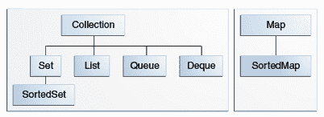

# Java 中的集合

> 原文： [https://howtodoinjava.com/java-collections/](https://howtodoinjava.com/java-collections/)

顾名思义，集合是一组对象。 **Java 集合框架**由接口和类组成，这些接口和类有助于处理不同类型的集合，例如**列表，集合，映射，栈和队列**等。

这些现成的集合类解决了许多非常常见的问题，在这些问题中，我们需要处理一组同构对象和异类对象。 其中的常见操作涉及**添加，删除，更新，排序，搜索**和更复杂的算法。 这些集合类使用**集合 API** 为所有此类操作提供了非常透明的支持。

## 1\. Java 集合层次结构

借助**核心接口**可以更好地理解集合框架。 集合类实现这些接口并提供具体功能。



Java 集合层次结构

#### 1.1 集合

**集合接口**位于层次结构的根部。 集合接口提供所有集合类必须支持（或抛出`UnsupportedOperationException`）的所有通用方法。 它扩展了`Iterable`接口，该接口使用“[**`for-each`循环**](https://howtodoinjava.com/java/basics/enhanced-for-each-loop-in-java/)”语句添加了对集合元素进行迭代的支持。

所有其他集合接口和类（`Map`除外）都可以扩展或实现此接口。 例如，列表（已索引，有序）和集（已排序）接口实现了此集合。

#### 1.2 列表

**列表**表示元素的**有序**集合。 使用列表，我们可以按元素的整数索引（列表中的位置）访问元素，并在列表中搜索元素。 索引以`0`开头，就像数组一样。

实现`List`接口的一些有用的类是 – `ArrayList`，`CopyOnWriteArrayList`， `LinkedList`，`Stack`和`Vector`。

#### 1.3 集合

**集合**代表**排序的**元素的集合。 集合不允许重复的元素。`Set`接口不能保证以任何可预测的顺序返回元素。 尽管某些`Set`实现以其[自然顺序](https://howtodoinjava.com/java/collections/java-comparable-interface/)存储元素并保证此顺序。

实现`Set`接口的一些有用的类是 – `ConcurrentSkipListSet`， `CopyOnWriteArraySet`， `EnumSet`，`HashSet`，`LinkedHashSet`和`TreeSet`。

#### 1.4 映射

`Map`接口使我们能够将数据存储在*键值对*中（键应该是不可变的）。 映射不能包含重复的键； 每个键最多可以映射到一个值。

`Map`接口提供了三个集合视图，这些视图允许将映射的内容作为一组键，值的集合或一组键值映射来查看。 一些映射实现（例如`TreeMap`类）对其顺序做出特定的保证。 其他的（例如`HashMap`类）则没有。

实现`Map`接口的一些有用的类是 – `ConcurrentHashMap`，`ConcurrentSkipListMap`，`EnumMap`，`HashMap`，`HashTable`，`IdentityHashMap`，`LinkedHashMap`，`Property`，`TreeMap`和`WeakHashMap`。

#### 1.5 `Stack`

Java `Stack`接口表示经典的栈数据结构，其中的元素可以被推入对象的后进先出（LIFO）栈。 在栈中，我们将元素推到栈的顶部，然后再次从栈顶部弹出。

#### 1.6 `Queue`

队列数据结构旨在在由使用者线程进行处理之前保存元素（由生产者线程放入）。 除了基本的“集合”操作外，队列还提供其他插入，提取和检查操作。

队列通常但不一定以 FIFO（先进先出）的方式对元素进行排序。 一种此类异常情况是优先级队列，该队列根据提供的[比较器](https://howtodoinjava.com/java/collections/java-comparator/)或元素的自然顺序对元素进行排序。

通常，队列不支持阻止插入或检索操作。 阻塞队列实现类实现了`BlockingQueue`接口。

实现`Map`接口的一些有用的类是 – `ArrayBlockingQueue`，`ArrayDeque`，`ConcurrentLinkedDeque`，`ConcurrentLinkedQueue`，`DelayQueue`，`LinkedBlockingDeque`，`LinkedBlockingQueue`，`LinkedList`，`LinkedTransferQueue`，`PriorityBlockingQueue`，`PriorityQueue`和`SynchronousQueue`。

#### 1.7 `Deque`

一个双端队列（发音为“DQ”），支持两端的元素插入和移除。 当双端队列用作队列时，将产生 [FIFO（先进先出）](https://en.wikipedia.org/wiki/FIFO_(computing_and_electronics))行为。 当双端队列用作栈时，将产生 LIFO（后进先出）行为。

此接口应优先于旧版`Stack`类使用。 当双端队列用作栈时，元素从双端队列的开头被压入并弹出。

实现此接口的一些常见的已知类是`ArrayDeque`，`ConcurrentLinkedDeque`，`LinkedBlockingDeque`和`LinkedList`。

## 2\. Java 集合和泛型

有目的的[泛型](https://howtodoinjava.com/java/generics/complete-java-generics-tutorial/)提供类型安全性。 它检测到不兼容的类型（在方法参数中），并在运行时防止`ClassCastException`。 同样在 Java 集合中，我们可以定义一个集合类以仅存储某种类型的对象。 所有其他类型均应禁止。 这是通过泛型完成的。

在给定的示例中，允许使用前两个`add（）`方法。 第三者将无法编译并给出错误 - “类型为`HashMap<Integer,String>`的`put(Integer, String)`方法不适用于参数`(String, String)`”。 它有助于及早发现不兼容的类型，以防止运行时发生不可预测的行为。

```java
HashMap<Integer, String> map = new HashMap<>();

map.put(1, "A");	//allowed
map.put(2, "B");	//allowed

map.put("3", "C");	//NOT allowed - Key is string

```

## 3\. `equals()`和`hashCode()`方法

许多集合类提供特定的特征，例如排序的元素，没有重复的元素等。要实现此行为，添加的元素（对象）必须正确实现 [`equals()`和`hashCode()`方法](https://howtodoinjava.com/java/basics/java-hashcode-equals-methods/)。

所有 Java 包装器类和`String`类均以其特定实现覆盖这些函数，因此它们在此类集合中的行为正确。 我们还需要确保在用户定义的自定义类中正确覆盖了这些函数。

```java
SortedSet<Integer> sortedSet = new TreeSet<>();

sortedSet.add(2);

sortedSet.add(1);
sortedSet.add(1);

sortedSet.add(3);

System.out.println(sortedSet); 	//[1,2,3]

```

## 4\. Java 8 集合

[Java 8](https://howtodoinjava.com/java-8-tutorial/) 是主要版本，它引入了 Java 编程中的 [lambda 样式](https://howtodoinjava.com/java8/complete-lambda-expressions-tutorial-in-java/)。 结果，集合类也得到了改善。 例如，我们可以单行遍历集合，并使用`forEach`语句对集合的所有元素执行操作。

```java
ArrayList<Integer> list = new ArrayList<>();

list.add(1);
list.add(2);
list.add(3);

list.forEach(System.out::print);

```

## 5\. Java 集合的好处

*   **一致且可重用的API** – 这是任何框架所做的。 它提供了一组一致的类方法，这些方法可用于一遍又一遍地解决一组类似的问题，而不会得到无法预测的结果。 Java 集合框架还有助于以一致的方式解决与一组对象有关的常见问题。

    所有集合类都具有一致的实现，并提供一些常见的方法，例如`add`，`get`，`put`，`remove`等。无论您要处理哪种数据结构，这些方法都将根据基础实现工作并透明地执行操作。

*   **更少的开发时间** – 通用且可预测的框架总是会减少开发时间，并有助于快速编写应用程序。 Java 集合还有助于对对象和集合执行一些最重复的常见任务，从而改善时间因素。
*   **性能** – Java 集合 API 是由一些最杰出的行业人士编写的，它们的性能在大多数情况下都是一流的。 Oracle 和非常热心的 Java 开发人员社区正在进行的开发工作有助于使它变得更好。
*   **干净的代码** – 这些 API 都是使用所有良好的[编码惯例](https://howtodoinjava.com/java-best-practices/)编写的，并且记录得很好。 它们在整个 Java 集合框架中遵循特定的标准。 它使程序员的代码看起来干净整洁。

    由于一致的类和方法名称，因此代码也更易于阅读。

## 6\. Java 集合示例

*   [数组](https://howtodoinjava.com/java-array/)
*   [`ArrayList`](https://howtodoinjava.com/java-arraylist/)
*   [`LinkedList`](https://howtodoinjava.com/java/collections/java-linkedlist-class/)
*   [`HashMap`](https://howtodoinjava.com/java-hashmap/)
*   [`HashMap`](https://howtodoinjava.com/java/collections/hashtable-class/)
*   [`LinkedHashMap`](https://howtodoinjava.com/java/collections/linkedhashmap/)
*   [`TreeMap`](https://howtodoinjava.com/java/collections/treemap-class/)
*   [`HashSet`](https://howtodoinjava.com/java/collections/java-hashset/)
*   [`LinkedHashSet`](https://howtodoinjava.com/java/collections/java-linkedhashset/)
*   [`TreeSet`](https://howtodoinjava.com/java/collections/java-treeset-class/)
*   [`Comparable`](https://howtodoinjava.com/java/collections/java-comparable-interface/)
*   [`Comparator`](https://howtodoinjava.com/java/collections/java-comparator/)
*   [`Iterator`](https://howtodoinjava.com/java/collections/java-iterator/)
*   [`ListIterator`](https://howtodoinjava.com/java/collections/java-listiterator/)
*   [`Spliterator`](https://howtodoinjava.com/java/collections/java-spliterator/)
*   [`PriorityQueue`](https://howtodoinjava.com/java/collections/java-priorityqueue/)
*   [`PriorityBlockingQueue`](https://howtodoinjava.com/java/collections/java-priorityblockingqueue/)
*   [`ArrayBlockingQueue`](https://howtodoinjava.com/java/collections/java-arrayblockingqueue/)
*   [`LinkedTransferQueue`](https://howtodoinjava.com/java/collections/transferqueue-linkedtransferqueue/)
*   [`CopyOnWriteArrayList`](https://howtodoinjava.com/java/collections/java-copyonwritearraylist/)
*   [`CopyOnWriteArraySet`](https://howtodoinjava.com/java/collections/java-copyonwritearrayset/)
*   [集合排序](https://howtodoinjava.com/java-sorting-guide/)
*   [面试问题](https://howtodoinjava.com/interview-questions/useful-java-collection-interview-questions/)

阅读更多：

[Wikepedia 链接](https://en.wikipedia.org/wiki/Java_collections_framework)
[Java 文档](https://docs.oracle.com/javase/tutorial/collections/index.html)