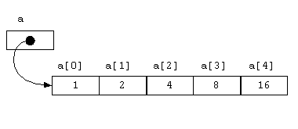

# Java 中的数组

> 原文： [https://howtodoinjava.com/java-array/](https://howtodoinjava.com/java-array/)

**数组**是一个容器对象，在**连续内存位置**中保存**单类型**的**固定数量的值**。 它是一种数据结构，用于存储有限数量的元素，并且所有元素必须具有相似的数据类型。

数组是基于索引的数据结构，因此它们允许对存储的元素进行随机访问。 索引以`'0'`开头。

## 1.内存中的数组表示

在此示例中，我们创建了一个由 5 个元素组成的数组。 索引的范围是`'0'`至`'4'`。

```java
int[] a = new int[5];

a[0] = 1;
a[1] = 2;
a[2] = 4;
a[3] = 8;
a[4] = 16;

```

上面示例的图形表示可以如下。



内存阵列

## 2.阵列功能

*   数组也是 Java 中`Object`的子类型。
*   数组是对象，因此我们可以使用`'length'`属性找到数组的长度。
*   Java 数组是类型。 我们可以声明数组类型的[变量](https://howtodoinjava.com/java/basics/java-variables/)。
*   数组是有序的，并且每个元素的索引都从`'0'`开始。
*   数组可以存储原始类型以及对象。 但是在一个数组实例中，所有都必须是单一类型。
*   就像其他变量一样，数组也可以是[`static`](https://howtodoinjava.com/java/basics/java-static-keyword/)，`final`或用作方法参数。
*   数组的大小必须由`int`值指定。
*   Java 数组是[`Cloneable`](https://howtodoinjava.com/java/cloning/a-guide-to-object-cloning-in-java/)和[`Serializable`](https://howtodoinjava.com/java/serialization/a-mini-guide-for-implementing-serializable-interface-in-java/)。

## 3\. Java 中的数组类型

数组可以是两种类型之一。

#### 3.1。 一维数组

仅存储图元或对象的数组称为一维数组。 一维数组声明的一般形式为：

```java
type var-name[];
OR
type[] var-name;

//Examples

int[] numbers;

String names[];

```

#### 3.2。 多维数组

多维数组存储其他数组。 它是**个数组**的数组。 在多维数组中，数组的每个元素都包含其他数组的引用。 多维数组是通过在每个维上附加一组方括号（`[ ]`）来创建的。

```java
type var-name[][];
OR
type[][] var-name;

//Examples

int[][] cordinates;

String nameSets[][];

```

## 4.数组示例

[如何检查数组是否包含元素](https://howtodoinjava.com/array/array-arraylist-contains-example/)
[Java 数组克隆示例](https://howtodoinjava.com/array/java-array-clone-shallow-copy/)
[Java 数组深度复制示例](https://howtodoinjava.com/array/java-array-deep-copy-example/)
[转换字符串为 字符串数组](https://howtodoinjava.com/array/string-to-string-array/)
[如何打印数组](https://howtodoinjava.com/array/print-2d-array-matrix/)
[Java 复制数组范围](https://howtodoinjava.com/array/copy-array-range/)
[如何复制数组](https://howtodoinjava.com/array/array-copy/)
[将字节数组转换为字符串](https://howtodoinjava.com/array/java-convert-byte-array-to-string-example/)
[将字符串转换为字节数组](https://howtodoinjava.com/array/convert-byte-array-string-vice-versa/)
[打印数组的内容](https://howtodoinjava.com/array/how-to-print-the-content-of-array-in-java/)
[删除数组中的重复元素](https://howtodoinjava.com/array/array-remove-duplicate-elements/)

学习愉快！