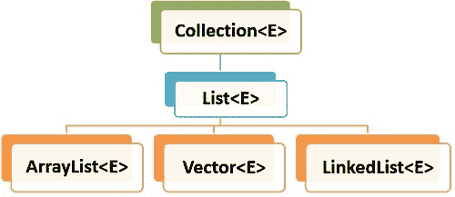

# Java ArrayList 指南

> 原文： [https://howtodoinjava.com/java-arraylist/](https://howtodoinjava.com/java-arraylist/)

Java 中的 **ArrayList 表示可调整大小的对象列表。 我们可以在此列表中添加，删除，查找，排序和替换元素。 ArrayList 是 Java 的收集框架的一部分，并实现 Java 的 **List** 接口。**

**ArrayList 类**的层次结构

Java ArrayList 类扩展了实现`List`接口的`AbstractList`类。 List 接口以分层顺序扩展了`Collection`和`Iterable`接口。



ArrayList 层次结构

## 1\. ArrayList 功能

ArrayList 具有以下功能 – 

1.  **有序** – arraylist 中的元素保留其顺序，默认情况下是其添加到列表的顺序。
2.  **基于索引的** – 可以使用索引位置随机访问元素。 索引以`'0'`开头。
3.  **动态调整大小** – 当需要添加的元素数量超过当前大小时，ArrayList 动态增长。
4.  **不同步** – 默认情况下，ArrayList 不同步。 程序员需要适当地使用`synchronized`关键字，或简单地使用 **Vector** 类。
5.  **允许重复** – 我们可以在 arraylist 中添加重复元素。 不能成组放置。

## 2\. ArrayList 的内部工作

ArrayList 类是围绕后备数组实现的。 从 arraylist 添加或删除的元素实际上是在此后备数组中修改的。 所有 arraylist 方法都访问此数组并获取/设置数组中的元素。

ArrayList 基本上可以看作是 Java 中可调整大小的数组实现。

```java
public class ArrayList<E> extends AbstractList<E>
        implements List<E>, RandomAccess, 
        		   Cloneable, java.io.Serializable
{
	transient Object[] elementData;		//backing array
	private int size;					//array or list size

	//more code
}

```

## 3\. ArrayList 示例

#### 3.1 创建 ArrayList

通常，我们将创建一个空列表并向其中添加元素。 或者，我们将使用另一个现有集合创建一个 arraylist。

```java
//Empty arraylist
List<String> names = new ArrayList<>(); 

//Arraylist initialized with another collection
List<Integer> numbers = new ArrayList<>(Arrays.asList(1,2,3,4,5)); 

```

#### 3.2 添加和删​​除元素

使用`add()`，`set()`和`remove()`方法添加或更新列表中的元素。

```java
//Create arraylist
List<String> names = new ArrayList<>(); 

names.add("lokesh");    //[lokesh]
names.add("alex");      //[lokesh, alex]

names.set(1, "brian");  //[lokesh, brian]

names.remove(1);        //[lokesh]

```

#### 3.2 重复

使用`iterator()`或`listIterator()`获取迭代器实例的引用。 该迭代器可用于迭代 arraylist 中的元素。

```java
ArrayList<Integer> digits = new ArrayList<>(Arrays.asList(1,2,3,4,5,6));

Iterator<Integer> iterator = digits.iterator();

while(iterator.hasNext()) {
	System.out.println(iterator.next());
}

```

程序输出。

```java
1
2
3
4
5
6

```

## 4\. ArrayList 方法

[ArrayList add（）方法示例](https://howtodoinjava.com/java/collections/arraylist/arraylist-add-example/)
[ArrayList addAll（）方法示例](https://howtodoinjava.com/java/collections/arraylist/arraylist-addall-method-example/)
[ArrayList clear（）方法示例](https://howtodoinjava.com/java/collections/arraylist/clear-empty-arraylist/)
[ArrayList 克隆 （） – 如何克隆 ArrayList](https://howtodoinjava.com/java/collections/arraylist/arraylist-clone-deep-copy/)
[ArrayList contains（）方法示例](https://howtodoinjava.com/java/collections/arraylist/arraylist-contains/)
[ArrayList sureCapacity（）方法示例](https://howtodoinjava.com/java/collections/arraylist/arraylist-ensurecapacity-method/)
[ArrayList forEach（ ）方法示例](https://howtodoinjava.com/java/collections/arraylist/arraylist-foreach/)
[ArrayList get（）方法示例](https://howtodoinjava.com/java/collections/arraylist/arraylist-get-method-example/)
[ArrayList indexOf（）方法示例](https://howtodoinjava.com/java/collections/arraylist/arraylist-indexof-method/)
[ArrayList lastIndexOf（）方法示例](https://howtodoinjava.com/java/collections/arraylist/arraylist-lastindexof-example/)
[ArrayList listIterator（）方法示例](https://howtodoinjava.com/java/collections/arraylist/arraylist-listiterator/)
[ArrayList remove（）方法示例](https://howtodoinjava.com/java/collections/arraylist/arraylist-remove-example/)
[ArrayList removeAll（）方法示例](https://howtodoinjava.com/java/collections/arraylist/arraylist-removeall/)
[ [ArrayList keepAll（）方法示例](https://howtodoinjava.com/java/collections/arraylist/arraylist-retainall-example/)
[ArrayList replaceAll（）方法示例](https://howtodoinjava.com/java/collections/arraylist/arraylist-replaceall-example/)
[ArrayList removeIf（）方法示例](https://howtodoinjava.com/java/collections/arraylist/arraylist-removeif/) [H TG47] [ArrayList sort（）方法示例](https://howtodoinjava.com/java/collections/arraylist/arraylist-sort-objects-by-field/)
[ArrayList spliterator（）方法示例](https://howtodoinjava.com/java/collections/arraylist/arraylist-spliterator-example/)
[ArrayList subList（）方法示例](https://howtodoinjava.com/java/collections/arraylist/arraylist-sublist/)
[ArrayList toArray（）方法示例](https://howtodoinjava.com/java/collections/arraylist/convert-arraylist-to-array/)

## 5\. Java ArrayList 示例

#### 5.1 创建数组列表

[初始化 ArrayList](https://howtodoinjava.com/java/collections/arraylist/initialize-arraylist/)
[迭代 ArrayList](https://howtodoinjava.com/java/collections/arraylist/iterate-through-objects/)

#### 5.2 添加元素并删除元素

[在 ArrayList 的特定索引处添加元素](https://howtodoinjava.com/java/collections/arraylist/add-replace-element-at-index/)
[从 ArrayList 中删除元素](https://howtodoinjava.com/java/collections/arraylist/remove-element-from-arraylist/)
[将多个项目添加到 ArrayList](https://howtodoinjava.com/java/collections/arraylist/add-multiple-elements-arraylist/)

#### 5.3 排序数组列表

[对 ArrayList 排序](https://howtodoinjava.com/sort/sort-arraylist-strings-integers/)
[使用比较器和比较器对对象的 ArrayList 排序](https://howtodoinjava.com/sort/sort-arraylist-objects-comparable-comparator/)
[对多个字段的对象 ArrayList 排序](https://howtodoinjava.com/sort/groupby-sort-multiple-comparators/)
[使用 Collections.sort（）方法对 ArrayList 排序 ](https://howtodoinjava.com/sort/collections-sort/)的对象

#### 5.4 获取/搜索

[获取 ArrayList 的子列表](https://howtodoinjava.com/java/collections/arraylist/arraylist-sublist/)
[查找 ArrayList 中元素的最后一个索引的索引](https://howtodoinjava.com/java/collections/arraylist/arraylist-lastindexof-example/)
[获取 ArrayList](https://howtodoinjava.com/java/collections/arraylist/arraylist-indexof-method/) 中元素的索引
[从 ArrayList 中获取元素](https://howtodoinjava.com/java/collections/arraylist/arraylist-get-method-example/)
[检查 ArrayList](https://howtodoinjava.com/java/collections/arraylist/arraylist-contains/) 中是否存在元素

## 6\. Java ArrayList 上的其他教程

[比较两个 ArrayList](https://howtodoinjava.com/java/collections/arraylist/compare-two-arraylists/)
[同步 ArrayList](https://howtodoinjava.com/java/collections/arraylist/synchronize-arraylist/)
[交换 ArrayList](https://howtodoinjava.com/java/collections/arraylist/swap-two-elements-arraylist/)
[序列化 ArrayList](https://howtodoinjava.com/java/collections/arraylist/serialize-deserialize-arraylist/)
[联接两个 ArrayList](https://howtodoinjava.com/java/collections/arraylist/merge-arraylists/)
[清空 ArrayList](https://howtodoinjava.com/java/collections/arraylist/empty-clear-arraylist/)
[检查 ArrayList 是否为空](https://howtodoinjava.com/java/collections/arraylist/check-arraylist-empty/)
[替换 ArrayList 中现有元素的值[](https://howtodoinjava.com/java/collections/arraylist/replace-element-arraylist/)
[删除 ArrayList](https://howtodoinjava.com/java/collections/arraylist/remove-duplicate-elements/) 中的重复元素

## 7\. 转换

[将 LinkedList 转换为 ArrayList](https://howtodoinjava.com/java/collections/arraylist/convert-linkedlist-arraylist/)
[将向量转换为 ArrayList](https://howtodoinjava.com/java/collections/arraylist/convert-vector-to-arraylist/)
[将 ArrayList 转换为字符串数组](https://howtodoinjava.com/java/collections/arraylist/arraylist-to-array/)
[将数组转换为 ArrayList](https://howtodoinjava.com/java/collections/arraylist/array-to-arraylist/)
[将 HashSet 转换为 ArrayList](https://howtodoinjava.com/java/collections/arraylist/hashset-to-arraylist/)

## 8\. 差异

[ArrayList 与向量](https://howtodoinjava.com/java/collections/arraylist/arraylist-vs-vector/)
[ArrayList 与 LinkedList](https://howtodoinjava.com/java/collections/arraylist/linkedlist-vs-arraylist/)

参考文献：

[ArrayList Java 文档](https://docs.oracle.com/javase/10/docs/api/java/util/ArrayList.html)