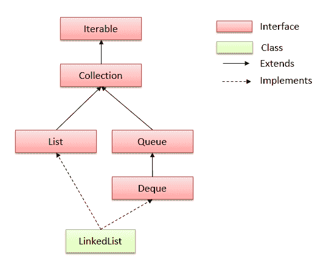

# Java LinkedList 类

> 原文： [https://howtodoinjava.com/java/collections/java-linkedlist-class/](https://howtodoinjava.com/java/collections/java-linkedlist-class/)

**Java LinkedList** 类是`List`和[`Deque`](https://docs.oracle.com/javase/7/docs/api/java/util/Deque.html)接口的双链列表实现。 它实现所有可选的列表操作，并允许所有元素（包括 null）。

```java
Table of Contents

1\. LinkedList Hierarchy
2\. LinkedList Features
3\. LinkedList Constructors
4\. LinkedList Methods
5\. LinkedList Example
6\. LinkedList Usecases
7\. LinkedList Performance
8\. ArrayList vs LinkedList
9\. Conclusion
```

## 1\. LinkedList 层次结构

LinkedList 类**扩展了 AbstractSequentialList** 类，**实现了 List 和 Deque** 接口。 这里`'E'`是值链表存储的类型。

```java
public class LinkedList<E>
    extends AbstractSequentialList<E>
    implements List<E>, Deque<E>, Cloneable, java.io.Serializable
{
	//implementation
}

```



LinkedList 层次结构

## 2\. LinkedList 功能

*   **双链表**实现，它实现 List 和 Deque 接口。 因此，它也可以用作队列，双端队列或堆栈。
*   允许所有元素，包括重复和 NULL。
*   LinkedList 维护元素的**插入顺序**。
*   **未同步**。 如果多个线程同时访问一个链表，并且至少一个线程在结构上修改了该链表，则它*必须在外部进行*同步。
*   使用 Collections.synchronizedList（new LinkedList（））获取同步链表。
*   此类返回的迭代器是快速失败的，并且可能抛出`ConcurrentModificationException`。
*   它没有实现 [RandomAccess](https://docs.oracle.com/javase/7/docs/api/java/util/RandomAccess.html) 接口。 因此，我们只能按顺序访问元素。 它不支持随机访问元素。
*   我们可以使用 [ListIterator](https://docs.oracle.com/javase/7/docs/api/java/util/ListIterator.html) 来迭代 LinkedList 元素。

## 3\. LinkedList 构造函数

1.  **LinkedList（）**：初始化一个空的 LinkedList 实现。
2.  **LinkedListExample（Collection c）**：初始化一个 LinkedList，其中包含指定集合的​​元素，并按集合的迭代器返回它们的顺序。

## 4\. LinkedList 方法

1.  **布尔值 add（Object o）**：将指定的元素附加到列表的末尾。
2.  **void add（int index，Object element）**：将指定元素插入列表中指定位置的索引处。
3.  **void addFirst（Object o）**：将给定元素插入列表的开头。
4.  **void addLast（Object o）**：将给定元素附加到列表的末尾。
5.  **int size（）**：返回列表中的元素数
6.  **boolean contains（Object o）**：如果列表包含指定元素，则返回`true`，否则返回`false`。
7.  **布尔值 remove（Object o）**：删除列表中指定元素的首次出现。
8.  **Object getFirst（）**：返回列表中的第一个元素。
9.  **对象 getLast（）**：返回列表中的最后一个元素。
10.  **int indexOf（Object o）**：返回指定元素首次出现的列表中的索引；如果列表不包含指定元素，则返回-1。
11.  **lastIndexOf（Object o）**：返回指定元素最后一次出现的列表中的索引；如果列表不包含指定元素，则返回-1。
12.  **迭代器 iterator（）**：按适当的顺序返回此列表中元素的迭代器。
13.  **Object [] toArray（）**：按正确顺序返回包含此列表中所有元素的数组。
14.  **列表 subList（int fromIndex，int toIndex）**：返回此列表中指定的 fromIndex（包括）和 toIndex（不包括）之间的视图。

## 5\. Java LinkedList 示例

#### 5.1 添加，删除，迭代

Java 程序演示链表类中基本方法的用法。

```java
import java.util.LinkedList;
import java.util.ListIterator;

public class LinkedListExample 
{
    public static void main(String[] args) 
    {
        //Create linked list
        LinkedList<String> linkedList = new LinkedList<>();

        //Add elements
        linkedList.add("A");
        linkedList.add("B");
        linkedList.add("C");
        linkedList.add("D");

        System.out.println(linkedList);

        //Add elements at specified position
        linkedList.add(4, "A");
        linkedList.add(5, "A");

        System.out.println(linkedList);

        //Remove element
        linkedList.remove("A");		//removes A
        linkedList.remove(0);		//removes B

        System.out.println(linkedList);

        //Iterate
        ListIterator<String> itrator = linkedList.listIterator();

        while (itrator.hasNext()) {
            System.out.println(itrator.next());
        }
    }
}

```

程序输出。

```java
[A, B, C, D]
[A, B, C, D, A, A]
[C, D, A, A]
C
D
A
A

```

#### 5.2 在数组和 LinkedList 之间转换

Java 程序将**的 LinkedList 转换为数组**，将**的数组转换为 Linkedlist** 。

```java
LinkedList<String> linkedList = new LinkedList<>();

linkedList.add("A");
linkedList.add("B");
linkedList.add("C");
linkedList.add("D");

//1\. LinkedList to Array
String array[] = new String[linkedList.size()];
linkedList.toArray(array);

System.out.println(Arrays.toString(array));

//2\. Array to LinkedList
LinkedList<String> linkedListNew = new LinkedList<>(Arrays.asList(array));

System.out.println(linkedListNew);

```

程序输出：

```java
[A, B, C, D]
[A, B, C, D]

```

#### 5.3 如何排序 LinkedList

使用 **Collections.sort（）**方法对 LinkedList 排序的 Java 示例。 请注意，对于对象的自定义排序，我们可以使用 **Collections.sort（linkedList，比较器）**方法。

```java
LinkedList<String> linkedList = new LinkedList<>();

linkedList.add("A");
linkedList.add("C");
linkedList.add("B");
linkedList.add("D");

//Unsorted
System.out.println(linkedList);

//1\. Sort the list
Collections.sort(linkedList);

//Sorted
System.out.println(linkedList);

//2\. Custom sorting
Collections.sort(linkedList, Collections.reverseOrder());

//Custom sorted
System.out.println(linkedList);

```

程序输出：

```java
[A, C, B, D]
[A, B, C, D]
[D, C, B, A]

```

## 6\. LinkedList 用例

在任何桌面应用程序中，动作都可以记录在链接列表中，并实现从上一次迭代的撤消和重做功能。

可以使用链表对浏览器的“下一个”和“上一个”按钮进行编程。

链接列表（与哈希表配对）对于 LRU 缓存非常有用。

## 7\. LinkedList 性能

在 Java LinkedList 类中，由于不需要进行任何转换，因此处理速度很快。 因此，基本上，所有添加和删除方法都提供非常好的性能 **O（1）**。

*   add（E element）方法是 O（1）。
*   get（int index）和 add（int index，E element）方法的类型为 O（n）。
*   remove（int index）方法的值为 O（n）。
*   Iterator.remove（）为 O（1）。
*   ListIterator.add（E 元素）为 O（1）。

应该首选 LinkedList，因为没有大量的元素随机访问，而有大量的添加/删除操作。

## 8\. ArrayList 与 LinkedList

让我们列出 arraylist 和链表之间的一些值得注意的**差异。**

*   ArrayList 是使用动态可调整大小的数组的概念实现的。 而 LinkedList 是双向链表实现。
*   ArrayList 允许随机访问其元素，而 LinkedList 则不允许。
*   LinkedList 还实现`Queue`接口，该接口添加了比 ArrayList 更多的方法，例如 offer（），peek（），poll（）等。
*   与 LinkedList 相比， [ArrayList](https://howtodoinjava.com/java-arraylist/) 的添加和删除速度较慢，但​​获取速度较快，因为如果[数组](https://howtodoinjava.com/java-array/)在 LinkedList 中已满，则无需调整数组大小并将内容复制到新数组中 。
*   LinkedList 比 ArrayList 具有更多的内存开销，因为在 ArrayList 中，每个索引仅保存实际对象，但是在 LinkedList 的情况下，每个节点都保存下一个和上一个节点的数据和地址。

## 9\. 结论

在此 **Java LinkedList 教程**中，我们学习了什么是 LinkedList，LinkedList 和 ArrayList 之间的区别是什么，如何创建 LinkedList，如何在 LinkedList 中添加，删除和搜索元素，以及 如何遍历 LinkedList。

让我知道您的问题。

学习愉快！

参考：

[LinkedList Java 文档](https://docs.oracle.com/javase/10/docs/api/java/util/LinkedList.html)