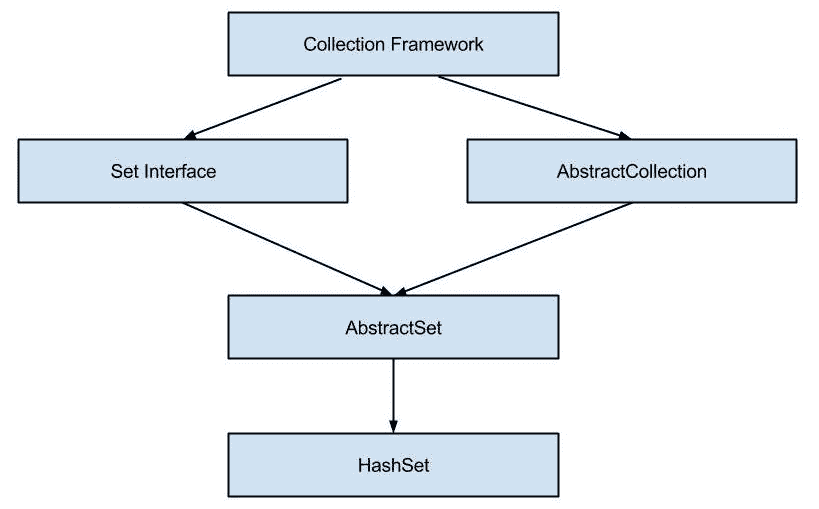

# Java `HashSet`类

> 原文： [https://howtodoinjava.com/java/collections/java-hashset/](https://howtodoinjava.com/java/collections/java-hashset/)

Java `HashSet`类实现了`Set`接口，由哈希表（实际上是[`HashMap`](https://howtodoinjava.com/java-hashmap/)实例）支持。 如果不对迭代顺序提供任何保证，并允许`null`元素。

```java
Table of Contents

1\. HashSet Hierarchy
2\. HashSet Features
3\. HashSet Constructors
4\. HashSet Methods
5\. HashSet Example
6\. HashSet Usecases
7\. HashSet Performance
8\. Conclusion
```

## 1\. `HashSet`层次结构

`HashSet`类扩展了实现`Set`接口的`AbstractSet`类。 `Set`接口以层次结构顺序继承`Collection`和`Iterable`接口。

```java
public class HashSet<E> extends AbstractSet<E> 
				implements Set<E>, Cloneable, Serializable 
{
	//implementation
}

```



哈希集合层次结构

## 2\. `HashSet`特性

*   它实现了`Set`接口。
*   `HashSet`中不允许重复的值。
*   `HashSet`中允许一个`NULL`元素。
*   它是无序集合，并且不保证集合的迭代顺序。
*   此类为基本操作（添加，删除，包含和调整大小）提供恒定的时间性能。
*   `HashSet`不同步。 如果多个线程同时访问哈希集合，并且至少有一个线程修改了哈希集合，则必须在外部对其进行同步。
*   使用`Collections.synchronizedSet(new HashSet())`方法来获取同步的哈希集合。
*   此类的迭代器方法返回的迭代器为**快速失败**，并且如果在创建迭代器后的任何时间修改了集合，则可能会抛出`ConcurrentModificationException`，除了通过迭代器自己的`remove()`方法之外 。
*   `HashSet`还实现了`Searlizable`和[`Cloneable`](https://howtodoinjava.com/java/cloning/a-guide-to-object-cloning-in-java/)接口。

#### 2.1 初始容量

初始容量表示创建哈希集合时（在支持`HashMap`中）的存储桶数。 如果当前大小已满，则存储桶数将自动增加。

默认初始容量为 **16** 。 我们可以通过在构造器`HashSet(int initialCapacity)`中传递默认容量来覆盖此默认容量。

#### 2.2 负载系数

负载因子是在自动增加 HashSet 容量之前允许其充满的度量。 默认负载系数为 **0.75** 。

这称为**阈值**，等于（`DEFAULT_LOAD_FACTOR * DEFAULT_INITIAL_CAPACITY`）。 当`HashSet`元素计数超过此阈值时，将调整`HashSet`的大小，并且新容量将是先前容量的两倍。

使用默认的`HashSet`时，内部容量为 16，负载系数为 0.75。 当表格中有 12 个元素时，存储桶数将自动增加。

## 3\. `HashSet`构造器

`HashSet`具有四种类型的构造器：

1.  **`HashSet()`**：使用默认的初始容量（16）和默认的负载因子（0.75）初始化默认的`HashSet`实例。
2.  **`HashSet(int capcity)`**：初始化具有指定容量和默认加载因子（0.75）的`HashSet`。
3.  **`HashSet(int capcity, float loadFactor)`**：使用指定的初始容量和指定的负载系数初始化`HashSet`。
4.  **`HashSet(Collection c)`**：使用与指定集合相同的元素初始化`HashSet`。

## 4\. `HashSet`方法

1.  **`public boolean add(E e)`**：如果指定的元素尚不存在，则将其添加到`Set`中。 此方法在内部使用`equals()`方法检查重复项。 如果元素重复，则元素被拒绝，并且不替换值。
2.  **`public void clear()`**：从哈希集合中删除所有元素。
3.  **`public boolean contains(Object o)`**：如果哈希集合包含指定的元素则返回`true`，否则为`false`。
4.  **`public boolean isEmpty()`**：如果哈希集合不包含任何元素，则返回`true`，否则返回`false`。
5.  **`public int size()`**：返回哈希集合中的元素数。
6.  **`public Iterator<E> iterator()`**：在此哈希集合中的元素上返回迭代器。 从迭代器返回的元素没有特定的顺序。
7.  **`public boolean remove(Object o)`**：从哈希集合中删除指定的元素（如果存在）并返回`true`，否则返回`false`。
8.  **`public boolean removeAll(Collection <?> c)`**：删除哈希集合中所有属于指定集合的​​元素。
9.  **`public Object clone()`**：返回哈希集合的浅表副本。
10.  **`public Spliterator<E> spliterator()`**：在此哈希集合中的元素上创建后绑定且快速失败的**拆分器**。

## 5\. Java `HashSet`示例

#### 5.1 `HashSet`添加，删除，迭代器示例

```java
//1\. Create HashSet
HashSet<String> hashSet = new HashSet<>();

//2\. Add elements to HashSet 
hashSet.add("A");
hashSet.add("B");
hashSet.add("C");
hashSet.add("D");
hashSet.add("E");

System.out.println(hashSet);

//3\. Check if element exists
boolean found = hashSet.contains("A");        //true
System.out.println(found);

//4\. Remove an element
hashSet.remove("D");

//5\. Iterate over values
Iterator<String> itr = hashSet.iterator();

while(itr.hasNext()) 
{
    String value = itr.next();

    System.out.println("Value: " + value);
}

```

程序输出。

```java
[A, B, C, D, E]
true
Value: A
Value: B
Value: C
Value: E

```

#### 5.2 将`HashSet`转换为数组示例

Java 示例，使用`toArrray()`方法将哈希集合转换为[数组](https://howtodoinjava.com/java-array/)。

```java
HashSet<String> hashSet = new HashSet<>();

hashSet.add("A");
hashSet.add("B");
hashSet.add("C");
hashSet.add("D");
hashSet.add("E");

String[] values = new String[hashSet.size()];

hashSet.toArray(values);

System.out.println(Arrays.toString(values));

```

程序输出：

```java
[A, B, C, D, E]

```

#### 5.3 将`HashSet`转换为`ArrayList`示例

使用 [Java 8 流 API](https://howtodoinjava.com/java8/java-8-tutorial-streams-by-examples/) 将哈希集合转换为[`ArrayList`](https://howtodoinjava.com/java-arraylist/)的 Java 示例。

```java
HashSet<String> hashSet = new HashSet<>();

hashSet.add("A");
hashSet.add("B");
hashSet.add("C");
hashSet.add("D");
hashSet.add("E");

List<String> valuesList = hashSet.stream().collect(Collectors.toList());

System.out.println(valuesList);

```

程序输出：

```java
[A, B, C, D, E]

```

## 6\. `HashSet`用例

`HashSet`非常类似于`ArrayList`类。 此外，它还会限制重复值。 因此，当我们有一个只需要存储不同元素的需求时，我们可以选择`HashSet`。

`HashSet`的真实用例可以存储流中的数据，其中流可能包含重复的记录，而我们仅对不同的记录感兴趣。

另一个用例是在给定的句子中找到不同的单词。

## 7\. Java `HashSet`性能

*   `HashSet`类为基本操作（添加，删除，包含和大小）提供` O(1)`的**恒定时间性能**，假设哈希函数将元素正确分散在存储桶中。
*   对此集合进行迭代需要的时间与`HashSet`实例的大小（元素的数量）加上后备`HashMap`实例的“容量”（存储桶的数量）之和成比例。 因此，如果迭代性能很重要，则不要将初始容量设置得过高（或负载因子过低），这一点非常重要。

## 8\. 总结

从上面的讨论中可以明显看出，在我们要处理重复记录的情况下，`HashSet`是非常有用的集合类。 它为基本操作提供了可预测的性能。

在评论中向我发送有关 Java 中 **`HashSet`的问题**。

学习愉快！

参考：

[HashSet Java 文档](https://docs.oracle.com/javase/10/docs/api/java/util/HashSet.html)