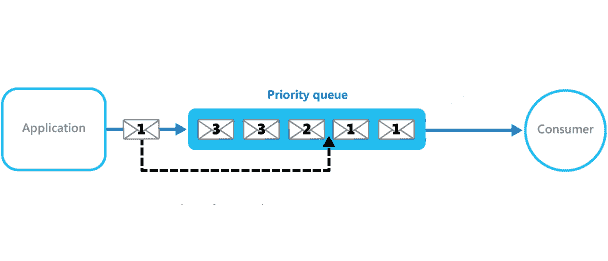

# Java PriorityQueue 类

> 原文： [https://howtodoinjava.com/java/collections/java-priorityqueue/](https://howtodoinjava.com/java/collections/java-priorityqueue/)

**Java PriorityQueue** 类是一种队列数据结构实现，其中，根据对象的**优先级**处理对象。 它与遵循 [FIFO](https://en.wikipedia.org/wiki/FIFO_(computing_and_electronics)) （先进先出）算法的标准队列不同。

在优先级队列中，添加的对象根据其优先级。 默认情况下，优先级由对象的自然顺序决定。 队列构建时提供的[比较器](https://howtodoinjava.com/java/collections/java-comparator/)可以覆盖默认优先级。



优先队列

## 1\. PriorityQueue 功能

让我们记下 PriorityQueue 的几个要点。

*   PriorityQueue 是一个无界队列，并且会动态增长。 默认初始容量为`'11'`，可以在适当的构造器中使用 **initialCapacity** 参数来覆盖。
*   它不允许使用 NULL 对象。
*   添加到 PriorityQueue 的对象必须是可比较的。
*   默认情况下，优先级队列的对象以自然顺序排序**。**
*   比较器可用于队列中对象的自定义排序。
*   优先级队列的**头**是基于自然排序或基于比较器排序的**最少**元素。 当我们轮询队列时，它从队列中返回头对象。
*   如果存在多个具有相同优先级的对象，则它可以随机轮询其中的任何一个。
*   PriorityQueue 是**不是线程安全的**。 在并发环境中使用`PriorityBlockingQueue`。
*   它为添加和轮询方法提供了 **O（log（n））**时间。

## 2\. Java PriorityQueue 示例

让我们看看对象的排序如何影响 PriorityQueue 中的添加和删除操作。 在给定的示例中，对象的类型为`Employee`。 Employee 类实现 **Comparable** 接口，默认情况下，该接口使对象可通过 employee `'id'`字段进行比较。

```java
public class Employee implements Comparable<Employee> {

    private Long id;
    private String name;
    private LocalDate dob;

    public Employee(Long id, String name, LocalDate dob) {
        super();
        this.id = id;
        this.name = name;
        this.dob = dob;
    }

    @Override
    public int compareTo(Employee emp) {
        return this.getId().compareTo(emp.getId());
    }

    //Getters and setters

    @Override
    public String toString() {
        return "Employee [id=" + id + ", name=" + name + ", dob=" + dob + "]";
    }
}

```

#### 2.1 自然排序

Java PriorityQueue 示例，用于添加和轮询根据其自然顺序进行比较的元素。

```java
PriorityQueue<Employee> priorityQueue = new PriorityQueue<>();

priorityQueue.add(new Employee(1l, "AAA", LocalDate.now()));
priorityQueue.add(new Employee(4l, "CCC", LocalDate.now()));
priorityQueue.add(new Employee(5l, "BBB", LocalDate.now()));
priorityQueue.add(new Employee(2l, "FFF", LocalDate.now()));
priorityQueue.add(new Employee(3l, "DDD", LocalDate.now()));
priorityQueue.add(new Employee(6l, "EEE", LocalDate.now()));

while(true) 
{
    Employee e = priorityQueue.poll();
    System.out.println(e);

    if(e == null) break;
}

```

程序输出。

```java
Employee [id=1, name=AAA, dob=2018-10-31]
Employee [id=2, name=FFF, dob=2018-10-31]
Employee [id=5, name=BBB, dob=2018-10-31]
Employee [id=4, name=CCC, dob=2018-10-31]
Employee [id=3, name=DDD, dob=2018-10-31]
Employee [id=6, name=EEE, dob=2018-10-31]

```

#### 2.2 使用比较器自定义订购

让我们使用 [**基于 Java 8 lambda 的比较器**](https://howtodoinjava.com/java8/using-comparator-becomes-easier-with-lambda-expressions-java-8/) 语法重新定义自定义顺序，并验证结果。

```java
//Comparator for name field
Comparator<Employee> nameSorter = Comparator.comparing(Employee::getName);

PriorityQueue<Employee> priorityQueue = new PriorityQueue<>( nameSorter );

priorityQueue.add(new Employee(1l, "AAA", LocalDate.now()));
priorityQueue.add(new Employee(4l, "CCC", LocalDate.now()));
priorityQueue.add(new Employee(5l, "BBB", LocalDate.now()));
priorityQueue.add(new Employee(2l, "FFF", LocalDate.now()));
priorityQueue.add(new Employee(3l, "DDD", LocalDate.now()));
priorityQueue.add(new Employee(6l, "EEE", LocalDate.now()));

while(true) 
{
    Employee e = priorityQueue.poll();
    System.out.println(e);

    if(e == null) break;
}

```

程序输出：

```java
Employee [id=1, name=AAA, dob=2018-10-31]
Employee [id=5, name=BBB, dob=2018-10-31]
Employee [id=4, name=CCC, dob=2018-10-31]
Employee [id=3, name=DDD, dob=2018-10-31]
Employee [id=6, name=EEE, dob=2018-10-31]
Employee [id=2, name=FFF, dob=2018-10-31]

```

## 3\. Java PriorityQueue 构造器

PriorityQueue 类提供了 6 种不同的方法来用 Java 构造优先级队列。

*   **PriorityQueue（）**：构造具有默认初始容量（11）的空队列，该初始容量根据其元素的自然顺序对其进行排序。
*   **PriorityQueue（Collection c）**：构造一个空队列，其中包含指定集合中的元素。
*   **PriorityQueue（int initialCapacity）**：构造具有指定初始容量的空队列，该队列根据其自然顺序对其元素进行排序。
*   **PriorityQueue（int initialCapacity，Comparator 比较器）**：构造具有指定初始容量的空队列，该队列根据指定的比较器对其元素进行排序。
*   **PriorityQueue（PriorityQueue c）**：构造一个空队列，其中包含指定优先级队列中的元素。
*   **PriorityQueue（SortedSet c）**：构造一个空队列，其中包含指定排序集中的元素。

## 4\. Java PriorityQueue 方法

您应该知道 PriorityQueue 类下面给出了重要的方法。

*   **布尔值 add（object）**：将指定的元素插入此优先级队列。
*   **布尔商品（对象）**：将指定的元素插入此优先级队列。
*   **boolean remove（object）**：从此队列中移除指定元素的单个实例（如果存在）。
*   **对象 poll（）**：检索并删除此队列的头部，如果此队列为空，则返回 null。
*   **对象 element（）**：检索但不删除此队列的头，如果此队列为空，则抛出 *NoSuchElementException* 。
*   **对象 peek（）**：检索但不删除此队列的头，如果此队列为空，则返回 null。
*   **void clear（）**：从此优先级队列中删除所有元素。
*   **Comparator 比较器（）**：返回用于对此队列中的元素进行排序的比较器；如果此队列是根据其元素的自然顺序排序的，则返回 null。
*   **布尔值 contains（Object o）**：如果此队列包含指定的元素，则返回 true。
*   **迭代器 iterator（）**：在此队列中的元素上返回一个迭代器。
*   **int size（）**：返回此队列中的元素数。
*   **Object [] toArray（）**：返回包含此队列中所有元素的数组。

## 5\. 总结

在此 **Java 队列教程**中，我们学习了使用 **PriorityQueue 类**，该类能够按默认的自然顺序或指定比较器的自定义顺序存储元素。

我们还了解了 PriorityQueue 类的一些重要方法和[构造器](https://howtodoinjava.com/oops/java-constructors/)。

将我的问题放在评论部分。

学习愉快！

参考文献：

[PriorityQueue 类 Java 文档](https://docs.oracle.com/javase/8/docs/api/java/util/PriorityQueue.html)