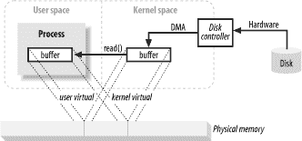

# Java I/O 如何在较低级别上内部工作？

> 原文： [https://howtodoinjava.com/java/io/how-java-io-works-internally-at-lower-level/](https://howtodoinjava.com/java/io/how-java-io-works-internally-at-lower-level/)

这篇博客文章主要讨论与 I/O 相关的事物在较低级别的工作方式。 这篇文章供那些想知道如何在机器级别映射 [**Java I/O**](//howtodoinjava.com "java io") 操作的读者使用； 以及您的应用程序在运行时硬件在所有时间内的所有功能。 我假设您熟悉基本的 IO 操作，例如读取文件，通过 Java I/O API 写入文件； 因为那超出了这篇文章的范围。

```java
Table of Contents

Buffer Handling and Kernel vs User Space
Virtual Memory
Memory Paging
File/Block Oriented I/O
File Locking
Stream Oriented I/O
```

## 缓冲区处理和内核与用户空间

缓冲区以及如何处理缓冲区是所有 I/O 的基础。 **术语“输入/输出”仅意味着将数据移入和移出缓冲区。** 始终要记住这一点。 通常，进程通过请求操作系统从缓冲区中清空数据（*写入操作*）或向缓冲区中填充数据（*读取操作*）来执行 I/O。 以上是 I/O 概念的全部总结。 操作系统内部执行这些传输的机制可能非常复杂，但是从概念上讲，它非常简单，我们将在本文中讨论其中的一小部分。


上图显示了块数据如何从外部源（例如硬盘）移动到正在运行的进程（例如 RAM）内部的存储区的简化“逻辑”图。 首先，该进程通过进行`read()`系统调用来请求填充其缓冲区。 此调用导致内核向磁盘控制器硬件发出命令以从磁盘获取数据。 磁盘控制器通过 [**DMA**](https://en.wikipedia.org/wiki/Direct_memory_access "dma") 将数据直接写入内核内存缓冲区，而无需主 CPU 的进一步协助。 磁盘控制器完成缓冲区填充后，内核将数据从内核空间中的临时缓冲区复制到进程指定的缓冲区中； 当它请求`read()`操作时。

需要注意的一件事是内核尝试缓存和/或预取数据，因此进程请求的数据可能已经在内核空间中可用。 如果是这样，则将过程所请求的数据复制出来。 如果数据不可用，则该过程将暂停，而内核将数据带入内存。

## 虚拟内存

您必须已经多次听说虚拟内存。 让我对它进行一些思考。

所有现代操作系统都使用虚拟内存。 虚拟内存意味着使用人工或虚拟地址代替物理（硬件 RAM）内存地址。 虚拟内存具有两个重要优点：

1）多个虚拟地址可以引用相同的物理内存位置。
2）虚拟内存空间可能大于可用的实际硬件内存。

在上一节中，从内核空间复制到最终用户缓冲区必须看起来像是额外的工作。 为什么不告诉磁盘控制器将其直接发送到用户空间中的缓冲区？ 嗯，这是通过使用虚拟内存来完成的，它的优势是上面的 1。

通过将内核空间地址映射到与用户空间中虚拟地址相同的物理地址，DMA 硬件（只能访问物理内存地址）可以填充一个缓冲区，该缓冲区同时对内核和用户空间进程可见。



这消除了内核空间和用户空间之间的副本，但是需要内核空间和用户缓冲区共享相同的页面对齐方式。 缓冲区还必须是磁盘控制器使用的块大小的倍数（通常为 512 字节磁盘扇区）。 操作系统将其内存地址空间划分为页面，页面是固定大小的字节组。 这些内存页始终是磁盘块大小的倍数，通常为 2 的幂（这简化了寻址）。 典型的内存页面大小为 1,024、2,048 和 4,096 字节。 虚拟和物理内存页面大小始终相同。

## 内存分页

为了支持虚拟内存的第二个优势（可寻址空间大于物理内存），有必要进行虚拟内存分页（通常称为交换）。 这是一种方案，通过该方案可以将虚拟内存空间的页面持久保存到外部磁盘存储中，从而在物理内存中为其他虚拟页面腾出空间。 本质上，物理内存充当页面调度区域的缓存，这是磁盘上的空间，当磁盘空间被迫退出物理内存时，该空间用于存储内存页面的内容。

将内存页面大小调整为磁盘块大小的倍数，可使内核向磁盘控制器硬件发出直接命令，以将内存页面写入磁盘或在需要时重新加载它们。 事实证明，所有磁盘 I/O 都是在页面级别完成的。 在现代的分页操作系统中，这是数据在磁盘和物理内存之间移动的唯一方式。

现代 CPU 包含一个称为 [**内存管理单元（MMU）**](https://en.wikipedia.org/wiki/Memory_management_unit "MMU") 的子系统。 该设备在逻辑上位于 CPU 和物理内存之间。 它包含将虚拟地址转换为物理内存地址所需的映射信息。 当 CPU 引用一个内存位置时，MMU 会确定该位置所在的页面（通常通过移动或屏蔽地址值的位）并将该虚拟页面号转换为物理页面号（此操作在硬件中完成，并且非常复杂）。 快速）。

## 面向文件/块的 I/O

文件 I/O 始终在文件系统的上下文中发生。 文件系统与磁盘完全不同。 磁盘将数据存储在扇区中，通常每个扇区 512 字节。 它们是对文件语义一无所知的硬件设备。 它们只是提供了许多可以存储数据的插槽。 在这方面，磁盘的扇区类似于内存页面； 它们都具有统一的大小，并且可以作为一个大数组寻址。

另一方面，文件系统是更高级别的抽象。 文件系统是整理和解释存储在磁盘（或某些其他随机访问的，面向块的设备）上的数据的特殊方法。 您编写的代码几乎总是与文件系统交互，而不是直接与磁盘交互。 它是定义文件名，路径，文件，文件属性等的抽象的文件系统。

文件系统（在硬盘中）组织一系列大小一致的数据块。 一些块存储元信息，例如空闲块，目录，索引的映射等。其他块包含实际文件数据。 有关单个文件的元信息描述了哪些块包含文件数据，数据结束于何处，数据的最后更新时间等。当用户进程发出读取文件数据的请求时，文件系统实现将确定数据在磁盘上的确切位置。 然后，它将采取措施将这些磁盘扇区放入内存。

文件系统还具有页面的概念，其大小可以与基本内存页面相同，也可以是其倍数。 典型的文件系统页面大小为 2,048 至 8,192 字节，并且始终是基本内存页面大小的倍数。

分页文件系统如何执行 I/O 归结为以下逻辑步骤：

1.  确定请求跨越哪个文件系统页面（磁盘扇区组）。 磁盘上的文件内容和/或元数据可能分布在多个文件系统页面上，并且这些页面可能是不连续的。
2.  在内核空间中分配足够的内存页面以容纳已标识的文件系统页面。
3.  在这些内存页面和磁盘上的文件系统页面之间建立映射。
4.  为每个内存页面生成页面错误。
5.  虚拟内存系统会捕获页面错误，并调度 pageins 通过从磁盘读取其内容来验证这些页面。
6.  一旦 pageins 完成，文件系统将分解原始数据以提取请求的文件内容或属性信息。

请注意，此文件系统数据将像其他内存页面一样被缓存。 在后续的 I/O 请求中，部分或全部文件数据可能仍存在于物理内存中，并且可以重新使用而无需从磁盘重新读取。

## 文件锁定

文件锁定是一种方案，通过该方案，一个进程可以阻止其他进程访问文件或限制其他进程访问该文件的方式。 虽然“文件锁定”一词的含义是锁定整个文件（并且通常这样做），但锁定通常可以在更细粒度的级别上进行。 文件区域通常是锁定的，粒度低至字节级别。 锁与特定文件相关联，该锁从该文件中的特定字节位置开始，并在特定字节范围内运行。 这很重要，因为它允许许多进程协调对文件特定区域的访问，而不会妨碍其他进程在文件中的其他位置工作。

文件锁有两种形式：**共享**和**独占**。 多个共享锁可能对同一文件区域同时生效。 另一方面，排他锁要求对请求的区域没有其他锁生效。

## 流 I/O

并非所有的 I/O 都是面向块的。 还有流 I/O，它是在管道上建模的。 I/O 流的字节必须顺序访问。 TTY（控制台）设备，打印机端口和网络连接是流的常见示例。

流通常（但不一定）比块设备慢，并且通常是间歇输入的来源。 大多数操作系统允许将流置于非阻塞模式，这允许进程检查输入是否在流上可用，而不会卡住当前是否可用。 这种功能允许进程在输入到达时处理输入，但在输入流空闲时执行其他功能。

超越非阻塞模式的一步是进行**准备就绪选择**的能力。 这类似于非阻塞模式（并且通常在非阻塞模式的基础上构建），但将检查流是否已准备就绪的检查分担给操作系统。 可以告诉操作系统观看流的集合，并向这些流中的哪些流准备就绪的过程返回指示。 此功能允许进程利用操作系统返回的就绪信息，使用通用代码和单个线程多路复用许多活动流。 这在网络服务器中被广泛使用以处理大量的网络连接。 准备就绪选择对于大批量缩放至关重要。

这就是这个非常复杂的主题，包含大量技术词汇

给我评论您的想法和疑问。

**祝您学习愉快！**