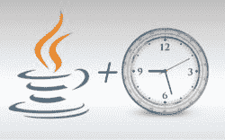

# Java 日期–解析，格式和转换

> 原文： [https://howtodoinjava.com/java/date-time/java-date-examples/](https://howtodoinjava.com/java/date-time/java-date-examples/)

学习**创建新日期**，**获取当前日期**，**将日期**解析为字符串或**格式`Date`** 对象，使用 [java。 util.Date](https://docs.oracle.com/javase/7/docs/api/java/util/Date.html) 类。 这些用例是经常需要的，将它们放在一个地方将有助于节省我们许多人的时间。



```java
Table of Contents

Format Date to string
Parse string to Date
Get current date
Get current time
Convert Calendar to Date
Get Date to Calendar
Compare between two dates
Get date parts (year, month, day of month)
```

#### 将日期格式化为字符串

**将日期格式化为字符串**表示形式的示例。

```java
SimpleDateFormat sdf = new SimpleDateFormat("dd/M/yyyy");
String date = sdf.format(new Date()); 
System.out.println(date); //Prints 26/10/2015
```

有关详细的日期和时间模式，请参考 [SimpleDateFormat](https://docs.oracle.com/javase/6/docs/api/java/text/SimpleDateFormat.html) JavaDoc。 以下是您可以使用的最常见的图案字母的列表。

```java
y   = year   (yy or yyyy)
M   = month  (MM)
d   = day in month (dd)
h   = hour (0-12)  (hh)
H   = hour (0-23)  (HH)
m   = minute in hour (mm)
s   = seconds (ss)
S   = milliseconds (SSS)
z   = time zone  text        (e.g. Pacific Standard Time...)
Z   = time zone, time offset (e.g. -0800)
```

例如，

```java
yyyy-MM-dd           	(2015-12-31)
dd-MM-YYYY           		(31-10-2015)
yyyy-MM-dd HH:mm:ss  		(2015-12-31 23:59:59)
HH:mm:ss.SSS         		(23:59.59.999)
yyyy-MM-dd HH:mm:ss.SSS   	(2015-12-31 23:59:59.999)
yyyy-MM-dd HH:mm:ss.SSS Z   (2015-12-31 23:59:59.999 +0100)
```

#### 解析字符串到日期

**将字符串解析为日期**对象的示例。

```java
SimpleDateFormat sdf = new SimpleDateFormat("dd-M-yyyy hh:mm:ss");
String dateInString = "15-10-2015 10:20:56";
Date date = sdf.parse(dateInString);
System.out.println(date); //Prints Tue Oct 15 10:20:56 SGT 2015
```

#### 获取当前日期

在 Java 中获取**当前日期的示例。**

```java
SimpleDateFormat dateFormat = new SimpleDateFormat("yyyy/MM/dd HH:mm:ss");
Date date = new Date();
System.out.println(dateFormat.format(date)); //2015/10/26 12:10:39
```

在 Java 8 中，可以使用`LocalDate`类。

```java
LocalDate today = LocalDate.now();
System.out.println("Today's Local date : " + today);
```

#### 获取当前时间

在 Java 中获取当前时间的示例。

```java
LocalTime time = LocalTime.now();
System.out.println("local time now : " + time);

```

#### 将日历转换为日期

```java
Calendar calendar = Calendar.getInstance();
Date date =  calendar.getTime();
```

#### 将日期转换为日历

```java
SimpleDateFormat sdf = new SimpleDateFormat("dd-M-yyyy hh:mm:ss");
String dateInString = "27-04-2016 10:22:56";
Date date = sdf.parse(dateInString);

Calendar calendar = Calendar.getInstance();
calendar.setTime(date);
```

#### 比较两个日期

比较两个日期实例的示例。

```java
Date date1 = new Date();
Date date2 = new Date();

int comparison = date1.compareTo(date2);
```

日期之间的**比较遵循`Comparable`接口的规则，这意味着`compareTo()`方法返回：**

1.  如果调用该方法的日期晚于作为参数给出的日期，则大于 0 的 int。
2.  如果日期相等，则 int 值为 0。
3.  如果调用该方法的日期早于作为参数给出的日期，则 int 值小于 0。

从 Java 8 开始，LocalDate 类重写了 equal 方法，以提供日期相等性。

```java
LocalDate today = LocalDate.now();
LocalDate date1 = LocalDate.of(2015, 10, 26);
if(date1.equals(today)){
    System.out.printf("Today %s and date1 %s are same date %n", today, date1);
}

```

#### 获取日期部分（年，月，日）

分别获取日期部分（例如年，月等）的示例。

不建议使用获取年，月，日，小时等的方法。 如果需要获取或设置年，月，日等，请改用`java.util.Calendar`。

```java
Calendar calendar = new GregorianCalendar();

int year       = calendar.get(Calendar.YEAR);
int month      = calendar.get(Calendar.MONTH); 
int dayOfMonth = calendar.get(Calendar.DAY_OF_MONTH); // Jan = 0, not 1
int dayOfWeek  = calendar.get(Calendar.DAY_OF_WEEK);
int weekOfYear = calendar.get(Calendar.WEEK_OF_YEAR);
int weekOfMonth= calendar.get(Calendar.WEEK_OF_MONTH);

int hour       = calendar.get(Calendar.HOUR);        // 12 hour clock
int hourOfDay  = calendar.get(Calendar.HOUR_OF_DAY); // 24 hour clock
int minute     = calendar.get(Calendar.MINUTE);
int second     = calendar.get(Calendar.SECOND);
int millisecond= calendar.get(Calendar.MILLISECOND);
```

仅供参考，在 Java 8 中，您可以按以下方式获得不同的时间单位。

```java
LocalDate today = LocalDate.now();
int year = today.getYear();
int month = today.getMonthValue();
int day = today.getDayOfMonth();
```

这些 **Java Date** 示例就是这些。

学习愉快！