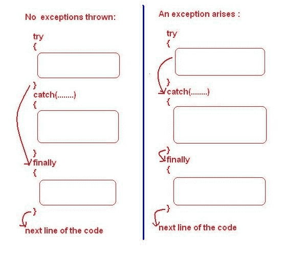

# Java 尝试最终捕获块

> 原文： [https://howtodoinjava.com/java/exception-handling/try-catch-finally/](https://howtodoinjava.com/java/exception-handling/try-catch-finally/)

**Java try，catch 和最后**块有助于编写可能在运行时引发[异常](https://howtodoinjava.com/java/exception-handling/checked-vs-unchecked-exceptions-in-java/)的应用程序代码，并为我们提供了通过执行替代应用程序逻辑或[从异常中恢复的机会 优雅地处理异常](https://howtodoinjava.com/best-practices/java-exception-handling-best-practices/)，以向用户报告。 它有助于防止丑陋的应用程序崩溃。

## 1\. Java 尝试，捕获并最终阻止

#### 1.1 尝试阻止

try 块包含应在正常条件下运行的应用程序代码。 例如，读取文件，写入数据库或执行复杂的业务操作。

一个 try Bock 的写为 **try 关键字**，后跟花括号。

```java
try {
    //application code
}

```

#### 1.2 捕获块

可选的 catch 块位于 try 块之后，并且必须处理 try 块引发的已检查异常以及任何可能的未检查异常。

```java
try {
    //code
}
catch(Exception e) {
    //handle exception
}

```

应用程序可能会以 N 种不同方式出错。 这就是为什么我们可以将**多个捕获块**与单个 try 块相关联的原因。 在每个 catch 块中，我们可以以一种独特的方式处理一个或多个特定的异常。

当一个 catch 块处理异常时，不执行下一个 catch 块。 控制直接从已执行的 catch 块转移到执行程序的其余部分，包括 finally 块。

```java
try {
    //code
}
catch(NullPointerException e) {
    //handle exception
}
catch(NumberFormatException e) {
    //handle exception
}
catch(Exception e) {
    //handle exception
}

```

#### 1.3 终于封锁

可选的 finally 块使我们有机会在每次 try-catch 块完成时运行我们要执行的代码-有错误或无错误。

即使我们未能在 catch 块中成功处理异常，也可以保证 finally 块语句的执行。

```java
try {
	//open file
    //read file
}
catch(Exception e) {
    //handle exception while reading the file
}
finally {
	//close the file
}

```

#### 1.4 仅尝试阻止是强制性的

请注意，只有 try 块是必需的，而 catch 和 finally 块是可选的。 使用 try 块，我们可以根据需要使用 catch 块或 finally 块。

下面可能用 Java 给出两种组合。 **这两个版本均有效**。

```java
try {

}
catch(Exception e) {

}

```

```java
try {

}
finally {

}

```

## 2\. Java 异常处理如何工作？

在正常情况下，当运行时发生异常时，JVM 将错误信息包装在 **Throwable** 子类型的实例中。 此异常对象类似于其他 Java 对象，并且具有字段和方法。

唯一的区别是 JVM 检查它们的存在并将控制权传递给`catch`块，该块可以处理**异常类型或其父类类型**。



尝试赶上终于流

当在应用程序中找不到异常的 catch 块时，**未捕获的异常**由 JVM 级别的**默认异常处理程序处理。 它向用户报告异常并终止应用程序。**

## 3\. 带有 try，catch 和 finally 块的不同执行流程

我们来看一些示例，以了解在不同情况下执行流程的流程。

#### 3.1 尝试，捕获并最终阻止–没有发生异常

如果没有发生异常，那么 JVM 将仅执行 finally 块。 捕获块将被跳过。

```java
try 
{
    System.out.println("try block");
} 
catch (Exception e) 
{
    System.out.println("catch block");
} 
finally 
{
    System.out.println("finally block");
}

```

程序输出。

```java
try block
finally block

```

#### 3.2 尝试，捕获并最终阻止–发生异常

如果 try 块中发生异常，则 JVM 将首先执行 catch 块，然后最后执行。

```java
try 
{
    System.out.println("try block");

    throw new NullPointerException("Null occurred");
} 
catch (Exception e) 
{
    System.out.println("catch block");
} 
finally 
{
    System.out.println("finally block");
}

```

Program output.

```java
try block
catch block
finally block

```

#### 3.3 尝试并最终阻止–未处理异常

如果提供的 catch 块未处理异常，则 JVM 默认异常处理程序将处理该异常。 在这种情况下，将执行**最终块**，然后执行默认的异常处理机制。

```java
try 
{
    System.out.println("try block");

    throw new NullPointerException("Null occurred");
} 
finally 
{
    System.out.println("finally block");
}

```

Program output.

```java
try block
finally block

Exception in thread "main" 
java.lang.NullPointerException: Null occurred
	at com.howtodoinjava.Main.main(Main.java:12)

```

#### 3.4 尝试，捕获并最终阻止–多个捕获块

如果有多个 catch 块与 try 块相关联，则异常由顺序处理的第一个 catch 块处理，该异常可以处理异常类型或其父类型。

例如，处理 **IOException** 的 catch 块可以处理**类型的异常 FileNotFoundException** ，这也是因为`FileNotFoundException extends IOException`。

```java
try 
{
    System.out.println("try block");

    throw new NullPointerException("null occurred");
} 
catch (NumberFormatException e) 
{
    System.out.println("catch block 1");
}
catch (NullPointerException e) 
{
    System.out.println("catch block 2");
}
catch (Exception e) 
{
    System.out.println("catch block 3");
} 
finally 
{
    System.out.println("finally block");
}

```

Program output.

```java
try block
catch block 2
finally block

```

#### 3.5 尝试，捕获并最终阻止–捕获块引发异常

在 catch 块中处理另一个异常时，有时可能会出现异常。 它将如何处理？

如果 catch 块中有异常，则将执行转移到与各个 catch 块相关联的 finally 块（如果有）。 然后，将该异常传播到方法调用堆栈中，以找到可以处理此异常的 catch 块。

如果找到了此类 catch 块，则处理异常，否则 JVM 默认异常处理程序将处理异常并终止应用程序。

```java
try 
{
    System.out.println("try block");

    throw new NullPointerException("NullPointerException occured");
} 
catch (NullPointerException e) 
{
    System.out.println("catch block 1");

    throw new NumberFormatException("NumberFormatException occurred");
}
catch (Exception e) 
{
    System.out.println("catch block 2");
} 
finally 
{
    System.out.println("finally block");
}

```

Program output.

```java
try block
catch block 1
finally block

Exception in thread "main" 
java.lang.NumberFormatException: NumberFormatException occurred
	at com.howtodoinjava.Main.main(Main.java:18)

```

## 4\. 试用资源

对于**可关闭的**资源（例如流），Java SE 7 引入了 try-with-resources 语句，这是在上述情况下处理异常的推荐方法。 在这种方法中，我们不需要关闭流，而 JVM 会为我们完成它。 它消除了 finally 块的需要。

在 try-with-resources 中，资源在小括号内的 try 块中打开，最后该块完全消失了。

```java
try (BufferedReader br = new BufferedReader(new FileReader("C:/temp/test.txt")))
{
    String sCurrentLine;
    while ((sCurrentLine = br.readLine()) != null)
    {
        System.out.println(sCurrentLine);
    }
}
catch (IOException e)
{
    e.printStackTrace();
}

```

<blockqute>阅读更多信息： [Java 7 资源尝试版](https://howtodoinjava.com/java7/try-with-resources/)</blockqute>

学习愉快！