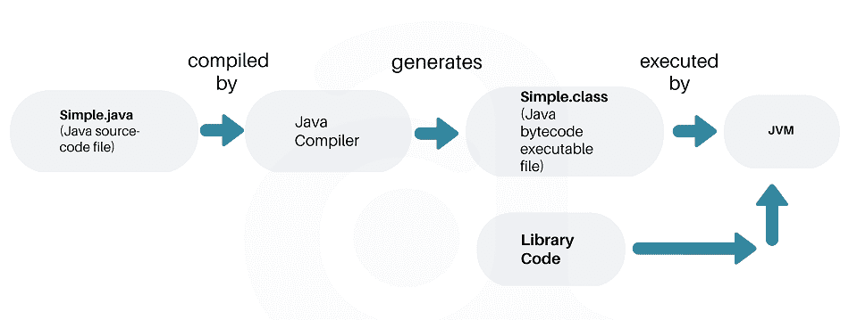
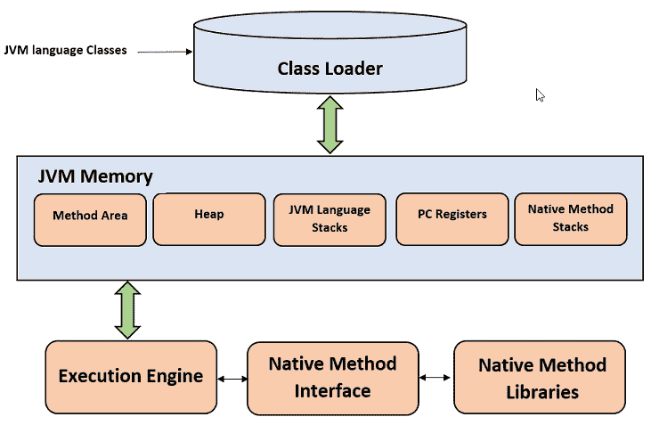
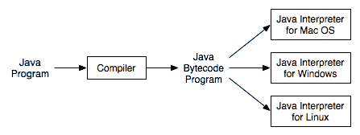
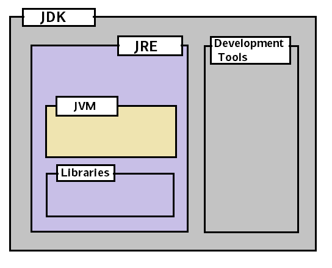
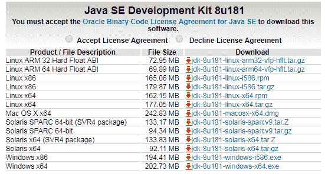
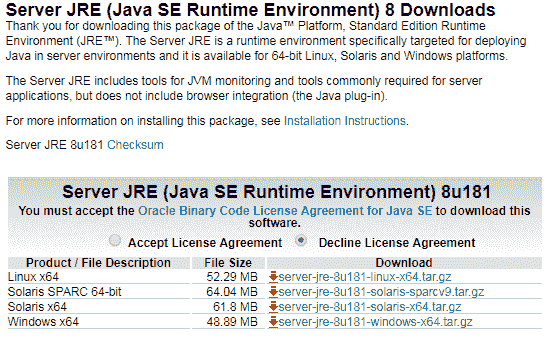

# 什么是 Java JDK，JRE 和 JVM –深入分析

> 原文： [https://howtodoinjava.com/java/basics/jdk-jre-jvm/](https://howtodoinjava.com/java/basics/jdk-jre-jvm/)

了解 JDK，JRE 和 JVM 之间的**区别。 JVM 是如何工作的？ 什么是**类加载器**，**解释器**和 **JIT 编译器**。 还要签出一些**面试问题**。**

```java
Table of Contents

1\. Execution of a Java Program
2\. What is JVM?
3\. What is JRE?
4\. What is JDK?
5\. Differences between JDK, JRE and JVM
6\. Interview questions related to JDK, JRE and JVM
7\. JDK and JRE downloads
```

## 1\. 执行 Java 程序

在深入了解 Java 内部之前，让我们了解如何执行 Java 源文件。

1.  我们使用编辑器或 IDE（**集成开发环境**）在`Simple.Java`文件中编写 Java 源代码。 *Eclipse* 或 *IntelliJ Idea* 。
2.  程序必须编译成字节码。 Java 编译器（`javac`）将源代码编译为`Simple.class`文件。
3.  JVM（ **Java 虚拟机**）可以在任何平台/操作系统中执行此类文件。
4.  JVM 将字节码转换为机器可执行的本机机器代码。



Java 执行流程

## 2\. 什么是 JVM？

**Java 虚拟机**（JVM）是​​运行 Java 字节码的虚拟机。 您可以通过将`.java`文件编译为`.class`文件来获得此字节码。 `.class`文件包含 JVM 可以理解的字节码。

在现实世界中，JVM 是提供可在其中执行 Java 字节码的运行时环境的规范。 不同的供应商提供此规范的不同实现。 例如，此 Wiki 页面列出了[不同的 JVM 实现](https://en.wikipedia.org/wiki/List_of_Java_virtual_machines)。

JVM 最流行的实现是 [Hotspot](https://www.oracle.com/technetwork/java/javase/tech/index-jsp-136373.html) ，它由 Oracle Corporation 拥有和提供。 （*先前由 Sun Microsystems，Inc.* ）。

JVM 使用许多先进技术为 Java 应用程序提供最佳性能，这些技术结合了最新的内存模型，**垃圾收集器**和**自适应优化器**。

JVM 具有两种不同的风格-**客户端**和**服务器**。 尽管服务器 VM 和客户端 VM 相似，但已经对服务器 VM 进行了特殊调整，以最大程度地提高峰值运行速度。 它用于执行长时间运行的服务器应用程序，这些应用程序需要比快速启动时间或较小的运行时内存占用更多​​的最快的运行速度。 开发人员可以通过指定`-client`或`-server`选择他们想要的系统。

JVM 之所以称为**虚拟**，是因为它提供的机器接口不依赖于底层操作系统和机器硬件体系结构。 这种与硬件和操作系统的独立性是 Java 程序一次写入，随处运行的价值的基石。

#### 2.1 JVM 架构



JVM 架构

##### 2.1.1 类加载器

类加载器是用于加载类文件的子系统。 它执行三个主要功能，即类加载，链接和初始化。

1.  ##### 载入中

    *   为了加载类，JVM 有 3 种类加载器。 **引导程序**，**扩展名**和**应用程序**类加载器。
    *   加载类文件时，JVM 会发现某个任意类 <co de="">XYZ.class 的依赖项。</co>
    *   第一个引导程序类加载器尝试查找该类。 它将扫描 JRE `lib`文件夹中的`rt.jar`文件。
    *   如果找不到类，那么扩展类加载器会在 **jre \ lib \ ext** 文件夹中搜索类文件。
    *   同样，如果未找到类，则应用程序类加载器将在系统的`CLASSPATH`环境变量中搜索所有 Jar 文件和类。
    *   如果任何加载程序找到了类，则由类加载程序加载类； 否则抛出`ClassNotFoundException`。
2.  ##### 连结中

    由类加载器加载类后，将执行链接。 **字节码验证器**将验证生成的字节码是否正确，如果验证失败，我们将收到验证错误。 它还对类中的静态变量和方法执行内存分配。

3.  ##### 初始化

    这是类加载的最后阶段，此处将为所有静态变量分配原始值，并执行静态块。

##### 2.1.2 JVM 内存区域

JVM 中的内存区域分为多个部分，以存储应用程序数据的特定部分。

*   **方法是**，用于存储类结构，如元数据，常量运行时池和方法代码。
*   **堆**存储在应用程序执行期间创建的所有对象。
*   **堆栈**存储局部变量和中间结果。 所有这些变量对于创建它们的线程都是本地的。 每个线程都有自己的 JVM 堆栈，并在创建线程时同时创建。 因此，所有此类局部变量都称为**线程局部变量**。
*   **PC 寄存器**存储当前正在执行的语句的物理内存地址。 在 Java 中，每个线程都有其单独的 PC 寄存器。
*   Java 也支持并使用**本机代码**。 许多底层代码都是用 C 和 C ++等语言编写的。 本机方法堆栈保存本机代码的指令。

#### 2.2 JVM 执行引擎

分配给 JVM 的所有代码均由**执行引擎**执行。 执行引擎读取字节码并一一执行。 它使用两个内置的*解释器*和 *JIT 编译器* **将字节码转换为机器代码并执行**。



平台特定的口译员

使用 JVM，解释器和编译器均会生成本机代码。 不同之处在于它们如何生成本机代码，其优化程度以及优化的代价。

#### 2.2.1 口译员

JVM 解释器通过查找预定义的 JVM 指令到机器指令的映射，几乎将每个字节码指令转换为相应的本机指令。 它**直接**执行字节码，并且不执行任何优化。

#### 2.2.2 JIT 编译器

**为了提高性能**，JIT 编译器在运行时与 JVM 交互，并将适当的字节码序列编译为本地机器代码。 通常，JIT 编译器采用一段代码（每次一次都没有一个语句作为解释器），优化代码，然后将其转换为优化的机器代码。

默认情况下启用 **JIT 编译器。 您可以禁用 JIT 编译器，在这种情况下，将解释整个 Java 程序。 除了诊断或解决 JIT 编译问题外，不建议禁用 JIT 编译器。**

## 3\. 什么是 JRE？

**Java 运行时环境**（JRE）是一个软件包，它将库（jar）和 Java 虚拟机以及其他组件捆绑在一起，以运行用 Java 编写的应用程序。 JVM 只是 JRE 发行版的一部分。

要执行任何 Java 应用程序，您需要在计算机中安装 JRE。 在任何计算机上执行 Java 应用程序都是最低要求。

JRE 捆绑了以下组件–

1.  Java HotSpot **客户端虚拟机**使用的 **DLL** 文件。
2.  Java HotSpot **服务器虚拟机**使用的 DLL 文件。
3.  **Java 运行时环境使用的代码库**，**属性设置**和**资源文件**。 例如 **rt.jar** 和 **charsets.jar** 。
4.  Java **扩展文件**，例如 **localedata.jar** 。
5.  包含用于安全管理的文件。 这些文件包括**安全策略**（java.policy）和**安全属性**（java.security）文件。
6.  包含**小程序**的支持类的 Jar 文件。
7.  包含 **TrueType 字体文件**供平台使用。

JRE 可以作为 JDK 的一部分下载，也可以单独下载。 JRE 与平台有关。 这意味着您必须根据计算机的类型（操作系统和体系结构）选择要导入和安装的 JRE 软件包。

例如，您不能在`32-bit`计算机上安装`64-bit` JRE 发行版。 同样， *Windows* 的 JRE 分发在 *Linux* 中将不起作用； 反之亦然。

## 4\. 什么是 JDK？

**JDK 是 JRE** 的超集。 JDK 包含 JRE 拥有的所有内容以及用于开发，调试和监视 Java 应用程序的开发工具。 需要**开发 Java 应用程序**时就需要 JDK。

JDK 附带的几个重要组件如下：

*   **appletviewer** –此工具可用于在没有 Web 浏览器的情况下运行和调试 Java applet
*   **apt** –注释处理工具
*   **extcheck** –一种检测 JAR 文件冲突的实用程序
*   **javadoc** –文档生成器，可从源代码注释自动生成文档
*   **jar** –归档程序，它将相关的类库打包到单个 JAR 文件中。 该工具还有助于管理 JAR 文件
*   **jarsigner** – jar 签名和验证工具
*   **javap** –类文件反汇编程序
*   **javaws** -用于 JNLP 应用程序的 Java Web Start 启动器
*   **JConsole** -Java 监视和管理控制台
*   **jhat** – Java 堆分析工具
*   **jrunscript** – Java 命令行脚本外壳
*   **jstack** –打印 Java 线程的 Java 堆栈跟踪的实用程序
*   **密钥工具** –用于操作密钥库的工具
*   **policytool** –策略创建和管理工具
*   **xjc** – XML 绑定 Java API（JAXB）API 的一部分。 它接受 XML 模式并生成 Java 类

与 JRE 一样，JDK 也依赖于平台。 因此，在为您的计算机下载 JDK 软件包时请多加注意。

## 5\. JDK，JRE 和 JVM 之间的区别

基于以上讨论，我们可以得出以下三个方面的关系–

> JRE = JVM +运行 Java 应用程序的库。
> 
> JDK = JRE +开发 Java 应用程序的工具。



JDK vs JRE vs JVM

简而言之，如果您是编写代码的 Java 应用程序开发人员，则需要在计算机中安装 JDK。 但是，如果只想运行用 Java 内置的应用程序，则只需要在计算机上安装 JRE。

## 6\. 与 JDK，JRE 和 JVM 有关的面试问题

如果您了解我们到目前为止在本文中讨论的内容，那么面对任何面试问题都将很困难。 尽管如此，请准备回答以下问题：

1.  #### 什么是 JVM 体系结构？

    已经详细解释了。

2.  #### Java 中有几种类型的类加载器？

    有 3 种装载机。 引导程序，扩展程序和应用程序类加载器。

3.  #### Java 中的类加载器如何工作？

    类加载器会在其预定义位置扫描 jar 文件和类。 他们扫描路径中的所有那些类文件，并查找所需的类。 如果找到它们，请加载，链接并初始化类文件。

4.  #### JRE 和 JVM 之间的区别？

    JVM 是用于运行 Java 应用程序的运行时环境的规范。 热点 JVM 是规范的这样一种实现。 它加载类文件，并使用解释器和 JIT 编译器将字节码转换为机器代码并执行。

5.  #### 解释器和 JIT 编译器之间的区别？

    解释器逐行解释字节码并顺序执行。 这会导致性能下降。 JIT 编译器通过分析块中的代码来为该过程添加优化，然后准备更多优化的机器代码。

## 7\. JDK 和 JRE 下载

您可以在 Oracle 的 Java 发行页面中找到特定于平台的 JDK 和 JRE 软件包。

例如，此[页](http://www.oracle.com/technetwork/java/javase/downloads/jdk8-downloads-2133151.html)列出了 Java 8 的所有可用 JDK 发行版。



JDK 8 发行版

类似地，此[页](http://www.oracle.com/technetwork/java/javase/downloads/server-jre8-downloads-2133154.html)中提供了 JRE 8 发行版。



JRE 8 发行版

学习愉快！

进一步阅读：

[JIT 编译器如何优化代码](https://www.ibm.com/support/knowledgecenter/en/SSYKE2_8.0.0/com.ibm.java.vm.80.doc/docs/jit_optimize.html)
[JIT 编译](https://en.wikipedia.org/wiki/Just-in-time_compilation)
[了解 JIT 编译器](https://aboullaite.me/understanding-jit-compiler-just-in-time-compiler/)
[JDK 和 JRE 文件结构](https://docs.oracle.com/javase/6/docs/technotes/tools/windows/jdkfiles.html)