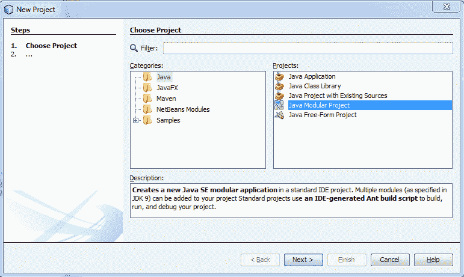
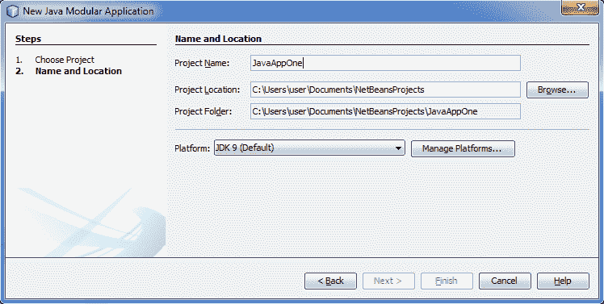
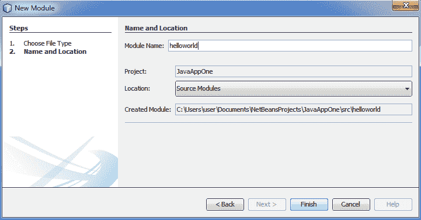
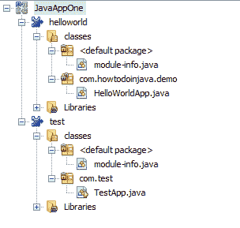
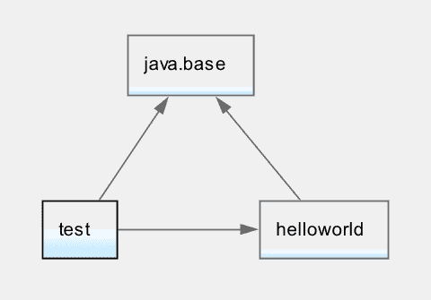

# Java 模块教程

> 原文： [https://howtodoinjava.com/java9/java-9-modules-tutorial/](https://howtodoinjava.com/java9/java-9-modules-tutorial/)

JPMS（Java 平台模块系统）是 Java 9 的主要增强特性。它也被称为 [Jigsaw 项目](https://openjdk.java.net/projects/jigsaw/)。 在此 **Java 9 模块示例**中，我们将学习有关模块的一般知识以及将来开始编写模块化代码时编程风格的变化。

```java
Table of Contents

What is a Module
Introduction to Java 9 Modules
How to Write Modular Code
Summary
```

## 什么是一般模块

在任何编程语言中，模块都是包含代码的（类似包的）工件，元数据描述了模块及其与其他模块的关系。 理想情况下，从编译时一直到运行时都可以识别这些工件。 通常，任何应用程序都是多个模块的组合，这些模块可以一起执行业务目标。

就应用程序架构而言，模块应代表特定的业务能力。 它应具有该特性的自足能力，并且应仅公开使用模块特性的接口。 要完成其任务，它可能依赖于其他模块，应明确声明其他模块。

因此，简而言之，一个模块应遵循三个核心原则：

*   #### 强封装

    [封装](//howtodoinjava.com/object-oriented/encapsulation-in-java-and-its-relation-with-abstraction/)意味着隐藏实现细节，这些细节对于正确使用模块不是必需的。 目的是封装的代码可以自由更改，而不会影响模块的用户。

*   #### 稳定的抽象

    [抽象](//howtodoinjava.com/object-oriented/understanding-abstraction-in-java/)有助于使用接口（即公共 API）公开模块特性。 任何时候，您想更改模块代码中的业务逻辑或实现，更改对模块用户都是透明的。

*   #### 显式依赖

    模块也可以依赖于其他模块。 这些外部依赖项必须是模块定义本身的一部分。 模块之间的这些依赖关系通常表示为图形。 在应用程序级别查看该图后，您将更好地了解应用程序的架构。

## Java 9 模块简介

在 Java 9 之前，您已经拥有“*包*”来根据业务特性对相关类进行分组。 与包一起，您还具有“[访问修饰符](//howtodoinjava.com/object-oriented/java-access-modifiers/)”，以控制其他类或包的可见内容和隐藏内容。 到目前为止，它一直运行良好。 Java 对封装和抽象有强大的支持。

但是，显式依赖关系是事情开始崩溃的地方。 在 Java 中，依存关系用`import`语句声明； 但严格来说，它们是“编译时”结构。 编译代码后，没有任何机制可以清楚地说明其运行时依赖项。 实际上，Java 运行时相关性解析是一个问题很大的领域，以至于已经创建了专门的工具来解决此问题，例如 [gradle](//howtodoinjava.com/gradle/gradle-tutorial-installation-and-hello-world-example/) 或 [maven](//howtodoinjava.com/maven/) 。 同样，很少有框架开始捆绑其完整的运行时依赖关系，例如 [SpringBoot](//howtodoinjava.com/spring/spring-boot/spring-boot-tutorial-with-hello-world-example/) 项目。

使用新的 **Java 9 模块**，我们将具有更好的特性来编写结构良好的应用程序。 此增强特性分为两个区域：

1.  模块化 JDK 本身。
2.  提供一个模块系统供其他应用程序使用。

Java 9 模块系统具有一个“`java.base`”模块。 称为“基本模块”。 这是一个独立模块，不依赖于任何其他模块。 默认情况下，所有其他模块都依赖于“`java.base`”。

在 Java 9 中，模块可帮助您封装包和管理依赖项。 所以通常

*   类是字段和方法的容器
*   包是类和接口的容器
*   模块是包的容器

如果您不知道要寻找的特定内容，您将不会感觉到普通代码和模块化代码之间的主要**区别**。 例如：

1.  模块通常只是一个 jar 文件，其根目录具有`module-info.class`文件。
2.  要使用模块，请将 jar 文件而不是`classpath`包含在`modulepath`中。 添加到类路径的模块化 jar 文件是普通的 jar 文件，`module-info.class`文件将被忽略。

## 如何编写模块化代码

阅读以上所有概念后，让我们看看如何在现实中编写模块化代码。 我正在使用 Netbeans IDE，因为它具有对 Java 9 的良好的[早期支持（截至今天）。](http://wiki.netbeans.org/JDK9Support)

#### 创建 Java 模块化项目

创建新的模块化项目。 我已经创建了名称`JavaAppOne`。



创建 Java 模块化项目



创建 Java 模块化项目 – 步骤 2

#### 创建 Java 模块

现在，在此项目中添加一个或两个模块。



创建新模块

我添加了两个模块`helloworld`和`test`。 让我们看看他们的代码和项目结构。



Java 9 模块项目结构

`/helloworld/module-info.java`

```java
module helloworld {
}

```

`HelloWorldApp.java`

```java
package com.howtodoinjava.demo;

public class HelloWorldApp {
    public static void sayHello() {
        System.out.println("Hello from HelloWorldApp");
    }
}

```

`/test/module-info.java`

```java
module test {
}

```

`TestApp.java`

```java
package com.test;

public class TestApp {
    public static void main(String[] args) {
        //some code
    }
}

```

到目前为止，模块是独立的。 现在假设，我们想在`TestApp`类中使用`HelloWorldApp.sayHello()`方法。 如果尝试使用该类而不导入模块，则会出现编译时错误“包`com.howtodoinjava.demo`包不可见”。

#### 导出包和导入模块

为了能够导入`HelloWorldApp`，您必须首先从`helloworld`模块中导出“`com.howtodoinjava.demo`”包，然后在`test`模块中包含`helloworld`模块。

```java
module helloworld {
    exports com.howtodoinjava.demo;
}

module test {
    requires helloworld;
}

```

在上面的代码中，`requires`关键字表示依赖性，`exports`关键字标识可导出到其他模块的包。 仅当显式导出包时，才能从其他模块访问它。 默认情况下，无法从其他模块访问模块中未导出的包。

现在您将可以在`TestApp`类中使用`HelloWorldApp`类。

```java
package com.test;

import com.howtodoinjava.demo.HelloWorldApp;

public class TestApp {
    public static void main(String[] args) {
        HelloWorldApp.sayHello();
    }
}

Output:

Hello from HelloWorldApp

```

让我们来看一下模块图。



模块图

从 Java 9 开始，“`public`”仅对该模块内部的所有其他包表示“`public`”。 仅当导出包含“`public`”类型的包时，其他模块才能使用它。

## 总结

模块化应用程序具有许多优点，当您遇到具有非模块化代码库的应用程序时，您会更加欣赏。 您必须听说过诸如“*意大利面条架构*”或“*凌乱的整体*”之类的术语。 模块化不是灵丹妙药，但它是一种架构原理，如果正确应用，可以在很大程度上防止这些问题。

借助 JPMS，Java 已迈出了一大步，成为了模块化语言。 决定是对还是错，只有时间会证明一切。 第三方库和框架如何适应和使用模块系统将会很有趣。 以及它如何影响开发工作，我们每天都在做。

[下载源码](//howtodoinjava.com/wp-content/downloads/Java9ModuleExample.zip)

学习愉快！