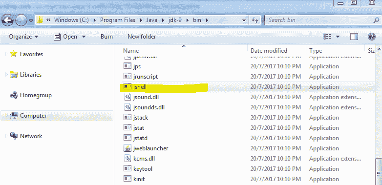
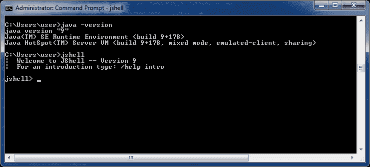
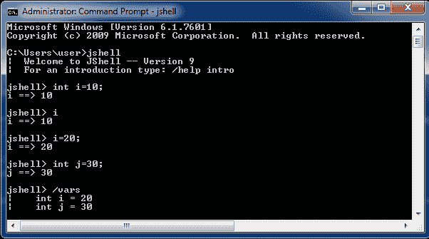
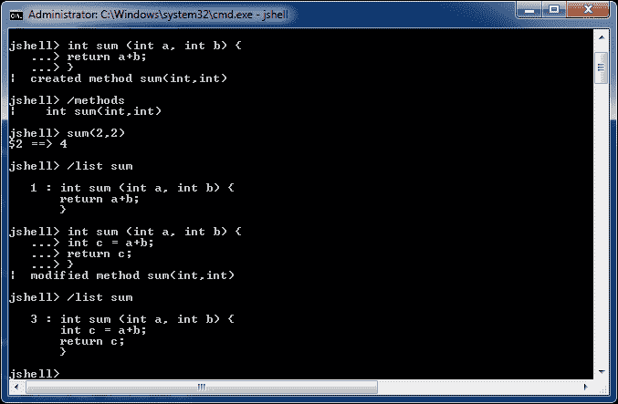
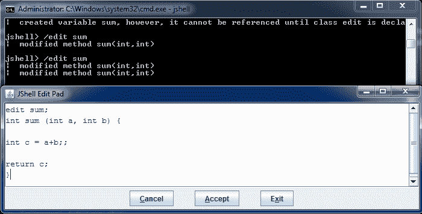
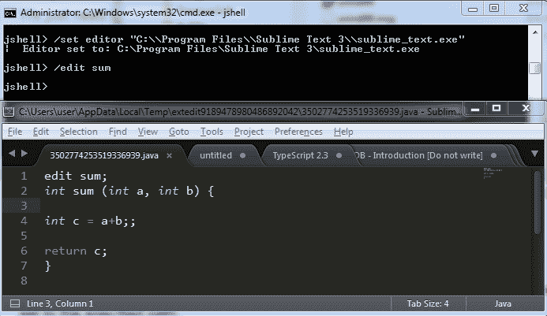
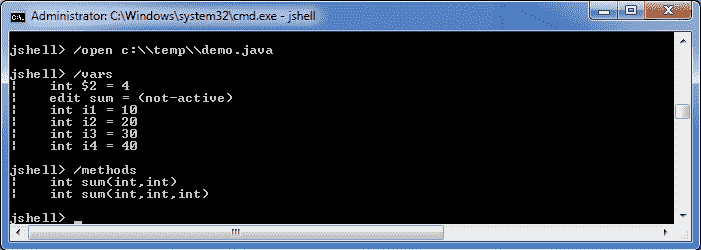

# Java 9 – JShell

> 原文： [https://howtodoinjava.com/java9/complete-jshell-tutorial-examples/](https://howtodoinjava.com/java9/complete-jshell-tutorial-examples/)

**JShell** 是新的命令行交互式 **REPL** （ *Read-Evaluate-Print-Loop* ）控制台，随附 **JDK 9** 发行版[ [JEP 222](https://openjdk.java.net/jeps/222) ]来评估用 Java 编写的声明，语句和表达式。 JShell 允许我们执行 Java 代码段并获得即时结果，而无需创建解决方案或项目。

在本教程中，我们将通过示例学习可以在 JShell 中完成的各种任务。

```java
Table of Contents

1\. Launch JShell
2\. Write and Execute Java Code
3\. Edit Code in JShell Edit Pad
4\. Launch Code in External Editor
5\. Load Code from External Files
```

## 1.启动 JShell

首先是将 JDK 9 安装到您的计算机中。 从此[链接](https://jdk.java.net/9/)下载 JDK 9 并进行安装。

转到安装位置并查看`/jdk-9/bin`文件夹。 您可以在这里找到 **jshell.exe** 文件。



JDK 9 中的 JShell 位置

现在启动一个新的命令窗口并检查 Java 版本。

```java
>> java -version
```

它应该指向 JDK 9 版本。 如果不是，则使用相应的值更新环境属性`JAVA_HOME`和`PATH`。

```java
JAVA_HOME=C:\Program Files\Java\jdk-9
PATH=C:\Program Files\Java\jdk-9\bin	//Path till bin folder

```

现在再次启动新的命令提示符窗口，然后键入命令`jshell`。 它将光标更改为`jshell`。



Jshell 启动窗口

恭喜，您已准备好在 **JShell REPL** （读取-评估-打印循环）中玩游戏。

## 2.在 REPL 中编写和执行 Java 代码

Jshell 允许创建小的代码段并对其进行测试，而无需创建和构建复杂的项目。 这就是应该使用它的方式。 在 JShell 上进行操作使其易于使用和快速。 让我们看看如何？

#### 2.1。 变数

您可以像在实际编程中一样，**定义变量**。 唯一的区别是您不必编写类或 main 方法即可开始。

```java
jshell> int i = 10;
i ==> 10
```

要**打印变量**的值，只需键入变量名称并按 ENTER。 它将打印变量的值。

```java
jshell> i
i ==> 10
```

要将**重新分配给新值**，只需按常规方法即可。

```java
jshell> i=20;
i ==> 20
```

要**列出所有声明的变量**，请使用命令 **/ vars** 。

```java
jshell> /vars
|    int i = 20
|    int j = 30
```



在 JShell 中使用变量

#### 2.2。 方法

与变量非常相似，方法也很简单。

要在 jshell 中使用**创建方法，**定义带有重新运行类型，方法名称，参数和方法主体的方法。 不需要访问修饰符。

```java
jshell> int sum (int a, int b) {
   ...> return a+b;
   ...> }
|  created method sum(int,int)
```

要**列出所有定义的方法**，请使用命令`/methods`。

```java
jshell> /methods
|    int sum(int,int)
```

要调用该方法，请像普通编程一样调用它。

```java
jshell> sum(2,2)
$6 ==> 4
```

如果要**查看方法**代码，请使用`/list`命令。 它将显示当前方法的源代码。 Ť

```java
jshell> /list sum

1 : int sum (int a, int b) {
   return a+b;
   }
```

要更改方法代码，您将需要使用相同的方法名称重写新的修改后的代码。

```java
jshell> int sum (int a, int b) {
   ...> int c = a+b;
   ...> return c;
   ...> }
|  modified method sum(int,int)

jshell> /list sum

   3 : int sum (int a, int b) {
       int c = a+b;
       return c;
       }
```



在 JShell 中使用方法

Please keep in mind the method overloading rules. It you changed the method parameters count or their data types, then it will be a new method and there will be two methods registered in jshell.

## 3.在 JShell 编辑板上编辑代码

到那时，您正在处理几行代码，JShell 内联编辑器已经足够了。 但是，当代码开始变大时，则可能需要文件编辑器来修改代码。

在这里您可以使用 JShell 编辑板。 要启动编辑板，请使用`/edit`命令和方法名称。


JShell 编辑板

在这里根据需要更改方法代码，然后单击“接受”按钮。 修改后的代码将在 Jshell 中更新，您将在提示符下收到确认消息。 您可以根据需要多次更改代码，保存代码然后退出窗口。



在 Jshell Edit Pad 中保存操作

## 4.在外部编辑器中启动代码

实际上，Edit Pad 足以满足大多数需求，即使您想在任何特定的编辑器上进行编码，也可以使用它。 JShell 允许轻松配置任何外部编辑器来编辑代码段。 您只需要获取我们要使用的编辑器的完整路径，并在 JShell 中运行`/set editor`命令来配置编辑器。

```java
/set editor "C:\\Program Files\\Sublime Text 3\\sublime_text.exe"
```

现在再次执行`/edit`命令。 现在它将在崇高编辑器中打开代码。



从 JShell 启动 Sublime Editor

随时编辑代码并保存在编辑板中。

## 5.将代码从外部 Java 文件加载到 REPL 中

很多时候，您已经在任何 Java 文件中编写了一些代码，并且希望将其执行到 JShell 中。 要在 JShell 中加载文件**，请使用`/open`命令。**

假设我在`c://temp`文件夹中有一个文件`Demo.java`。 内容是：

```java
int i1 = 10;
int i2 = 20;
int i3 = 30;
int i4 = 40;

int sum(int a, int b) {
	return a+b;
}

int sum(int a, int b, int c) {
	return a+b;
}

```

现在，将文件加载到 JShell 中。

```java
/open c:\\temp\\demo.java
```

验证在 Jshell 中加载的变量和方法。



JShell 中加载的 Java 代码

使用 Java 9 中的 **REPL 工具时，您必须了解的一切。**

将您的问题放在评论部分中。

学习愉快！