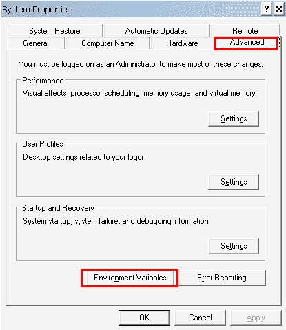

# Java 类路径

> 原文： [https://howtodoinjava.com/java/basics/java-classpath/](https://howtodoinjava.com/java/basics/java-classpath/)

了解**如何将类路径**设置为**环境变量**并作为**命令行参数**传递。 在任何 Java 应用程序的运行期间，`CLASSPATH`是一个告诉 JVM 在何处查找类和包的参数，可以使用环境变量或命令行参数进行设置。

> **类路径分隔符**：
> 
> **Windows** – `;`（分号）
> 
> **Linux / Unix** – `:`（冒号）

## 1\. 将 Java 类路径设置为环境变量

当您设置了在应用程序运行期间始终需要的 jar 文件集时，最好将它们添加到计算机的环境变量`'CLASSPATH'`中。 在应用程序运行时，[应用程序类加载器](https://howtodoinjava.com/java/basics/jdk-jre-jvm/#jvm)将始终在此变量的指定路径下扫描 jar 文件和类。

要设置**类路径环境变量**，请在您的计算机中查找用户变量的位置，并添加存储 Jar 文件的所有路径。 在两个不同的文件夹，jar 文件或类之间使用分隔符。

例如，您可以通过以下方式找到环境变量：

1.  在桌面上，右键单击**计算机**图标。
2.  从上下文菜单中选择**属性**。
3.  单击**高级系统设置**链接。
4.  单击**环境变量**。 在**系统变量**部分中，找到`CLASSPATH`环境变量并将其选中。 点击**编辑**。 如果`CLASSPATH`环境变量不存在，请单击`New`。
5.  添加所有用分隔符分隔的文件夹。 单击 **OK**。 通过单击 **OK** 关闭所有剩余的窗口。



系统属性

如果是第一次创建`CLASSPATH`，则需要在窗口中指定**变量名**的名称。 使用`'.'`（点）表示**当前目录**。

## 2\. 从命令行设置 Java 类路径

使用`-classpath`参数从命令提示符/控制台设置类路径。 使用以下给定的命令来设置不同需求的类路径。 假设我们有一个名为`dependency`的文件夹，用于放置 JAR 文件和其他类。

#### 2.1 在类路径中添加单个 jar 文件

下面的语法示例将**在类路径**中添加单个 jar 文件。

```java
//WINDOWS
$ set CLASSPATH=.;C:\dependency\framework.jar

//Linux/Unix
$ export CLASSPATH=.:/dependency/framework.jar

```

#### 2.2 在类路径中添加多个 jar 文件

以下语法示例将**在类路径**中添加多个 jar 文件。 为此，只需将操作系统的分隔符（`;`或`:`）用作为`CLASSPATH`指定的位置之间的分隔符。

要向**添加目录**中存在的所有 JAR 文件，请使用通配符（`'*'`）。

```java
//WINDOWS
$ set CLASSPATH=C:\dependency\framework.jar;C:\location\otherFramework.jar 				
$ set CLASSPATH=C:\dependency\framework.jar;C:\location\*.jar

//Linux/Unix
$ export CLASSPATH=/dependency/framework.jar:/location/otherFramework.jar  	
$ export CLASSPATH=/dependency\framework.jar:/location/*.jar

```

#### 2.3 将类添加到类路径

很多时候，您可能还需要在`classpath`中添加单个类。 为此，只需**添加存在类文件的文件夹**。 例如假设`location`文件夹中存在五个`.class`文件，您希望将它们包括在类路径中。

```java
//WINDOWS
$ set CLASSPATH=C:\dependency\*;C:\location

//Linux/Unix
$ export CLASSPATH=/dependency/*:/location

```

最佳做法是，始终将所有 JAR 文件和应用程序类组织在一个根文件夹中。 这可能是应用程序的工作空间。

请注意，**`CLASSPATH`中包含的子目录不会被加载**。 为了加载子目录中包含的文件，必须在`CLASSPATH`中显式列出这些目录和/或文件。

## 3\. 使用`-classpath`参数执行 Java 程序

除了将`classpath`设置为环境变量之外，您还可以在使用` – classpath`参数启动应用程序时将其他`classpath`传递给 Java 运行时。

```java
$ javac – classpath C:\dependency\framework.jar MyApp.Java
$ java – classpath C:\dependency\framework.jar MyApp

```

## 4\. 如何检查类路径

每当您希望验证`CLASSPATH`变量中的所有路径条目时，都可以使用`echo`命令进行验证。

```java
//Windows
c:/> echo %CLASSPATH%

//Linux/Unix
$ echo $CLASSPATH

```

如果未设置`CLASSPATH`，则控制台将显示“`CLASSPATH`：未定义的变量”错误（Solaris 或 Linux），或仅在 Windows 命令提示符中打印`%CLASSPATH%`。

学习愉快！

阅读更多：

[Oracle Java 文档](https://docs.oracle.com/javase/tutorial/essential/environment/paths.html)