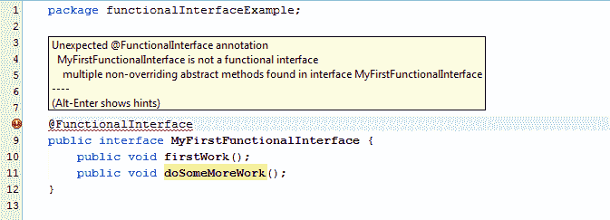

# Java 8 – 函数式接口

> 原文： [https://howtodoinjava.com/java8/functional-interface-tutorial/](https://howtodoinjava.com/java8/functional-interface-tutorial/)

了解 Java 8 函数式接口以及围绕一个接口允许的一种抽象方法的规则。 了解如何通过函数式接口中的默认方法添加更多方法。

```java
Table of Contents 

1\. What is functional interface
2\. Do's and Don't's in functional interfaces

```

## 1\. 什么是函数式接口

函数式接口是 [**java 8**](//howtodoinjava.com/category/java8/ "java 8") 中的新增特性，其中**恰好允许其中的一种抽象方法**。 这些接口也称为**单一抽象方法接口（SAM 接口）**。

在 Java 8 中，函数式接口也可以使用 lambda 表达式，方法引用和构造器引用表示。

Java 8 也引入了一个注解，即`@FunctionalInterface`，当您注解的接口违反了一种抽象方法的约定时，该注解也可用于编译器级错误。

让我们构建第一个函数式接口：

```java
@FunctionalInterface
public interface MyFirstFunctionalInterface 
{
	public void firstWork();
}

```

让我们尝试添加另一个抽象方法：

```java
@FunctionalInterface
public interface MyFirstFunctionalInterface 
{
	public void firstWork();
	public void doSomeMoreWork();	//error
}

```

以上将导致编译器错误，如下所示：

```java
Unexpected @FunctionalInterface annotation
@FunctionalInterface ^ MyFirstFunctionalInterface is not a functional interface
multiple non-overriding abstract methods found in interface MyFirstFunctionalInterface

```



> 阅读更多：[通用函数式接口](https://howtodoinjava.com/java8/generic-functional-interfaces/)

## 2\. 函数式接口中的“是”与“否”

以下是函数式接口中允许和不允许的事物的列表。

*   如上所述， ***在任何函数式接口中仅允许使用一种抽象方法*** 。 在函数式接口中不允许使用第二种抽象方法。 如果删除`@FunctionInterface`注解，则可以添加另一个抽象方法，但是它将使该接口成为非函数式接口。
*   即使`@FunctionalInterface`注释将被省略 ，函数式接口也有效。 它仅用于通知编译器在接口内部强制使用单个[抽象方法](//howtodoinjava.com/object-oriented/exploring-interfaces-and-abstract-classes-in-java/ "Exploring interfaces and abstract classes in java")。
*   从概念上讲，函数式接口仅具有一种抽象方法。 由于[**默认方法**](//howtodoinjava.com/java8/default-methods-in-java-8/)具有实现，因此它们不是抽象的。 由于默认方法不是抽象的，因此您可以自由地向函数式接口添加任意数量的默认方法。

    以下是有效的函数式接口：

    ```java
    @FunctionalInterface
    public interface MyFirstFunctionalInterface 
    {
        public void firstWork();

        default void doSomeMoreWork1(){
        //Method body
        }

        default void doSomeMoreWork2(){
        //Method body
        }
    }

    ```

*   如果接口声明了覆盖`java.lang.Object`的公共方法之一的抽象方法，则该方法也不计入接口的抽象方法数量，因为该接口的任何实现都有来自`java.lang.Object`或其他地方的实现。 例如[`Comparator`](//howtodoinjava.com/search-sort/when-to-use-comparable-and-comparator-interfaces-in-java/)是函数式接口，即使它声明了两个抽象方法。 为什么？ 因为这些抽象方法之一`equals()`具有与`Object`类中的`public`方法相同的签名。

    例如下方的接口是有效的函数式接口。

    ```java
    @FunctionalInterface
    public interface MyFirstFunctionalInterface 
    {
    	public void firstWork();

    	@Override
    	public String toString();                //Overridden from Object class

    	@Override
    	public boolean equals(Object obj);        //Overridden from Object class
    }

    ```

这就是 Java 8 中**函数式接口的全部内容。**

学习愉快！