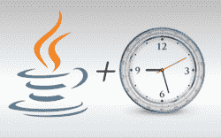

# Java 8 – 日期和时间示例

> 原文： [https://howtodoinjava.com/java8/date-and-time-api-changes-in-java-8-lambda/](https://howtodoinjava.com/java8/date-and-time-api-changes-in-java-8-lambda/)

开发人员社区的很大一部分一直在抱怨**日期和日历类**。 原因很多，例如难以理解，难以使用和不灵活。 Date 类甚至已经过时，并且 Java 文档建议使用`Calendar`类而不是`Date`类。 最重要的是，**日期比较**有很多问题，我过去也遇到过这样的问题。



展望未来，JAVA 8（ [Lambda](//howtodoinjava.com/java8/complete-lambda-expressions-tutorial-in-java/) ）有望发布新的日期和时间 API /类（ [**JSR-310**](https://java.net/projects/jsr-310/ "jsr-310") ），也称为 **ThreeTen** ，它将仅更改您到目前为止的操作方式。 这的一个关键部分是提供一个新的 API，该 API 显着易于使用且不易出错。

它将提供一些非常需要的功能，例如：

*   所有关键的公共类都是不可变的并且是线程安全的
*   其他计算领域可以采用的定义的术语和行为

I wrote this post on 15th May 2013\. Now today on 18th Mar 2014, java 8 is finally released and available for early access. I have re-validated and verified all the outputs in post examples. They work like charm as they did in May last year. Only change encountered was in `TemporalAdjuster.java`. Previously it was a class, now it is a **`@FunctionalInterface`**. So, I have corrected the related example and used the class “`TemporalAdjusters.java`“.

```java
Table of Contents

New classes to represent local date and timezone
New classes to represent timestamp and duration
Added utility classes over existing enums
Date adjusters introduced
Building dates will be easier
New class to simulate system/machine clock
Timezone handling related changes
Date formatting changes
References
```

## 代表本地日期和时区的新类

打算替换 Date 类的新类是`LocalDate`，`LocalTime`和`LocalDateTime`。

#### 本地化

[LocalDate](https://docs.oracle.com/javase/8/docs/api/java/time/LocalDate.html) 类表示日期。 没有时间或时区的表示。

```java
LocalDate localDate = LocalDate.now();
System.out.println(localDate.toString());                //2013-05-15
System.out.println(localDate.getDayOfWeek().toString()); //WEDNESDAY
System.out.println(localDate.getDayOfMonth());           //15
System.out.println(localDate.getDayOfYear());            //135
System.out.println(localDate.isLeapYear());              //false
System.out.println(localDate.plusDays(12).toString());   //2013-05-27

```

#### 当地时间

[LocalTime](https://docs.oracle.com/javase/8/docs/api/java/time/LocalTime.html) 类表示时间。 没有日期或时区的表示。

```java
//LocalTime localTime = LocalTime.now();     //toString() in format 09:57:59.744
LocalTime localTime = LocalTime.of(12, 20);
System.out.println(localTime.toString());    //12:20
System.out.println(localTime.getHour());     //12
System.out.println(localTime.getMinute());   //20
System.out.println(localTime.getSecond());   //0
System.out.println(localTime.MIDNIGHT);      //00:00
System.out.println(localTime.NOON);          //12:00

```

#### localdateti 至

[LocalDateTime](https://docs.oracle.com/javase/8/docs/api/java/time/LocalDateTime.html) 类表示日期时间。 没有时区的表示。

```java
LocalDateTime localDateTime = LocalDateTime.now(); 
System.out.println(localDateTime.toString());      //2013-05-15T10:01:14.911
System.out.println(localDateTime.getDayOfMonth()); //15
System.out.println(localDateTime.getHour());       //10
System.out.println(localDateTime.getNano());       //911000000

```

如果您想将日期功能与区域信息一起使用，则 Lambda 会为您提供额外的 3 类，类似于上面的一种，即`OffsetDate`，`OffsetTime`和`OffsetDateTime`。 时区偏移可以以“ +05：30”或“欧洲/巴黎”格式表示。 这是通过使用另一个类即`ZoneId`完成的。

```java
OffsetDateTime offsetDateTime = OffsetDateTime.now();
System.out.println(offsetDateTime.toString());            	//2013-05-15T10:10:37.257+05:30

offsetDateTime = OffsetDateTime.now(ZoneId.of(&quot;+05:30&quot;));
System.out.println(offsetDateTime.toString());            	//2013-05-15T10:10:37.258+05:30

offsetDateTime = OffsetDateTime.now(ZoneId.of(&quot;-06:30&quot;));
System.out.println(offsetDateTime.toString());            	//2013-05-14T22:10:37.258-06:30

ZonedDateTime zonedDateTime = 
				ZonedDateTime.now(ZoneId.of(&quot;Europe/Paris&quot;));
System.out.println(zonedDateTime.toString());     			//2013-05-15T06:45:45.290+02:00[Europe/Paris]

```

## 代表时间戳和持续时间的新类

#### 瞬间

为了随时表示特定的时间戳，需要使用的类是 [Instant](https://docs.oracle.com/javase/8/docs/api/java/time/Instant.html) 。 `Instant`类表示精确到纳秒的时间点。 对`Instant`的操作包括与另一个`Instant`的比较以及持续时间的增加或减少。

```java
Instant instant = Instant.now();
System.out.println(instant.toString());                                 //2013-05-15T05:20:08.145Z
System.out.println(instant.plus(Duration.ofMillis(5000)).toString());   //2013-05-15T05:20:13.145Z
System.out.println(instant.minus(Duration.ofMillis(5000)).toString());  //2013-05-15T05:20:03.145Z
System.out.println(instant.minusSeconds(10).toString());				//2013-05-15T05:19:58.145Z

```

#### 持续时间

[持续时间](https://docs.oracle.com/javase/8/docs/api/java/time/Duration.html)类是用 Java 语言首次带来的全新概念。 它表示两个时间戳之间的时差。

```java
Duration duration = Duration.ofMillis(5000);
System.out.println(duration.toString());     //PT5S

duration = Duration.ofSeconds(60);
System.out.println(duration.toString());     //PT1M

duration = Duration.ofMinutes(10);
System.out.println(duration.toString());     //PT10M

duration = Duration.ofHours(2);
System.out.println(duration.toString());     //PT2H

duration = Duration.between(Instant.now(), Instant.now().plus(Duration.ofMinutes(10)));
System.out.println(duration.toString());  //PT10M

```

`Duration`处理较小的时间单位，例如毫秒，秒，分钟和小时。 它们更适合与应用程序代码进行交互。

#### 期

要与人互动，您需要获得更大的持续时间，并以 [Period](https://docs.oracle.com/javase/8/docs/api/java/time/Period.html) class 给出。

```java
Period period = Period.ofDays(6);
System.out.println(period.toString());    //P6D

period = Period.ofMonths(6);
System.out.println(period.toString());    //P6M

period = Period.between(LocalDate.now(), 
			LocalDate.now().plusDays(60));
System.out.println(period.toString());   //P1M29D

```

## 在现有枚举上添加了实用程序类

当前的 Java SE 平台使用 int 常量表示月份，星期几和 am-pm 等。现在，添加了许多额外的实用程序类，它们在这些枚举的基础上起作用。 我以这样的类为例： [DayOfWeek](https://docs.oracle.com/javase/8/docs/api/java/time/DayOfWeek.html) 。 该类是 day 枚举的包装，并且可以与其他类一致使用。

#### 日间周

```java
//day-of-week to represent, from 1 (Monday) to 7 (Sunday)
System.out.println(DayOfWeek.of(2));        			//TUESDAY 

DayOfWeek day = DayOfWeek.FRIDAY;
System.out.println(day.getValue());         			//5

LocalDate localDate = LocalDate.now();
System.out.println(localDate.with(DayOfWeek.MONDAY));  //2013-05-13  i.e. when was monday in current week ?

```

其他此类类别是`Month`，`MonthDay`，`Year`和`YearMonth`等。

## 日期调整器

日期调节器是日期处理工具中另一个美观实用的功能。 它可以轻松解决以下问题：您如何*查找一个月的最后一天*？ 还是下一个工作日？ 还是星期二一个星期？

让我们看一下代码。

```java
LocalDate date = LocalDate.of(2013, Month.MAY, 15);						//Today

LocalDate endOfMonth = date.with(TemporalAdjusters.lastDayOfMonth());
System.out.println(endOfMonth.toString()); 								//2013-05-31

LocalDate nextTue = date.with(TemporalAdjusters.next(DayOfWeek.TUESDAY));
System.out.println(nextTue.toString());									//2013-05-21

```

## 创建日期对象

现在也可以使用[构建器模式](//howtodoinjava.com/design-patterns/creational/builder-pattern-in-java/)创建日期对象。 构建器模式允许使用单个零件来构建您想要的对象。 这是通过使用以“ at”为前缀的方法来实现的。

```java
//Builder pattern used to make date object
 OffsetDateTime date1 = Year.of(2013)
						.atMonth(Month.MAY).atDay(15)
						.atTime(0, 0)
						.atOffset(ZoneOffset.of(&quot;+03:00&quot;));
 System.out.println(date1);   									//2013-05-15T00:00+03:00

//factory method used to make date object
OffsetDateTime date2 = OffsetDateTime.
						of(2013, 5, 15, 0, 0, 0, 0, ZoneOffset.of(&quot;+03:00&quot;));
System.out.println(date2);										//2013-05-15T00:00+03:00

```

## 模拟系统/机器时钟的新类

在新版本中提出了新的类[时钟](https://docs.oracle.com/javase/8/docs/api/java/time/Clock.html)。 该**模拟系统时钟功能**。 我最喜欢这个功能。 原因是在进行单元测试时。 您通常需要在将来的日期测试 API。 为此，我们已经将系统时钟转发到下一个日期，然后再次重新启动服务器并测试应用程序。

现在，无需这样做。 使用`Clock`类可以模拟这种情况。

```java
Clock clock = Clock.systemDefaultZone();
System.out.println(clock);						//SystemClock[Asia/Calcutta]
System.out.println(clock.instant().toString());	//2013-05-15T06:36:33.837Z
System.out.println(clock.getZone());			//Asia/Calcutta

Clock anotherClock = Clock.system(ZoneId.of(&quot;Europe/Tiraspol&quot;));
System.out.println(anotherClock);						//SystemClock[Europe/Tiraspol]
System.out.println(anotherClock.instant().toString());	//2013-05-15T06:36:33.857Z
System.out.println(anotherClock.getZone());				//Europe/Tiraspol

Clock forwardedClock  = Clock.tick(anotherClock, Duration.ofSeconds(600));
System.out.println(forwardedClock.instant().toString());  //2013-05-15T06:30Z

```

## 时区变更

与时区相关的处理由 3 个主要类别完成。 这些是 [ZoneOffset](https://docs.oracle.com/javase/8/docs/api/java/time/ZoneOffset.html) ， [TimeZone](https://docs.oracle.com/javase/8/docs/api/java/util/TimeZone.html) ， [ZoneRules](https://docs.oracle.com/javase/8/docs/api/java/time/zone/ZoneRules.html) 。

*   `ZoneOffset`类表示与 UTC 的固定偏移量，以秒为单位。 通常以“±hh：mm”格式的字符串表示。
*   `TimeZone`类表示在其中定义了指定时区规则的区域的标识符。
*   `ZoneRules`是定义区域偏移量何时更改的实际规则集。

```java
//Zone rules
System.out.println(ZoneRules.of(ZoneOffset.of(&quot;+02:00&quot;)).isDaylightSavings(Instant.now()));
System.out.println(ZoneRules.of(ZoneOffset.of(&quot;+02:00&quot;)).isFixedOffset());

```

## 日期格式

日期格式化通过两个类别（主要是`DateTimeFormatterBuilder`和`DateTimeFormatter`）支持。 `DateTimeFormatterBuilder`使用构建器模式来构建自定义模式，因为`DateTimeFormatter`为此提供了必要的输入。

```java
DateTimeFormatterBuilder formatterBuilder = new DateTimeFormatterBuilder();
formatterBuilder.append(DateTimeFormatter.ISO_LOCAL_DATE_TIME)
				.appendLiteral(&quot;-&quot;)
				.appendZoneOrOffsetId();
DateTimeFormatter formatter = formatterBuilder.toFormatter();
System.out.println(formatter.format(ZonedDateTime.now()));

```

这些是我能够识别并进行的重大更改。

## 参考文献

*   [https://jdk8.java.net/lambda/](https://jdk8.java.net/lambda/ "download lambda")
*   [http://sourceforge.net/apps/mediawiki/threeten/index.php?title=User_Guide](https://sourceforge.net/apps/mediawiki/threeten/index.php?title=User_Guide "date changes ref doc")

**祝您学习愉快！**