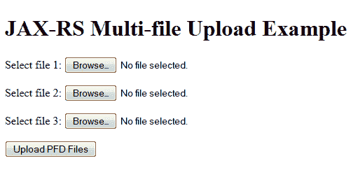

# Jersey -Ajax 多文件上传示例

> 原文： [https://howtodoinjava.com/jersey/jax-rs-jersey-ajax-multi-file-upload-example/](https://howtodoinjava.com/jersey/jax-rs-jersey-ajax-multi-file-upload-example/)

了解如何结合使用 **[Ajax](//howtodoinjava.com/scripting/complete-ajax-tutorial/)** 和 JAX-RS 网络服务（示例中使用 **[Jersey](//howtodoinjava.com/jersey-jax-rs-tutorials/)** ）将**上传到多个文件** 单键单击。 还要看看基于[表单的文件上传示例](//howtodoinjava.com/jersey/jersey-file-upload-example/)和[文件下载示例](//howtodoinjava.com/jersey/jax-rs-jersey-2-file-download-example-using-streamingoutput/)。


```java
Table of Contents

Jersey maven multipart dependency
Add MultiPartFeature
Write Upload REST API
HTML/Ajax code
Demo of Multiple files upload
```

## Jersey  Maven 多部分依赖

要使用多部分功能，您需要将`jersey-media-multipart`模块以及其他必需的模块添加到`pom.xml`文件中。

```java
<project xmlns="http://maven.apache.org/POM/4.0.0" 
		 xmlns:xsi="http://www.w3.org/2001/XMLSchema-instance"
	     xsi:schemaLocation="http://maven.apache.org/POM/4.0.0 
		 http://maven.apache.org/xsd/maven-4.0.0.xsd;
	<modelVersion>4.0.0</modelVersion>
	<groupId>com.howtodoinjava.jersey</groupId>
	<artifactId>JerseyDemos</artifactId>
	<version>0.0.1-SNAPSHOT</version>
	<packaging>war</packaging>
	<repositories>
		<repository>
			<id>maven2-repository.java.net</id>
			<name>Java.net Repository for Maven</name>
			<url>http://download.java.net/maven/2/</url>
			<layout>default</layout>
		</repository>
	</repositories>
	<properties>
		<jersey2.version>2.19</jersey2.version>
		<jaxrs.version>2.0.1</jaxrs.version>
	</properties>
	<dependencies>
		<!-- JAX-RS -->
		<dependency>
			<groupId>javax.ws.rs</groupId>
			<artifactId>javax.ws.rs-api</artifactId>
			<version>${jaxrs.version}</version>
		</dependency>
		<!-- Jersey 2.19 -->
		<dependency>
			<groupId>org.glassfish.jersey.containers</groupId>
			<artifactId>jersey-container-servlet</artifactId>
			<version>${jersey2.version}</version>
		</dependency>
		<dependency>
			<groupId>org.glassfish.jersey.core</groupId>
			<artifactId>jersey-server</artifactId>
			<version>${jersey2.version}</version>
		</dependency>
		<dependency>
			<groupId>org.glassfish.jersey.core</groupId>
			<artifactId>jersey-client</artifactId>
			<version>${jersey2.version}</version>
		</dependency>
		<dependency>
			<groupId>org.glassfish.jersey.media</groupId>
			<artifactId>jersey-media-multipart</artifactId>
			<version>${jersey2.version}</version>
		</dependency>
	</dependencies>
	<build>
		<finalName>JerseyDemos</finalName>
		<plugins>
			<plugin>
				<artifactId>maven-compiler-plugin</artifactId>
				<configuration>
					<source>1.7</source>
					<target>1.7</target>
				</configuration>
			</plugin>
		</plugins>
	</build>
</project>

```

## 添加 MultiPartFeature

此外，还需要在 Jersey 配置中添加 **MultiPartFeature** ，以使其知道您将使用多部分请求。 最简单的方法是通过`web.xml`文件添加支持。

```java
<!DOCTYPE web-app PUBLIC
 "-//Sun Microsystems, Inc.//DTD Web Application 2.3//EN"
 "http://java.sun.com/dtd/web-app_2_3.dtd" >

<web-app>

	<display-name>Archetype Created Web Application</display-name>

	<servlet>
		<servlet-name>jersey-serlvet</servlet-name>
		<servlet-class>org.glassfish.jersey.servlet.ServletContainer</servlet-class>
		<init-param>
			<param-name>jersey.config.server.provider.packages</param-name>
			<param-value>com.howtodoinjava.jersey</param-value>
		</init-param>
		<init-param>
			<param-name>jersey.config.server.provider.classnames</param-name>
			<param-value>org.glassfish.jersey.filter.LoggingFilter;
						 org.glassfish.jersey.media.multipart.MultiPartFeature</param-value>
		</init-param>
		<load-on-startup>1</load-on-startup>
	</servlet>

	<servlet-mapping>
		<servlet-name>jersey-serlvet</servlet-name>
		<url-pattern>/rest/*</url-pattern>
	</servlet-mapping>

</web-app>

```

## 编写上传 REST API

现在编写服务层 JAX-RS API，它实际上将具有将上传的文件存储在服务器上的逻辑。

```java
package com.howtodoinjava.jersey;

import java.io.File;
import java.io.FileOutputStream;
import java.io.IOException;
import java.io.InputStream;
import java.io.OutputStream;

import javax.ws.rs.Consumes;
import javax.ws.rs.POST;
import javax.ws.rs.Path;
import javax.ws.rs.WebApplicationException;
import javax.ws.rs.core.MediaType;
import javax.ws.rs.core.Response;

import org.glassfish.jersey.media.multipart.FormDataContentDisposition;
import org.glassfish.jersey.media.multipart.FormDataParam;

@Path("/upload")
public class JerseyService 
{
	@POST
	@Path("/pdf")
	@Consumes({MediaType.MULTIPART_FORM_DATA})
	public Response uploadPdfFile(	@FormDataParam("file") InputStream fileInputStream,
            						@FormDataParam("file") FormDataContentDisposition fileMetaData) throws Exception
	{
		String UPLOAD_PATH = "c:/temp/";
		try 
		{
			int read = 0;
			byte[] bytes = new byte[1024];

			OutputStream out = new FileOutputStream(new File(UPLOAD_PATH + fileMetaData.getFileName()));
			while ((read = fileInputStream.read(bytes)) != -1) 
			{
				out.write(bytes, 0, read);
			}
			out.flush();
			out.close();
		} catch (IOException e) 
		{
			throw new WebApplicationException("Error while uploading file. Please try again !!");
		}
		return Response.ok(fileMetaData.getFileName() + " uploaded successfully !!").build();
	}
}

```

## HTML / Ajax 代码

是时候看看客户端代码了。 我编写了一个功能非常简单的非常简单的文件。 如果您要对其进行某些特定的更改，请告诉我。

```java
<!DOCTYPE html PUBLIC "-//W3C//DTD XHTML 1.0 Strict//EN"
  "http://www.w3.org/TR/xhtml1/DTD/xhtml1-strict.dtd">

<html xmlns="http://www.w3.org/1999/xhtml" xml:lang="en" lang="en">
	<head>
		<meta content="text/html;charset=utf-8" http-equiv="Content-Type" />
		<meta content="utf-8" http-equiv="encoding" />

		<script src="./js/jquery.min.js"></script>
		<script type="text/javascript">

		$(document).ready(function() 
		{
			$("#uploadBtn").click(function() 
			{
				$('input[name="file"]').each(function(index, value) 
				{ 
				    var file = value.files[0];
				    if(file) 
				    {
				    	var formData = new FormData();
						formData.append('file', file);
						$.ajax({
						  url : '/JerseyDemos/rest/upload/pdf',
						  type : 'POST',
						  data : formData,
						  cache : false,
						  contentType : false,
						  processData : false,
						  success : function(data, textStatus, jqXHR) {
						    	var message = jqXHR.responseText;
						    	$("#messages").append("<li>" + message + "</li>");
						  },
						  error : function(jqXHR, textStatus, errorThrown) {
							  	$("#messages").append("<li style='color: red;'>" + textStatus + "</li>");
						  }
						});
					}
				});
			});
		});
		</script>
</head>
<body>
	<h1>JAX-RS Multi-file Upload Example</h1>

	<form action="rest/upload/pdf" method="post" enctype="multipart/form-data">

		<p>
			Select file 1: <input type="file" name="file" size="45"	accept=".pdf" />
		</p>
		<p>
			Select file 2: <input type="file" name="file" size="45"	accept=".pdf" />
		</p>
		<p>
			Select file 3: <input type="file" name="file" size="45"	accept=".pdf" />
		</p>
		<p>
			<input id="uploadBtn" type="button" value="Upload PFD Files" />
		</p>

	</form>

	<ul id="messages">	
	</ul>

</body>
</html>

```

## 多个文件上传演示

演示时间。 在服务器上部署应用程序，然后单击 URL：`http://localhost:8080/JerseyDemos/fileUpload.html`



Jersey multifile upload example – blank form


现在选择两个/三个文件，然后单击上载按钮。 您将在屏幕上看到以下消息。 文件也将存储在服务器上。


Jersey multi-file upload success


在评论框中让我知道您的问题。

**祝您学习愉快！**