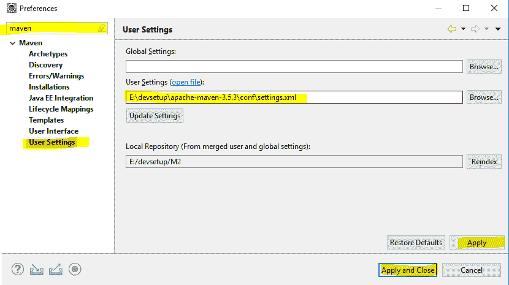

# Maven 代理设置 – Eclipse，命令行和全局设置

> 原文： [https://howtodoinjava.com/maven/maven-proxy-settings/](https://howtodoinjava.com/maven/maven-proxy-settings/)

学习配置 **maven https 代理设置**。 默认情况下，maven 在本地系统上运行时使用默认的网络连接。 但是有时我们在工作场所或公司中运行应用程序。 这些网络通过代理服务器或防火墙来屏蔽互联网使用，因此从我们的系统进行的所有互联网查询都通过此代理服务器进行。

Maven 默认情况下不会检测网络代理配置，并且要在这些受限区域中使用 maven，我们必须为 maven 配置网络代理设置。

> 阅读更多： [Maven 安装](https://howtodoinjava.com/maven/change-local-repository-location/)

## 1\. 如何配置 Maven 代理设置

要设置 **maven 代理设置**，请执行以下步骤：

*   导航到路径 – `{M2_HOME} conf/settings.xml`
*   在任何文本编辑器中以编辑模式打开文件`settings.xml`。
*   打开并更新`<proxy>`标签。

该标签如下所示：

```java
<settings xmlns="http://maven.apache.org/SETTINGS/1.0.0" 
      xmlns:xsi="http://www.w3.org/2001/XMLSchema-instance" 
      xsi:schemaLocation="http://maven.apache.org/SETTINGS/1.0.0 http://maven.apache.org/xsd/settings-1.0.0.xsd">

	<!-- proxies
	| This is a list of proxies which can be used on this machine to connect to the network.
	| Unless otherwise specified (by system property or command-line switch), the first proxy
	| specification in this list marked as active will be used.
	|-->
	<proxies>
		<!-- proxy
		 | Specification for one proxy, to be used in connecting to the network.
		 |
		<proxy>
			<id>optional</id>
			<active>true</active>
			<protocol>http</protocol>
			<username>proxyuser</</username>
			<password>proxypass</password>
			<host>proxy.host.net</host>
			<port>80</port>
			<nonProxyHosts>local.net|some.host.com</nonProxyHosts>
		</proxy>
		-->
	</proxies>

</settings>

```

使用您的网络特定凭据更新上述代理服务器字段。 您可以在浏览器的连接设置中找到网络代理的详细信息。 例如，可以在以下位置找到代理设置：

```java
Internet Explorer >> tools >> internet options >> Connections >> LAN Settings

Firefox >> tools >> options >> ADVANCED TAB >> settings

```

## 2\. Maven 代理设置示例

给出了示例网络代理设置条目。

```java
<!-- proxies
| This is a list of proxies which can be used on this machine to connect to the network.
| Unless otherwise specified (by system property or command-line switch), the first proxy
| specification in this list marked as active will be used.
|-->
<proxies>
	<!-- proxy
	 | Specification for one proxy, to be used in connecting to the network.
	 |
	<proxy>
		<id>optional</id>
		<active>true</active>
		<protocol>https</protocol>
		<username>lokesh</</username>
		<password>abc123</password>
		<host>webproxy.company.com</host>
		<port>8081</port>
		<!-- <nonProxyHosts>local.net|some.host.com</nonProxyHosts> -->
	</proxy>
	-->
</proxies>

```

完成上述步骤后，您还应该可以在代理服务器后面使用 maven。

## 3\. Eclipse 中的 Maven 代理设置

要在使用 Maven 时在 eclipse 中使用代理设置，请按照下列步骤操作：

*   打开 Eclipse，然后转到窗口 -> 首选项。
*   点击`User Settings`的`Browse`按钮，并选择`settings.xml`。

    

    Eclipse 中的 Maven 代理


*   单击`"Update Settings"`按钮更新设置。 如果出现任何确认对话框，只需单击“是”。

## 4\. 通过命令行进行 Maven 代理设置

为了节省时间，我们可以在 maven 命令的末尾附加代理详细信息。

```java
$ mvn clean install -DproxySet=true -DproxyHost=ur.proxy.server -DproxyPort=port
```

尽管可以从命令行设置 Maven 代理，但仍建议在`settings.xml`文件中使用**全局代理设置**。

学习愉快！

参考：

[配置代理](https://maven.apache.org/guides/mini/guide-proxies.html)