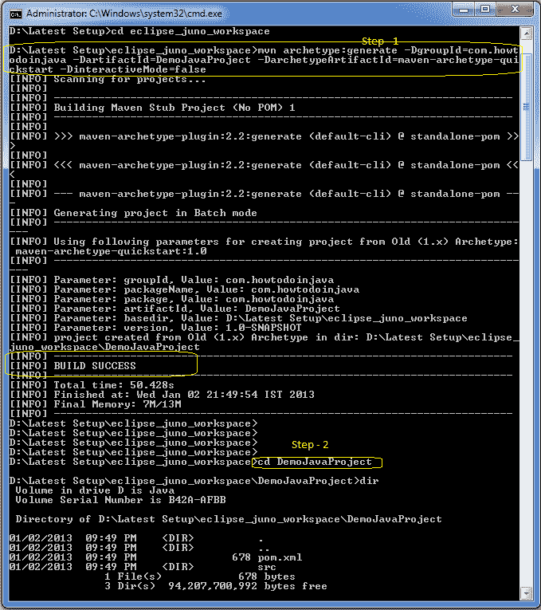
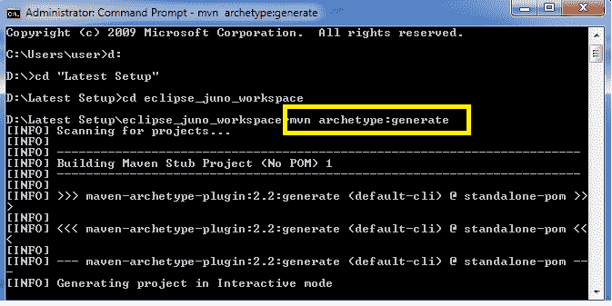
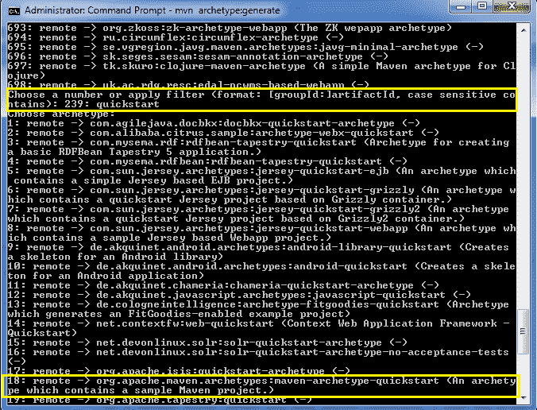
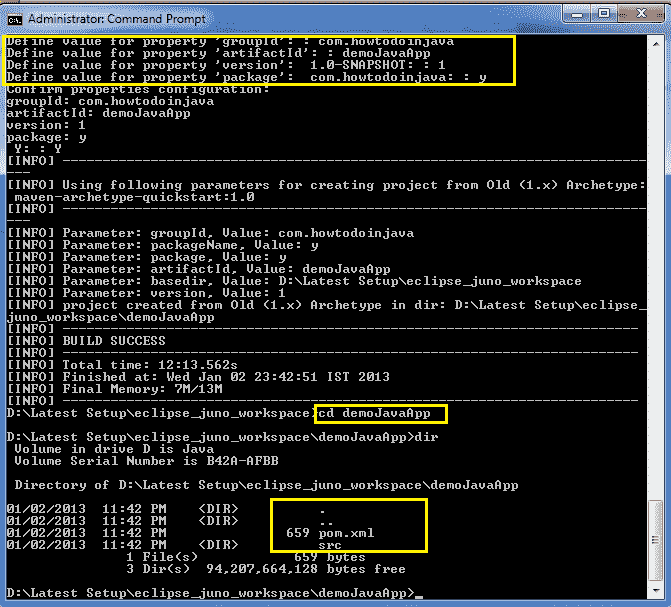

# Maven 创建 Java 项目–交互式与非交互式模式

> 原文： [https://howtodoinjava.com/maven/create-java-project-maven/](https://howtodoinjava.com/maven/create-java-project-maven/)

从**命令提示符**中使用交互式和非交互式模式，学习**使用 maven** 命令创建 Java 应用程序项目。

```java
Table of Contents

1\. Maven non-interactive mode
2\. Maven interactive mode
```

## 1\. Maven 使用 Maven 非交互模式创建 Java 项目

在非交互模式下，maven 使用所有默认选项创建一个**空白 Java 项目。 要创建此文件，请输入以下命令。**

```java
$ mvn archetype:generate 
		-DgroupId=com.howtodoinjava 
		-DartifactId=DemoJavaProject
		-DarchetypeArtifactId=maven-archetype-quickstart 
		-DinteractiveMode=false

```

此命令将在工作区中创建一个名为 *DemoJavaProject* 的空白 Java 项目。 您可以选择并使用自己的应用程序名称。

在下图中，您可以看到当运行上述命令时发生的所有情况。



您可以在步骤 2 中看到，创建的 Java 项目已经创建了 **src 文件夹**，并且还为您创建了默认的 **pom.xml** 。

## 2\. Maven 使用 Maven 交互模式创建 Java 项目

在交互模式下，您只需要以“ `mvn archetype:generate`”开头，其余选项将使用**向导**来指定，该向导将一个一个地出现。

```java
$ mvn archetype:generate

```

让我们看看向导中包含哪些步骤：

#### 2.1。 mvn 原型：生成

这是*默认模式*。 当您键入以上命令时，它将开始创建项目，并在要求 **archetypeArtifactId** 的位置停止。 向导将为您显示一个数字列表，供您选择或过滤（因为选项列表很长）。

[](https://howtodoinjava.com/maven/maven-custom-archetype/)

#### 2.2。 筛选

可以通过键入 arctetype 名称的一部分来完成，例如 *快速入门*。

[](//howtodoinjava.com/maven/create-a-simple-java-project-using-maven/)

您需要为我们的简单 Java 项目选择**选项 18** 。

#### 2.3。 指定 achetype 版本

以 5（或您自己的）的形式执行，`groupId`以“ com.howtodoinjava”的形式执行。

[](//howtodoinjava.com/maven/create-a-simple-java-project-using-maven/)

#### 2.4。 定义 artifactId

通过所需的 Java 项目名称进行操作。 现在，将有一些其他选项和确认。 回答他们，您的项目就准备好了。

[](//howtodoinjava.com/maven/create-a-simple-java-project-using-maven/)

您可以看到您的项目是使用默认源文件夹和`pom.xml`文件创建的。

这样，如果您尝试几次，您将更喜欢这种方法来创建

学习愉快！