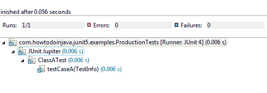
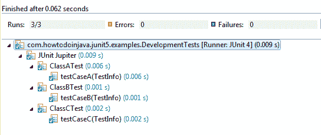

# JUnit 5 @Tag 注释示例

> 原文： [https://howtodoinjava.com/junit5/junit-5-tag-annotation-example/](https://howtodoinjava.com/junit5/junit-5-tag-annotation-example/)

JUnit 5 [@Tag](http://junit.org/junit5/docs/current/api/org/junit/jupiter/api/Tag.html) 可用于从测试计划中过滤测试用例。 它可以帮助针对不同的环境，不同的用例或任何特定要求创建多个不同的测试计划。 您可以通过仅在测试计划中包括那些标记的测试或通过从测试计划中排除其他测试来执行测试集。

## 1\. @Tag 注释用法

1.  我们可以将**应用于测试类或测试方法或同时应用于**。

    ```java
    @Tag("development")
    public class ClassATest
    {
    	@Test
    	@Tag("userManagement")
    	void testCaseA(TestInfo testInfo) {
    	}
    }

    ```

2.  我们也可以将**多个标签应用于单个测试**案例，以便您可以将其包含在多个测试计划中。

    ```java
    public class ClassATest
    {
    	@Test
    	@Tag("development")
    	@Tag("production")
    	void testCaseA(TestInfo testInfo) {
    	}
    }

    ```

## 2.使用@IncludeTags 和@ExcludeTags 创建测试计划

我们可以在测试计划中使用 [@IncludeTags](http://junit.org/junit5/docs/current/api/index.html?org/junit/platform/runner/IncludeTags.html) 或 [@ExcludeTags](http://junit.org/junit5/docs/current/api/index.html?org/junit/platform/runner/ExcludeTags.html) 批注来过滤测试或包括测试。

```java
//@IncludeTags example

@RunWith(JUnitPlatform.class)
@SelectPackages("com.howtodoinjava.junit5.examples")
@IncludeTags("production")
public class MultipleTagsExample 
{
}

//@ExcludeTags example

@RunWith(JUnitPlatform.class)
@SelectPackages("com.howtodoinjava.junit5.examples")
@ExcludeTags("production")
public class MultipleTagsExample 
{
}

```

要添加多个标签，请在所需注释中传递标签的*字符串数组。*

```java
@RunWith(JUnitPlatform.class)
@SelectPackages("com.howtodoinjava.junit5.examples")
@IncludeTags({"production","development"})
public class MultipleTagsExample 
{
}

```

We CAN NOT include both @IncludeTags and @ExcludeTags annotations in single test plan.

## 3\. JUnit 5 @Tag 示例

假设我们有 3 个测试，并且我们想在开发环境中运行全部 3 个测试； 但只想在生产中运行一个。 因此，我们将标记测试如下：

```java
public class ClassATest
{
	@Test
	@Tag("development")
	@Tag("production")
	void testCaseA(TestInfo testInfo) { //run in all environments
	}
}

public class ClassBTest
{
	@Test
	@Tag("development")
	void testCaseB(TestInfo testInfo) {
	}
}

public class ClassCTest
{
	@Test
	@Tag("development")
	void testCaseC(TestInfo testInfo) {
	}
}

```

让我们为两种环境创建测试计划。

#### 测试在生产环境中运行

```java
@RunWith(JUnitPlatform.class)
@SelectPackages("com.howtodoinjava.junit5.examples")
@IncludeTags("production")
public class ProductionTests 
{
}

```

<figure aria-describedby="caption-attachment-7867" class="wp-caption aligncenter" id="attachment_7867" style="width: 535px">

<figcaption class="wp-caption-text" id="caption-attachment-7867">JUnit 5 @Tag Example – Production Tests</figcaption>

</figure>

#### 测试在开发环境中运行

```java
@RunWith(JUnitPlatform.class)
@SelectPackages("com.howtodoinjava.junit5.examples")
@IncludeTags("development")
public class DevelopmentTests 
{
}

```

<figure aria-describedby="caption-attachment-7868" class="wp-caption aligncenter" id="attachment_7868" style="width: 544px">

<figcaption class="wp-caption-text" id="caption-attachment-7868">JUnit 5 @Tag Example – Development Tests</figcaption>

</figure>

将我的问题放在评论部分。

学习愉快！

[Sourcecode Download](https://github.com/lokeshgupta1981/Junit5Examples/tree/master/JUnit5Examples)