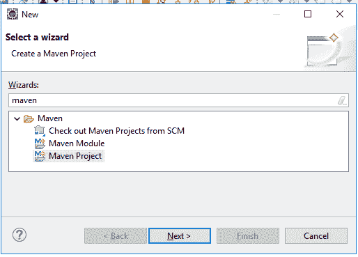
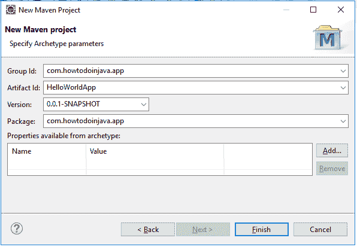
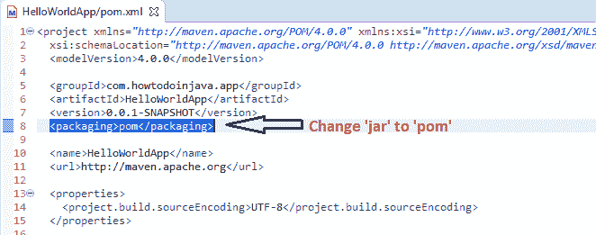
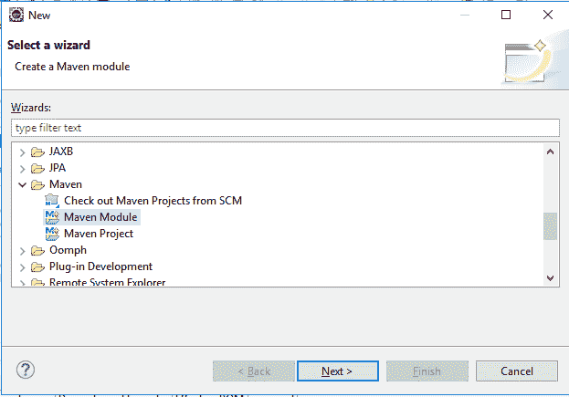
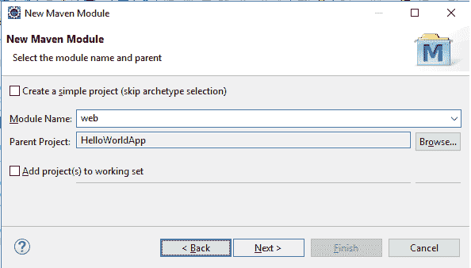
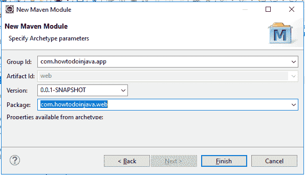
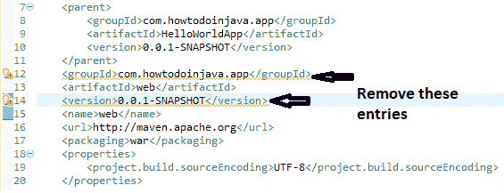
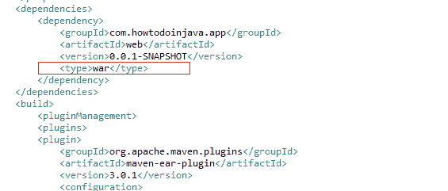

# Eclipse 中的 Maven 多模块项目

> 原文： [https://howtodoinjava.com/maven/multi-module-project-eclipse/](https://howtodoinjava.com/maven/multi-module-project-eclipse/)

了解**如何在 Eclipse** IDE 中创建多模块 Maven 项目。 在此 [maven](https://howtodoinjava.com/maven/) 教程中，我们将学习在 eclipse 中创建*嵌套的 maven 项目*。

## 1.创建多模块 Maven 项目

让我们创建一个 maven 项目，其中包含 **ear**， **war** 和 **jar** 类型的模块。 我们正在创建企业应用程序的结构，其中应用程序将作为 EAR（企业应用程序获取）文件部署到应用程序服务器（例如 weblogic，websphere）。

该 EAR 将包含一个（或多个）WAR（Web 应用程序资源）文件，并且每个 war 将包含服务项目，该服务项目对所有 war 文件和 JAR（Java ARchive）打包类型具有通用代码。


Projects Relationship


#### 1.1 创建父项目-打包类型为“ pom”

在 Eclipse 中创建一个新的 Maven 项目。 将其包类型设置为“ **pom** ”。



Create new maven project




Fill maven group id and artifact id




Change packaging jar to pom


#### 1.2 创建 Maven 模块-包类型为“EAR”

在父项目中创建一个新的 Maven 模块。 将其包类型更改为`'ear'`。 该模块可以具有 maven EAR 插件，该插件最终将构建要在服务器上部署的 EAR 文件。



Create new maven module




Add Module Name




Fill archetype details


#### 1.3 创建 Maven 模块-打包类型为“ war”和“ jar”

与 ear 模块类似，为 war 文件和 service jar 文件再创建两个模块。 分别更改其包并添加 maven 插件。

#### 1.4 最后结果

现在，在 eclipse 中观察最终的项目结构，并验证所有项目的 **pom.xml** 文件。

```java
<?xml version="1.0" encoding="UTF-8"?>
<project xmlns="http://maven.apache.org/POM/4.0.0"
	xmlns:xsi="http://www.w3.org/2001/XMLSchema-instance"
	xsi:schemaLocation="http://maven.apache.org/POM/4.0.0 
        http://maven.apache.org/xsd/maven-4.0.0.xsd">
	<modelVersion>4.0.0</modelVersion>

	<groupId>com.howtodoinjava.app</groupId>
	<artifactId>HelloWorldApp</artifactId>
	<version>0.0.1-SNAPSHOT</version>
	<packaging>pom</packaging>

	<name>HelloWorldApp</name>
	<url>http://maven.apache.org</url>

	<properties>
		<project.build.sourceEncoding>UTF-8</project.build.sourceEncoding>
		<maven.compiler.source>1.8</maven.compiler.source>
		<maven.compiler.target>1.8</maven.compiler.target>
	</properties>

	<modules>
		<module>web</module>
		<module>service</module>
		<module>ear</module>
	</modules>
</project>

```

```java
<?xml version="1.0"?>
<project
	xsi:schemaLocation="http://maven.apache.org/POM/4.0.0 http://maven.apache.org/xsd/maven-4.0.0.xsd"
	xmlns="http://maven.apache.org/POM/4.0.0"
	xmlns:xsi="http://www.w3.org/2001/XMLSchema-instance">
	<modelVersion>4.0.0</modelVersion>
	<parent>
		<groupId>com.howtodoinjava.app</groupId>
		<artifactId>HelloWorldApp</artifactId>
		<version>0.0.1-SNAPSHOT</version>
	</parent>
	<artifactId>ear</artifactId>
	<name>ear</name>
	<packaging>ear</packaging>
	<properties>
		<project.build.sourceEncoding>UTF-8</project.build.sourceEncoding>
	</properties>
	<dependencies>
		<dependency>
			<groupId>com.howtodoinjava.app</groupId>
			<artifactId>web</artifactId>
			<version>0.0.1-SNAPSHOT</version>
			<type>war</type>
		</dependency>
	</dependencies>
	<build>
		<pluginManagement>
		<plugins>
		<plugin>
			<groupId>org.apache.maven.plugins</groupId>
			<artifactId>maven-ear-plugin</artifactId>
			<version>3.0.1</version>
			<configuration>
				<modules>
					<webModule>
						<groupId>com.howtodoinjava.app</groupId>
						<artifactId>web</artifactId>
						<uri>web-0.0.1-SNAPSHOT.war</uri>
						<!-- Set custom context root -->
						<contextRoot>/application</contextRoot>
					</webModule>
				</modules>
			</configuration>
		</plugin>
		</plugins>
		</pluginManagement>
	</build>
</project>

```

```java
<?xml version="1.0"?>
<project
	xsi:schemaLocation="http://maven.apache.org/POM/4.0.0 http://maven.apache.org/xsd/maven-4.0.0.xsd"
	xmlns="http://maven.apache.org/POM/4.0.0"
	xmlns:xsi="http://www.w3.org/2001/XMLSchema-instance">
	<modelVersion>4.0.0</modelVersion>
	<parent>
		<groupId>com.howtodoinjava.app</groupId>
		<artifactId>HelloWorldApp</artifactId>
		<version>0.0.1-SNAPSHOT</version>
	</parent>
	<groupId>com.howtodoinjava.app</groupId>
	<artifactId>web</artifactId>
	<version>0.0.1-SNAPSHOT</version>
	<name>web</name>
	<url>http://maven.apache.org</url>
	<packaging>war</packaging>
	<properties>
		<project.build.sourceEncoding>UTF-8</project.build.sourceEncoding>
	</properties>
	<dependencies>
		<dependency>
			<groupId>com.howtodoinjava.app</groupId>
			<artifactId>service</artifactId>
			<version>0.0.1-SNAPSHOT</version>
		</dependency>
	</dependencies>
</project>

```

```java
<?xml version="1.0"?>
<project
	xsi:schemaLocation="http://maven.apache.org/POM/4.0.0 http://maven.apache.org/xsd/maven-4.0.0.xsd"
	xmlns="http://maven.apache.org/POM/4.0.0"
	xmlns:xsi="http://www.w3.org/2001/XMLSchema-instance">
	<modelVersion>4.0.0</modelVersion>
	<parent>
		<groupId>com.howtodoinjava.app</groupId>
		<artifactId>HelloWorldApp</artifactId>
		<version>0.0.1-SNAPSHOT</version>
	</parent>
	<groupId>com.howtodoinjava.app</groupId>
	<artifactId>service</artifactId>
	<version>0.0.1-SNAPSHOT</version>
	<name>service</name>
	<url>http://maven.apache.org</url>
	<packaging>jar</packaging>
	<properties>
		<project.build.sourceEncoding>UTF-8</project.build.sourceEncoding>
	</properties>
	<dependencies>
		<dependency>
			<groupId>junit</groupId>
			<artifactId>junit</artifactId>
			<version>3.8.1</version>
			<scope>test</scope>
		</dependency>
	</dependencies>
</project>

```

要生成项目，请从控制台运行 **$ mvn clean install** 命令。

```java
E:\devsetup\workspacetemp\HelloWorldApp>mvn clean install

[INFO] Scanning for projects...
[INFO] ------------------------------------------------------------------------
[INFO] Reactor Build Order:
[INFO]
[INFO] HelloWorldApp                                                      [pom]
[INFO] service                                                            [jar]
[INFO] web                                                                [war]
[INFO] ear                                                                [ear]
[INFO]
...
...
[INFO] --- maven-jar-plugin:2.4:jar (default-jar) @ service ---
[WARNING] JAR will be empty - no content was marked for inclusion!
[INFO] Building jar: E:\devsetup\workspacetemp\HelloWorldApp\service\target\service-0.0.1-SNAPSHOT.jar
[INFO]
...
...
[INFO] Packaging webapp
[INFO] Assembling webapp [web] in [E:\devsetup\workspacetemp\HelloWorldApp\web\target\web-0.0.1-SNAPSHOT]
[INFO] Processing war project
[INFO] Copying webapp resources [E:\devsetup\workspacetemp\HelloWorldApp\web\src\main\webapp]
[INFO] Webapp assembled in [47 msecs]
[INFO] Building war: E:\devsetup\workspacetemp\HelloWorldApp\web\target\web-0.0.1-SNAPSHOT.war
[INFO] WEB-INF\web.xml already added, skipping
[INFO]
...
...
[INFO]
[INFO] --- maven-ear-plugin:3.0.1:ear (default-ear) @ ear ---
[INFO] Copying artifact [war:com.howtodoinjava.app:web:0.0.1-SNAPSHOT] to [web-0.0.1-SNAPSHOT.war]
[INFO] Copy ear sources to E:\devsetup\workspacetemp\HelloWorldApp\ear\target\ear-0.0.1-SNAPSHOT
[INFO] Building jar: E:\devsetup\workspacetemp\HelloWorldApp\ear\target\ear-0.0.1-SNAPSHOT.ear
[INFO]
[INFO] ------------------------------------------------------------------------
[INFO] Reactor Summary:
[INFO]
[INFO] HelloWorldApp 0.0.1-SNAPSHOT ....................... SUCCESS [  0.328 s]
[INFO] service ............................................ SUCCESS [  0.839 s]
[INFO] web ................................................ SUCCESS [  0.838 s]
[INFO] ear 0.0.1-SNAPSHOT ................................. SUCCESS [  0.588 s]
[INFO] ------------------------------------------------------------------------
[INFO] BUILD SUCCESS
[INFO] ------------------------------------------------------------------------
[INFO] Total time: 2.749 s
[INFO] Finished at: 2018-11-18T15:04:52+05:30
[INFO] ------------------------------------------------------------------------

```

构建会生成名称为`ear-0.0.1-SNAPSHOT.ear`的 ear 文件。 可以根据需要随意更改项目名称和生成的软件包。

## 2.常见问题

#### 2.1 GroupId 与父 groupId 重复

Maven 子项目从父项目继承属性。 如果任何 Maven 模块/项目的组 ID 或版本 ID 与父项目相同，那么我们只需删除此条目即可。



Remove duplicate entries


#### 2.2 工件不是项目的依赖项

如果在未指定**类型**属性的情况下添加模块依赖项（war），我们可能会遇到此错误。



Module type attribute


让我丢下与在 Eclipse IDE 中创建多模块 Maven 项目有关的问题。

学习愉快！