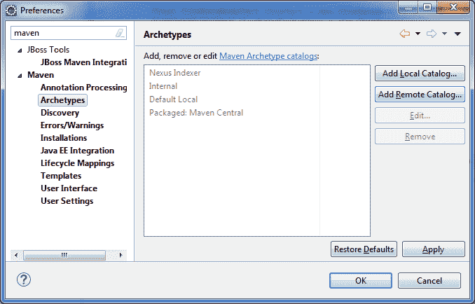
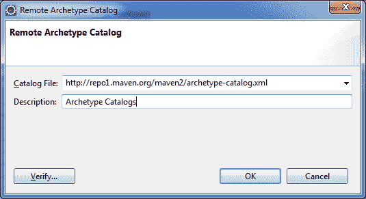
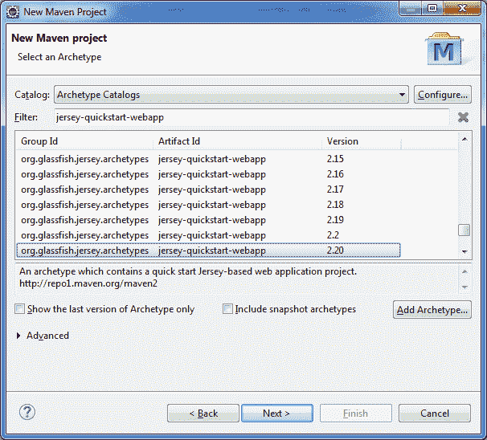
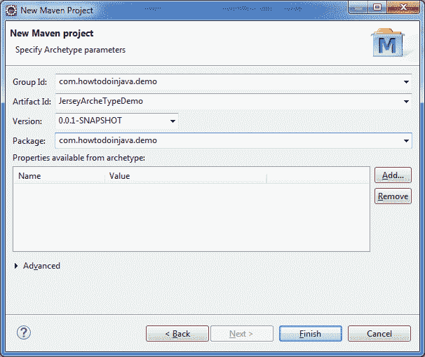
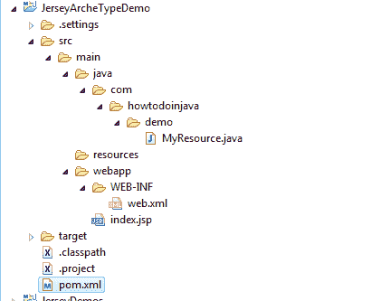

# 在 Eclipse 中导入 Maven 远程原型目录

> 原文： [https://howtodoinjava.com/eclipse/how-to-import-maven-remote-archetype-catalogs-in-eclipse/](https://howtodoinjava.com/eclipse/how-to-import-maven-remote-archetype-catalogs-in-eclipse/)

本教程为**在 Eclipse** 中导入 Maven 远程原型目录提供了简单的说明，以使您在配置项目时获得领先。 使用原型自动导入所有基本的运行时依赖项，并使用最基本的配置来配置项目，您可以在数分钟内直接将其直接用于构建 hello world 应用程序。

## 第 1 步：在 Eclipse 中打开 Maven 首选项

转到`Windows`-> `Preferences`-> `Maven`-> `Archetypes`。

<figure aria-describedby="caption-attachment-4955" class="wp-caption aligncenter" id="attachment_4955" style="width: 678px">

<figcaption class="wp-caption-text" id="caption-attachment-4955">Maven archetype option in eclipse</figcaption>

</figure>

## 步骤 2：添加远程目录文件

单击添加远程目录按钮。 将目录文件填写为“ **http://repo1.maven.org/maven2/archetype-catalog.xml** ”和一些自定义描述。

<figure aria-describedby="caption-attachment-4956" class="wp-caption aligncenter" id="attachment_4956" style="width: 535px">

<figcaption class="wp-caption-text" id="caption-attachment-4956">Fill Archetype URL and name</figcaption>

</figure>

单击确定按钮。 大功告成

## 步骤 3：验证远程原型

为了验证您现在可以访问所有原型，请创建一个新的 maven 项目。

选择您创建的新的自定义目录。

<figure aria-describedby="caption-attachment-4957" class="wp-caption aligncenter" id="attachment_4957" style="width: 606px">

<figcaption class="wp-caption-text" id="caption-attachment-4957">Jersey remote archetypes</figcaption>

</figure>

In first time, it will take a few moments to gather all the archetypes. You can see the progress at the very bottom right of the IDE. When it’s done, you should be able to see the archetypes

填写项目的组 ID 和工件 ID。

<figure aria-describedby="caption-attachment-4958" class="wp-caption aligncenter" id="attachment_4958" style="width: 606px">

<figcaption class="wp-caption-text" id="caption-attachment-4958">Fill group id and artifact id</figcaption>

</figure>

单击确定以创建项目。 您将在工作区上看到已完成所有依赖关系和基本配置的新项目创建。

<figure aria-describedby="caption-attachment-4959" class="wp-caption aligncenter" id="attachment_4959" style="width: 421px">

<figcaption class="wp-caption-text" id="caption-attachment-4959">New maven project with auto configuration</figcaption>

</figure>

如果您在任何步骤中遇到任何问题，请随时向我提问。

**祝您学习愉快！**