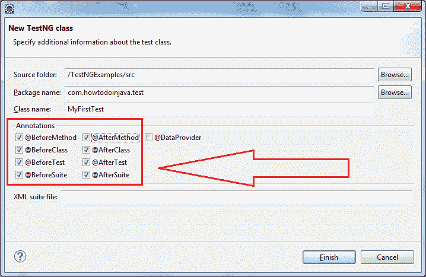

# 注释前后的 TestNG

> 原文： [https://howtodoinjava.com/testng/testng-before-and-after-annotations/](https://howtodoinjava.com/testng/testng-before-and-after-annotations/)

**TestNG 的前后[注释](//howtodoinjava.com/testng/testng-annotations-tutorial/ "TestNG Annotations Tutorial")** 主要用于在执行测试方法之前和之后执行一组特定的代码。 这些用于基本上在测试执行开始之前设置一些变量或配置，然后在测试执行结束之后清除所有这些内容。

## 1.注释前后的 TestNG

TestNG 提供了五种不同的`Before`和`After`注释选项，可以根据测试要求使用每种注释选项。 以下是 TestNG 提供的不同之前和之后选项。

| 注解 | 描述 |
| @BeforeSuite | 带注释的方法将在该套件中的所有测试运行之前运行。 |
| @BeforeTest | 带注释的方法将在运行属于`test`标记内的类的任何测试方法之前运行。 |
| @BeforeGroups | 此配置方法将在其之前运行的组的列表。 保证此方法可以在调用属于任何一个组的第一个测试方法之前不久运行。 |
| @课前 | 带注释的方法将在调用当前类中的第一个测试方法之前运行。 |
| @BeforeMethod | 带注释的方法将在当前类中的所有测试方法运行之前运行。 |
| @AfterSuite | 带注释的方法将在该套件中的所有测试运行之后运行。 |
| @AfterTest | 带注释的方法将在所有属于`test`标记内的类的测试方法运行后运行。 |
| @AfterGroups | 此配置方法将在其后运行的组的列表。 保证在调用属于这些组中任何一个的最后一个测试方法后不久便可以运行该方法。 |
| @下课以后 | 带注释的方法将在当前类中的所有测试方法运行之后运行。 |
| @AfterMethod | 带注释的方法将在每种测试方法之后运行。 |

让我们尝试一个包含所有前面带注释的方法的示例，并了解它们何时执行。

## 2\. TestNG 注释前后的示例

创建一个具有所有注释前后的新 TestNG 测试。 您可以根据此 **[TestNG 教程](//howtodoinjava.com/testng/testng-tutorial-with-eclipse/ "TestNG Tutorial (With Eclipse)")** 中给出的说明来创建此测试。 让我们看看如何选择所有注释之前和之后的注释。



单击确定后，您将获得带有所有注释的测试。 在所有方法中添加一些打印语句，以便可以按执行顺序对其进行跟踪。

```java
package com.howtodoinjava.test;

import org.testng.annotations.AfterClass;
import org.testng.annotations.AfterMethod;
import org.testng.annotations.AfterSuite;
import org.testng.annotations.AfterTest;
import org.testng.annotations.BeforeClass;
import org.testng.annotations.BeforeMethod;
import org.testng.annotations.BeforeSuite;
import org.testng.annotations.BeforeTest;
import org.testng.annotations.Test;

public class MyFirstTest 
{
	@Test
	public void testCase() {
	}

	@BeforeSuite
	public void beforeSuite() {
		System.out.println("Before Suite method");
	}

	@AfterSuite
	public void afterSuite() {
		System.out.println("After Suite method");
	}

	@BeforeTest
	public void beforeTest() {
		System.out.println("Before Test method");
	}

	@AfterTest
	public void afterTest() {
		System.out.println("After Test method");
	}

	@BeforeClass
	public void beforeClass() {
		System.out.println("Before Class method");
	}

	@AfterClass
	public void afterClass() {
		System.out.println("After Class method");
	}

	@BeforeMethod
	public void beforeMethod() {
		System.out.println("Before Method");
	}

	@AfterMethod
	public void afterMethod() {
		System.out.println("After Method");
	}
}

```

现在在 Testcase 上方运行 TestNG 测试，您将在控制台中获得以下输出。

```java
[TestNG] Running:
  C:\Users\somepath\testng-customsuite.xml

Before Suite method
Before Test method
Before Class method
Before Method
After Method
After Class method
After Test method
PASSED: testCase

===============================================
    Default test
    Tests run: 1, Failures: 0, Skips: 0
===============================================

After Suite method

===============================================
Default suite
Total tests run: 1, Failures: 0, Skips: 0
===============================================

[TestNG] Time taken by org.testng.reporters.XMLReporter@177b3cd: 19 ms
[TestNG] Time taken by [FailedReporter passed=0 failed=0 skipped=0]: 0 ms
[TestNG] Time taken by org.testng.reporters.jq.Main@b8deef: 53 ms
[TestNG] Time taken by org.testng.reporters.JUnitReportReporter@10ab323: 13 ms
[TestNG] Time taken by org.testng.reporters.EmailableReporter2@5e176f: 11 ms
[TestNG] Time taken by org.testng.reporters.SuiteHTMLReporter@d1e89e: 184 ms

```

恭喜，您已经成功创建了具有各种前后注释的测试类，并执行了该类。

当前示例仅包含存在于同一类中的注释。 当包含注释的类被另一个具有前后一组注释的类扩展时，让我们学习执行流程。

## 3.在超类上放置注释之前和之后

让我们创建两个新类`BaseClass`和`ChildClass`。 然后在两者上添加类似的前后注释。 这里主要要注意的是`ChildClass extends BaseClass`。 测试在`ChildClass`类中定义。

#### 3.1。 家长班

```java
package com.howtodoinjava.test;

import org.testng.annotations.AfterClass;
import org.testng.annotations.AfterMethod;
import org.testng.annotations.BeforeClass;
import org.testng.annotations.BeforeMethod;

public class BaseClass {

	@BeforeMethod
	public void beforeMethod() {
		System.out.println("BaseClass's Before Test method");
	}

	@AfterMethod
	public void afterMethod() {
		System.out.println("BaseClass's After Test method");
	}

	@BeforeClass
	public void beforeClass() {
		System.out.println("BaseClass's Before Class method");
	}

	@AfterClass
	public void afterClass() {
		System.out.println("BaseClass's After Class method");
	}
}

```

#### 2.子类

```java
package com.howtodoinjava.test;

import org.testng.annotations.AfterClass;
import org.testng.annotations.AfterMethod;
import org.testng.annotations.BeforeClass;
import org.testng.annotations.BeforeMethod;
import org.testng.annotations.Test;

public class ChildClass extends BaseClass {

	@BeforeMethod
	public void beforeChildMethod() {
		System.out.println("ChildClass's Before Test method");
	}

	@AfterMethod
	public void afterChildMethod() {
		System.out.println("ChildClass's After Test method");
	}

	@BeforeClass
	public void beforeChildClass() {
		System.out.println("ChildClass's Before Class method");
	}

	@AfterClass
	public void afterChildClass() {
		System.out.println("ChildClass's After Class method");
	}

	@Test
	public void testCase() {
		System.out.println("===== Executing actual test ======");
	}
}

```

执行 ChildClass 测试将生成以下输出。

```java
[TestNG] Running:
  C:\Users\somepath\testng-customsuite.xml

BaseClass's Before Class method
ChildClass's Before Class method
BaseClass's Before Test method
ChildClass's Before Test method
===== Executing actual test ======
ChildClass's After Test method
BaseClass's After Test method
ChildClass's After Class method
BaseClass's After Class method
PASSED: testCase

===============================================
    Default test
    Tests run: 1, Failures: 0, Skips: 0
===============================================

===============================================
Default suite
Total tests run: 1, Failures: 0, Skips: 0
===============================================

[TestNG] Time taken by org.testng.reporters.EmailableReporter2@1549f94: 13 ms
[TestNG] Time taken by [FailedReporter passed=0 failed=0 skipped=0]: 0 ms
[TestNG] Time taken by org.testng.reporters.XMLReporter@1bd7848: 16 ms
[TestNG] Time taken by org.testng.reporters.jq.Main@1342ba4: 52 ms
[TestNG] Time taken by org.testng.reporters.JUnitReportReporter@176e552: 12 ms
[TestNG] Time taken by org.testng.reporters.SuiteHTMLReporter@ff057f: 190 ms

```

如您所见，TestNG 的报告输出在被注释的方法之前执行父类，然后在被注释的方法之前执行子类。 在带注释的方法之后，先执行子类方法，然后再执行父类。

这有助于我们在所有测试类中使用通用的注释前方法，并在需要时为每个测试类使用特定的**注释前/后方法**。

如果您有任何问题要给我留言。

学习愉快！

参考：

[TestNG 文档[​​HTG1]](http://testng.org/doc/documentation-main.html#annotations)