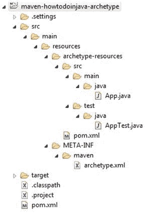
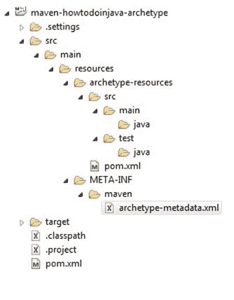
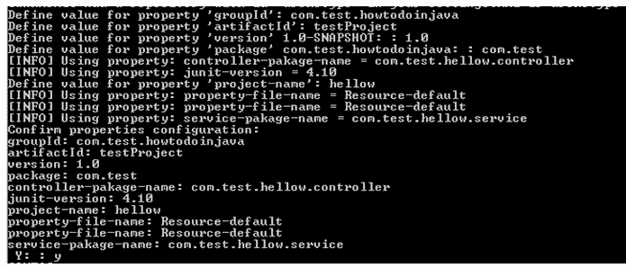

# Eclipse Project 中的 Maven 自定义原型

> 原文： [https://howtodoinjava.com/maven/maven-custom-archetype/](https://howtodoinjava.com/maven/maven-custom-archetype/)

**Maven 定制原型**帮助创建特定类型的项目结构，而任何标准的 Maven 原型均无法使用。 在这个 Maven 教程中，我们将学习从一个 Eclipse 项目创建**创建自定义原型**。

特别是在某些情况下，当我们在生成的 maven 项目中需要自定义内容时，这是非常有用的，而 maven 并没有提供现成的内容。

```java
Table of Contents

Why custom archetype is required?
Create Custom Archetype
Import Project to Eclipse
Create Template Files
Create new projects with custom archetype

```

## 为什么需要自定义原型？

通常，Maven 和一些第三方提供商会提供一些原型，这些原型对于轻松启动我们的 Maven 项目很有用。 但是在我们的日常工作中，由于以下原因，我们可能会遇到一些需要创建自定义项目结构的场景：

*   需要在组织内引入/强制执行特定的项目结构（包括程序包和框架类）。
*   通过快速开始实际工作，减少了建立项目结构的时间，提高了开发人员的生产率。
*   通过确保项目结构和预期的工件到位，减少了代码检查的工作量。

## 创建自定义原型

Maven 已经为创建新原型的**提供了一种新原型`maven-archetype-archetype`。**

```java
mvn archetype:generate -B -DarchetypeArtifactId=maven-archetype-archetype  -DgroupId=com.howtodoinjava.archetype -DartifactId=maven-howtodoinjava-archetype -Dversion=1.0-SNAPSHOT

```

让我们了解以上命令。

*   `-DarchetypeArtifactId=maven-archetype-archetype`是 maven 提供的用于创建新的自定义原型的原型。
*   `-DgroupId=com.howtodoinjava.archetype`是我们现在将创建的原型的组 ID。
*   `-DartifactId=maven-howtodoinjava-archetype`是我们现在将创建的原型的 artifactId。
*   `-Dversion=1.0-SNAPSHOT`是 Maven 原型的版本。

这里的所有参数都是不言自明和直观的。 尽管如此，我们仍然可以随时遵循官方 Maven 文档以获取更多详细信息。

We need to now run this command from command prompt and before that make sure you have setup the [maven class path](//howtodoinjava.com/maven/how-to-install-maven-on-windows-7/).

因此，一旦在命令提示符下运行此命令，您将在启动`mvn`命令的同一目录中生成一个 maven 项目。

#### 导入项目以使其黯然失色

现在的下一个工作是将这个项目导入 Eclipse 中，以进一步完善以满足我们的要求。 导入后，eclipse 项目结构将如下所示。



Folder Structure of Imported Project


将其导入 eclipse 后，我们需要执行以下步骤。

*   删除`/src/main/resources/archetype-resources/src/main/java` & `/src/main/resources/archetype-resources/src/test/java`的内容–主要是`App.java`和`AppTest.java`
*   我们需要将文件`/src/main/resources/META-INF/maven/archetype.xml`重命名为`archetype-metadata.xml`，稍后我们需要更改该文件的内容，我们将在一段时间后看到。

完成上述步骤后，文件夹结构将如下所示：



Project Structure after Changes


#### 创建模板文件

现在，我们将为原型应每次生成的类和资源创建一些模板文件。

*   Create a template java file in `\src\main\resources\archetype-resources\src\main\java\__project-name__.java` with the contents:

    ```java
    package ${package};

    public class ${project-name} {

        public static void ${project-name}SampleMethod() {
          System.out.println("Sample method generated by maven Archetype..");
        }

    }

    ```

    该模板文件将根据运行时提供的占位符的值生成 Java 文件。 文件名中的占位符必须用`__NAME__`包围，并且占位符逻辑名称分隔符应为连字符（-）。

*   为属性文件创建模板； 具有属性键-值模板，例如
    `${project-name}.key=This is ${project-name} test property`，文件名将为`\src\main\resources\archetype-resources\src\main\resources\__property-file-name__.properties`
    ，因为我们想在运行时生成文件名，因此我们在文件名中放置了一个占位符。
*   随意根据您的需求创建任意数量的模板文件。
*   Now we need to modify the `archetype-metadata.xml` like below.

    – `requiredProperties`部分将声明从该原型生成项目时所需的所有属性及其默认值。

    – `fileSets`将声明将在最终生成的项目中放置的文件。

    ```java
    <?xml version="1.0" encoding="UTF-8"?>
    <archetype-descriptor name="basic">

    	<requiredProperties>
    		<requiredProperty key="project-name" />
    		<requiredProperty key="property-file-name">
    			<defaultValue>Resource-default</defaultValue>
    		</requiredProperty>

    		<!--JUnit version to use in generated project -->
    		<requiredProperty key="junit-version">
    			<defaultValue>4.10</defaultValue>
    		</requiredProperty>
    	</requiredProperties>

    	<!--Add new fileset for resources -->
    	<!--Set filtered="true" to process files in that directory as templates -->
    	<!--Set packaged="false" to remove package folder structure from resource 
    		directory -->
    	<fileSets>
    		<fileSet filtered="true">
    			<directory>src/main/resources</directory>

    			<!--Filters example -->
    			<includes>
    				<include>*.txt</include>
    				<include>*.properties</include>
    			</includes>
    			<excludes>
    				<exclude>**/*.xml</exclude>
    			</excludes>
    		</fileSet>

    		<fileSet filtered="true" packaged="true">
    			<directory>src/main/java</directory>
    		</fileSet>
    		<fileSet filtered="true" packaged="true">
    			<directory>src/test/java</directory>
    		</fileSet>
    	</fileSets>

    </archetype-descriptor>

    ```

*   We also need to change the `pom.xml` file under `archetype-resources` folder to accept the runtime GAV (GroupId:ArtifactId:Version) coordinates . We need to change it to placeholder in order to accept runtime values, for the project we will generate with this archetype.

    `archetype-resources`下的`pom.xml`应该看起来像

    ```java
    <project xmlns="http://maven.apache.org/POM/4.0.0" xmlns:xsi="http://www.w3.org/2001/XMLSchema-instance"
    	xsi:schemaLocation="http://maven.apache.org/POM/4.0.0 http://maven.apache.org/maven-v4_0_0.xsd">
    	<modelVersion>4.0.0</modelVersion>
    	<groupId>${groupId}</groupId>
    	<artifactId>${artifactId}</artifactId>
    	<version>${version}</version>

    	<dependencies>
    		<dependency>
    			<groupId>junit</groupId>
    			<artifactId>junit</artifactId>
    			<version>${junit-version}</version>
    			<scope>test</scope>
    		</dependency>
    	</dependencies>
    </project>

    ```

    因此，我们基本上完成了与原型更改相关的更改，现在应该通过命令`mvn clean install`来构建原型 maven 项目。 该项目应该构建良好，我们已经准备好使用此原型来创建新的 Maven 项目。

## 使用自定义原型创建新项目

成功构建原型项目并将此项目成功安装到本地后，我们将运行以下命令来创建 maven 项目。

```java
mvn archetype:generate -DarchetypeCatalog=local -DarchetypeArtifactId=maven-howtodoinjava-archetype -DarchetypeGroupId=com.howtodoinjava.archetype -DarchetypeVersion=1.0-SNAPSHOT

```

Maven 将启动交互模式，并询问有关新 Maven 项目的所有必需属性。 具有默认值的属性将被跳过，但是如果您在上一步中没有确认配置，则可以覆盖默认值。

自定义原型输入例如：



Create Custom archetypes Example


完成此步骤后，我们应该根据已开发的模板创建一个新项目。

因此，展望未来，如果您处于任何情况下，默认的 Maven 原型都不足够，则可以使用 Maven 的隐藏功能来创建自己的自定义原型。

[Download Source Code](//howtodoinjava.com/wp-content/downloads/maven-howtodoinjava-archetype.zip)

学习愉快！