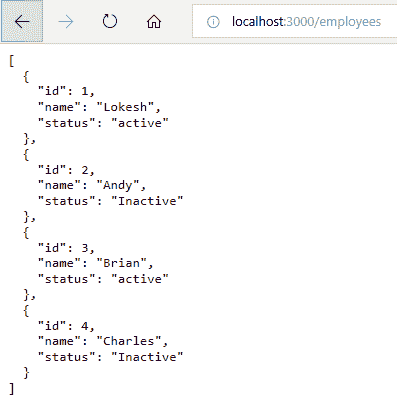

# 模拟 REST Server 伪造在线 API

> 原文： [https://howtodoinjava.com/angular/mock-rest-server/](https://howtodoinjava.com/angular/mock-rest-server/)

学习**在本地创建模拟 REST 服务器**，该服务器将**模拟在线 REST API** ，并在线生成所需的 JSON 响应。 拥有这样的 REST API 模拟功能非常方便，可以缩短开发时间。

## 安装 JSON 服务器

在节点和角度开发环境中，让我们导入`json-server`依赖项。

```java
$ npm install -g json-server

//Console Output

C:\Users\admin\AppData\Roaming\npm\json-server -> C:\Users\admin\AppData\Roaming\npm\node_modules\json-server\bin\index.js
+ json-server@0.14.0
added 229 packages from 130 contributors in 24.844s

```

## 创建模拟 JSON 响应并在线进行服务

1.  关于这种方法的最好的事情是，您不会被迫消耗任何意味着更少数据的虚拟对象。 相反，您可以**创建要使用的 JSON 数据**，并将其放入文件`'db.json'`中并开始提供它。

    ```java
    {
      "employees": [
        { "id": 1, "name": "Lokesh", "status": "active" },
        { "id": 2, "name": "Andy", "status": "Inactive" },
        { "id": 3, "name": "Brian", "status": "active" },
        { "id": 4, "name": "Charles", "status": "Inactive" }
      ]
    }

    ```

2.  并使用简单的命令开始在`db.json`文件上方投放。

    ```java
    $ json-server --watch 'E:\ngexamples\db.json'

    \{^_^}/ hi!

    Loading E:\ngexamples\db.json
    Done

    Resources
    http://localhost:3000/employees

    Home
    http://localhost:3000

    Type s + enter at any time to create a snapshot of the database
    Watching...

    ```

3.  Now test the REST API in browser using command `'http://localhost:3000/employees'`.

    

    JSON server running


    > 请注意，由 JSON 服务器提供的 REST 端点由`db.json`中的数据节点确定。 它是如此简单而强大。

将我的问题放在评论部分。

学习愉快！

参考： [json 服务器 github 页面](https://github.com/typicode/json-server)