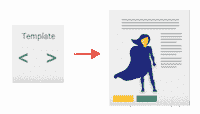
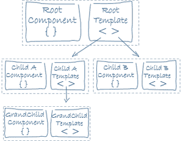

# 角度模板和视图

> 原文： [https://howtodoinjava.com/angular/angular-templates-and-views/](https://howtodoinjava.com/angular/angular-templates-and-views/)

## 1\. 什么是角度模板和视图

***模板*** 是 **HTML 代码段**，它告诉 Angular 如何在 angular 应用程序中渲染组件。

模板立即与组件相关联，以定义该组件的 ***视图*** 。

[](https://howtodoinjava.com/wp-content/uploads/2018/11/template-and-views.png)

## 2\. 角度视图层次结构

该组件还可以包含**视图层次结构**，这些层次结构具有嵌入的视图，这些视图定义或与其他组件相关联。

[](https://howtodoinjava.com/wp-content/uploads/2018/11/view-hierarchy.png)

视图层次结构可以包含来自同一 NgModule 中组件的视图，但是它也可以包含来自不同 NgModules 中定义的组件的视图。

关于 ***视图层次结构*** 的要点如下：

*   它是相关视图的树，可以充当一个独立的单元。
*   根视图通常称为*组件的宿主视图。*
*   它在角度变化检测中起着重要作用。

#### 2.1 查看层次结构示例

下图显示了管理超级英雄和危机中心的应用程序的视图层次结构。

[](https://howtodoinjava.com/wp-content/uploads/2018/11/view-hierarchy-1.png)

*   **应用组件**位于根级别，称为*主机视图*，其中包含**英雄**和**危机中心**组件。
*   **英雄组件**充当其子组件**英雄列表**和 **Hero Details** 的宿主视图，它们将具有各自的视图。
*   同样，**危机中心组件**还托管两个子组件，分别包含针对**危机列表**和**危机详细信息**组件的视图。

在此，层次结构中的每个组件都可以具有与其关联的视图。

## 3\. 模板类型

有两种方法可以在角度分量中定义模板。

#### 3.1 内联模板

内联模板是通过将 HTML 代码放在“反勾号”中定义的，并使用 *@Component* 装饰器的*模板*属性链接到组件元数据。

```java
import { Component, OnInit } from '@angular/core';

@Component({
  selector: 'app-zipcode',
  template: `
            <p>
            zipcode inline template
            </p>
            `,
  styleUrls: ['./zipcode.component.css']
})

export class ZipcodeComponent implements OnInit {

  constructor() { }

  ngOnInit() { }
}

```

要使用 ***@ angular / cli*** 定义内联模板，请使用以下命令：

```java
ng generate component zipcode -it

```

#### 3.2 模板文件

模板是在单独的 HTML 文件中定义的，并使用 *@Component* 装饰器的 templateUrl 属性链接到组件元数据，例如

```java
<p>
  zipcode separate HTML template
</p>

```

```java
import { Component, OnInit } from '@angular/core';

@Component({
  selector: 'app-zipcode',
  templateUrl: './zipcode.component.html',
  styleUrls: ['./zipcode.component.css']
})
export class ZipcodeComponent implements OnInit 
{
  constructor() { }

  ngOnInit() {
  }
}

```

学习愉快！