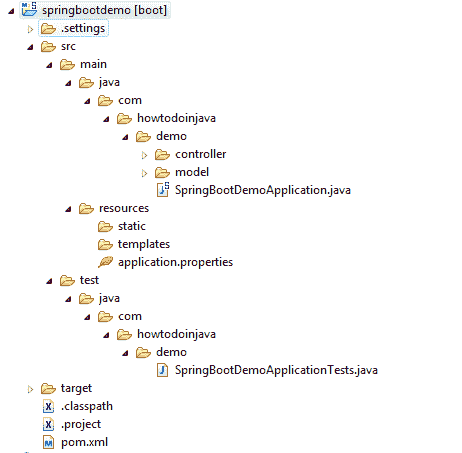
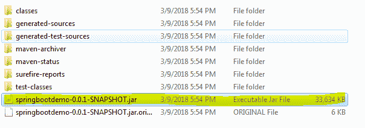

# Maven – Spring Boot Fat/Uber Jar

> 原文： [https://howtodoinjava.com/maven/create-fat-jar-spring-boot-applications/](https://howtodoinjava.com/maven/create-fat-jar-spring-boot-applications/)

在本 Maven 教程中，我们将学习**使用 maven 插件为 SpringBoot 应用程序创建胖 jar** 或 uber jar。 它非常简单，几乎不需要`pom.xml`文件中的配置更改。

## 步骤 1 –在 pom.xml 中添加 Spring boot maven 插件

第一步，也许只是所需的第一步，是在`pom.xml`文件中具有`spring-boot-maven-plugin`插件条目。

```java
<build>
	<plugins>
		<plugin>
			<groupId>org.springframework.boot</groupId>
			<artifactId>spring-boot-maven-plugin</artifactId>
		</plugin>
	</plugins>
</build>

```

> 阅读更多：[使用 maven 阴影插件](https://howtodoinjava.com/maven/maven-shade-plugin-create-uberfat-jar-example/)创建胖子

## 第 2 步–运行 Maven 构建

现在，当您使用简单的命令`mvn clean install`运行 maven 构建时，它将为您的项目生成胖 jar，其中包含所有已编译的应用程序代码及其所有依赖项–打包在一个大 jar 文件中。

```java
mvn clean install
```

## 演示

您可以将 [Spring Boot REST API 示例](https://howtodoinjava.com/spring/spring-boot/spring-boot-tutorial-with-hello-world-example/)的源代码下载到您的计算机中以运行演示。 如果希望查看项目代码内部，则可以选择将此项目作为 Maven 项目导入 eclipse。

#### 导入的项目结构



Spring boot application


#### 生成的胖子 jar 文件



Generated maven fat jar file


#### 演示中使用的完整 pom.xml 文件

```java
<?xml version="1.0" encoding="UTF-8"?>
<project xmlns="http://maven.apache.org/POM/4.0.0" xmlns:xsi="http://www.w3.org/2001/XMLSchema-instance"
	xsi:schemaLocation="http://maven.apache.org/POM/4.0.0 http://maven.apache.org/xsd/maven-4.0.0.xsd;
	<modelVersion>4.0.0</modelVersion>

	<groupId>com.howtodoinjava.demo</groupId>
	<artifactId>springbootdemo</artifactId>
	<version>0.0.1-SNAPSHOT</version>
	<packaging>jar</packaging>

	<name>SpringBootDemo</name>
	<description>Spring Boot Demo for https://howtodoinjava.com</description>

	<parent>
		<groupId>org.springframework.boot</groupId>
		<artifactId>spring-boot-starter-parent</artifactId>
		<version>1.4.0.RELEASE</version>
		<relativePath/> <!-- lookup parent from repository -->
	</parent> 

	<properties>
		<project.build.sourceEncoding>UTF-8</project.build.sourceEncoding>
		<project.reporting.outputEncoding>UTF-8</project.reporting.outputEncoding>
		<java.version>1.8</java.version>
	</properties>

	<dependencies>
		<dependency>
			<groupId>org.springframework.boot</groupId>
			<artifactId>spring-boot-starter-data-jpa</artifactId>
		</dependency>
		<dependency>
			<groupId>org.springframework.boot</groupId>
			<artifactId>spring-boot-starter-hateoas</artifactId>
		</dependency>
		<dependency>
			<groupId>org.springframework.boot</groupId>
			<artifactId>spring-boot-starter-jersey</artifactId>
		</dependency>
		<dependency>
			<groupId>org.springframework.boot</groupId>
			<artifactId>spring-boot-starter-security</artifactId>
		</dependency>
		<dependency>
			<groupId>org.springframework.boot</groupId>
			<artifactId>spring-boot-starter-web</artifactId>
		</dependency>
		<dependency>
			<groupId>org.hsqldb</groupId>
			<artifactId>hsqldb</artifactId>
			<scope>runtime</scope>
		</dependency>
		<dependency>
			<groupId>org.springframework.boot</groupId>
			<artifactId>spring-boot-starter-test</artifactId>
			<scope>test</scope>
		</dependency>
	</dependencies>

	<build>
		<plugins>
			<plugin>
				<groupId>org.springframework.boot</groupId>
				<artifactId>spring-boot-maven-plugin</artifactId>
			</plugin>
		</plugins>
	</build>

</project>

```

这就是这个快速提示。 将我的问题放在评论部分。

学习愉快！