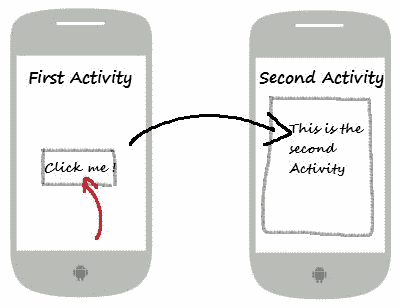

# Android 教程：关键概念

> 原文： [https://howtodoinjava.com/android/android-tutorial-key-concepts/](https://howtodoinjava.com/android/android-tutorial-key-concepts/)

让我们从我们中有些人可能已经知道的大多数**基本 android 概念**开始。

## Android 应用程式

用户可以从 [Google Play 商店](https://play.google.com/store)安装 Android 应用程序，也可以从 Internet 上的任何远程位置（甚至也可以从本地系统）将其下载到设备上。 该应用程序**应该具有一些用户界面**，并且可能还有一些其他代码旨在在该应用程序的后台工作。 在这里，我假设您对 Android 设备有一定的动手经验，因此您熟悉诸如 HOME 和 BACK 之类的按钮，内置设置，主屏幕和启动器的概念，等等。 如果您从未使用过 Android 设备，我强烈建议您购买一台并使用该设备和已安装在设备上的应用程序/或从应用程序商店下载的应用程序。 这将帮助您了解经过如此艰苦工作后将要构建的内容。

## 允许的编程语言

绝大多数 Android 应用程序都是用 Java 编写的。 但是，还有其他选择：

*   您可以使用 C / C ++编写应用程序的各个部分。 通常这样做是为了提高性能或移植到现有应用程序的代码库等上。
*   您可以使用 C / C ++编写整个应用程序。 这主要是针对使用 OpenGL 进行 3D 动画的游戏完成的。
*   您还可以使用 HTML，CSS 和 JavaScript 编写 android 应用程序的一部分。 有些工具会将它们打包到 Android 应用程序中。

但事实仍然是，Java 是构建 Android 应用程序最常用和流行的语言。 如果您想深入研究 android 应用程序开发，那么没有学习 Java 的任何借口。

## 主要 Android 组件

请记住，当您开始学习 Java 时，您的第一个程序是“ *Hello World* ”应用程序。 您编写了`main()`方法和一些打印语句； 然后发生了一些魔术，并且输出是在控制台中编写的。 同样，当您进入 Web 编程区域时，通常您将首先学习/编写 http servlet。 您扩展一个类并在其中编写一些代码； 然后某些东西将控制权传递给您的 servlet，然后它开始执行。

Android 采用第二种方法，即，您扩展了一些特定的类，并在一些 XML 文件中定义了配置，因此很好地启动了第一个 android 应用。 通过扩展 Android 提供的基类而创建的子类称为组件。 以下是您应该事先了解的 4 个主要组成部分：

#### 1）活动

**用户界面的主要构建块称为活动**。 您可以将活动视为在经典 Windows 应用程序中看到的用户界面。 就像在窗口中，应用程序将大部分屏幕从工具栏上移开一样，活动也会在移动设备屏幕上留下区域，仅用于顶部的条上包含设备时钟，信号强度指示器等。请记住此术语，您将在每个步骤中使用它 您的应用程序开发。

<figure aria-describedby="caption-attachment-4147" class="wp-caption aligncenter" id="attachment_4147" style="width: 400px">

<figcaption class="wp-caption-text" id="caption-attachment-4147">Android Activities</figcaption>

</figure>

#### 2）服务

活动是短暂的，可以随时关闭，例如当用户按下 BACK 按钮或 HOME 按钮时。 另一方面，服务被设计为**，以便在需要时与应用程序内部的任何活动无关地在短时间内保持运行**。 即使控制活动（即媒体播放器）不再在前屏幕上运行，您也可以使用一项服务来检查 RSS Feed 的更新或播放音乐。

#### 3）内容提供商

内容提供商为“多个”应用程序可访问的设备中存储的任何数据提供**抽象级别。 Android 开发模型鼓励您将自己的数据提供给其他应用程序。 建立内容提供商可以使您做到这一点，同时可以控制同一设备上其他应用程序如何访问您的数据。**

#### 4）广播接收器

该系统和/或其他应用程序将不时发送广播/通知，用于所有相关的内容，例如 当电池电量不足时，屏幕将关闭，或者连接性将从 WiFi 更改为移动数据等。您应用程序中的广播接收器将能够**收听这些广播/通知，并以所需的方式做出相应的**响应 。

## Android 开发中使用的关键术语

#### a）小部件

用 Android 术语来说，小部件是用户界面的**“微型”单元。 字段，按钮，标签，列表等都是小部件。 因此，您活动的用户界面由这些小部件中的一个或多个组成。 您可以想到普通网页中的所有文本框，下拉菜单和其他 HTML UI 元素。 在 Android 中，它们称为小部件。 容易记住。**

#### b）容器/布局管理器

如果您有多个小部件（这很典型），则需要告诉 Android 这些小部件在屏幕上的组织方式。 为此，您将使用各种称为“布局管理器”的容器类。 这些将使您**根据需要以行，列或更复杂的方式放置内容**。 为了描述容器和小部件的连接方式，通常将创建一个布局资源文件，并将其放入项目的资源文件夹中，Android 将从中直接将其拾取并自动为您呈现整个 UI。

用更熟悉的术语来说，它们等效于 HTML 中的 DIV，SPAN 或 Table 标签。

#### c）资源

android 中的资源指的是**图像，字符串以及应用程序在运行时**上使用的其他类似内容。 在 android 编程中，您将创建大量此类资源文件，以在应用程序运行时提供数据； 更像是普通 Java 应用程序中的属性文件。

#### d）碎片

通常，您将以以下方式设计应用程序： **UI 可以在各种设备**上运行：手机，平板电脑，电视等。例如，平板电脑上的 Gmail 应用程序将显示标签列表， 平板电脑中的一个活动（屏幕）中所有选定标签中的对话列表以及选定对话中的消息列表。 但是，电话上的同一个 Gmail 应用无法执行此操作，因为屏幕空间不足，因此会在单独的活动（屏幕）中显示每个（标签，对话，消息）。 Android 提供了一个称为 fragment 的构造，以帮助您更轻松地实现这些效果。 我们将在以后的文章中详细学习它们。

#### e）应用程序和软件包

给定一堆源代码和一揽子资源，Android 构建工具将为您提供一个应用程序。 该应用程序以 APK 文件的形式出现。 它是 APK 文件，您将上传到 Play 商店或通过其他方式分发。

要了解的重要一点是，每个 android 应用程序都有一个唯一的包名称，并且必须满足三个要求：

1.  它必须是有效的 Java 软件包名称，因为此软件包中的 android 构建工具将生成一些 Java 源代码。
2.  使用同一软件包的设备上不能同时存在两个应用程序。
3.  具有相同软件包的两个应用程序都不能上传到 Play 商店。

因此，您将遵循“ [反向域名](https://en.wikipedia.org/wiki/Reverse_domain_name_notation "Reverse_domain_name_notation")”约定选择一个包名称（例如 com.howtodoinjava.android.app）。 这样，域名系统将确保您的程序包名称前缀（com.howtodoinjava）是唯一的，并且由您来确保其余程序包名称将您的应用程序与其他应用程序区分开。

## Android 设备类型

Android 设备具有各种形状，大小和颜色。 但是，存在三个主要的“形式因素”：

*   电话
*   片剂
*   电视

但是，重要的是要了解 android 没有 ***内置的概念，即设备是“电话”，“平板电脑”或“电视”*** 。 而是，Android 根据功能和特征来区分设备。 因此，尽管您可以询问 android，但您不会在任何地方看到`isPhone()`方法：

*   屏幕尺寸是多少？
*   设备是否具有电话功能？ 等等

同样，在构建应用程序时，无需考虑这三个形状因素，而是将重点放在所需的功能上。 这不仅可以帮助您更好地与 android 希望您构建应用程序的方式保持一致，而且还可以使您更轻松地适应即将出现的其他形状因素，例如：

*   手表和其他类型的可穿戴设备
*   飞机靠背娱乐中心
*   车载导航和娱乐设备等

## Android 版本和 API 级别

自 2007 年下半年发布早期 Beta 版以来，Android 已经走了很长一段路。每个新的 Android OS 版本都为该平台增加了更多功能，开发人员可以利用这些功能做更多的事情。 而且，核心的 Android 开发团队会尽力确保向前和向后的兼容性。 您今天编写的应用程序在将来的 Android 版本（向前兼容）上应该可以保持不变，尽管它可能会丢失某些功能或以某种“兼容模式”运行。

为了帮助我们跟踪与开发人员相关的所有不同操作系统版本，Android 具有 API 级别。 当 Android 版本包含影响开发人员的更改时，会定义一个新的 API 级别。 创建仿真器 AVD（某种 VM）以测试您的应用时，您将指出仿真器应仿真的 API 级别。 分发应用程序时，您将指出应用程序支持的最旧 API 级别，因此该应用程序未安装在较旧的设备上。

以下是 [**android 版本**](https://en.wikipedia.org/wiki/Android_version_history "Android_version_history") 和 API 级别的列表。 当您想要在至少具有某些功能的设备上安装应用程序时，将需要此信息。

*   API 等级 3（Android 1.5）
*   API 级别 4（Android 1.6）
*   API 等级 7（Android 2.1）
*   API 级别 8（Android 2.2）
*   API 等级 9（Android 2.3）
*   API 等级 11（Android 3.0）
*   API 级别 15（Android 4.0.3）
*   API 级别 16（Android 4.1）
*   API 级别 17（Android 4.2）
*   API 级别 18（Android 4.3）
*   API 级别 19（Android 4.4）

## Dalvik 虚拟机

虚拟机被许多编程语言使用，例如 Java，Perl 和 Smalltalk。 [**Dalvik VM**](https://en.wikipedia.org/wiki/Dalvik_%28software%29 "Dalvik") 的工作原理类似于 Java VM，但针对嵌入式 Linux 环境进行了优化。 在开发环境中，您将使用此 VM 来测试您的代码，以查看其在实际 android 设备上的外观。

现在让我们看一下，当有人编写并运行一个 android 应用程序时真正发生了什么：

1.  开发人员利用 Android 项目和第三方发布的类库编写 Java 语法源代码。
2.  构建工具使用 Java SDK 随附的 javac 编译器将源代码编译为 Java VM 字节码。
3.  生成工具将 Java VM 字节码转换为 Dalvik VM 字节码，该 Dalvik VM 字节码与其他文件一起打包成扩展名为.apk 的 ZIP 存档（APK 文件）。
4.  Android 设备或模拟器运行 APK 文件，您将以实时应用程序的形式获取构建的内容。

从开发人员的角度来看，大多数构建工具都将其隐藏了。 您只需从顶部倒入 Java 源代码，APK 文件就会出现在漏斗的底部。

这是简短的 **Android 入门教程**的全部内容。 我将在以后的文章中再次回顾上述所有术语，以对整个图片和幕后事物有更深入的了解。

学习愉快！