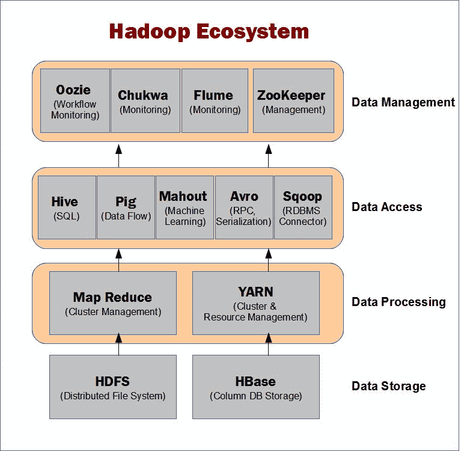

# Hadoop –大数据教程

> 原文： [https://howtodoinjava.com/hadoop/hadoop-big-data-tutorial/](https://howtodoinjava.com/hadoop/hadoop-big-data-tutorial/)

在这个 **hadoop 教程**中，我将讨论**大数据技术**的需求，他们打算解决的问题以及有关所涉及的技术和框架的一些信息。

```java
Table of Contents

How really big is Big Data?
Characteristics Of Big Data Systems
How Google solved the Big Data problem?
Evolution of Hadoop
Apache Hadoop Distribution Bundle
Apache Hadoop Ecosystem
```

## 大数据到底有多大？

让我们从一些事实开始。 从开始到 2003 年，我们产生的数据量为 50 亿千兆字节。 2011 年每两天和 2013 年每十分钟创建一次相同的数量。此速度仍在极大地增长。 统计数据显示，每天有 500 TB 以上的新数据被摄入社交媒体网站 Facebook 的数据库中。 这些数据主要以照片和视频上传，消息，评论等形式[[参考](https://gigaom.com/2012/08/22/facebook-is-collecting-your-data-500-terabytes-a-day/)]生成。 Google 每天处理 20 PB 的信息。

参见下面的信息图。 它将帮助您认识到生成了这些源的数据量与数千个源相似。

<figure aria-describedby="caption-attachment-4864" class="wp-caption aligncenter" id="attachment_4864" style="width: 600px">

<figcaption class="wp-caption-text" id="caption-attachment-4864">Big Data Growth</figcaption>

</figure>

图片： [Erik Fitzpatrick](https://www.flickr.com/photos/22244945@N00/3278869535/in/photolist-5ZK4Fn-wZhZd-6aGNbC-9AsggZ-7XE95z-9Avbkf-5nJkso-55zRNp-aPstJp-9Y4VMY-deUcef-99Gf16-gcg8mw-4TnMfy-a5vF3K-deqnNq-9Y4VN1-acLqa5-cf9tko-asSJNJ-Rc1BX-acLrrb-igDmy-93s25S-7euQsi-526UdZ-9fv4y3-mzQCL6-8WPwKd-A9xpa-4y3Rug-2khxUo-bUdjEY-6arb1v-75umLC-9X5xcb-86ezqV-481hNa-mzRq8D-7dZZR8-7e4TBN-47GeJT-vyNc5-b4gX2t-6zVsV8-5v16L3-3jz3Bw-9qpCK5-7qtryv-7e4S1u) 许可的 [CC BY 2.0](https://creativecommons.org/licenses/by/2.0/)

现在，您知道正在生成的数据量。 尽管如此大量的数据本身就是一个很大的挑战，但由于该数据没有固定格式，因此带来了更大的挑战。 它具有图像，视频，线路记录，GPS 跟踪详细信息，传感器记录以及许多其他形式。 简而言之，它是非结构化数据。 传统系统擅长处理结构化数据（也受限制），但它们无法处理如此大量的非结构化数据。

有人可能会问这个问题，为什么还要关心存储和处理数据呢？ 出于什么目的？ 答案是，我们需要这些数据，以便在我们正在研究的任何领域中做出更明智和可计算的决策。 业务预测并不是什么新鲜事物。 过去也已完成，但数据非常有限。 为了领先于竞争对手，企业必须使用这些数据，然后做出更明智的决策。 这些决定的范围从猜测消费者的喜好到提前预防欺诈活动。 每个领域的专业人员都可能找到他们分析此数据的原因。

## 大数据系统的特征

当您想确定下一个项目需要使用任何大数据系统时，请查看应用程序将产生的数据，并尝试寻找这些特征。 这些特性称为 4 V 大数据。

1.  #### 体积

    容量无疑是使大数据变得庞大的一部分。 互联网移动革命带来了大量社交媒体更新，来自设备的传感器数据以及电子商务的爆炸式增长，这意味着每个行业都充斥着数据，如果您知道如何使用它，那将是非常有价值的数据 。

    您的数据是否正在扩展/或可能像上述统计数据一样呈爆炸式增长？

2.  #### 品种

    存储在 SQL 表中的结构化数据已成为过去。 如今，从地理空间数据到可以分析内容和情感的推文，再到视觉数据（如照片和视频），各种形式和形式的 90％生成的数据都是“非结构化”的。

    您的数据是否始终保持结构化？ 还是半结构化还是非结构化？

3.  #### 速度

    每天每一分钟，全球用户在 YouTube 上上传 100 个小时的视频，发送超过 2 亿封电子邮件，以及发送 30 万条推文。 并且速度正在迅速增加。

    您的数据速度如何，或者将来会怎样？

4.  #### 真实性

    这是指营销商可获得的数据的不确定性（或可变性）。 这也可能适用于可能不一致的数据流的可变性，这使得组织更难以快速，更适当地做出反应。

    您是否总是以一致的形式获取数据？

## Google 如何解决大数据问题？

这个问题可能首先是因为搜索引擎数据使 Google 感到头疼，但随着互联网行业的革命而爆炸（尽管没有任何证据）。 他们使用并行处理的概念巧妙地解决了这个问题。 他们创建了一种称为 MapReduce 的算法。 该算法将任务分为小部分，并将这些部分分配给通过网络连接的许多计算机，然后收集结果以形成最终结果数据集。

当您意识到 I / O 是数据处理中最昂贵的操作时，这似乎合乎逻辑。 传统上，数据库系统将数据存储到单台计算机中，并且当您需要数据时，可以通过 SQL 查询的形式向它们发送一些命令。 这些系统从存储中获取数据，将其放入本地内存区域，进行处理并发送回给您。 这是最好的事情，您可以处理有限的数据和有限的处理能力。

但是，当您获得大数据时，就无法将所有数据存储在一台计算机中。 您必须将其存储到多台计算机（可能是数千台计算机）中。 而且，当您需要运行查询时，由于高 I / O 成本，您无法将数据聚合到一个位置。 那么 MapReduce 算法的作用是什么？ 它会将您的查询独立运行到存在数据的所有节点中，然后汇总结果并返回给您。

它带来了两个主要的改进，即 I / O 成本非常低，因为数据移动很少。 因为您的工作并行地在多台计算机中分解成较小的数据集，所以时间减少了第二秒。

## Hadoop 的演变

这一切始于 1997 年，当时 [Doug Cutting](https://en.wikipedia.org/wiki/Doug_Cutting) 开始编写 [Lucene](https://lucene.apache.org/) （全文搜索库）以对整个 Web 进行索引（就像 Google 一样）。 后来 Lucene 被 Apache 社区改编，Cutting 与华盛顿大学研究生 Mike Cafarella 一起创建了一个 Lucene 子项目“ [Apache Nutch](https://nutch.apache.org/) ”。 Nutch 现在被称为网络爬虫。 Nutch 抓取网站，并在其获取页面时，Nutch 使用 Lucene 对页面内容进行索引（使其“可搜索”）。

最初，他们将应用程序部署在具有 1GB RAM 和 8 个硬盘驱动器，总容量 8 TB 的单台计算机中，索引速率约为每秒 1000 页。 但是，一旦应用程序数据增长，就会出现限制。 不能将整个 Internet 数据存储到一台机器中是可以理解的。 因此，他们又增加了 3 台计算机（主要用于存储数据）。 但这是一个挑战，因为现在他们需要将数据从一台机器手动移动到另一台机器。 他们希望使应用程序易于扩展，因为即使 4 台计算机也将很快装满。

因此，他们开始研究一种系统，该系统可以是没有模式的，没有预定义的结构，经久耐用，能够处理组件故障的系统。 硬盘故障并自动重新平衡，以平衡整个计算机群集中的磁盘空间消耗。 幸运的是，2003 年 10 月，Google 发表了他们的 [Google 文件系统](http://research.google.com/archive/gfs.html)论文。 本文旨在解决他们面临的完全相同的问题。 太好了！

他们出色地在 Java 中实现了该解决方案，并将其称为 **Nutch 分布式文件系统（NDFS）**。 根据 GFS 论文，Cutting 和 Cafarella 通过将每个文件分成 64MB 块并将每个块存储在 3 个不同的节点（复制因子设置为 3）上，解决了持久性和容错性问题。 如果发生组件故障，系统将自动发现缺陷，并通过使用其他两个副本的数据重新复制故障节点上的数据块。 因此，发生故障的节点对 NDFS 的整体状态没有任何作用。

NDFS 解决了他们的一个问题，即存储，但带来了另一个问题“如何处理此数据”？ 至关重要的是，新算法应具有与 NDFS 相同的可扩展性。 该算法必须能够达到尽可能高的并行度（能够同时在多个节点上运行的能力）。 幸运再次使勇敢者受益。 2004 年 12 月，Google 发表了另一篇关于类似算法“ [MapReduce](http://research.google.com/archive/mapreduce.html) ”的论文。 大奖!!

MapReduce 论文解决的三个主要问题是并行化，分布和容错。 这些是切特和卡法雷利亚面临的确切问题。 MapReduce 的主要见解之一是，不应强迫他人为了处理数据而移动数据。 而是将程序发送到数据所在的位置。 与传统的数据仓库系统和关系数据库相比，这是一个关键的区别。 在 2005 年 7 月，Cutting 报告说 MapReduce 已集成到 Nutch 中，作为其基础计算引擎。

2006 年 2 月，Cutting 从 Nutch 代码库中删除了 NDFS 和 MapReduce，并创建了 Hadoop。 它由 Hadoop Common（核心库），HDFS 和 MapReduce 组成。 这就是 hadoop 诞生的方式。

此后发生了许多事情，导致 Yahoo 在 MapReduce“ [Pig](https://pig.apache.org/) ”之上贡献了他们的高级编程语言，而 Facebook 在“ [Hive](https://hive.apache.org/) ”之上贡献了 SQL，这是 SQL 的第一个化身。 MapReduce 的顶部。

## Apache Hadoop 分发套件

开源 Hadoop 由 Apache 软件基金会维护，网站位置为 [http://hadoop.apache.org/](https://hadoop.apache.org/) 。 当前的 Apache Hadoop 项目（版本 2.7）包括以下模块：

*   **Hadoop 通用**：支持其他 Hadoop 模块的通用实用程序
*   **Hadoop 分布式文件系统（HDFS）**：提供对应用程序数据的高吞吐量访问的分布式文件系统
*   **Hadoop YARN：**用于作业调度和集群资源管理的框架
*   **Hadoop MapReduce** ：基于 YARN 的系统，用于并行处理大型数据集

可以通过以下三种模式部署 Apache Hadoop：

1.  **独立**：用于简单分析或调试到单机环境中。
2.  **伪分布式**：它可帮助您模拟单个节点上的多节点安装。 在伪分布式模式下，每个组件进程都在单独的 JVM 中运行。
3.  **分布式**：具有数十个，数百个或数千个多个节点的群集。

## Apache Hadoop 生态系统

除了上述随 hadoop 分发的核心组件之外，还有许多组件可以补充基本的 Hadoop 框架，并为公司提供获得所需 Hadoop 结果所需的特定工具。

<figure aria-describedby="caption-attachment-4866" class="wp-caption aligncenter" id="attachment_4866" style="width: 767px">

<figcaption class="wp-caption-text" id="caption-attachment-4866">Hadoop Ecosystem</figcaption>

</figure>

1.  **数据存储层**：这是将数据存储在分布式文件系统中的位置，该文​​件系统由 HDFS 和 HBase ColumnDB 存储组成。 HBase 是可扩展的分布式数据库，支持大型表的结构化数据存储。
2.  **数据处理层**：此处要计算的调度，资源管理和集群管理。 使用 Map Reduce 的 YARN 作业调度和群集资源管理位于此层。
3.  **数据访问层**：这是将来自管理层的请求发送到数据处理层的层。 Hive，一种数据仓库基础结构，提供数据汇总和临时查询； Pig，一种用于并行计算的高级数据流语言和执行框架； Mahout，可扩展的机器学习和数据挖掘库； Avro，数据序列化系统。
4.  **管理层**：这是满足用户需求的层。 用户通过该层访问系统，该层具有以下组件：Chukwa，一个用于管理大型分布式系统的数据收集系统，以及 ZooKeeper，用于分布式应用程序的高性能协调服务。

在下一组文章中，我将详细介绍 hadoop 集群中涉及的编程概念。

**祝您学习愉快！**

#### 参考文献

[https://zh.wikipedia.org/wiki/Doug_Cutting](https://en.wikipedia.org/wiki/Doug_Cutting)
[http://hadoop.apache.org/](https://hadoop.apache.org/)
[http：// lucene。 apache.org/](https://lucene.apache.org/)
[http://nutch.apache.org/](https://nutch.apache.org/)
[http://hive.apache.org/](https://hive.apache.org/)
[http://pig.apache.org/](https://pig.apache.org/)
[http://research.google.com/archive/gfs.html](http://research.google.com/archive/gfs.html)
[http：// research。 google.com/archive/mapreduce.html](http://research.google.com/archive/mapreduce.html)
[https://medium.com/@markobonaci/the-history-of-hadoop-68984a11704](https://medium.com/@markobonaci/the-history-of-hadoop-68984a11704) [良好阅读]
[https://www.linkedin.com/pulse/100-open-source-big-data-architecture-papers-anil-madan](https://www.linkedin.com/pulse/100-open-source-big-data-architecture-papers-anil-madan) [必须阅读]