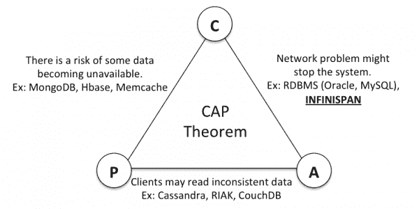

# 简单单词布鲁尔的 CAP 定理

> 原文： [https://howtodoinjava.com/hadoop/brewers-cap-theorem-in-simple-words/](https://howtodoinjava.com/hadoop/brewers-cap-theorem-in-simple-words/)

当您开始讨论分布式体系结构时，很可能会遇到 **CAP 理论**（或 Brewer 定理）。 CAP 代表一致性，可用性和分区容忍度。 它希望系统设计师在最终设计中在以上三个竞争保证之间做出选择。 据说不可能在系统中实现全部三项，并且您必须在系统的三项保证中最多选择两项。

好。 定义似乎简单快捷。 可是等等 ！！ 您所说的一致性，可用性和分区容忍度是什么意思？ 让我们在分布式计算环境中定义这些术语。

1.  #### 一致性

    一致的服务将完全运行或根本不运行。 一致性在非分布式系统中的 ACID 属性中为“ C”，适用于数据库事务的理想属性，这意味着数据将永远不会持久保存（回滚），从而打破了某些预设约束。

    在分布式环境中，一致性意味着**，正在从集群读取数据的所有客户端程序在任何给定时间点**都会看到相同的数据。 从两个节点获取数据的两个客户端应该根本看不到不同的数据。

2.  #### 可用性

    可用性意味着– **，无论群集**内部发生什么，您都应该能够检索存储在分布式系统中的数据。 如果发出请求，则必须从系统得到响应； 即使集群中的一个节点（或多个节点）发生故障。

3.  #### 分区容限

    分区容限意味着即使两个节点（两个节点都在上，但无法通信）之间存在“分区”（通信中断），群集（作为一个整体）仍可以继续运行。

    **不允许出现少于总网络故障的一组故障，从而导致系统无法正确响应。**

因此，CAP 定理使您可以选择想要添加到系统中的 3 个保证中的任意两个。 您不能保证单个分布式系统中的全部 3 个，例如 为了获得可用性和分区容忍度，您必须放弃一致性。

## CAP 定理例子

不管您读过什么，大部分都是定义部分，对于初学者来说有点复杂。 让我们用更简单的英语来了解

您需要设计一个由 4 个数据节点组成的分布式集群。 复制因子为 2，即任何写入群集的数据都必须写入 2 个节点； 因此，当发生故障时，一秒钟即可提供数据。 现在，尝试对此要求应用 CAP 定理。 在分布式系统中，任何时候都可能发生两件事，即节点故障（硬盘崩溃）或网络故障（两个节点之间的连接断开）[[分布式计算的谬误](https://en.wikipedia.org/wiki/Fallacies_of_Distributed_Computing)]。

我们将尝试根据这些事实/假设来设计我们的系统。

#### CP [一致性/分区容差]系统

在分布式系统中，在读取数据时，一致性是由一种投票机制决定的，在该机制中，所有拥有数据副本的节点都同意他们拥有所请求数据的“相同副本”。 现在，假设我们请求的数据存在于两个节点 N1 和 N2 中。 客户端尝试读取数据； 而且我们的 CP 系统也可以容忍分区，因此发生了预期的网络故障，并且将 N2 检测为 DOWN。 现在，系统无法确定 N1 的数据副本是否为最新； 它也可能是陈旧的。 因此，系统决定将 ERROR 事件发送给客户端。 在这里，系统选择了数据一致性而不是数据可用性。

同样，如果复制因子为 2，则在写入数据时，系统可能会拒绝写入请求，直到找到两个运行状况良好的节点以一致的方式完全写入数据为止。

#### AP [可用性/分区容限]系统

如果在上述情况下系统而不是发送错误（如果 N2 处于关闭状态）怎么办？ 它发送从 N1 接收的数据。 客户端得到了数据，但是过去存储在系统中的是最新数据副本吗？ 你不能决定。 您选择可用性而不是一致性。 这些是 AP 系统。

#### CA [一致性/可用性]系统

在分布式环境中，我们无法避免 CAP 的“ P”。 因此，我们必须在 CP 或 AP 系统之间进行选择。 如果我们希望拥有一个一致且可用的系统，那么我们就必须忽略分区容忍度，只有在非分布式系统（例如 oracle 和 SQL Server）中才有可能。

CAP Theorem Example

In today’s world, we can achieve all 3 in a distributed system (if not fully, then partially at least). E.g. [Tunable consistency in Cassandra](http://docs.datastax.com/en/cassandra/2.0/cassandra/dml/dml_config_consistency_c.html)

*CAP Theorem is like the old joke about software projects: you can have it on TIME, in BUDGET, or CORRECT. Pick any two 🙂*

**祝您学习愉快！**

**参考**： [http://www.julianbrowne.com/article/viewer/brewers-cap-theorem](http://www.julianbrowne.com/article/viewer/brewers-cap-theorem)