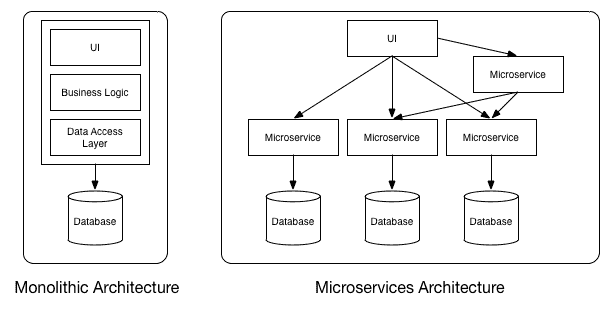

# 微服务–定义，原理和收益

> 原文： [https://howtodoinjava.com/microservices/microservices-definition-principles-benefits/](https://howtodoinjava.com/microservices/microservices-definition-principles-benefits/)

微服务是业界最新的流行语，似乎每个人都以一种或另一种方式谈论它。 让我们了解**什么是微服务**？ 在本教程中，我们将尝试了解微服务的定义，概念和**原理。**

```java
Table of Contents

1\. Definition of Microservices
2\. Principles of Microservices
3\. Benefits of Microservices
4\. Conclusion
```

## 1\. 微服务的定义

如今，微服务是继 SOA（[面向服务的架构](https://en.wikipedia.org/wiki/Service-oriented_architecture)）之后越来越流行的架构模式之一。 如果您遵循行业趋势，那么您会意识到，如今的企业不再像几年前那样对开发大型应用程序来管理其端到端业务功能感兴趣，而是选择了快速而敏捷的应用程序，而这些应用程序的成本很高 他们的钱也减少了。

微服务有助于打破大型应用程序的界限，并在系统内部构建逻辑上独立的小型系统。 例如。 使用 [Amazon AWS](https://aws.amazon.com/) ，您可以毫不费力地构建云应用程序。 这是微服务可以做什么的一个很好的例子。



Monolithic vs MicroServices Architecture


如上图所示，每个微服务都有其自己的业务层和数据库。 这样，对一种微服务的更改不会影响其他微服务。

通常，**微服务使用广泛采用的轻量协议**（例如 HTTP 和 REST）或消息传递协议（例如 [JMS](https://howtodoinjava.com/jms/jms-java-message-service-tutorial/) 或 AMQP）相互通信。 在特定情况下，它们也可以使用更专业的协议。

## 2\. 微服务原理

现在，让我们研究微服务的“必备”原则。

1.  #### 单一责任原则

    单一责任原则是定义为 [SOLID 设计模式](//howtodoinjava.com/best-practices/5-class-design-principles-solid-in-java/#SRP)一部分的原则之一。 这意味着一个单元（一个类，一个函数或一个微服务）应该只承担一个责任。

    在任何时候，一项微服务都不应承担一项以上的责任。

2.  #### 围绕业务能力构建

    **微服务应专注于某些业务功能**，并确保其有助于完成任务。 微服务绝不能限制自己采用最适合解决业务目的的适当技术栈或后端数据库存储。

    当我们设计整体应用程序时，这通常是约束条件，在这些应用程序中，我们试图解决多个业务解决方案并在某些方面做出一些妥协。 微服务可让您选择最适合当前问题的方法。

3.  #### 您创建它，就拥有它！

    这种设计的另一个重要方面与职责的前后发展有关。 在大型组织中，通常会有一个团队来开发应用程序位置，并且在进行一些知识转移之后，会将项目移交给维护团队。 在微服务中，构建服务的团队拥有它，并负责将来维护它。

    > [您构建它，拥有它！](https://aronatkins.github.io/2014/12/23/you-build-it-you-own-it.html)

    这种所有权使开发人员可以接触到其软件的日常操作，并且他们可以更好地了解现实世界中客户如何使用其内置产品。

4.  #### 基础设施自动化

    为微服务准备和构建基础架构是另一个非常重要的需求。 **服务应是可独立部署的**，并且应捆绑所有依赖项，包括库依赖项，甚至捆绑抽象物理资源的执行环境，例如 Web 服务器和容器或虚拟机。

    微服务和 SOA 之间的主要**差异之一在于它们的自治程度。 虽然大多数 SOA 实现都提供服务级别的抽象，但是微服务却走得更远，并且抽象了实现和执行环境。**

    在传统的应用程序开发中，我们先构建一个 WAR 或 EAR，然后将其部署到 JEE 应用程序服务器中，例如使用 JBoss，WebLogic，WebSphere 等。 我们可能将多个应用程序部署到同一个 JEE 容器中。 在理想情况下，在微服务方法中，每个微服务将构建为[胖 JAR](//howtodoinjava.com/maven/maven-shade-plugin-create-uberfat-jar-example/)，嵌入所有依赖项并作为独立的 Java 进程运行。

5.  #### 失败的设计

    微服务的设计应考虑到故障情况。 如果服务失败或停顿了一段时间该怎么办。 这些是非常重要的问题，必须在实际编码开始之前解决-清楚地估计**服务故障将如何影响用户体验**。

    快速故障是用于构建容错，弹性系统的另一个概念。 这种哲学提倡的系统应该是失败的，而不是构建永远不会失败的系统。 由于服务随时可能发生故障，因此重要的是能够迅速检测到故障，并在可能的情况下自动恢复服务。

    微服务应用程序非常重视应用程序的实时监视，同时检查架构元素（数据库每秒收到多少请求）和业务相关指标（例如每分钟有多少订单） 收到）。 语义监视可以为发生错误的情况提供预警系统，从而触发开发团队进行跟进和调查。

## 3\. 微服务的好处

与传统的多层单片架构相比，微服务提供了许多*优势。 让我们列出它们：*

*   借助微服务，架构师和开发人员可以为每种微服务选择适用于特定体系结构和技术的**（[多语言体系结构](https://www.infoq.com/articles/paradigm-based-polyglot-prog)）。 这样可以灵活地以更具成本效益的方式设计更适合的解决方案。**
*   由于服务**相当简单且规模较小**，因此企业可以承受尝试新流程，算法，业务逻辑等的费用。 它通过提供实验和快速失败的能力，使企业能够进行颠覆性创新。
*   微服务能够实现**选择性可伸缩性**，即每个服务都可以独立地按比例放大或缩小，并且按比例缩放的成本要比单片方法小。
*   微服务是**自包含的独立部署模块**，当第二个微服务未按我们的需要运行时，它可以用另一个类似的微服务代替。 它有助于做出正确的买进建造决策，而这通常是许多企业所面临的挑战。
*   微服务可帮助我们**构建本质上是有机的系统**（有机系统是通过向其添加越来越多的功能而在一段时间内横向增长的系统）。 因为微服务都是关于独立可管理的服务的，所以它可以根据需要添加越来越多的服务，而对现有服务的影响却很小。
*   技术变革是软件开发的障碍之一。 使用微服务，可以单独为每个服务**更改或升级技术**，而不是升级整个应用程序。
*   由于微服务**将服务运行时环境与服务本身**打包在一起，因此可以在同一环境中共存多个版本的服务。
*   最后，微服务还使**小型，专注的敏捷团队**得以开发。 将基于微服务的边界组织团队。

## 4 结论

Often the true consequences of your architectural decisions are only evident several years after you made them.

在本文中，我仅列举了一些关于微服务的正面评价，而这些知识在我有限的知识中已在许多组织中看到。 具有强大设计和出色编码人员支持的单片应用程序也可以证明是一个不错的决定，并且产品可以保留足够长的时间来支持该决定。

与微服务类似，糟糕的设计决策将被证明是昂贵的。 它们似乎在简化组件，但它们可能会增加它们之间的通信复杂性，并且更难控制和管理。

最后，**好的设计和熟练的团队将为您带来胜利**。 技术水平低下的团队总是会创建一个糟糕的系统，很难说微服务在这种情况下是减少混乱还是使其变得更糟。

我建议您从整体应用程序设计开始，并且当您觉得它使系统变得复杂时，请尝试使用微服务，以检查它们是否使应用程序变得不太复杂。 这样，您将有一个更明智的决定。

学习愉快！

资源：

[Martin Fowler 关于微服务](http://martinfowler.com/articles/microservices.html)