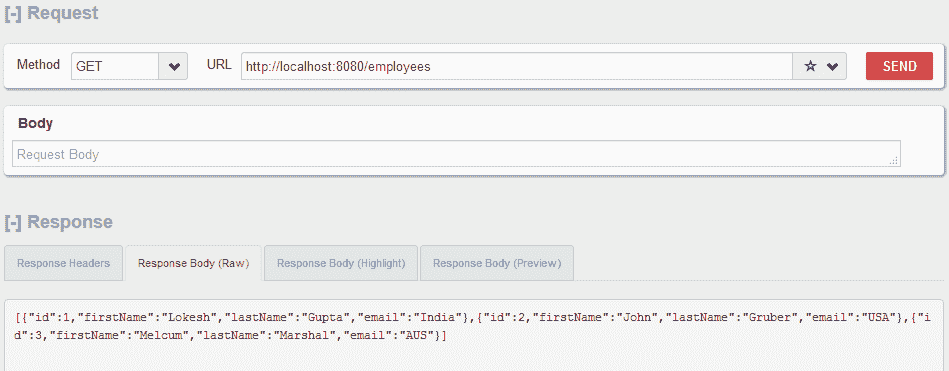
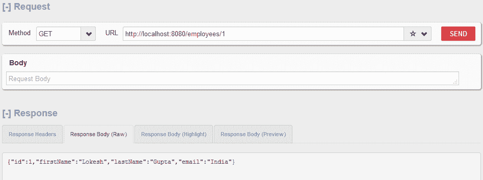
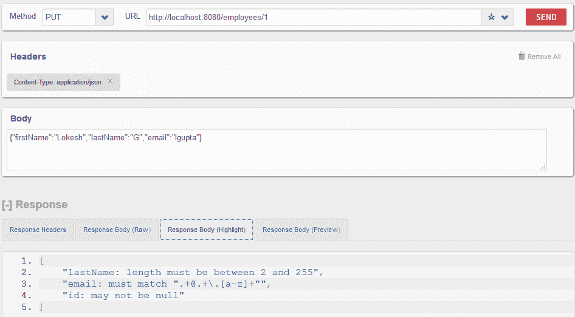
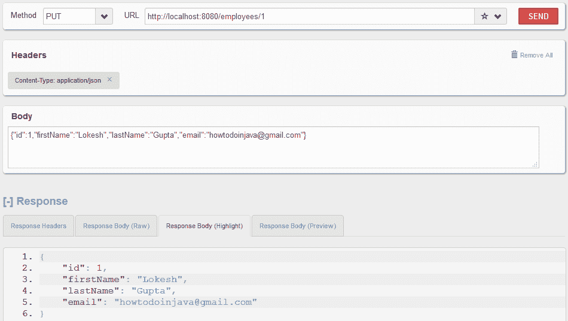

# Dropwizard 教程 – Hello World 示例

> 原文： [https://howtodoinjava.com/dropwizard/tutorial-and-hello-world-example/](https://howtodoinjava.com/dropwizard/tutorial-and-hello-world-example/)

Dropwizard 是用于快速开发 REST API 的开源 Java 框架。 Dropwizard 是一种生态系统，其中包含捆绑到单个程序包中的所有依赖项（例如，Jersey，Jackson 或 Jetty），也可以作为单独的模块添加。 如果不使用 dropwizard，最终将自己收集所有依赖关系，由于各种 Java 库之间的版本不匹配，通常会导致类加载问题。 Dropwizard 为您解决了这个问题，并将稳定，成熟的库组合到一个简单，轻巧的程序包中，使您可以专注于完成工作。 让我们**逐步使用**来学习使用 dropwizard 构建 REST API。

```java
Table of Contents

Libraries included inside dropwizard
Setup dropwizard with maven
Create REST Application Class
Create REST Resource and APIs
Build Resource Representations
Request Validation
Verify REST APIs
```

您将需要 **Java 8** 来运行此代码中给出的示例，这些示例是使用 dropwizard 1.0.0 版开发的。

## dropwizard 中包含的库

将 dropwizard 包含到项目中后，您将获得以下库添加到您的类路径中。

*   [Jersey](//howtodoinjava.com/jersey-jax-rs-tutorials/) – 用于构建 RESTful Web 应用程序。
*   [Jetty](https://www.eclipse.org/jetty/) – Dropwizard 使用 Jetty HTTP 库将 HTTP 服务器直接嵌入到您的项目中。
*   [Jackson](https://github.com/FasterXML/jackson) - 用于对象到 JSON 的转换。 它允许直接使用 JAXB 注释导出域模型。
*   [Guava](https://github.com/google/guava) – 高度优化的不可变数据结构，可加快开发速度。
*   [Logback](http://logback.qos.ch/) 和 [SLF4j](http://www.slf4j.org/) – 用于高性能和灵活的日志记录。
*   [Hiberante 验证器](http://www.hibernate.org/subprojects/validator.html) – 一个简单的声明性框架，用于验证用户输入并生成有用且对 i18n 友好的错误消息。
*   [Apache HTTPClient](https://hc.apache.org/httpcomponents-client-ga/index.html) – 用于与其他 Web 服务的高层和高层交互。
*   [JDBI](http://www.jdbi.org/) - 在 Java 中使用关系数据库的最直接方法。
*   [Liquidbase](http://www.liquibase.org/) – 在整个开发和发布周期中，始终检查数据库模式。
*   [FreeMarker](http://freemarker.sourceforge.net/) – 模板系统。
*   [Mustache](https://mustache.github.io/) – 适用于更多面向用户的应用程序的简单模板系统。
*   [Joda Time](http://www.joda.org/joda-time/) –非常完整和理智的库，用于处理日期和时间。

## 用 Maven 设置 dropwizard

我们的项目将基于`maven-archetype-quickstart`原型。 您可以使用命令提示符来创建项目，或[使用 eclipse 创建简单的 Maven Java 项目](//howtodoinjava.com/maven/create-a-simple-java-project-using-maven/)。

```java
mvn archetype:generate -DgroupId=com.howtodoinjava.demo -DartifactId=DropWizardExample 
-DarchetypeArtifactId=maven-archetype-quickstart -DinteractiveMode=false
```

生成的项目也将具有`pom.xml`文件。 在此处添加 dropwizard 依赖项。

```java
<properties>
	<dropwizard.version>1.0.0</dropwizard.version>
</properties>
<dependencies>
	<dependency>
		<groupId>io.dropwizard</groupId>
		<artifactId>dropwizard-core</artifactId>
		<version>${dropwizard.version}</version>
	</dependency>
</dependencies>

```

这将下载所有 jar 文件并将它们添加到您的类路径中。 为了向我们的项目添加构建和程序包支持，我们将使用 [maven-shade 插件](//howtodoinjava.com/maven/maven-shade-plugin-create-uberfat-jar-example/)，它将允许我们将我们的项目及其依赖项完全打包到一个独立的 JAR 文件中（胖/Uber JAR），可以按原样分发和执行。

完整的`pom.xml`文件如下所示。

```java
<project xmlns="http://maven.apache.org/POM/4.0.0" xmlns:xsi="http://www.w3.org/2001/XMLSchema-instance"
	xsi:schemaLocation="http://maven.apache.org/POM/4.0.0 http://maven.apache.org/xsd/maven-4.0.0.xsd;
	<modelVersion>4.0.0</modelVersion>

	<groupId>com.howtodoinjava.demo</groupId>
	<artifactId>DropWizardExample</artifactId>
	<version>0.0.1-SNAPSHOT</version>
	<packaging>jar</packaging>

	<name>DropWizardExample</name>
	<url>http://maven.apache.org</url>

	<properties>
		<dropwizard.version>1.0.0</dropwizard.version>
		<project.build.sourceEncoding>UTF-8</project.build.sourceEncoding>
	</properties>

	<dependencies>
		<dependency>
			<groupId>io.dropwizard</groupId>
			<artifactId>dropwizard-core</artifactId>
			<version>${dropwizard.version}</version>
		</dependency>
	</dependencies>
	<build>
		<finalName>DropWizardExample-${version}</finalName>
		<plugins>
			<plugin>
				<groupId>org.apache.maven.plugins</groupId>
				<artifactId>maven-compiler-plugin</artifactId>
				<version>3.1</version>
				<configuration>
					<source>1.8</source>
					<target>1.8</target>
				</configuration>
			</plugin>
			<plugin>
				<groupId>org.apache.maven.plugins</groupId>
				<artifactId>maven-shade-plugin</artifactId>
				<version>2.1</version>
				<executions>
					<execution>
						<phase>package</phase>
						<goals>
							<goal>shade</goal>
						</goals>
						<configuration>
							<transformers>
								<transformer implementation="org.apache.maven.plugins.shade.resource.ManifestResourceTransformer">
									<mainClass>com.howtodoinjava.rest.App</mainClass>
								</transformer>
								<transformer implementation="org.apache.maven.plugins.shade.resource.ServicesResourceTransformer">
								</transformer>
							</transformers>
						</configuration>
					</execution>
				</executions>
			</plugin>
		</plugins>
	</build>

</project>

```

## 创建 REST 应用程序类

应用程序类是任何 dropwizard 应用程序的入口点。 它需要扩展`io.dropwizard.Application`类并实现`initialize(Bootstrap<Configuration>)`和`run(Configuration, Environment)`方法。 他们准备应用程序的运行时环境。

要调用`run`方法，您需要具有`public static void main(String[] args) {}`方法，当您将应用程序作为 jar 文件运行时，该方法将由`java -jar`命令调用。

```java
package com.howtodoinjava.rest;

import io.dropwizard.Application;
import io.dropwizard.Configuration;
import io.dropwizard.setup.Bootstrap;
import io.dropwizard.setup.Environment;

import org.slf4j.Logger;
import org.slf4j.LoggerFactory;

import com.howtodoinjava.rest.controller.EmployeeRESTController;

public class App extends Application<Configuration> {
	private static final Logger LOGGER = LoggerFactory.getLogger(App.class);

	@Override
	public void initialize(Bootstrap<Configuration> b) {
	}

	@Override
	public void run(Configuration c, Environment e) throws Exception {
		LOGGER.info("Registering REST resources");
		e.jersey().register(new EmployeeRESTController(e.getValidator()));
	}

	public static void main(String[] args) throws Exception {
		new App().run(args);
	}
}

```

为了执行 JAR 文件，我们在命令中添加**服务器**参数，该参数启动嵌入式 HTTP 服务器（Jetty）以运行我们的服务。

```java
java -jar target\DropWizardExample.jar server
```

Dropwizard 的嵌入式 Jetty 服务器将默认尝试绑定到端口 **8080** 和 **8081** 。 服务器使用端口 8080 来向应用程序提供传入的 HTTP 请求，而 Dropwizard 的管理界面则使用 8081 端口。

我们还导入了必要的`Logger`和`LoggerFactory`类，以构造可用于日志记录需求的`Logger`实例。

## 创建 REST 资源和 API

现在，当您添加了应用程序引导类后，现在可以添加包含 REST API 的 REST 资源。 在此示例中，我创建并创建了员工管理应用程序-因此它具有用于创建/更新/删除员工记录的 API。 此类将负责处理 HTTP 请求并生成 JSON 响应。

由于类路径中包含 Jersey，因此我们将使用它来构建 REST API。

```java
package com.howtodoinjava.rest.controller;

import java.net.URI;
import java.net.URISyntaxException;
import java.util.ArrayList;
import java.util.Set;

import javax.validation.ConstraintViolation;
import javax.validation.Validator;
import javax.ws.rs.DELETE;
import javax.ws.rs.GET;
import javax.ws.rs.POST;
import javax.ws.rs.PUT;
import javax.ws.rs.Path;
import javax.ws.rs.PathParam;
import javax.ws.rs.Produces;
import javax.ws.rs.core.MediaType;
import javax.ws.rs.core.Response;
import javax.ws.rs.core.Response.Status;

import com.howtodoinjava.rest.dao.EmployeeDB;
import com.howtodoinjava.rest.representations.Employee;

@Path("/employees")
@Produces(MediaType.APPLICATION_JSON)
public class EmployeeRESTController {

	private final Validator validator;

	public EmployeeRESTController(Validator validator) {
		this.validator = validator;
	}

	@GET
	public Response getEmployees() {
		return Response.ok(EmployeeDB.getEmployees()).build();
	}

	@GET
	@Path("/{id}")
	public Response getEmployeeById(@PathParam("id") Integer id) {
		Employee employee = EmployeeDB.getEmployee(id);
		if (employee != null)
			return Response.ok(employee).build();
		else
			return Response.status(Status.NOT_FOUND).build();
	}

	@POST
	public Response createEmployee(Employee employee) throws URISyntaxException {
		// validation
		Set<ConstraintViolation<Employee>> violations = validator.validate(employee);
		Employee e = EmployeeDB.getEmployee(employee.getId());
		if (violations.size() > 0) {
			ArrayList<String> validationMessages = new ArrayList<String>();
			for (ConstraintViolation<Employee> violation : violations) {
				validationMessages.add(violation.getPropertyPath().toString() + ": " + violation.getMessage());
			}
			return Response.status(Status.BAD_REQUEST).entity(validationMessages).build();
		}
		if (e != null) {
			EmployeeDB.updateEmployee(employee.getId(), employee);
			return Response.created(new URI("/employees/" + employee.getId()))
					.build();
		} else
			return Response.status(Status.NOT_FOUND).build();
	}

	@PUT
	@Path("/{id}")
	public Response updateEmployeeById(@PathParam("id") Integer id,	Employee employee) {
		// validation
		Set<ConstraintViolation<Employee>> violations = validator.validate(employee);
		Employee e = EmployeeDB.getEmployee(employee.getId());
		if (violations.size() > 0) {
			ArrayList<String> validationMessages = new ArrayList<String>();
			for (ConstraintViolation<Employee> violation : violations) {
				validationMessages.add(violation.getPropertyPath().toString() + ": " + violation.getMessage());
			}
			return Response.status(Status.BAD_REQUEST).entity(validationMessages).build();
		}
		if (e != null) {
			employee.setId(id);
			EmployeeDB.updateEmployee(id, employee);
			return Response.ok(employee).build();
		} else
			return Response.status(Status.NOT_FOUND).build();
	}

	@DELETE
	@Path("/{id}")
	public Response removeEmployeeById(@PathParam("id") Integer id) {
		Employee employee = EmployeeDB.getEmployee(id);
		if (employee != null) {
			EmployeeDB.removeEmployee(id);
			return Response.ok().build();
		} else
			return Response.status(Status.NOT_FOUND).build();
	}
}

```

为了模仿数据库，我创建了`EmployeeDB`类，该类将员工记录和更新存储在内存中。

```java
package com.howtodoinjava.rest.dao;

import java.util.ArrayList;
import java.util.HashMap;
import java.util.List;

import com.howtodoinjava.rest.representations.Employee;

public class EmployeeDB {

	public static HashMap<Integer, Employee> employees = new HashMap<>();
	static{
		employees.put(1, new Employee(1, "Lokesh", "Gupta", "India"));
		employees.put(2, new Employee(2, "John", "Gruber", "USA"));
		employees.put(3, new Employee(3, "Melcum", "Marshal", "AUS"));
	}

	public static List<Employee> getEmployees(){
		return new ArrayList<Employee>(employees.values());
	}

	public static Employee getEmployee(Integer id){
		return employees.get(id);
	}

	public static void updateEmployee(Integer id, Employee employee){
		employees.put(id, employee);
	}

	public static void removeEmployee(Integer id){
		employees.remove(id);
	}
}

```

## 建立资源表示

表示是保存数据并序列化为 JSON 的内容。 它是 RESTful 应用程序的模型。 当将 Jersey 与 Jackson 结合使用时，构建资源表示形式所需的全部就是 – 遵循 Java bean 标准的简单 POJO。 Jackson 根据每个类的设置器方法及其返回类型来递归构造 JSON 字符串。

任何`java.util.List`类型的实例都将转换为 JSON 数组。

```java
package com.howtodoinjava.rest.representations;

import javax.validation.constraints.NotNull;
import javax.validation.constraints.Pattern;

import org.hibernate.validator.constraints.Length;
import org.hibernate.validator.constraints.NotBlank;

public class Employee {

	@NotNull
	private Integer id;
	@NotBlank @Length(min=2, max=255)
	private String firstName;
	@NotBlank @Length(min=2, max=255)
	private String lastName;
	@Pattern(regexp=".+@.+\\.[a-z]+")
	private String email;

	public Employee(){
	}

	public Employee(Integer id, String firstName, String lastName, String email) {
		this.id = id;
		this.firstName = firstName;
		this.lastName = lastName;
		this.email = email;
	}

	public Integer getId() {
		return id;
	}

	public void setId(Integer id) {
		this.id = id;
	}

	public String getFirstName() {
		return firstName;
	}

	public void setFirstName(String firstName) {
		this.firstName = firstName;
	}

	public String getLastName() {
		return lastName;
	}

	public void setLastName(String lastName) {
		this.lastName = lastName;
	}

	public String getEmail() {
		return email;
	}

	public void setEmail(String email) {
		this.email = email;
	}

	@Override
	public String toString() {
		return "Emplyee [id=" + id + ", firstName=" + firstName + ", lastName="
				+ lastName + ", email=" + email + "]";
	}
}

```

如果在某些情况下需要，可以通过将`@JsonIgnore`批注添加到其设置器来防止该属性成为 JSON 表示的一部分。

## 要求验证

接受`PUT`和`POST`请求时，您需要在请求正文中验证用户提交的实体内容。 Dropwizard 为此使用休眠验证器。 添加验证需要执行以下步骤。

1.  #### 在表示形式类中添加验证注释

    ```java
    @NotNull
    private Integer id;

    @NotBlank @Length(min=2, max=255)
    private String firstName;

    @NotBlank @Length(min=2, max=255)
    private String lastName;

    @Pattern(regexp=".+@.+\\.[a-z]+")
    private String email;
    ```

2.  #### 从应用程序的 REST 资源中注入 Environment.getValidator（）

```java
@Override
public void run(Configuration c, Environment e) throws Exception 
{
	LOGGER.info("Registering REST resources");
	e.jersey().register(new EmployeeRESTController(e.getValidator()));
}

```

4.  #### 在 REST 资源中使用验证器

    ```java
    public class EmployeeRESTController {

    	private final Validator validator;

    	public EmployeeRESTController(Validator validator) {
    		this.validator = validator;
    	}

    	@POST
    	public Response createEmployee(Employee employee) throws URISyntaxException 
    	{
    		Set<ConstraintViolation<Employee>> violations = validator.validate(employee);
    		Employee e = EmployeeDB.getEmployee(employee.getId());
    		if (violations.size() > 0) {
    			ArrayList<String> validationMessages = new ArrayList<String>();
    			for (ConstraintViolation<Employee> violation : violations) {
    				validationMessages.add(violation.getPropertyPath().toString() + ": " + violation.getMessage());
    			}
    			return Response.status(Status.BAD_REQUEST).entity(validationMessages).build();
    		}

    		//Create Employee code here
    	}
    }

    ```

## 验证 REST API

现在，当我们创建并添加了 REST API 的验证后，让我们对其进行测试。

#### 构建应用程序 uber jar 文件

```java
> mvn clean package
```

#### 在 Jetty 服务器中启动应用程序

```java
> java -jar target\DropWizardExample-0.0.1-SNAPSHOT.jar server
```

#### 访问 URI `http://localhost:8080/employees`

这将返回员工集合和相关的响应头。



Dropwizard – GET 请求示例 – 1


#### 访问 URI `http://localhost:8080/employees/1`

这将返回 ID 为 1 的员工记录。



Dropwizard – GET 请求示例 – 2


#### 使用无效的请求数据发送 HTTP PUT `http://localhost:8080/employees/1`

您将收到验证消息。



Dropwizard – 验证示例


#### 使用正确的数据发送 HTTP PUT `http://localhost:8080/employees/1`

员工记录将成功更新。



Dropwizard – PUT 请求示例


同样，您可以测试其他 API 和方案。

[源码下载](//howtodoinjava.com/wp-content/downloads/DropWizardExample.zip)

在评论部分让我知道您的问题。

学习愉快！