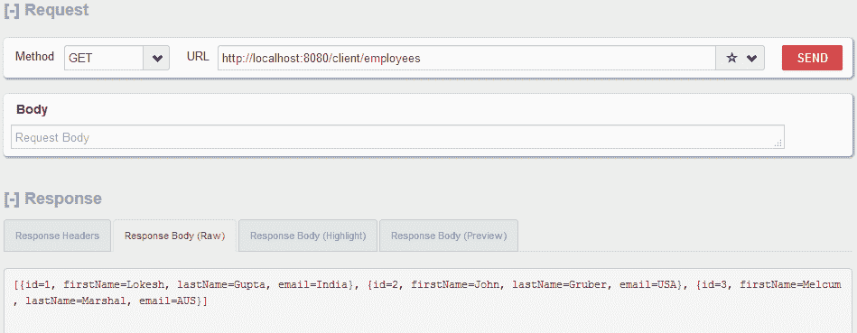

# Dropwizard 客户端– Jersey / HTTP 配置和示例

> 原文： [https://howtodoinjava.com/dropwizard/client-configuration-and-examples/](https://howtodoinjava.com/dropwizard/client-configuration-and-examples/)

我们已经使用 dropwizard 构建了 REST API。 现在，让我们构建 REST 客户端，以在整个网络上使用 REST API。 Dropwizard 同时包含 [Apache HttpClient](https://hc.apache.org/httpcomponents-client-ga/quickstart.html) 和 [Jersey Client](https://jersey.java.net/nonav/documentation/latest/user-guide.html#client) 。 让我们来构建它们。

> 阅读更多： [Dropwizard Hello World 应用程序](//howtodoinjava.com/dropwizard/tutorial-and-hello-world-example/)

## Maven 依赖

Dropwizard 客户端模块被添加为单独的模块。

```java
<properties>
	<dropwizard.version>1.0.0</dropwizard.version>
</properties>
<dependency>
	<groupId>io.dropwizard</groupId>
	<artifactId>dropwizard-client</artifactId>
	<version>${dropwizard.version}</version>
</dependency>

```

## Dropwizard REST 客户端配置

Dropwizard 提供易于声明和使用的 REST 客户端配置。 您需要创建`io.dropwizard.client.JerseyClientBuilder`实例并为其提供`io.dropwizard.setup.Environment`参考。

```java
@Override
public void run(Configuration c, Environment e) throws Exception {
	//Here we added REST Resource
	e.jersey().register(new EmployeeRESTController(e.getValidator()));

	//Now we added REST Client Resource named RESTClientController
	final Client client = new JerseyClientBuilder(e).build("DemoRESTClient");
	e.jersey().register(new RESTClientController(client));
}

```

要添加 HTTP 客户端，请使用以下类似的步骤：

```java
@Override
public void run(Configuration c, Environment e) throws Exception {
	//Here we added REST Resource
	e.jersey().register(new EmployeeRESTController(e.getValidator()));

	//Now we added REST Client Resource named RESTClientController
	final HttpClient client = new HttpClientBuilder(e).build("DemoRESTClient");
	e.jersey().register(new RESTClientController(client));
}

```

`HttpClientConfiguration`的默认配置如下：

```java
timeout: 500ms
connectionTimeout: 500ms
timeToLive: 1 hour
cookiesEnabled: false
maxConnections: 1024
maxConnectionsPerRoute: 1024
keepAlive: 0s
```

`JerseyClientConfiguration`的默认配置如下：

```java
minThreads: 1
maxThreads: 128
gzipEnabled: true
gzipEnabledForRequests: true

//same as HttpClientConfiguration
timeout: 500ms
connectionTimeout: 500ms
timeToLive: 1 hour
cookiesEnabled: false
maxConnections: 1024
maxConnectionsPerRoute: 1024
keepAlive: 0s
```

## Dropwizard REST 客户端资源

现在，当您可以访问 REST 客户端资源`RESTClientController.java`中的`javax.ws.rs.client.Client`或`org.apache.http.client.HttpClient`时，您可以使用库方法来照常调用 HTTP URI。

```java
package com.howtodoinjava.rest.controller;

import java.util.ArrayList;

import javax.ws.rs.GET;
import javax.ws.rs.Path;
import javax.ws.rs.PathParam;
import javax.ws.rs.Produces;
import javax.ws.rs.client.Client;
import javax.ws.rs.client.Invocation;
import javax.ws.rs.client.WebTarget;
import javax.ws.rs.core.MediaType;
import javax.ws.rs.core.Response;

import com.howtodoinjava.rest.representations.Employee;

@Produces(MediaType.TEXT_PLAIN)
@Path("/client/")
public class RESTClientController 
{
	private Client client;

	public RESTClientController(Client client) {
		this.client = client;
	}

	@GET
	@Path("/employees/")
	public String getEmployees()
	{
		//Do not hard code in your application
		WebTarget webTarget = client.target("http://localhost:8080/employees");
		Invocation.Builder invocationBuilder =  webTarget.request(MediaType.APPLICATION_JSON);
		Response response = invocationBuilder.get();
		@SuppressWarnings("rawtypes")
		ArrayList employees = response.readEntity(ArrayList.class);
		return employees.toString();
	}

	@GET
	@Path("/employees/{id}")
	public String getEmployeeById(@PathParam("id") int id)
	{
		//Do not hard code in your application
		WebTarget webTarget = client.target("http://localhost:8080/employees/"+id);
		Invocation.Builder invocationBuilder =  webTarget.request(MediaType.APPLICATION_JSON);
		Response response = invocationBuilder.get();
		Employee employee = response.readEntity(Employee.class);
		return employee.toString();
	}
}

```

在上面的课程中，我访问了在 [dropwizard hello world 教程](//howtodoinjava.com/dropwizard/tutorial-and-hello-world-example/)中创建的 REST API。

访问 API 之后，我以纯文本形式返回了响应，如下图所示。

<figure aria-describedby="caption-attachment-7651" class="wp-caption aligncenter" id="attachment_7651" style="width: 949px">

<figcaption class="wp-caption-text" id="caption-attachment-7651">Drop Wizard REST Client</figcaption>

</figure>

我已将客户端资源类的上下文路径设置为`/client/`，以在逻辑上分离客户端端点和服务端点的 URI。

> 阅读更多 ：
> 
> [泽西岛 RESTful 客户端示例](//howtodoinjava.com/jersey/jersey-restful-client-examples/)
> [Apache HttpClient GET / POST 请求示例](//howtodoinjava.com/apache-commons/jax-rs-restful-client-using-apache-httpclient/)

[Sourcecode Download](//howtodoinjava.com/wp-content/downloads/DropWizardExample.zip)

将我的问题放在评论部分。

学习愉快！