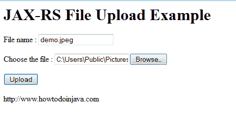

# RESTEasy 文件上传-HTML 表单示例

> 原文： [https://howtodoinjava.com/resteasy/jax-rs-resteasy-file-upload-html-form-example/](https://howtodoinjava.com/resteasy/jax-rs-resteasy-file-upload-html-form-example/)

在上一篇文章中，我们了解了有关在 JAX-RS RESTEasy 应用程序中上传文件的信息，其中使用 HttpClient 库构建了 [**客户端以上传文件**](//howtodoinjava.com/resteasy/jax-rs-resteasy-file-upload-httpclient-example/ "JAX-RS RESTEasy file upload + httpclient example") 。 该客户端是纯 Java 客户端，没有任何 UI 关联。 在这篇文章中，我将构建相同的上传功能，但是这次，我们将有一个与之交互的 UI。

我们将文件上传到服务器的 UI 如下所示。

<figure aria-describedby="caption-attachment-2107" class="wp-caption alignnone" id="attachment_2107" style="width: 468px">

<figcaption class="wp-caption-text" id="caption-attachment-2107">JAX-RS RESTeasy file upload example</figcaption>

</figure>

让我们逐步制作应用程序：

1）使用 Maven 创建一个 Eclipse Web 项目进行依赖项管理

[在此处学习操作方法](//howtodoinjava.com/maven/ "Maven Tutorials")

**2）更新 pom.xml 中的项目依赖项**

```java
<project xmlns="http://maven.apache.org/POM/4.0.0" xmlns:xsi="http://www.w3.org/2001/XMLSchema-instance"
  xsi:schemaLocation="http://maven.apache.org/POM/4.0.0 http://maven.apache.org/maven-v4_0_0.xsd">
  <modelVersion>4.0.0</modelVersion>
  <groupId>com.howtodoinjava</groupId>
  <artifactId>RESTfulDemoApplication</artifactId>
  <packaging>war</packaging>
  <version>1.0-SNAPSHOT</version>
  <name>RESTfulDemoApplication Maven Webapp</name>
  <url>http://maven.apache.org</url>
  <repositories>
   	<repository>
      <id>jboss</id>
      <url>http://repository.jboss.org/maven2</url>
   	</repository>
  </repositories>
  <dependencies>
  	<!-- Junit support -->
    <dependency>
      <groupId>junit</groupId>
      <artifactId>junit</artifactId>
      <version>3.8.1</version>
      <scope>test</scope>
    </dependency>
    <!-- core library -->
	<dependency>
		<groupId>org.jboss.resteasy</groupId>
		 <artifactId>resteasy-jaxrs</artifactId>
		<version>2.3.1.GA</version>
	</dependency>
	<dependency>
		<groupId>net.sf.scannotation</groupId>
		<artifactId>scannotation</artifactId>
		<version>1.0.2</version>
	</dependency>
	<!-- JAXB provider -->
   <dependency>
		<groupId>org.jboss.resteasy</groupId>
		<artifactId>resteasy-jaxb-provider</artifactId>
		<version>2.3.1.GA</version>
	</dependency>	
	<!-- Multipart support -->
	<dependency>
		<groupId>org.jboss.resteasy</groupId>
		<artifactId>resteasy-multipart-provider</artifactId>
		<version>2.3.1.GA</version>
	</dependency>
	<!-- For better I/O control -->
	<dependency>
		<groupId>commons-io</groupId>
		<artifactId>commons-io</artifactId>
		<version>2.0.1</version>
	</dependency>
  </dependencies>
  <build>
    <finalName>RESTfulDemoApplication</finalName>
  </build>
</project>

```

**3）更新 web.xml 文件以映射有效的 REST API**

```java
<!DOCTYPE web-app PUBLIC
 "-//Sun Microsystems, Inc.//DTD Web Application 2.3//EN"
 "http://java.sun.com/dtd/web-app_2_3.dtd" >

<web-app>
  	<display-name>Archetype Created Web Application</display-name>

  	<!-- Auto scan REST service -->
	<context-param>
		<param-name>resteasy.scan</param-name>
		<param-value>true</param-value>
	</context-param>

	<listener>
      <listener-class>
         org.jboss.resteasy.plugins.server.servlet.ResteasyBootstrap
      </listener-class>
   </listener>

	<servlet>
		<servlet-name>resteasy-servlet</servlet-name>
		<servlet-class>
			org.jboss.resteasy.plugins.server.servlet.HttpServletDispatcher
		</servlet-class>
	</servlet>

	<servlet-mapping>
		<servlet-name>resteasy-servlet</servlet-name>
		<url-pattern>/rest-ws/*</url-pattern>
	</servlet-mapping>

</web-app>

```

**4）使用所需的用户界面**更新 index.jsp 文件

```java
<html>
	<body>
		<h1>JAX-RS File Upload Example</h1>
		<form action="rest-ws/upload-file" method="post" enctype="multipart/form-data">
			<p>
				File name : <input type="text" name="fileName" />
			</p>
			<p>
				Choose the file : <input type="file" name="selectedFile" />
			</p>
			<input type="submit" value="Upload" />
		</form>
		https://www.howtodoinjava.com
	</body>
</html>

```

**5）创建具有映射到 HTML 表单**的字段的 FileUploadForm

```java
package com.howtodoinjava.client.upload;

import javax.ws.rs.FormParam;
import org.jboss.resteasy.annotations.providers.multipart.PartType;

public class FileUploadForm {

	public FileUploadForm() {
	}

	private byte[] fileData;
	private String fileName;

	public String getFileName() {
		return fileName;
	}

	@FormParam("fileName")
	public void setFileName(String fileName) {
		this.fileName = fileName;
	}

	public byte[] getFileData() {
		return fileData;
	}

	@FormParam("selectedFile")
	@PartType("application/octet-stream")
	public void setFileData(byte[] fileData) {
		this.fileData = fileData;
	}
}

```

**6）创建具有处理上传文件逻辑的 RESTful API**

```java
package com.howtodoinjava.client.upload;

import java.io.File;
import java.io.FileOutputStream;
import java.io.IOException;

import javax.ws.rs.Consumes;
import javax.ws.rs.POST;
import javax.ws.rs.Path;
import javax.ws.rs.core.Response;

import org.jboss.resteasy.annotations.providers.multipart.MultipartForm;

@Path("/rest-ws")
public class DemoFileSaver_MultipartForm 
{
	@POST
	@Path("/upload-file")
	@Consumes("multipart/form-data")
	public Response uploadFile(@MultipartForm FileUploadForm form) {

		String fileName = form.getFileName() == null ? "Unknown" : form.getFileName() ;

		String completeFilePath = "c:/temp/" + fileName;
		try 
		{
			//Save the file
			File file = new File(completeFilePath);

			if (!file.exists()) 
			{
				file.createNewFile();
			}

			FileOutputStream fos = new FileOutputStream(file);

			fos.write(form.getFileData());
			fos.flush();
			fos.close();
		} 
		catch (IOException e)
		{
			e.printStackTrace();
		}
		//Build a response to return
		return Response.status(200)
		    .entity("uploadFile is called, Uploaded file name : " + fileName).build();
	}
}	

```

**7）测试应用程序**

```java
**Sourcecode download**
```

**祝您学习愉快！**