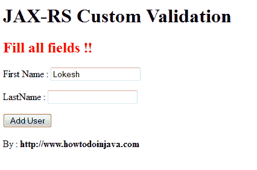

# 使用 Ajax 的 JAX-RS 自定义验证示例

> 原文： [https://howtodoinjava.com/resteasy/jax-rs-custom-validation-example-using-ajax/](https://howtodoinjava.com/resteasy/jax-rs-custom-validation-example-using-ajax/)

在此示例中，我将显示 **[ValidatorAdapter](http://docs.jboss.org/resteasy/docs/2.3.1.GA/javadocs/org/jboss/resteasy/spi/validation/ValidatorAdapter.html "ValidatorAdapter")** 与 **[@ValidateRequest](http://docs.jboss.org/resteasy/docs/2.3.0.GA/javadocs/org/jboss/resteasy/spi/validation/ValidateRequest.html "ValidateRequest")** 批注的结合使用。 为了从 UI 发送请求，我将使用 ajax。 您可以在项目中使用表单提交。 在这种情况下，您将需要@FormParam 批注来捕获请求参数。

在下面的功能截图中，我们将在本教程中实现。



JAX-RS + Ajax Validation example


让我们逐步构建此示例教程。

**步骤 1）使用 Maven 创建一个 Eclipse Web 项目**

```java
C:LokeshSetupworkspaceRESTfulValidation>mvn archetype:generate -DgroupId=com.howtodoinjava 
-DartifactId=RESTfulValidation -DarchetypeArtifactId=maven-archetype-webapp -DinteractiveMode=false

mvn eclipse:eclipse -Dwtpversion=2.0
```

**步骤 2）更新 pom.xml 文件**中的运行时依赖项

```java
<!-- core library -->
<dependency>
	<groupId>org.jboss.resteasy</groupId>
	 <artifactId>resteasy-jaxrs</artifactId>
	<version>2.3.1.GA</version>
</dependency>
<dependency>
	<groupId>net.sf.scannotation</groupId>
	<artifactId>scannotation</artifactId>
	<version>1.0.2</version>
</dependency>
<!-- JAXB provider -->
<dependency>
	<groupId>org.jboss.resteasy</groupId>
	<artifactId>resteasy-jaxb-provider</artifactId>
	<version>2.3.1.GA</version>
</dependency>

```

**步骤 3）使用路径映射信息**更新 web.xml。

```java
<!DOCTYPE web-app PUBLIC
 "-//Sun Microsystems, Inc.//DTD Web Application 2.3//EN"
 "http://java.sun.com/dtd/web-app_2_3.dtd" >

<web-app>
  <display-name>Archetype Created Web Application</display-name>
  <!-- Auto scan REST service -->
	<context-param>
		<param-name>resteasy.scan</param-name>
		<param-value>true</param-value>
	</context-param>

	<listener>
      <listener-class>
         org.jboss.resteasy.plugins.server.servlet.ResteasyBootstrap
      </listener-class>
   </listener>

	<servlet>
		<servlet-name>resteasy-servlet</servlet-name>
		<servlet-class>
			org.jboss.resteasy.plugins.server.servlet.HttpServletDispatcher
		</servlet-class>
	</servlet>

	<servlet-mapping>
		<servlet-name>resteasy-servlet</servlet-name>
		<url-pattern>/rest/*</url-pattern>
	</servlet-mapping>
</web-app>

```

**步骤 4）创建将在其上执行验证的 RESTful API**

该 API 在以下级别可以具有@ValidateRequest 批注：

*   **方法级别**：它将启用对该特定方法的验证。
*   **类级别**：它将在该类内的所有方法上启用验证。

我在课堂上使用此注释。

```java
package com.howtodoinjava.rest;

import javax.ws.rs.POST;
import javax.ws.rs.Path;
import javax.ws.rs.QueryParam;
import javax.ws.rs.core.Response;

import org.jboss.resteasy.spi.validation.ValidateRequest;

@Path("/rest")
@ValidateRequest
public class UserService {

	@Path("/users")
	@POST
	public Response addUser(@QueryParam("firstName") String firstName, @QueryParam("lastName") String lastName)
	{
		System.out.println("User added !!");
		return Response.ok().build();
	}
}

```

**注意：**如果已在类级别使用@ValidateRequest 批注，并且想要禁用某些 API 的验证，则可以使用@DoNotValidateRequest 批注。

**步骤 5）创建您的自定义验证器，该实现器将实现 ValidatorAdapter 类**

ValidatorAdapter 的实现在应用程序启动时由 RESTEasy 自动扫描，并在上下文中注册。

```java
package com.howtodoinjava.validator;

import java.lang.reflect.Method;

import org.jboss.resteasy.spi.BadRequestException;
import org.jboss.resteasy.spi.validation.ValidatorAdapter;

public class CommonValidator implements ValidatorAdapter {

	@Override
	public void applyValidation(Object resource, Method invokedMethod, Object[] args) 
	{
		/*ValidateRequest classLevelValidateRequest = FindAnnotation.findAnnotation(invokedMethod.getDeclaringClass()
														.getAnnotations(), ValidateRequest.class);

		ValidateRequest methodLevelValidateRequest = FindAnnotation.findAnnotation(invokedMethod.getAnnotations(), ValidateRequest.class);

		boolean applyValidation = (classLevelValidateRequest != null || methodLevelValidateRequest != null);*/

		if( invokedMethod.getName().equalsIgnoreCase("addUser"))
		{
			if(args == null || args.length != 2)
			{
				throw new BadRequestException("Fill all fields");
			}

			if(((String) args[0]).isEmpty())
			{
				throw new BadRequestException("Fill first name");
			} 
			else if(((String) args[1]).isEmpty())
			{
				throw new BadRequestException("Fill last name");
			}
		}
	}

}

```

**步骤 6）修改 index.jap 文件以与 REST API 交互**

该 jsp 文件将包含带有两个输入框的 HTML 表单。 这些文本框将接受用户的名字和姓氏。 我们正在尝试在此表单上启用 ajax 支持的验证功能。

```java
<html>
<head>
<script lang="javascript">
	var xmlhttp;
	function postRequest(url, cfunc) {
		if (window.XMLHttpRequest) {// code for IE7+, Firefox, Chrome, Opera, Safari
			xmlhttp = new XMLHttpRequest();
		} else {// code for IE6, IE5
			xmlhttp = new ActiveXObject("Microsoft.XMLHTTP");
		}
		xmlhttp.onreadystatechange = cfunc;
		xmlhttp.open("POST", url, true);
		xmlhttp.send();
	}
	function submitForm() {
		postRequest(
				"./rest/users?firstName="+document.getElementById("firstName").value+"&lastName="+document.getElementById("lastName").value,
				function() {
					if (xmlhttp.readyState == 4 && xmlhttp.status != 200) {
						//alert(xmlhttp.responseText);
						document.getElementById("error").innerHTML = "<h2><span style='color:red'>Fill all fields !!</span></h2>";
					}
				});
	}
</script>
</head>
<body>
	<h1>JAX-RS Custom Validation</h1>
	<div id="error"></div>
	<form onclick="submitForm()" method="post">
		<p>
			First Name : <input type="text" name="firstName" id="firstName"/>
		</p>
		<p>
			LastName : <input type="text" name="lastName" id="lastName"/>
		</p>
		<input type="button" value="Add User" />
	</form>
	By :
	<b>https://www.howtodoinjava.com</b>
</body>
</html>

```

**步骤 7）测试应用程序**

尝试提交 Emtry 或半填表时，您会收到验证错误，如帖子开头的屏幕截图所示。 另外，在服务器日志中，您可以验证错误记录为：

```java
SEVERE: Failed executing POST /rest/users
org.jboss.resteasy.spi.BadRequestException: Fill first name
	at com.howtodoinjava.validator.CommonValidator.applyValidation(CommonValidator.java:30)
	at org.jboss.resteasy.core.MethodInjectorImpl.invoke(MethodInjectorImpl.java:150)
	at org.jboss.resteasy.core.ResourceMethod.invokeOnTarget(ResourceMethod.java:257)
	at org.jboss.resteasy.core.ResourceMethod.invoke(ResourceMethod.java:222)
	at org.jboss.resteasy.core.ResourceMethod.invoke(ResourceMethod.java:211)
	at org.jboss.resteasy.core.SynchronousDispatcher.getResponse(SynchronousDispatcher.java:525)
	at org.jboss.resteasy.core.SynchronousDispatcher.invoke(SynchronousDispatcher.java:502)
	at org.jboss.resteasy.core.SynchronousDispatcher.invoke(SynchronousDispatcher.java:119)
	at org.jboss.resteasy.plugins.server.servlet.ServletContainerDispatcher.service(ServletContainerDispatcher.java:208)
	at org.jboss.resteasy.plugins.server.servlet.HttpServletDispatcher.service(HttpServletDispatcher.java:55)
	at org.jboss.resteasy.plugins.server.servlet.HttpServletDispatcher.service(HttpServletDispatcher.java:50)
	at javax.servlet.http.HttpServlet.service(HttpServlet.java:728)
	at org.apache.catalina.core.ApplicationFilterChain.internalDoFilter(ApplicationFilterChain.java:305)
	at org.apache.catalina.core.ApplicationFilterChain.doFilter(ApplicationFilterChain.java:210)
	at org.apache.catalina.core.StandardWrapperValve.invoke(StandardWrapperValve.java:222)
	at org.apache.catalina.core.StandardContextValve.invoke(StandardContextValve.java:123)
	at org.apache.catalina.authenticator.AuthenticatorBase.invoke(AuthenticatorBase.java:472)
	at org.apache.catalina.core.StandardHostValve.invoke(StandardHostValve.java:171)
	at org.apache.catalina.valves.ErrorReportValve.invoke(ErrorReportValve.java:99)
	at org.apache.catalina.valves.AccessLogValve.invoke(AccessLogValve.java:936)
	at org.apache.catalina.core.StandardEngineValve.invoke(StandardEngineValve.java:118)
	at org.apache.catalina.connector.CoyoteAdapter.service(CoyoteAdapter.java:407)
	at org.apache.coyote.http11.AbstractHttp11Processor.process(AbstractHttp11Processor.java:1004)
	at org.apache.coyote.AbstractProtocol$AbstractConnectionHandler.process(AbstractProtocol.java:589)
	at org.apache.tomcat.util.net.JIoEndpoint$SocketProcessor.run(JIoEndpoint.java:312)
	at java.util.concurrent.ThreadPoolExecutor.runWorker(Unknown Source)
	at java.util.concurrent.ThreadPoolExecutor$Worker.run(Unknown Source)
	at java.lang.Thread.run(Unknown Source)

```

```java
**源码下载**
```

**学习愉快！**