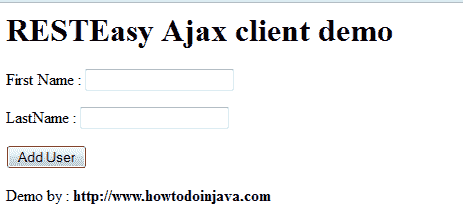
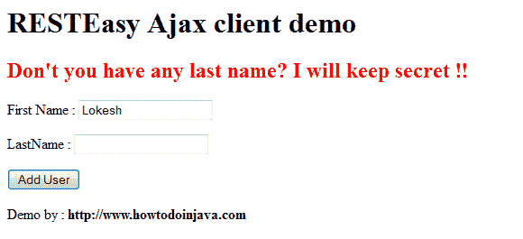
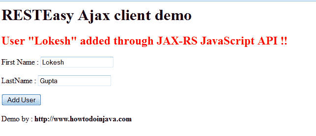

# RESTEasy Javascript / Ajax 客户端演示

> 原文： [https://howtodoinjava.com/resteasy/resteasy-javascriptajax-client-demo/](https://howtodoinjava.com/resteasy/resteasy-javascriptajax-client-demo/)

[**RESTEasy**](//howtodoinjava.com/restful-web-service/ "Resteasy tutorials") 如果正在开发 Web 应用程序，则为构建 Ajax 驱动的客户端提供了非常出色的支持。 RESTEasy 可以生成一个 JavaScript API，该 API 使用 AJAX 调用来调用 JAX-RS 操作。 生成用于访问 REST API 的 JavaScript 代码与 Java 代码非常相似，您会感觉自己正在用 Java 语言调用 REST API。

这种方法的优点（或缺点？）是您的类名和方法名可以通过 javascript 代码直接访问。 即使您不需要编写自动嵌入在您的网页中的 Ajax 处理代码。

```java
Note: Using class and method names in JS code might become a very serious security loop hole. So please use it wisely.
```

在本教程中，我构建了一个普通的 HTML 表单，该表单是用于将用户添加到系统中的用户。 我将使用 RESTEasy Ajax 客户端来访问 REST API，以添加用户并获取响应。

## **步骤 1）添加对 RESTEasy JSAPI 的运行时支持**

```java
<dependency>
	<groupId>org.jboss.resteasy</groupId>
	<artifactId>resteasy-jsapi</artifactId>
	<version>2.3.1.GA</version>
</dependency>

```

如果不使用 maven 构建工具，则可以将 jar 文件添加到 lib 文件夹中。

## **步骤 2）添加 JSAPI Servlet 映射**

在 web.xml 文件中的 Servlet 声明下方添加。 必须将 JavaScript API Servlet 配置为启用 JavaScript API。

```java
<servlet>
	<servlet-name>RESTEasy-JSAPI</servlet-name>
	<servlet-class>org.jboss.resteasy.jsapi.JSAPIServlet</servlet-class>
</servlet>

<servlet-mapping>
	<servlet-name>RESTEasy-JSAPI</servlet-name>
	<url-pattern>/js/*</url-pattern>
</servlet-mapping>

```

## **第 3 步）编写需要从 javascript / ajax 中调用的 REST API**

我正在编写一个最小的 REST API，以使示例不复杂。

```java
@Path("/rest")
public class UserService 
{
	@Path("/users")
	@POST
	public Response addUser(@QueryParam("firstName") String firstName, @QueryParam("lastName") String lastName)
	{
		//vaildate first name
		if(firstName == null || firstName.isEmpty())
		{
			return Response.ok().entity("First name is mandatory dude").build();
		}
		//vaildate last name
		if(lastName == null || lastName.isEmpty())
		{
			return Response.ok().entity("Don't you have any last name? I will keep secret").build();
		}
		//Add user and return the response
		return Response.ok().entity("User "" + firstName + "" added through JAX-RS JavaScript API").build();
	}
}

```

## **步骤 4）在视图层**上构建 Ajax 客户端

我正在使用默认的 index.jsp 文件编写客户端代码。

**示例 1：**

```java
<html>
	<head>
		<!-- This will include the whole javascript file including ajax handling  -->
		<script lang="javascript" src="./js"></script>

		<!-- Write the javascript code for accessing REST APIs -->
		<script lang="javascript">
			function addUserForm()
			{
				//Collect input from html page
				var firstNameTxt = document.getElementById("firstName").value;
				var lastNameTxt = document.getElementById("lastName").value;

				//Call the REST APIs with directly method names
				var message = UserService.addUser({firstName:firstNameTxt,lastName:lastNameTxt});

				//Use the REST API response
				document.getElementById("error").innerHTML = "<h2><span style='color:red'>" + message + " !!</span></h2>";
			}
		</script>
	</head>
	<body>
		<h1>RESTEasy Ajax client demo</h1>
		<div id="error"></div>
		<form method="post">
			<p>First Name : <input type="text" name="firstName" id="firstName"/></p>
			<p>LastName : <input type="text" name="lastName" id="lastName"/></p>
			<input type="button" value="Add User" onclick="addUserForm()" />
		</form>
		Demo by : <b>https://www.howtodoinjava.com</b>
	</body>
</html>

```

**示例 2：**

如果发现使用类名和方法名是不可管理的，因为它们可能在另一天得到更改。 不用担心，REST 隐式对象正在为您解救。 演示 REST 调用如下：

```java
//Example Two using REST object
function addUserForm()
{
	//Collect input from html page
	var firstNameTxt = document.getElementById("firstName").value;
	var lastNameTxt = document.getElementById("lastName").value;

	var req = new REST.Request();
	req.setURI(REST.apiURL + "/rest/users");
	req.setMethod("POST");
	req.setEntity({firstName:firstNameTxt,lastName:lastNameTxt});
	req.execute(function(status, request, entity){
		document.getElementById("error").innerHTML = "<h2><span style='color:red'>" + entity + " !!</span></h2>";
	});
} 

```

## **测试应用程序**

要测试该应用程序，请将其部署在任何 Web 服务器中。

1）输入网址 **http：// localhost：8080 / RESTfulValidation /**



Demo welcome screen


2）仅填写名字，然后按添加按钮



Validation error for last name field


3）填写两个字段，然后按添加按钮



User added successfully


要下载上面演示的源代码，请遵循以下给定的下载链接。

```java
**Sourcecode Download**
```

**祝您学习愉快！**