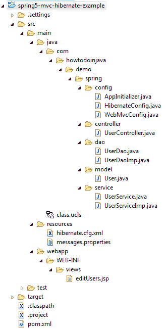
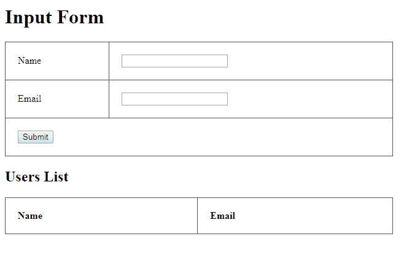
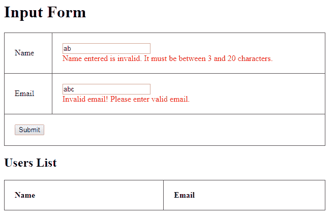
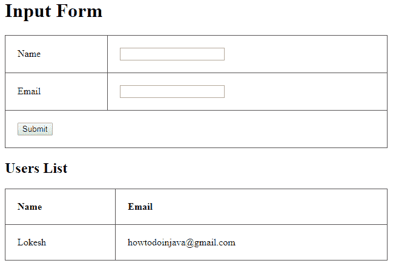

# Spring 5 MVC + Hibernate 5 示例

> 原文： [https://howtodoinjava.com/spring5/webmvc/spring5-mvc-hibernate5-example/](https://howtodoinjava.com/spring5/webmvc/spring5-mvc-hibernate5-example/)

在本 **spring 5 Hibernate 5 注解示例**教程中，学习**创建 Spring 5 MVC Web 应用程序**，**处理表单提交**，**集成 Hibernate 5** 连接到后端数据库并为输入表单[字段验证](https://howtodoinjava.com/resteasy/resteasy-bean-validation-using-hibernate-validator-provider/)添加**Hibernate 验证器**。

我们将创建一个简单的屏幕，可以在其中添加用户字段（名称和电子邮件）。 这些详细信息将首先通过 Hibernate 进行验证，然后存储在 [HSQL 数据库中](https://howtodoinjava.com/hibernate/hibernate-4-using-in-memory-database-with-hibernate/)。 该页面还将列出所有已存储的用户。

## 1\. 开发环境

*   Eclipse Neon 2
*   JDK 1.8
*   Spring 5.2.0.发布
*   Hibernate 5.2.11.Final
*   Hibernate 验证器 5.4.1.Final
*   Servlet 3.1.0
*   HSQLDB 1.8.0.10
*   Tomcat 7 Maven 插件 2.2

## 2\. 项目结构

该项目具有典型的 [Maven Web 应用程序](https://howtodoinjava.com/maven/how-to-create-a-eclipse-web-application-using-maven/)结构。

Spring5 WebMVC 项目结构

#### 2.1. 类图

类图

## 3\. Maven 依赖

在`pom.xml`文件中找到用于运行此示例的项目依赖项。

`pom.xml`

[PRE0]

## 4\. `DispatcherServlet`配置

随着 [Servlet 3.0 规范](https://download.oracle.com/otndocs/jcp/servlet-3.0-fr-oth-JSpec/)的发布，可以（几乎）没有 xml 配置 Servlet 容器。 为此，Servlet 规范中有[`ServletContainerInitializer`](https://docs.oracle.com/javaee/7/api/javax/servlet/ServletContainerInitializer.html)。 在该类中，您可以注册过滤器，监听器，servlet 等，就像您在`web.xml`中传统上所做的那样。

Spring 提供了[`SpringServletContainerInitializer`](https://docs.spring.io/spring/docs/current/javadoc-api/org/springframework/web/SpringServletContainerInitializer.html)，它知道如何处理`WebApplicationInitializer`类。 `AbstractAnnotationConfigDispatcherServletInitializer`类实现了`WebMvcConfigurer`，而该内部实现了`WebApplicationInitializer`。 它注册了`ContextLoaderlistener`（可选）和`DispatcherServlet`，并允许您轻松添加配置类以加载这两个类，并将过滤器应用于`DispatcherServlet`并提供 Servlet 映射。

`AppInitializer.java`

[PRE1]

## 5\. Spring WebMVC 配置

下面给出了使用**注解配置**的 Spring MVC 配置。

`WebMvcConfig.java`

[PRE2]

1.  [`WebMvcConfigurer`](https://docs.spring.io/spring-framework/docs/current/javadoc-api/org/springframework/web/servlet/config/annotation/WebMvcConfigurer.html)定义用于自定义或添加到通过使用`@EnableWebMvc`启用的默认 Spring MVC 配置的选项。
2.  `@EnableWebMvc`启用默认的 Spring MVC 配置，并注册`DispatcherServlet`期望的 Spring MVC 基础结构组件。
3.  `@Configuration`指示一个类声明一个或多个`@Bean`方法，并且可以由 Spring 容器进行处理以在运行时为这些 bean 生成 bean 定义和服务请求。
4.  `@ComponentScan`注解用于指定要扫描的基本软件包。 任何用`@Component`和`@Configuration`注解的类都将被扫描。
5.  `InternalResourceViewResolver`有助于将逻辑视图名称映射为直接查看特定预配置目录下的文件。
6.  `ResourceBundleMessageSource`使用指定的基本名称（这里是消息）访问资源束。
7.  `LocalValidatorFactoryBean`运行`javax.validation.ValidationFactory`，并通过 Spring `Validator`接口以及 JSR-303 `Validator`接口和`ValidatorFactory`接口本身公开它。

## 6\. Hibernate 配置

该示例中使用的 Hibernate 配置是**基于 Hibernate Java 的配置**。

`HibernateConfig.java`

[PRE3]

*   `LocalSessionFactoryBean`创建一个 Hibernate`SessionFactory`。 这是在 Spring 应用程序上下文中设置共享的 Hibernate `SessionFactory`的常用方法。
*   `EnableTransactionManagement`启用 Spring 的注解驱动的事务管理功能。
*   `HibernateTransactionManager`将来自指定工厂的 Hibernate 会话绑定到线程，可能每个工厂允许一个线程绑定的`Session`。 该事务管理器适用于使用单个 Hibernate `SessionFactory`进行事务数据访问的应用程序，但它也支持事务内的直接`DataSource`访问，即纯 JDBC。

`hibernate.cfg.xml`

[PRE4]

## 7\. Spring 控制器和 REST 映射

控制器类具有用于`GET`和`POST`操作的两个简单的 [REST 映射](https://howtodoinjava.com/spring5/webmvc/controller-getmapping-postmapping/)。 如果输入字段未经验证，则返回相同的表单 bean 以显示错误消息。 否则返回刷新的视图。

`UserController.java`

[PRE5]

## 8\. 服务和 DAO 层

服务和 DAO 层是用`@Service`和`@Repository`注解注解的常规服务组件。 `@Transactional`注解在服务层应用，以支持事务。

> 阅读更多：[`@Service`和`@Repository`注解](https://howtodoinjava.com/spring/spring-core/how-to-use-spring-component-repository-service-and-controller-annotations/)

`UserService Interface amd Impl`

[PRE6]

`UserDao Interface and Impl`

[PRE7]

`User.java`

[PRE8]

## 9\. 视图和消息资源

最后，使用了 JSP 文件，并使用了[消息资源包](https://howtodoinjava.com/spring-core/resolving-text-messages-in-spring-resourcebundlemessagesource-example/)。

`editUsers.jsp`

[PRE9]

`messages.properties`

[PRE10]

## 10\. 演示

让我们使用 [**maven tomcat7 插件**](https://howtodoinjava.com/maven/tomcat-maven-plugin-example/) 运行应用程序。 执行 Maven 目标：`tomcat7:run`。

网址：`http://localhost:8080`

初始界面

无效输入的验证

有效表单的提交

检查服务器日志。

`Console`

[PRE11]

我希望您能找到这个 **Spring Hibernate Web 应用程序示例**，以开始开发自己的应用程序。 这主要是针对初学者的，但是它将帮助您构建带有注解的任何带有 Hibernate 集成示例的 **Spring MVC**。

学习愉快！

[下载源码](https://github.com/lokeshgupta1981/spring-webmvc)