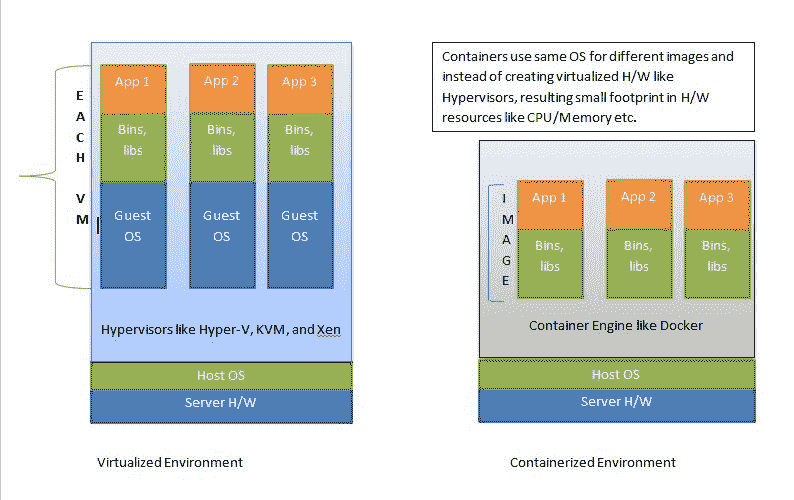
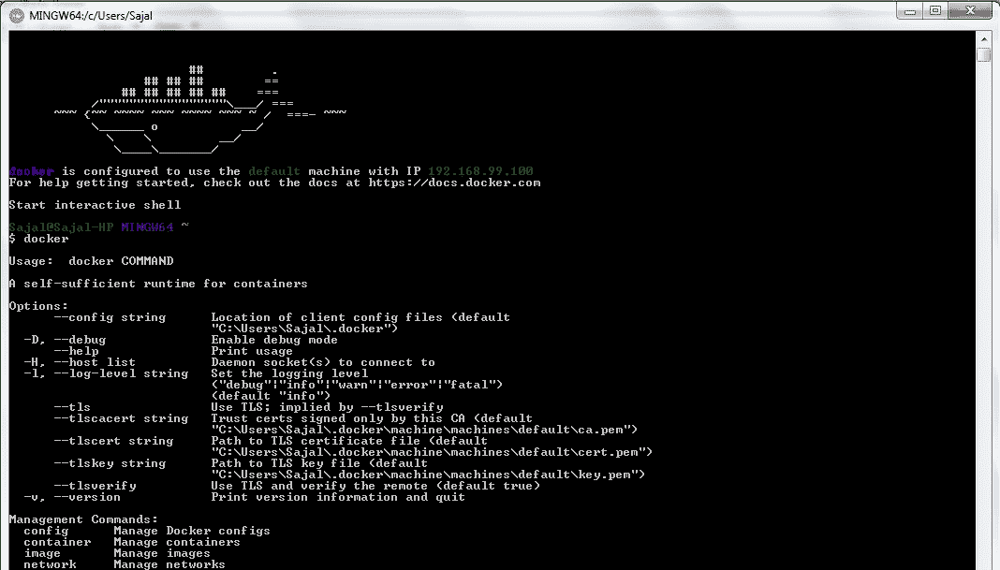
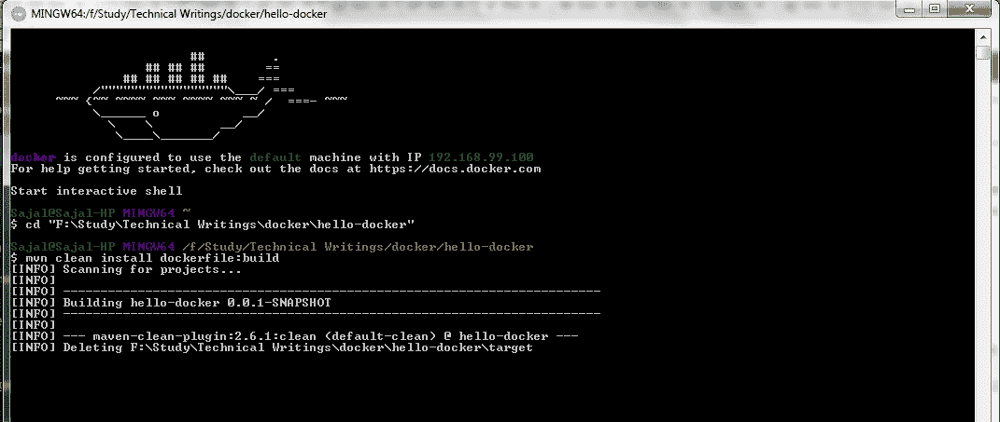

# Docker 的 Hello World 示例

> 原文： [https://howtodoinjava.com/library/docker-hello-world-example/](https://howtodoinjava.com/library/docker-hello-world-example/)

[Docker](https://www.docker.com/) 是用于将应用程序及其运行时环境打包在一起的开发人员工具，因此任何人都可以在任何其他计算机上部署和运行它们，而不会遇到运行时环境冲突。 它与虚拟机概念（[虚拟化](https://en.wikipedia.org/wiki/Virtualization)）非常相似，在虚拟机概念中，您可以获取 VM 映像并在任何支持的硬件上运行它。 VM 中的所有内部程序将按其原始打包的方式运行。

**VM 和 docker 映像之间的区别**是 docker 映像不打包整个虚拟操作系统。 就像开发人员计算机中的其他进程一样，它使用 OS 资源，仅打包应用程序，并且打包其特定于运行时的依赖项（[容器化](http://www.theserverside.com/discussions/thread/80994.html)）。



虚拟化 vs 容器化

Docker 允许用户发布 docker 映像并使用其他人在 [Docker Hub](https://hub.docker.com/) 等存储库中发布的映像。

在本教程中，学习在 Windows 中在 **Windows** 中安装 Docker 容器，**创建 Docker 映像**和**部署 Docker 映像**（作为一个简单的基于 spring boot 的微服务）。 开发人员机器。

## Docker 安装

要在 Windows 7 计算机上安装 docker，请按照以下步骤操作：

#### 为您的系统选择合适的 Docker 安装程序

在开始安装过程之前，我们需要了解适合您所使用 Windows 的确切 Docker 版本。 Docker 提供了以下两个版本的 Windows 发行版

*   对于 Windows 10，我们需要点击此链接 [https://docs.docker.com/docker-for-windows/](https://docs.docker.com/docker-for-windows/)
*   对于 Windows 7、8 和更早版本，我们需要使用 Docker 工具箱，这是官方链接：[https://docs.docker.com/toolbox/overview/](https://docs.docker.com/toolbox/overview/)

我们将按照本文的 Docker 工具箱安装步骤进行操作。

#### 下载 Docker 安装程序

我们首先需要从 [https://download.docker.com/win/stable/DockerToolbox.exe](https://download.docker.com/win/stable/DockerToolbox.exe) 下载 Docker 工具箱发行版，然后按照本地工作站中的安装步骤进行操作。

#### 启用硬件虚拟化技术

为了使 Docker 工具箱正常工作，我们需要确保您的 Windows 系统支持硬件虚拟化技术并且已启用虚拟化。 Docker 在此处提供了详细的步骤： [https://docs.docker.com/toolbox/toolbox_install_windows/#step-1-check-your-version](https://docs.docker.com/toolbox/toolbox_install_windows/#step-1-check-your-version)。 如果未启用此功能，则需要转到 BIOS 选项并启用“硬件虚拟化”。 对于不同型号的计算机，BIOS 有所不同，因此请按照官方指南启用它。

#### 运行 Docker 安装程序

一旦下载了安装程序并启用了硬件虚拟化，就可以启动安装程序。 就像安装向导指导下的另一个基于 Windows 的简单安装过程一样。

#### 验证您的安装

要[验证 docker 安装](https://docs.docker.com/toolbox/toolbox_install_windows/#step-3-verify-your-installation)，请从“桌面”或“开始”菜单中打开 Docker Quickstart Terminal 快捷方式。 验证 Docker 提示即将到来，然后需要测试一些基本命令。 Docker 提示和示例 docker 命令将如下所示。



Docker 安装验证

#### 记下 Docker IP

现在，我们需要记下分配给该容器的 Docker IP。 我们将访问此 IP，以访问 Docker 内部安装的应用程序。 要从命令提示符处了解 IP，请使用命令`docker-machine ip`。 这是命令的示例输出。 请注意，此 IP 对于不同的 M / C 将有所不同。


docker 机器 IP 输出

## 创建 Docker Windows 映像

我们将首先创建基于 Spring Boot 的 REST API，添加特定于 docker 的配置，然后创建 docker 映像。

#### 创建 Spring REST 项目

开发一个简单的 hello world [微服务](//howtodoinjava.com/microservices/microservices-definition-principles-benefits/)进行测试。 我们使用 [Spring Boot](//howtodoinjava.com/spring/spring-boot/spring-boot-jersey-example/) 和 [Maven](//howtodoinjava.com/maven/) 和 Eclipse 作为 IDE。 添加 [REST](http://restfulapi.net) 端点，以便将该应用程序部署到 Docker 之后，我们可以通过访问其余端点来对其进行测试。

```java
package com.example.howtodoinjava.hellodocker;

import java.util.Date;
import org.springframework.boot.SpringApplication;
import org.springframework.boot.autoconfigure.SpringBootApplication;
import org.springframework.web.bind.annotation.PathVariable;
import org.springframework.web.bind.annotation.RequestMapping;
import org.springframework.web.bind.annotation.RestController;

@SpringBootApplication
public class HelloDockerApplication {

	public static void main(String[] args) {
		SpringApplication.run(HelloDockerApplication.class, args);
	}
}

@RestController
class HelloDockerRestController {
	@RequestMapping("/hello/{name}")
	public String helloDocker(@PathVariable(value = "name") String name) {
		String response = "Hello " + name + " Response received on : " + new Date();
		System.out.println(response);
		return response;

	}
}

```

使用服务器端口信息更新`resources/application.properties`。

```java
server.port = 9080

```

现在，通过将项目作为 Spring Boot 应用程序运行来测试此微服务。

#### 添加 Docker 配置

现在在根目录中创建一个名为`Dockerfile`的文件，并将以下几行添加为 Docker 配置。

```java
FROM openjdk:8-jdk-alpine
VOLUME /tmp
ADD target/hello-docker-0.0.1-SNAPSHOT.jar hello-docker-app.jar
ENV JAVA_OPTS=""
ENTRYPOINT [ "sh", "-c", "java $JAVA_OPTS -Djava.security.egd=file:/dev/./urandom -jar /hello-docker-app.jar" ]

```

Docker 在创建映像时使用它。 基本上是在声明 Java 运行时信息和目标分发。 有关更多详细信息，请遵循[ docker 构建器参考](https://docs.docker.com/engine/reference/builder/)。

#### 添加 Maven Docker 插件

在`pom.xml`文件中添加两个 maven 插件，以便我们在创建实例时可以使用与 Docker 相关的 maven 命令。 这些插件是`dockerfile-maven-plugin`和`maven-dependency-plugin`。

我们使用了构建项目所需的最少配置。

```java
<plugin>
	<groupId>com.spotify</groupId>
	<artifactId>dockerfile-maven-plugin</artifactId>
	<version>1.3.4</version>
	<configuration>
		<repository>${docker.image.prefix}/${project.artifactId}</repository>
	</configuration>
</plugin>
<plugin>
	<groupId>org.apache.maven.plugins</groupId>
	<artifactId>maven-dependency-plugin</artifactId>
	<executions>
		<execution>
			<id>unpack</id>
			<phase>package</phase>
			<goals>
				<goal>unpack</goal>
			</goals>
			<configuration>
				<artifactItems>
					<artifactItem>
						<groupId>${project.groupId}</groupId>
						<artifactId>${project.artifactId}</artifactId>
						<version>${project.version}</version>
					</artifactItem>
				</artifactItems>
			</configuration>
		</execution>
	</executions>
</plugin>

```

#### 创建 Docker 映像

现在使用 maven 命令`mvn clean install dockerfile:build`创建 docker 镜像。



从 Docker 终端构建 Docker 映像

请确保在构建映像时本地应用程序未运行，在这种情况下，您可能会遇到 maven 构建失败的情况，因为在干净的步骤中，由于 Java 进程正在使用 jar，因此它将无法删除目标文件夹。

这是 Maven 输出日志在其中构建映像的最后几行。

```java
[INFO] Image will be built as hello-howtodoinjava/hello-docker:latest
[INFO]
[INFO] Step 1/5 : FROM openjdk:8-jdk-alpine
[INFO] Pulling from library/openjdk
[INFO] Digest: sha256:2b1f15e04904dd44a2667a07e34c628ac4b239f92f413b587538f801a0a57c88
[INFO] Status: Image is up to date for openjdk:8-jdk-alpine
[INFO]  ---> 478bf389b75b
[INFO] Step 2/5 : VOLUME /tmp
[INFO]  ---> Using cache
[INFO]  ---> f4f6473b3c25
[INFO] Step 3/5 : ADD target/hello-docker-0.0.1-SNAPSHOT.jar hello-docker-app.jar
[INFO]  ---> ce7491518508
[INFO] Removing intermediate container c74867501651
[INFO] Step 4/5 : ENV JAVA_OPTS ""
[INFO]  ---> Running in f7cd27710bf3
[INFO]  ---> 086226135205
[INFO] Removing intermediate container f7cd27710bf3
[INFO] Step 5/5 : ENTRYPOINT sh -c java $JAVA_OPTS -Djava.security.egd=file:/dev/./urandom -jar /hello-docker-app.jar
[INFO]  ---> Running in 9ef14a442715
[INFO]  ---> bf14919a32e2
[INFO] Removing intermediate container 9ef14a442715
[INFO] Successfully built bf14919a32e2
[INFO] Successfully tagged hello-howtodoinjava/hello-docker:latest
[INFO]
[INFO] Detected build of image with id bf14919a32e2
[INFO] Building jar: F:\Study\Technical Writings\docker\hello-docker\target\hello-docker-0.0.1-SNAPSHOT-docker-info.jar
[INFO] Successfully built hello-howtodoinjava/hello-docker:latest
[INFO] ------------------------------------------------------------------------
[INFO] BUILD SUCCESS
[INFO] ------------------------------------------------------------------------

```

## 部署并运行 Docker 映像

因此，我们创建了 Docker 映像（即`hello-docker-0.0.1-SNAPSHOT-docker-info.jar`）。 我们还在本地计算机上运行了一个已安装的 docker 容器。

现在，要在已安装的 Docker 容器中运行 docker 映像，我们将使用以下命令。

```java
docker run -p 8080:9080 -t hello-howtodoinjava/hello-docker  --name hello-docker-image
```

在这里，选项`-p 8080:9080`很重要。 它表示将端口`8080`暴露为内部端口`9080`。 请记住，我们的应用程序正在 Docker 映像内的端口`9080`中运行，我们将从 Docker 容器外部的端口`8080`中对其进行访问。

现在，使用 URL `http://192.168.99.100:8080/hello/sajal`访问该应用程序。 请注意，浏览器输出与`localhost`上独立 REST API 的输出相同。


Docker Localhost 输出

#### 停止 Docker 容器

我们可以在终端中通过命令`docker ps`列出所有 docker 容器，并且可以使用命令`docker stop <name>`


停止 Docker 容器

## 总结

我们学会了在 Windows OS 中安装 Docker。 我们还学习了使用一个 REST 端点创建一个 spring boot 项目并为其构建 Docker 映像。 然后，我们学习了在 docker 容器中运行 docker 镜像，并在 docker 镜像中测试了 REST 端点。

Docker 是一个非常酷的工具，可以解决非常老的开发人员问题，“它可以在我的本地计算机上工作”。 现在，如果您的计算机可以正常运行，那么您当然也可以在其他计算机上运行它。

[下载源码](//howtodoinjava.com/wp-content/uploads/2017/08/hello-docker.zip)

学习愉快！