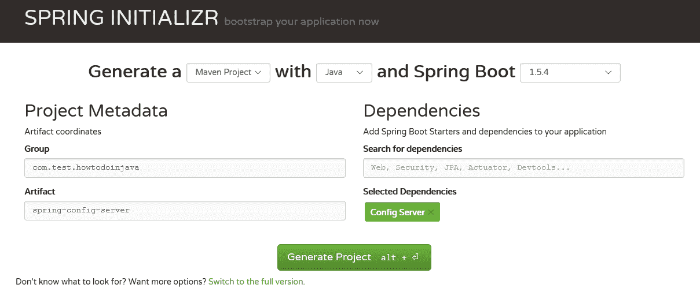
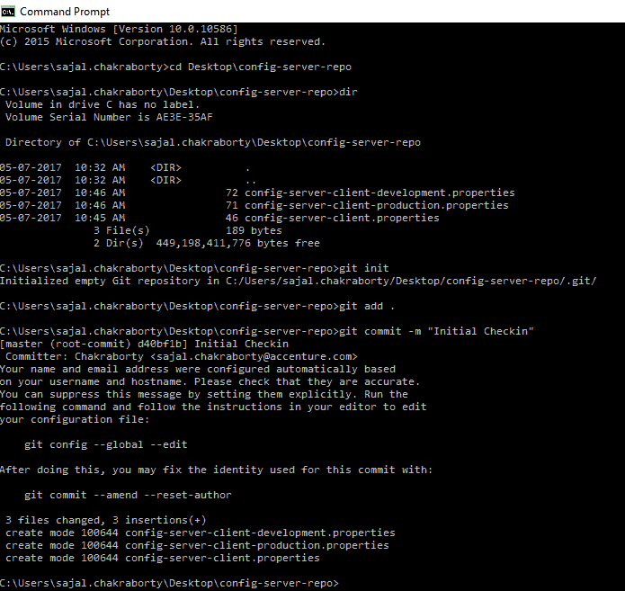
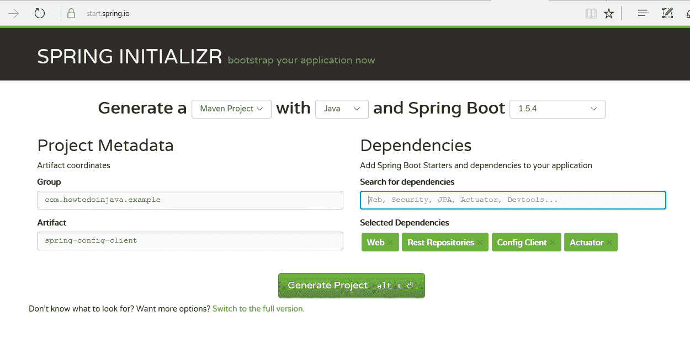
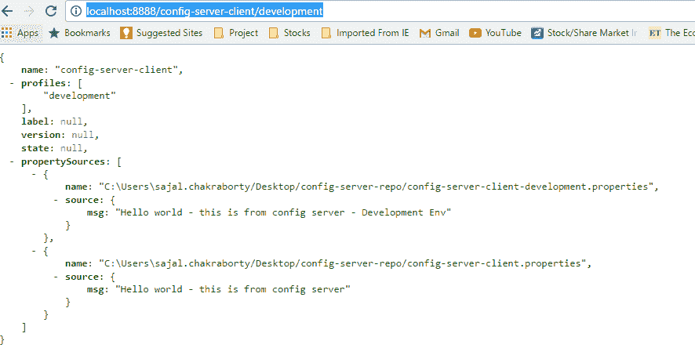

# 集成 Git 的 Spring Cloud Config Server

> 原文： [https://howtodoinjava.com/spring-cloud/spring-cloud-config-server-git/](https://howtodoinjava.com/spring-cloud/spring-cloud-config-server-git/)

现在，微服务方法已成为任何新 API 开发的行业标准，并且几乎所有组织都在推广这种方法。 Spring Cloud 提供了出色的工具，可以在 Spring 启动框架之上构建这些微服务。

在本 **Spring Cloud 配置**教程中，我们将讨论称为**配置服务器**的特定微服务功能。 配置服务器是存储和维护所有微服务的所有可配置参数的位置。

这更像是将属性/资源文件从项目代码库外部完全外部化到外部服务，以便对任何给定属性的任何更改都不需要重新部署使用该属性的服务。 所有此类属性更改都将反映出来，而无需重新部署微服务。

## 1\. 为什么要使用 Spring Cloud Config Server

配置服务器的思想来自 [12 因子应用程序](https://12factor.net/config)宣言，该宣言与开发现代云原生应用程序的最佳实践指南有关。 它建议**将属性或资源文件从服务器**外部化，在服务器中，这些资源或资源的值在运行时会发生变化 – 通常情况下，不同的配置在每种环境中都会有所不同。

例如，假设一个服务依赖于另一服务（针对特定业务场景调用），并且该依赖服务的 URL 是否更改为其他内容。 然后，通常我们需要使用更新的 URL 构建和部署我们的服务。 现在，如果我们采用 12 要素应用程序方法，并且从外部服务读取了这些配置属性，那么我们只需要更新配置服务器中的 URL 并刷新该客户端服务配置即可使用更新的 URL。

因此，该想法是显而易见且有效的。 现在让我们来看如何创建 Spring Cloud 配置服务器。

## 2\. 技术栈

我们将使用基于 spring-boot 的 spring-cloud API，该 API 随时可用且非常受欢迎。 在 Spring 框架命名中，它称为 Config Server。 另外，我们将使用 git 配置来托管属性文件。

因此，最后，此演示的技术栈为：

1.  [Java 1.8](//howtodoinjava.com/java-8-tutorial/)
2.  Eclipse IDE
3.  Spring Cloud
4.  [Spring Boot](https://projects.spring.io/spring-boot/)
5.  Spring Rest
6.  GitHub 作为资源库
7.  [Maven](//howtodoinjava.com/maven/)
8.  REST 客户端

首先，我们将使用 spring boot 开发两个微服务。

1.  一个是**配置服务器服务**，在运行时提供配置
2.  一种是**配置客户端服务**，使用作为配置服务器公开的配置。

## 3\. 服务器配置

首先，按照给定的步骤构建配置服务器部分：

1.  #### 生成项目结构

    从 [spring boot 初始化程序门户](https://start.spring.io)开始，这是创建任何基于 spring boot 的应用程序的一个很好的起点。 在这里，我们将仅选择**配置服务器**启动器 pom。 屏幕截图是这样的。 使用此配置，一旦生成项目，便会下载一个 zip 文件，解压缩后将其导入 eclipse 中。

    

    Generate Server Project with Config Server Starter POM

2.  #### 在 Eclipse 中导入项目

    从 spring 初始化器门户获得 zip 文件后，我们需要将其解压缩到我们选择的目录中，然后将其导入作为 Eclipse 作为 Maven 项目。

    `pom.xml`

    ```java
    <properties>
    	<project.build.sourceEncoding>UTF-8</project.build.sourceEncoding>
    	<project.reporting.outputEncoding>UTF-8</project.reporting.outputEncoding>
    	<java.version>1.8</java.version>
    	<spring-cloud.version>Hoxton.RELEASE</spring-cloud.version>
    </properties>

    <dependencyManagement>
    	<dependencies>
    		<dependency>
    			<groupId>org.springframework.cloud</groupId>
    			<artifactId>spring-cloud-dependencies</artifactId>
    			<version>${spring-cloud.version}</version>
    			<type>pom</type>
    			<scope>import</scope>
    		</dependency>
    	</dependencies>
    </dependencyManagement>

    <dependencies>
    	<dependency>
    		<groupId>org.springframework.cloud</groupId>
    		<artifactId>spring-cloud-config-server</artifactId>
    	</dependency>
    	<dependency>
    		<groupId>org.springframework.boot</groupId>
    		<artifactId>spring-boot-starter-actuator</artifactId>
    	</dependency>
    	<dependency>
    		<groupId>org.springframework.boot</groupId>
    		<artifactId>spring-boot-starter-test</artifactId>
    		<scope>test</scope>
    	</dependency>
    </dependencies>

    ```

3.  #### 建立日食

    下一步将是从命令提示符处或从 eclipse 运行`mvn clean install`，无论您喜欢什么。 在这一步中，所有必需的依赖项将从 Maven 存储库中下载。 确保从没有下载限制的任何网络上尝试该操作。 非常需要成功完成此步骤才能继续进行下一步。

4.  #### 添加@EnableConfigServer 注解

    现在，打开 spring 已经提供的 Spring Application 类，并在类之前添加[`@EnableConfigServer`](https://github.com/spring-cloud/spring-cloud-config/blob/master/spring-cloud-config-server/src/main/java/org/springframework/cloud/config/server/EnableConfigServer.java)注解，然后再次构建项目。 有了此注解，此工件将充当 spring config 服务器。

    添加此注解后，类将如下所示 – 根据您在生成时提供的项目名称，类名称可以不同。 您也可以手动将类名称更改为您喜欢的名称。

    `SpringConfigServerApplication.java`

    ```java
    package com.howtodoinjava.example.springconfigserver;

    import org.springframework.boot.SpringApplication;
    import org.springframework.boot.autoconfigure.SpringBootApplication;
    import org.springframework.cloud.config.server.EnableConfigServer;

    @EnableConfigServer
    @SpringBootApplication
    public class SpringConfigServerApplication 
    {
    	public static void main(String[] args) 
    	{
    		SpringApplication.run(SpringConfigServerApplication.class, args);
    	}
    }

    ```

5.  #### git 存储库中的客户端属性

    下一步是创建本地 git 存储库。 通过稍后在属性文件中配置其 URL，可以轻松地将其转换为远程存储库。 我们将放置外部属性文件[configuration]，配置服务器微服务将使用该文件来提供属性的外部配置。 我们需要按照以下步骤创建本地 git 存储库并签入示例属性文件。

    1.  确保您的计算机中安装了 git shell，并且可以从命令提示符运行 git bash。 要验证它，请打开命令提示符并键入`git`，如果它可以识别该命令，则可能安装了 git 提示符；如果没有，请访问 git 网站，按照说明下载并安装。
    2.  现在，在桌面中创建目录`config-server-repo`。
    3.  然后在 config-server-repo 目录中创建文件`config-server-client.properties`文件，并在其中添加消息`msg = Hello world - this is from config server`。
    4.  然后在 config-server-repo 目录中创建另一个文件`config-server-client-development.properties`文件，并在其中添加消息`msg = Hello world - this is from config server – Development environment.`
    5.  然后在 config-server-repo 目录中创建另一个文件`config-server-client-production.properties`文件，并在其中添加消息`msg = Hello world - this is from config server – Production environment.`
    6.  在这里，我们为不同的环境维护相同的属性名称，因为我们通常为不同的环境（例如 url，凭据，数据库详细信息等）维护属性。这里最重要的一点是，我们需要在每个属性中在环境名称后附加连字符（-） 以便配置服务器可以理解。 另外，我们需要使用将在此之后创建的配置客户端服务名称来命名属性文件。
    7.  现在从`config-server-repo`目录中打开命令提示符，然后运行命令`git init`以将该目录作为 git 存储库。
    8.  现在运行`git add .`将所有内容添加到此仓库中。
    9.  Then finally we need to commit the properties file by running command `git commit – m "initial checkin"`. This should check in all the files in the git repository. Here is the command prompt screen shot for the same.

        

        Property Check-in in Git

        `client-config.properties`

        ```java
        msg = Hello world - this is from config server - default profile

        ```

        `client-config-development.properties`

        ```java
        msg = Hello world - this is from config server - Development Environment

        ```

        `client-config-production.properties`

        ```java
        msg = Hello world - this is from config server - Prodcution Environment

        ```

        `Git commands to execute in properties folder`

        ```java
        $ git init

        $ git add .

        $ git commit -m "initial commit"

        ```

6.  #### 从配置服务器指向 Git 存储库

    在`spring-config-sever`项目的`src\main\resources`目录中创建一个名为`bootstrap.properties`的文件，然后添加以下行。

    `bootstrap.properties`

    ```java
    #Server port
    server.port = 8888

    #Git repo location
    spring.cloud.config.server.git.uri=E:\\devsetup\\gitworkspace\\spring-cloud\\config-git-repo

    #Verify any repository issue in service startup
    spring.cloud.config.server.git.cloneOnStart=true

    #Disable security of the Management endpoint
    management.security.enabled=false

    ```

    现在让我们了解这些属性。

    *   `server.port`定义嵌入式服务器将在其上启动的端口。
    *   `spring.cloud.config.server.git.uri`将绑定 git 位置以查找配置。 在这里，我们使用本地 git repo，但只需更改此位置即可将其切换到远程位置。
    *   `management.security.enabled=false`将在/ env，/ refresh 等管理点上禁用 spring 安全性。这是用于开发设置的，应启用生产安全性。

    因此，此步骤将指向 git 位置和服务器端口。

    以上所有步骤都是我们需要在配置服务器端执行的，现在在此项目上执行最后的`mvn clean install`命令，以便正确编译所有内容并将其打包在目标文件夹以及本地 Maven 存储库中。 准备好客户端部分后，我们将启动配置服务器服务，然后我们将最终测试该功能。

7.  #### 验证配置

    在嵌入式模式下运行服务的命令是`java -jar target\spring-config-server-0.0.1-SNAPSHOT.jar`，但是我们将在测试部分中重新访问它。

    要检查配置服务器是否可以识别属性，请首先使用项目代码库位置的命令提示符下的给定命令，从命令提示符下运行配置服务器微服务。

    ```java
    java -jar target\spring-config-server-0.0.1-SNAPSHOT.jar
    ```

    现在打开浏览器并检查下面的 URL，它将返回`JSON`输出，在`propertySources`部分中，我们可以看到我们在属性中添加的所有属性。 这可以确保 config-server 成功运行，它已经识别了 git 位置，并且正在为不同环境提供配置。

    *   `http://localhost:8888/client-config/development`
    *   `http://localhost:8888/client-config/production`

    另外，要检查服务器是否反映了属性文件中的任何更改而无需重新启动，请更改任何环境的属性和签入属性文件的值。 然后运行该特定环境的终结点，并验证更改后的属性值应立即反映出来而无需重新启动服务器。

    要进行 git 签入，请在完成更改并通过任何文本编辑器保存文件后，运行命令`git add .`和`git commit -m "test"`

## 4\. 客户端配置

现在，我们将进行客户端实现，在此我们将使用来自单独的微服务的那些属性，这是我们的最终目标 – 将配置外部化为不同的服务。

1.  #### 创建 Maven 项目

    转到 [https://start.spring.io/](https://start.spring.io/) Web 门户，并使用以下选定的工件生成客户端项目：

    1.  执行器
    2.  配置客户端
    3.  网页
    4.  其余资料库

    生成前的屏幕如下所示； 单击生成后，我们将获得`.zip`文件下载选项。 像 Spring-Config-Server 一样，将文件解压缩到某个目录中，然后将其导入 eclipse 中。

    `pom.xml`

    ```java
    <properties>
    	<project.build.sourceEncoding>UTF-8</project.build.sourceEncoding>
    	<project.reporting.outputEncoding>UTF-8</project.reporting.outputEncoding>
    	<java.version>1.8</java.version>
    	<spring-cloud.version>Hoxton.RELEASE</spring-cloud.version>
    </properties>

    <dependencyManagement>
    	<dependencies>
    		<dependency>
    			<groupId>org.springframework.cloud</groupId>
    			<artifactId>spring-cloud-dependencies</artifactId>
    			<version>${spring-cloud.version}</version>
    			<type>pom</type>
    			<scope>import</scope>
    		</dependency>
    	</dependencies>
    </dependencyManagement>

    <dependencies>
    	<dependency>
    		<groupId>org.springframework.boot</groupId>
    		<artifactId>spring-boot-starter-actuator</artifactId>
    	</dependency>
    	<dependency>
    		<groupId>org.springframework.cloud</groupId>
    		<artifactId>spring-cloud-starter-config</artifactId>
    	</dependency>
    	<dependency>
    		<groupId>org.springframework.boot</groupId>
    		<artifactId>spring-boot-starter-data-rest</artifactId>
    	</dependency>
    	<dependency>
    		<groupId>org.springframework.boot</groupId>
    		<artifactId>spring-boot-starter-web</artifactId>
    	</dependency>

    	<dependency>
    		<groupId>org.springframework.boot</groupId>
    		<artifactId>spring-boot-starter-test</artifactId>
    		<scope>test</scope>
    	</dependency>
    </dependencies>

    ```

    

    Generate Client Project with Listed Dependencies

2.  #### 创建 REST 资源

    添加一个[`RestController`](//howtodoinjava.com/spring/spring-boot/spring-boot-tutorial-with-hello-world-example/)以查看响应中的服务器端属性值。 为此，请打开已生成的[`@SpringBootApplication`](https://docs.spring.io/spring-boot/docs/current/reference/html/using-boot-using-springbootapplication-annotation.html)类文件，并将以下小类添加到该文件的末尾。 这非常简单明了，我们只是在`/message` URL 处公开一种方法，我们将只返回由配置服务器微服务提供的`msg`的属性值，该属性值已配置到本地 git 存储库（ 将会迁移到生产环境中的远程 git 存储库！）。

    `SpringConfigClientApplication.java`

    ```java
    package com.howtodoinjava.example.springconfigclient;

    import org.springframework.beans.factory.annotation.Autowired;
    import org.springframework.beans.factory.annotation.Value;
    import org.springframework.boot.SpringApplication;
    import org.springframework.boot.autoconfigure.SpringBootApplication;
    import org.springframework.cloud.context.config.annotation.RefreshScope;
    import org.springframework.core.env.Environment;
    import org.springframework.web.bind.annotation.GetMapping;
    import org.springframework.web.bind.annotation.RestController;

    @SpringBootApplication
    public class SpringConfigClientApplication {

    	public static void main(String[] args) {
    		SpringApplication.run(SpringConfigClientApplication.class, args);
    	}

    	@Autowired
    	public void setEnv(Environment e)
    	{
    		System.out.println(e.getProperty("msg"));
    	}
    }

    @RefreshScope
    @RestController
    class MessageRestController {

    	@Value("${msg:Config Server is not working. Please check...}")
    	private String msg;

    	@GetMapping("/msg")
    	public String getMsg() {
    		return this.msg;
    	}
    }

    ```

3.  #### 与配置服务器绑定

    在`src\main\resources`目录中创建一个名为`bootstrap.properties`的文件，并添加以下属性以与配置服务器以及一些必需的配置连接。

    `bootstrap.properties`

    ```java
    spring.application.name=client-config

    #Active Profile - will relate to development properties file in the server. 
    #If this property is absent then,default profile will be activated which is 
    #the property file without any environment name at the end. 
    spring.profiles.active=development

    # N.B. this is the default:
    spring.cloud.config.uri=http://localhost:8888

    management.security.enabled=false

    ```

    现在让我们了解属性。

    *   `spring.application.name`只是将要部署的微服务的应用程序名称。
    *   `spring.cloud.config.uri`是提及配置服务器 URL 的属性。 请注意，我们的配置服务器在端口`8888`上运行； 通过打开 spring config 服务器代码库的`application.properties`文件进行验证，然后检查`server.port=8888`。
    *   `management.security.enabled=false`将在诸如`/env`，`/refresh`等管理端点上禁用 spring 安全性。这是用于开发设置的，应启用生产安全性。
4.  #### 验证客户端配置

    这是我们需要在 config 客户端执行的，而不是在此项目上执行最终的`mvn clean install`命令，以便正确编译所有内容并将其打包在目标文件夹以及本地 Maven 存储库中。 我们将与服务器端一起启动配置客户端服务，最后我们将测试该功能。

## 5\. 演示

让我们测试配置服务器应用程序。

*   生成并运行 Config Server 项目

    从`spring-config-server`文件夹中打开命令提示符，然后运行`mvn clean install`命令。 一旦构建完成，就可以通过`java -jar`命令（例如`java -jar target\spring-config-server-0.0.1-SNAPSHOT.jar`）从该命令提示符本身运行应用程序。

    这将在本地主机的 8888 端口中启动配置服务器服务。

*   生成并运行配置客户端项目

    同样，从`spring-config-client`文件夹中打开命令提示符，然后运行`mvn clean install`命令。 一旦构建完成，就可以通过`java -jar`命令（例如`java -jar target\spring-config-client-0.0.1-SNAPSHOT.jar`）从该命令提示符本身运行应用程序。

    这将在 localhost 的 8080 端口中启动 Config Client 服务。

*   测试 REST 端点

    现在，在浏览器中，通过浏览 URL `http://localhost:8080/msg`打开`/msg` rest 端点。 它应该返回`config-server-client-development.properties`文件中提到的`Hello world - this is from config server`。

    

    Test REST End Point

*   测试属性更改

    现在，我们将进行属性更改，并测试该更改是否可以反映在配置客户端服务中，而无需重新启动任何微服务。
    进行一些更改，在`config-server-client-development.properties` 中的`msg`属性的值中，并在本地 git 中签入，然后在浏览器中再次单击`http://localhost:8080/msg`，您将只使用旧值。

    为了反映新值，我们需要通过从任何`REST`客户端使用`POST`方法命中`http://localhost:8080/refresh`端点来**刷新配置**。

    成功刷新配置客户端服务后，新值应反映在服务响应中。 这是因为[`@RefreshScope`](https://cloud.spring.io/spring-cloud-static/docs/1.0.x/spring-cloud.html#_refresh_scope)注解了我们已经公开的 Rest Controller。

## 6\. 检查是否遇到任何错误的东西

*   Property file name and the Client module service name `spring.application.name=config-server-client` should be exactly same, otherwise, properties will not be detected. Actually, Config Server exposes the properties in an end point of property file name, if you browse URL `http://localhost:8888/config-server-client/development` it will return all the dev environment values.

    

    All Dev Properties View

*   确保如上所述使用`git init/add/commit`命令在 git repo 中签入属性文件。
*   通过任何 REST 客户端调用`http://localhost:8080/refresh`的`POST`方法，确保已刷新客户端服务环境。 否则，更改后的值将不会反映在客户端服务中。
*   确保在启动配置客户端服务时，配置服务器服务已在运行。 否则，注册可能会花费一些时间，这可能会在测试时造成混乱。

这就是为微服务创建配置服务器。 如果您在配置本文中提到的所有要点时遇到任何困难，请添加评论，我们很乐意调查问题。

[Config Server Source Code](https://github.com/lokeshgupta1981/spring-cloud/tree/master/spring-config-server)[Config Client Source Code](https://github.com/lokeshgupta1981/spring-cloud/tree/master/spring-config-client)[Download Git Repo](https://github.com/lokeshgupta1981/spring-cloud/tree/master/config-git-repo)

学习愉快！