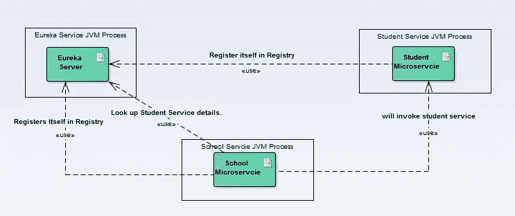
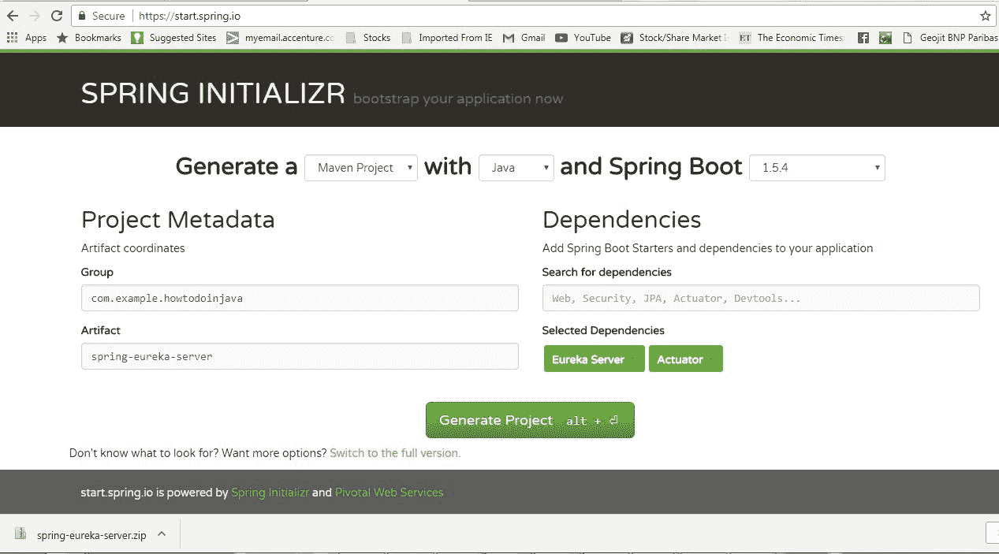
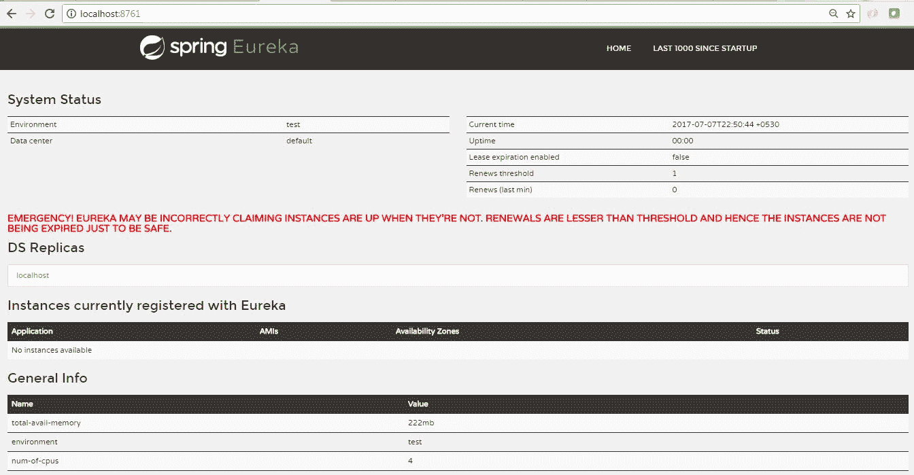
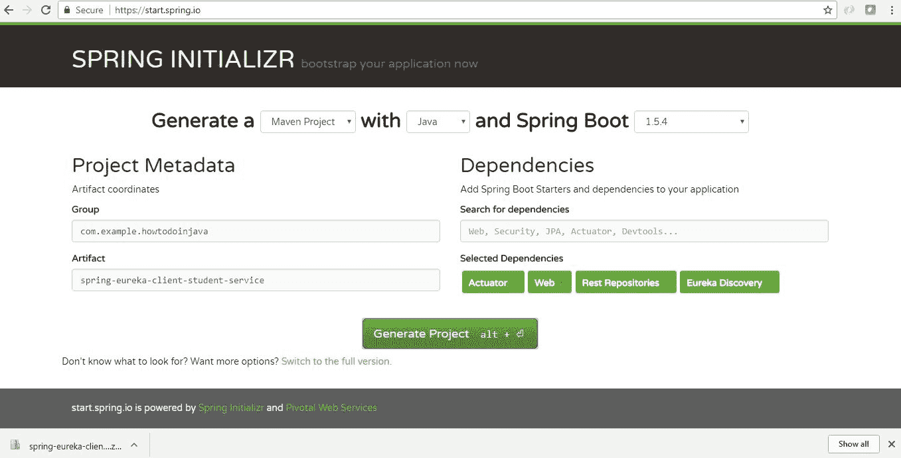
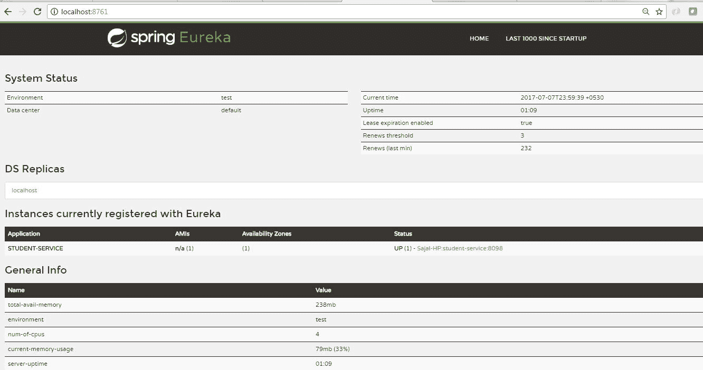
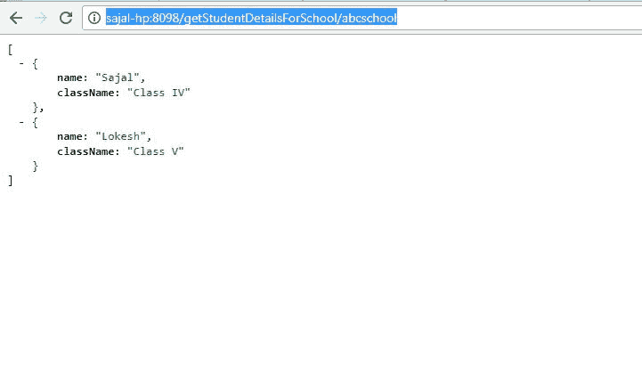
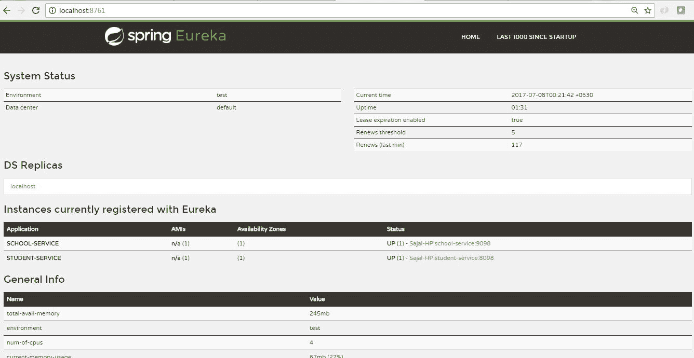

# 借助 Netflix Eureka 进行 Spring Cloud Service 发现

> 原文： [https://howtodoinjava.com/spring-cloud/spring-cloud-service-discovery-netflix-eureka/](https://howtodoinjava.com/spring-cloud/spring-cloud-service-discovery-netflix-eureka/)

学习在 [Netflix Eureka](https://github.com/Netflix/eureka) 注册表服务器上基于 [Spring cloud](https://projects.spring.io/spring-cloud) 创建[微服务](//howtodoinjava.com/microservices/microservices-definition-principles-benefits/)，以及其他微服务（Eureka 客户端）如何使用它注册和发现要调用的服务 他们的 API。

我们将使用基于 Spring Boot 的 Spring Cloud API。 我们将使用 Netflix Eureka 服务器来构建服务注册服务器，并使用 Eureka 客户端进行注册并发现其他服务以调用 REST API。

## 总览

我们将为此 **Netflix Eureka 示例**创建三个微服务。

1.  **Eureka 服务注册表服务器**-此微服务将提供服务注册表和发现服务器。
2.  **学生微服务** – 这将提供一些基于学生实体的功能。 这将是一个基于休息的服务，最重要的是它将是一个 eureka 客户服务，它将与 eureka 服务对话以在服务注册表中注册自己。
3.  **学校微服务** – 与学生服务的类型相同 – 唯一增加的功能是它将使用服务查找机制调用学生服务。 我们不会使用学生服务的绝对 URL 与该服务进行交互。

这是上面列出的三个服务之间的交互图。

[](//howtodoinjava.com/wp-content/uploads/2017/07/Discovery_interratction-Diagram.jpg)

Component Interaction with each other

#### 技术堆栈和运行时

*   Java 1.8
*   Eclipse IDE
*   SpringCloud
*   SpringBoot
*   SpringRest
*   Maven

## 什么是 Netflix Eureka 服务器和客户端？

众所周知，如今，微服务的发展势头非常强劲。 从单片架构过渡到基于微服务的体系结构在可维护性，可伸缩性，高可用性等切面为将来带来了许多好处。但是，与此同时，在进行这种迁移时也面临许多挑战。 其中之一是维护单个微服务地址。 这项任务可能非常复杂-取决于服务的数量及其动态性质。 如果整个基础架构都是分布式的，并且还存在一些复制，那么维护该服务地址将变得更加困难。

为了解决这个问题，在分布式计算中有一个称为“服务注册和发现”的概念，其中一个专用服务器负责维护已部署和删除的所有微服务的注册表。 这就像所有其他应用程序/微服务的电话簿一样。

可以将其视为微服务（客户端）可以注册自己并发现其他已注册微服务的查找服务。 当客户端微服务向 Eureka 注册时，它会提供元数据，例如主机，端口和运行状况指示器，从而允许其他微服务发现它。 发现服务器期望来自每个微服务实例的常规心跳消息。 如果实例开始始终无法发送心跳，发现服务器将从其注册表中删除该实例。 这样，我们将拥有一个非常稳定的微服务生态系统，彼此协作，并且最重要的是，我们不必手动维护其他微服务的地址，如果频繁进行规模扩大/缩减，则这是几乎不可能完成的任务 ，根据需要，我们使用虚拟主机专门在云环境中托管服务。

## Eureka 服务注册表服务器

请按照以下步骤创建和运行 Eureka 服务器。

#### 创建尤里卡服务器

从 [Spring Boot 初始化器门户](https://start.spring.io/)创建一个具有两个依赖项的 Spring Boot 项目，即`Eureka server`和`Actuator`。 给出其他 Maven GAV 坐标并下载项目。

[](//howtodoinjava.com/wp-content/uploads/2017/07/server_projec-generation.jpg)

Eureka Server Service Project Generation

将项目解压缩并将其作为现有的 maven 项目导入 Eclipse。 在此步骤中，将从 maven 存储库下载所有必需的依赖项。

现在打开在下载的项目中已经生成的`SpringEurekaServerApplication`类，并在该类上添加[`@EnableEurekaServer`](https://github.com/spring-cloud/spring-cloud-netflix/blob/master/spring-cloud-netflix-eureka-server/src/main/java/org/springframework/cloud/netflix/eureka/server/EnableEurekaServer.java)注解。

```java
package com.example.howtodoinjava.springeurekaserver;

import org.springframework.boot.SpringApplication;
import org.springframework.boot.autoconfigure.SpringBootApplication;
import org.springframework.cloud.netflix.eureka.server.EnableEurekaServer;

@EnableEurekaServer
@SpringBootApplication
public class SpringEurekaServerApplication {

    public static void main(String[] args) {
        SpringApplication.run(SpringEurekaServerApplication.class, args);
    }
}

```

再次构建项目。 使用此注解，此工件将充当微服务注册表和发现服务器。

#### 服务器配置

在`src\main\resources`目录中创建一个名为`application.yml`的文件。 添加这些属性 – 

```java
server:
  port: ${PORT:8761} # Indicate the default PORT where this service will be started

eureka:
  client:
    registerWithEureka: false	#telling the server not to register himself in the service registry
    fetchRegistry: false
  server:
    waitTimeInMsWhenSyncEmpty: 0	#wait time for subsequent sync

```

在`src\main\resources`目录中创建另一个名为`bootstrap.yml`的文件。 添加这些属性 – 

```java
spring:
  application:
    name: eureka
  cloud:
    config:
      uri: ${CONFIG_SERVER_URL:http://localhost:8888}

```

#### 测试 Eureka 服务器

作为 Spring Boot 应用程序启动该应用程序。 打开浏览器并转到`http://localhost:8761/`，您应该看到如下所示的 eureka 服务器主页。

[](//howtodoinjava.com/wp-content/uploads/2017/07/eureka_console_without_anyClient.jpg)

Eureka Console Without Any Client

请注意，目前尚未在此处注册任何服务，这是我们期望的，一旦我们启动客户端服务，此服务器将自动更新客户端服务的详细信息。

## 尤里卡客户 – 学生服务

请按照以下步骤创建并运行运行学生服务的 Eureka 客户端。

#### 创建尤里卡客户项目

从具有四个依赖项的初始化程序门户创建 Spring Boot 项目，即`Actuator`，`Web`，`Rest Repositories`和`Eureka Discovery`。 给出其他 Maven GAV 坐标并下载项目。

[](//howtodoinjava.com/wp-content/uploads/2017/07/client_projec-generation_Student.jpg)

Client Project Generation – 
Student Microservice

将项目解压缩并将其作为现有的 maven 项目导入 Eclipse。

现在，在`src`文件夹中的 Spring 运行应用程序类上添加[`@EnableEurekaClient`](https://github.com/spring-cloud/spring-cloud-netflix/blob/master/spring-cloud-netflix-eureka-client/src/main/java/org/springframework/cloud/netflix/eureka/EnableEurekaClient.java)注解。 使用此注解，此工件将充当 Spring Discovery 客户端，并在连接到此服务的 eureka 服务器中进行注册。

```java
package com.example.howtodoinjava.springeurekaclientstudentservice;

import org.springframework.boot.SpringApplication;
import org.springframework.boot.autoconfigure.SpringBootApplication;
import org.springframework.cloud.netflix.eureka.EnableEurekaClient;

@SpringBootApplication
@EnableEurekaClient
public class SpringEurekaClientStudentServiceApplication {

    public static void main(String[] args) {
        SpringApplication.run(SpringEurekaClientStudentServiceApplication.class, args);
    }
}

```

#### 客户端配置

在`src\main\resources`目录中创建一个名为`application.yml`的文件，然后添加以下几行。

```java
server:
  port: 8098	#default port where the service will be started

eureka:			#tells about the Eureka server details and its refresh time
  instance:
    leaseRenewalIntervalInSeconds: 1
    leaseExpirationDurationInSeconds: 2
  client:
    serviceUrl:
      defaultZone: http://127.0.0.1:8761/eureka/
    healthcheck:
      enabled: true
    lease:
      duration: 5

spring:		
  application:
    name: student-service 	#current service name to be used by the eureka server

management:
  security:
    enabled: false	#disable the spring security on the management endpoints like /env, /refresh etc. 

logging:
  level:
    com.example.howtodoinjava: DEBUG

```

#### 添加 REST API

现在添加一个`RestController`并公开一个剩余端点，以获取特定学校的所有学生详细信息。 在这里，我们公开`/getStudentDetailsForSchool/{schoolname}`端点来满足业务目的。 为简单起见，我们正在对学生详细信息进行硬编码。

```java
package com.example.howtodoinjava.springeurekaclientstudentservice.controller;

import java.util.ArrayList;
import java.util.HashMap;
import java.util.List;
import java.util.Map;

import org.springframework.web.bind.annotation.PathVariable;
import org.springframework.web.bind.annotation.RequestMapping;
import org.springframework.web.bind.annotation.RequestMethod;
import org.springframework.web.bind.annotation.RestController;

import com.example.howtodoinjava.springeurekaclientstudentservice.domain.Student;

@RestController
public class StudentServiceController {

	private static Map<String, List<Student>> schooDB = new HashMap<String, List<Student>>();

	static {
		schooDB = new HashMap<String, List<Student>>();

		List<Student> lst = new ArrayList<Student>();
		Student std = new Student("Sajal", "Class IV");
		lst.add(std);
		std = new Student("Lokesh", "Class V");
		lst.add(std);

		schooDB.put("abcschool", lst);

		lst = new ArrayList<Student>();
		std = new Student("Kajal", "Class III");
		lst.add(std);
		std = new Student("Sukesh", "Class VI");
		lst.add(std);

		schooDB.put("xyzschool", lst);

	}

	@RequestMapping(value = "/getStudentDetailsForSchool/{schoolname}", method = RequestMethod.GET)
	public List<Student> getStudents(@PathVariable String schoolname) {
		System.out.println("Getting Student details for " + schoolname);

		List<Student> studentList = schooDB.get(schoolname);
		if (studentList == null) {
			studentList = new ArrayList<Student>();
			Student std = new Student("Not Found", "N/A");
			studentList.add(std);
		}
		return studentList;
	}
}

```

`Student`类是一个简单的 POJO。

```java
public class Student 
{
	private String name;
	private String className;

	public Student(String name, String className) {
		super();
		this.name = name;
		this.className = className;
	}

	public String getName() {
		return name;
	}

	public void setName(String name) {
		this.name = name;
	}

	public String getClassName() {
		return className;
	}

	public void setClassName(String className) {
		this.className = className;
	}
}

```

#### 测试 Eureka 客户

作为 spring boot 应用程序启动该项目。 现在，验证此服务已在 Eureka 服务器中自动注册。 转到 Eureka 服务控制台并刷新页面。 现在，如果一切顺利，我们将在 eureka 服务控制台中看到**学生服务**的一项。 这表明 Eureka 服务器和客户端都相互了解。

[](//howtodoinjava.com/wp-content/uploads/2017/07/eureka_console_with_Student_1service_registered.jpg)

Eureka console with Student service registered

现在，我们将验证`/getStudentDetailsForSchool/{schoolname}`端点是否已启动并正在运行。 转到浏览器并转到`http://localhost:8098/getStudentDetailsForSchool/abcschool`，它将为特定学校`abcschool`提供学生详细信息。

[](//howtodoinjava.com/wp-content/uploads/2017/07/Student-Service-Responding.jpg)

Student Service response

## 尤里卡客户 – 学校服务

现在，我们将创建学校服务，该服务将在 eureka 服务器中进行注册-它将发现并调用没有硬编码 URL 路径的学生服务。

遵循创建学生服务的确切步骤，以及创建并运行运行学校服务的 Eureka 客户程序。

#### 创建尤里卡客户项目

从具有四个依赖项的初始化程序门户创建 Spring Boot 项目，即`Actuator`，`Web`，`Rest Repositories`和`Eureka Discovery`。 给出其他 Maven GAV 坐标并下载项目。

将项目解压缩并将其作为现有的 maven 项目导入 Eclipse。

现在，在`src`文件夹中的 Spring 运行应用程序类上添加`@EnableEurekaClient`注解。 使用此注解，此工件将充当 Spring Discovery 客户端，并在连接到此服务的 eureka 服务器中进行注册。

```java
package com.example.howtodoinjava.springeurekaclientschoolservice;

import org.springframework.boot.SpringApplication;
import org.springframework.boot.autoconfigure.SpringBootApplication;
import org.springframework.cloud.netflix.eureka.EnableEurekaClient;

@SpringBootApplication
@EnableEurekaClient
public class SpringEurekaClientSchoolServiceApplication {

	public static void main(String[] args) {
		SpringApplication.run(SpringEurekaClientSchoolServiceApplication.class, args);
	}
}

```

#### 客户端配置

在`src\main\resources`目录中创建一个名为`application.yml`的文件，然后添加以下几行。 除了端口号和服务名称之外，这些配置与学生服务非常相似。

```java
server:
  port: 9098	#port number

eureka:
  instance:
    leaseRenewalIntervalInSeconds: 1
    leaseExpirationDurationInSeconds: 2
  client:
    serviceUrl:
      defaultZone: http://127.0.0.1:8761/eureka/
    healthcheck:
      enabled: true
    lease:
      duration: 5

spring:
  application:
    name: school-service 	#service name

logging:
  level:
    com.example.howtodoinjava: DEBUG

```

#### 添加使用学生服务的 REST API 的 REST API

现在添加一个`RestController`，并公开一个休息点以获取学校详细信息。 该端点将使用带有应用程序名称的服务发现样式 URL，而不是带有 host：port 的完整 URL。

```java
package com.example.howtodoinjava.springeurekaclientschoolservice.controller;

import org.springframework.beans.factory.annotation.Autowired;
import org.springframework.cloud.client.loadbalancer.LoadBalanced;
import org.springframework.context.annotation.Bean;
import org.springframework.core.ParameterizedTypeReference;
import org.springframework.http.HttpMethod;
import org.springframework.web.bind.annotation.PathVariable;
import org.springframework.web.bind.annotation.RequestMapping;
import org.springframework.web.bind.annotation.RequestMethod;
import org.springframework.web.bind.annotation.RestController;
import org.springframework.web.client.RestTemplate;

@RestController
public class SchoolServiceController {
	@Autowired
	RestTemplate restTemplate;

	@RequestMapping(value = "/getSchoolDetails/{schoolname}", method = RequestMethod.GET)
	public String getStudents(@PathVariable String schoolname) 
	{
		System.out.println("Getting School details for " + schoolname);

		String response = restTemplate.exchange("http://student-service/getStudentDetailsForSchool/{schoolname}",
								HttpMethod.GET, null, new ParameterizedTypeReference<String>() {}, schoolname).getBody();

		System.out.println("Response Received as " + response);

		return "School Name -  " + schoolname + " \n Student Details " + response;
	}

	@Bean
	@LoadBalanced
	public RestTemplate restTemplate() {
		return new RestTemplate();
	}
}

```

这样，我们可以摆脱特定的服务配置，并且可以赋予服务查找此处提供的 eureka 服务器和其余模板的责任。 如果多个实例正在为同一服务运行，我们也可以在此处应用负载平衡（请参阅`@LoadBalanced`注解）。

我们使用的 URL 是`http://student-service/getStudentDetailsForSchool/{schoolname}`。 显然，我们只使用服务名称`student-service`代替`host:port`。 这将由 spring 框架，eureka 服务器和 rest 模板在内部处理。

## 服务发现和呼叫演示

现在也开始学校服务。 所有这三个服务都已启动。 检查 eureka 服务器控制台。 学生和学校服务都必须在此注册。

[](//howtodoinjava.com/wp-content/uploads/2017/07/eureka_console_with_both_servcies.jpg)

Eureka console with both services registered

转到浏览器，然后转到`http://localhost:9098/getSchoolDetails/abcschool`，它将提供特定学校 abcschool 详细信息的学校详细信息。 **内部调用了学生服务**。 响应看起来像在浏览器中：

[](//howtodoinjava.com/wp-content/uploads/2017/07/School-Service-Responding.jpg)

School Service Response

## 检查是否遇到任何错误的事情

1.  注解`@EnableEurekaServer`和`@EnableEurekaClient`是应用程序生态系统的核心。 没有这两个东西将根本无法工作。
2.  确保在启动配置客户端服务时，eureka 服务器服务已在运行，否则可能要花一些时间进行注册，这可能会在测试时造成混乱。

## 总结

我们看到了如何轻松高效地部署服务注册表和发现服务器以及客户端。 Spring 框架在内部维护着很多东西。 在这里，我们仅使用几个注解和非常少的配置即可快速完成所有操作。

这就是创建 spring may eureka 服务器和微服务注册的全部内容。 如果您在执行本文时遇到任何困难，请添加评论。 我们将很乐意调查这个问题。

[Download Source code for this Article](//howtodoinjava.com/wp-content/uploads/2017/07/discovery-server.zip)

学习愉快！