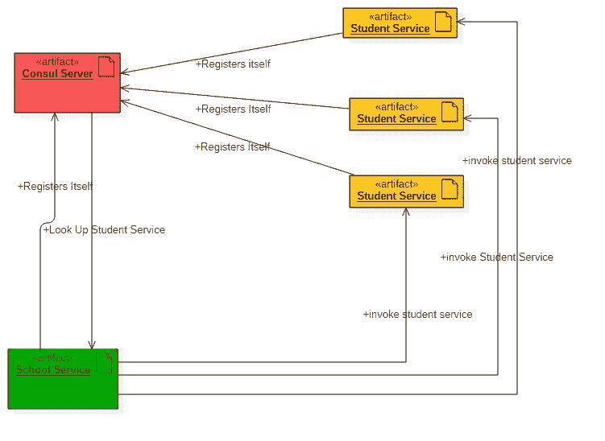
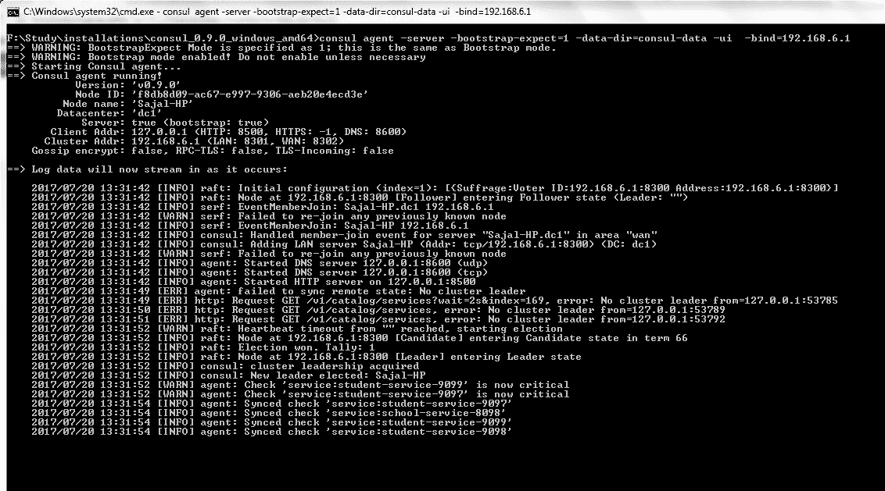
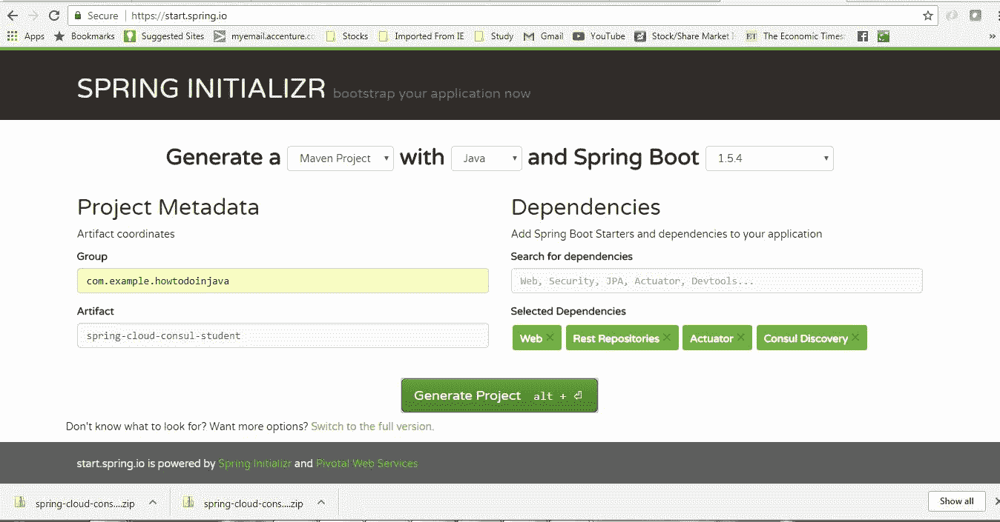
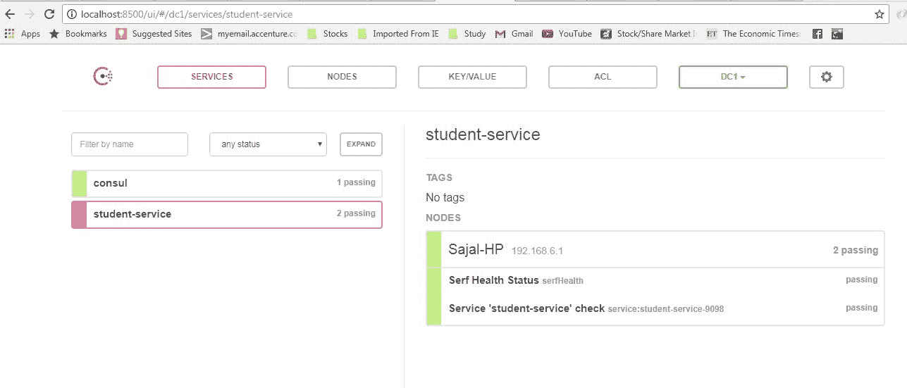
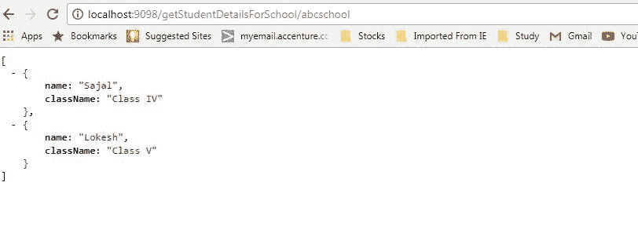
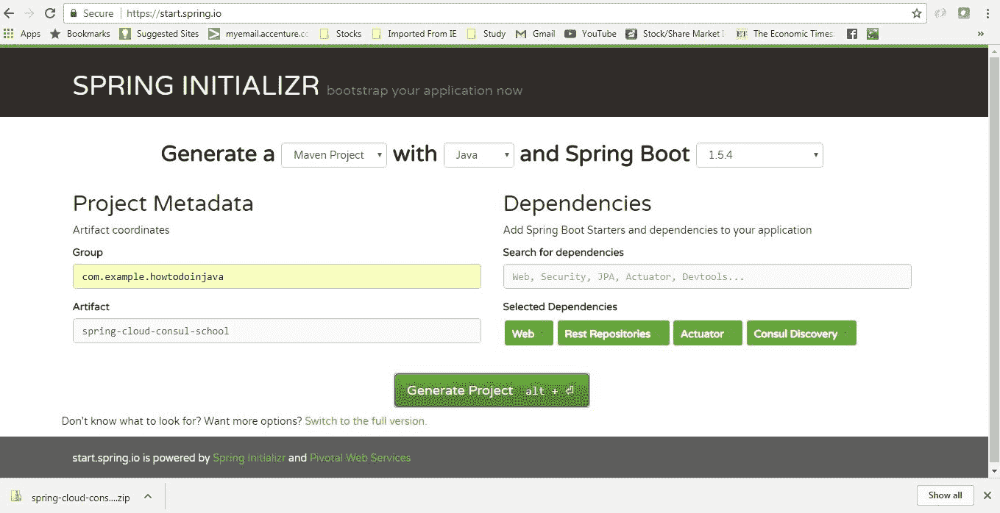
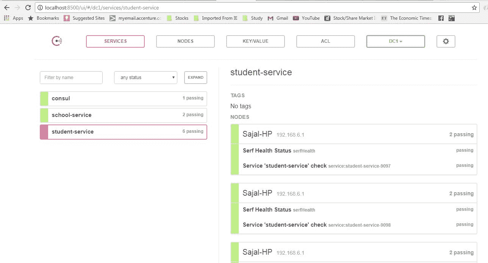

# 领事服务注册和发现示例

> [https://howtodoinjava.com/spring-cloud/consul-service-registration-discovery/](https://howtodoinjava.com/spring-cloud/consul-service-registration-discovery/)

学习基于`Spring cloud`创建[微服务](//howtodoinjava.com/microservices/microservices-definition-principles-benefits/)，在[`HashiCorp Consul`](https://www.consul.io/)注册表服务器上注册以及其他微服务（发现客户端）如何使用它来注册和发现服务以调用其 API。

我们将使用基于 Spring Boot 的 Spring Cloud API。 我们将使用 Consul 注册表服务器来构建服务注册表服务器和通用发现客户端，后者将自行注册并发现其他服务以调用 REST API。

## 总览

领事提供服务发现，配置管理，运行状况检查和键值存储等多种功能。今天，我们将专注于服务注册和发现部分。 我们将开发以下组件来构建分布式生态系统，其中每个组件都相互依赖，但是它们之间的耦合非常松散，当然还有容错能力。

*   **领事代理** – 在充当发现/注册服务器功能的 localhost 上运行。
*   **学生微服务** – 将基于学生实体提供一些功能。 这将是一个基于休息的服务，最重要的是它将是一个发现服务客户端，该客户端将与 Consul Server / Agent 对话以在服务注册表中注册自己。
*   **学校微服务** – 与学生服务的类型相同 – 唯一增加的功能是它将通过服务查找机制调用学生服务。 我们不会使用学生服务的绝对 URL 与该服务进行交互。 我们将使用 Consul 发现功能，并在调用该功能之前先使用它查找学生服务实例。

这是相同组件的整体组件交互图。

[](//howtodoinjava.com/wp-content/uploads/2017/07/Main.jpg)

Component Diagram

#### 技术堆栈和运行时

*   Java 1.8
*   Eclipse IDE
*   领事即服务注册服务器
*   SpringCloud
*   SpringBoot
*   SpringRest
*   Maven

## 在本地工作站中配置领事

在开始练习之前，我们需要首先在 localhost 中下载，配置和运行 consul 代理。

*   从[领事门户网站](https://www.consul.io/downloads.html)下载。 根据操作系统选择特定的程序包。 下载压缩文件后，我们需要将其解压缩到所需位置。
*   **Start Consul Agent in local workstation** – The Zip file that we have unzipped, has only one exe file called `consul.exe`. We will start a command prompt here and use below command to start the agent.

    ```java
    consul agent -server -bootstrap-expect=1 -data-dir=consul-data -ui -bind=192.168.6.1
    ```

    确保输入正确的绑定地址，根据局域网设置的不同，绑定地址会有所不同。 在命令提示符下执行`ipconfig`以了解您的 **IpV4 地址**，并在此处使用它。

    [](//howtodoinjava.com/wp-content/uploads/2017/07/ipconfig.jpg)

    ipconfig command

    [](//howtodoinjava.com/wp-content/uploads/2017/07/AgentStart.jpg)

    Agent Start Command Log

*   **Test whether Consul Server is running** – Consul runs on default port and once agent started successfully, browse [http://localhost:8500/ui](http://localhost:8500/ui) and you should see a console screen like – 

    [](//howtodoinjava.com/wp-content/uploads/2017/07/Consul-console-Initial.jpg)

    Consul console – No service registered

因此，我们已经在本地计算机中配置了 consul，并且 consul 代理已成功运行。 现在，我们需要创建客户端并测试服务注册表和发现部分。

## 学生服务

请按照以下步骤创建和运行学生服务。 这将是一个发现客户端，将其注册到现在已经在我们的计算机中运行的领事服务。

#### 创建学生项目

从具有四个依赖项的[初始化程序门户](https://start.spring.io/)创建一个 Spring Boot 项目。

*   执行器
*   网页
*   其余资料库
*   领事发现

给出其他 Maven GAV 坐标并下载项目。

[](//howtodoinjava.com/wp-content/uploads/2017/07/student_generation.jpg)

student service project generation

将项目解压缩并将其作为现有的 maven 项目导入 Eclipse。

现在，在`src`文件夹中的 Spring 引导应用程序类上添加`@org.springframework.cloud.client.discovery.EnableDiscoveryClient`注解。 有了此注解，此工件将像 Spring Discovery 客户端一样发挥作用，并在连接到此服务的领事服务器中注册自己。

```java
package com.example.howtodoinjava.springcloudconsulstudent;

import org.springframework.boot.SpringApplication;
import org.springframework.boot.autoconfigure.SpringBootApplication;
import org.springframework.cloud.client.discovery.EnableDiscoveryClient;

@SpringBootApplication
@EnableDiscoveryClient
public class SpringCloudConsulStudentApplication {

	public static void main(String[] args) {
		SpringApplication.run(SpringCloudConsulStudentApplication.class, args);
	}
}

```

#### 服务配置

打开`application.properties`并添加以下属性

```java
server.port=9098
spring.application.name: student-service
management.security.enabled=false

```

这是每个属性的详细信息 – 

*   `server.port=9098` – 将在默认的 **9098** 端口中启动服务。
*   `spring.application.name: student-service` – 将使用`student-service`标签在领事服务器中注册自己，其他服务也将使用此名称本身查找该服务。
*   `management.security.enabled=false` – 此练习实际上不是必需的，但是它将在执行器模块提供的管理端点中禁用 SpringSecurity。

#### 添加 REST API

现在添加一个`RestController`并公开一个剩余端点，以获取特定学校的所有学生详细信息。 在这里，我们公开`/getStudentDetailsForSchool/{schoolname}`端点来满足业务目的。 为简单起见，我们正在对学生详细信息进行硬编码。

```java
package com.example.howtodoinjava.springcloudconsulstudent.controller;

import java.util.ArrayList;
import java.util.HashMap;
import java.util.List;
import java.util.Map;

import org.springframework.web.bind.annotation.PathVariable;
import org.springframework.web.bind.annotation.RequestMapping;
import org.springframework.web.bind.annotation.RequestMethod;
import org.springframework.web.bind.annotation.RestController;

import com.example.howtodoinjava.springcloudconsulstudent.domain.Student;

@RestController
public class StudentServiceController {

	private static Map<String, List<Student>> schooDB = new HashMap<String, List<Student>>();

	static {
		schooDB = new HashMap<String, List<Student>>();

		List<Student> lst = new ArrayList<Student>();
		Student std = new Student("Sajal", "Class IV");
		lst.add(std);
		std = new Student("Lokesh", "Class V");
		lst.add(std);

		schooDB.put("abcschool", lst);

		lst = new ArrayList<Student>();
		std = new Student("Kajal", "Class III");
		lst.add(std);
		std = new Student("Sukesh", "Class VI");
		lst.add(std);

		schooDB.put("xyzschool", lst);

	}

	@RequestMapping(value = "/getStudentDetailsForSchool/{schoolname}", method = RequestMethod.GET)
	public List<Student> getStudents(@PathVariable String schoolname) {
		System.out.println("Getting Student details for " + schoolname);

		List<Student> studentList = schooDB.get(schoolname);
		if (studentList == null) {
			studentList = new ArrayList<Student>();
			Student std = new Student("Not Found", "N/A");
			studentList.add(std);
		}
		return studentList;
	}
}

```

**Student.java 模型**

```java
package com.example.howtodoinjava.springcloudconsulstudent.domain;

public class Student {
	private String name;
	private String className;

	public Student(String name, String className) {
		super();
		this.name = name;
		this.className = className;
	}

	public String getName() {
		return name;
	}

	public void setName(String name) {
		this.name = name;
	}

	public String getClassName() {
		return className;
	}

	public void setClassName(String className) {
		this.className = className;
	}
}

```

#### 验证学生服务

作为 spring boot 应用程序启动该项目。 现在，确认此服务已在 Consul 服务器中自动注册。 转到 Consul Agent 控制台并刷新页面。 现在，如果一切顺利，我们将在 Consul Agent 控制台中看到`student-service`的一项。

[](//howtodoinjava.com/wp-content/uploads/2017/07/Consul-console-Student-Servcie-registered1.jpg)

Consul console Student Service registered

这表明 Consul 服务器和客户端都相互了解，这是 Consul 服务器和学生服务之间发生的一种自动注册和发现。

现在，我们将验证`/getStudentDetailsForSchool/{schoolname}`端点是否已启动并正在运行。 转到浏览器并转到 [http://localhost:9098/getStudentDetailsForSchool/abcschool](http://localhost:9098/getStudentDetailsForSchool/abcschool) ，它将为特定学校`abcschool`提供学生详细信息。

[](//howtodoinjava.com/wp-content/uploads/2017/07/Student_Service_Response.jpg)

Student Service Response

## 学校服务 – 发现客户

现在，我们将创建学校服务，该服务将在领事服务器中进行注册-它将发现并调用没有硬编码 URL 路径的学生服务。

请按照相同的步骤创建和运行学校服务。 这将是一个发现客户端，将其注册到现在已经在我们的计算机中运行的领事服务。

它将内部调用已开发的学生服务，并将使用领事服务发现功能来发现学生实例。

#### 创建学校项目

从具有四个依赖项的[初始化程序门户](https://start.spring.io/)创建一个 Spring Boot 项目。

*   执行器
*   网页
*   其余资料库
*   领事发现

给出其他 Maven GAV 坐标并下载项目。

[](//howtodoinjava.com/wp-content/uploads/2017/07/School_generation.jpg)

School Generation

将项目解压缩并将其作为现有的 maven 项目导入 Eclipse。

现在，在`src`文件夹中的 Spring 引导应用程序类上添加`@org.springframework.cloud.client.discovery.EnableDiscoveryClient`注解。 有了此注解，此工件将像 Spring Discovery 客户端一样发挥作用，并在连接到此服务的领事服务器中注册自己。

```java
package com.example.howtodoinjava.springcloudconsulschool;

import org.springframework.boot.SpringApplication;
import org.springframework.boot.autoconfigure.SpringBootApplication;
import org.springframework.cloud.client.discovery.EnableDiscoveryClient;

@EnableDiscoveryClient
@SpringBootApplication
public class SpringCloudConsulSchoolApplication {

	public static void main(String[] args) {
		SpringApplication.run(SpringCloudConsulSchoolApplication.class, args);
	}
}

```

#### 服务配置

打开`application.properties`并添加以下属性

```java
server.port=8098
spring.application.name: school-service
management.security.enabled=false

```

这是每个属性的详细信息 – 

*   `server.port=8098` – 将在默认的 **8098** 端口中启动服务
*   `spring.application.name: school-service` – 将使用`school-service`标签在领事服务器中注册自己。
*   `management.security.enabled=false` – 将在执行器模块提供的管理端点中禁用 SpringSecurity。

#### 添加使用学生服务的 REST API 的 REST API

现在添加一个`RestController`，并公开一个休息点以获取学校详细信息。 该端点将使用带有应用程序名称的服务发现样式 URL，而不是带有 host：port 的完整 URL 约定。

`SchoolServiceController.java`

```java
package com.example.howtodoinjava.springcloudconsulschool.controller;

import org.springframework.beans.factory.annotation.Autowired;
import org.springframework.web.bind.annotation.PathVariable;
import org.springframework.web.bind.annotation.RequestMapping;
import org.springframework.web.bind.annotation.RequestMethod;
import org.springframework.web.bind.annotation.RestController;
import com.example.howtodoinjava.springcloudconsulschool.delegate.StudentServiceDelegate;

@RestController
public class SchoolServiceController {

	@Autowired
	StudentServiceDelegate studentServiceDelegate;

	@RequestMapping(value = "/getSchoolDetails/{schoolname}", method = RequestMethod.GET)
	public String getStudents(@PathVariable String schoolname) 
	{
		System.out.println("Going to call student service to get data!");
		return studentServiceDelegate.callStudentServiceAndGetData(schoolname);
	}
}

```

`StudentServiceDelegate.java`

```java
package com.example.howtodoinjava.springcloudconsulschool.delegate;

import java.util.Date;
import org.springframework.beans.factory.annotation.Autowired;
import org.springframework.cloud.client.loadbalancer.LoadBalanced;
import org.springframework.context.annotation.Bean;
import org.springframework.core.ParameterizedTypeReference;
import org.springframework.http.HttpMethod;
import org.springframework.stereotype.Service;
import org.springframework.web.client.RestTemplate;

@Service
public class StudentServiceDelegate 
{
	@Autowired
	RestTemplate restTemplate;

	public String callStudentServiceAndGetData(String schoolname) 
	{
		System.out.println("Consul Demo - Getting School details for " + schoolname);

		String response = restTemplate.exchange("http://student-service/getStudentDetailsForSchool/{schoolname}", 										HttpMethod.GET, null, new ParameterizedTypeReference<String>() {}, 												schoolname).getBody();

		System.out.println("Response Received as " + response + " -  " + new Date());

		return "School Name -  " + schoolname + " :::  Student Details " + response + " -  " + new Date();
	}

	@Bean
	@LoadBalanced
	public RestTemplate restTemplate() {
		return new RestTemplate();
	}
}

```

看上面的代码。 在`StudentServiceDelegate`中，我们使用`RestTemplate`调用学生服务，并将学生服务的 URL 用作`http://<font color="RED">student-service/getStudentDetailsForSchool/{schoolname}`。

这样，我们就可以摆脱特定的服务配置，并且可以将服务查找职责赋予`consul`服务器和此处提供的其余模板。 如果多个实例正在为同一服务运行，我们也可以在此处应用负载平衡（请参阅`@LoadBalanced`注解）。

## 示例

逐步执行以下步骤以了解整个过程 – 

*   **检查 Consul Agent 是否仍在运行** – 打开浏览器，然后浏览 [http://localhost:8500/ui](http://localhost:8500/ui) 。 它应该显示如上所述的领事控制台。
*   **检查学生服务是否已运行** – 从领事管理页面和浏览器中检查学生服务是否已启动并正在运行。 如果没有启动该服务，并验证它已在领事服务器中注册。
*   **启动并检查学校服务** – 从命令提示符启动学校服务，并检查它是否已在领事服务器中注册。
*   Open browser and test school REST service using URL [http://localhost:8098//getSchoolDetails/abcschool](http://localhost:8098//getSchoolDetails/abcschool). It will give below response and it will internally invoke student service using consul service.

    [](//howtodoinjava.com/wp-content/uploads/2017/07/studentService.jpg)

    School Service Response

*   Also Try starting multiple instance Student Service by changing port by `java -jar "-Dserver.port=9099 target\spring-cloud-consul-student-0.0.1-SNAPSHOT.jar`. Those will also be registered in consul and as we are using `@LoadBalanced` annotation in the `RestTemplate`, load balancing will also be done internally. Check the respective student service console to verify which instance got invoked in multi-instance scenario.

    一旦我们注册了多个服务和多个实例，领事服务器的外观将如此。

    [](//howtodoinjava.com/wp-content/uploads/2017/07/Consul_All_Services_running.jpg)

    Consul All Services Running 

## 检查是否遇到任何错误的内容

*   注解 [`@EnableDiscoveryClient`](https://github.com/spring-cloud/spring-cloud-commons/blob/master/spring-cloud-commons/src/main/java/org/springframework/cloud/client/discovery/EnableDiscoveryClient.java) 和 Consul 代理运行是应用程序生态系统的核心。 没有这两个东西将根本无法工作。
*   确保在开始学校服务，学生服务，领事服务器时，代理已在运行，否则可能要花一些时间进行注册，并且在测试时可能会造成混淆。

## 摘要

我们看到了如何高效地部署领事服务注册表和发现服务器以及客户端。 Spring 框架在内部维护着很多东西。 在这里，我们仅使用几个注解和非常少的配置即可快速完成所有操作。

这就是为 spring 服务创建微服务的服务。

如果您在执行本文时遇到任何困难，请添加注解。 我们将很乐意调查这个问题。

[Download Source code for this Article](//howtodoinjava.com/wp-content/uploads/2017/07/Consoul.zip)

祝您学习愉快！