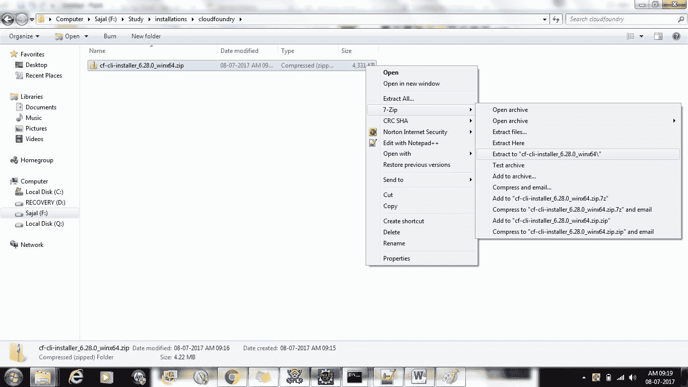
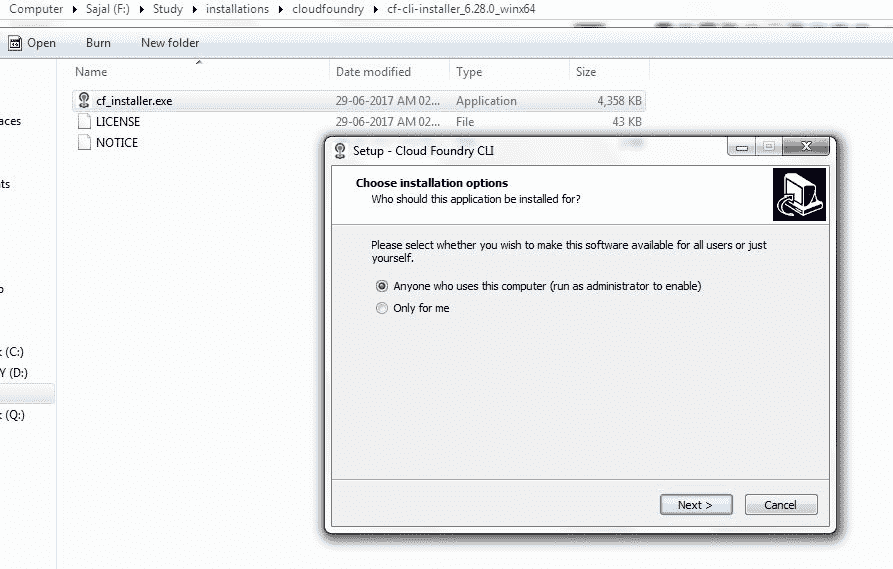
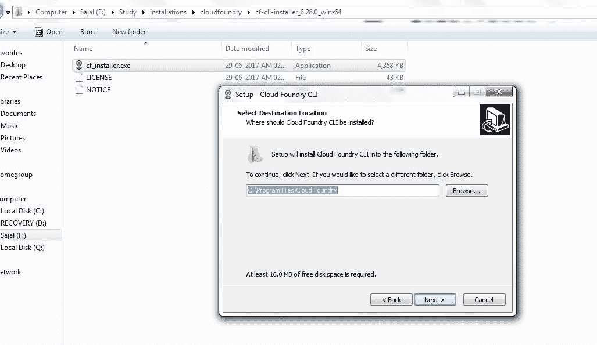
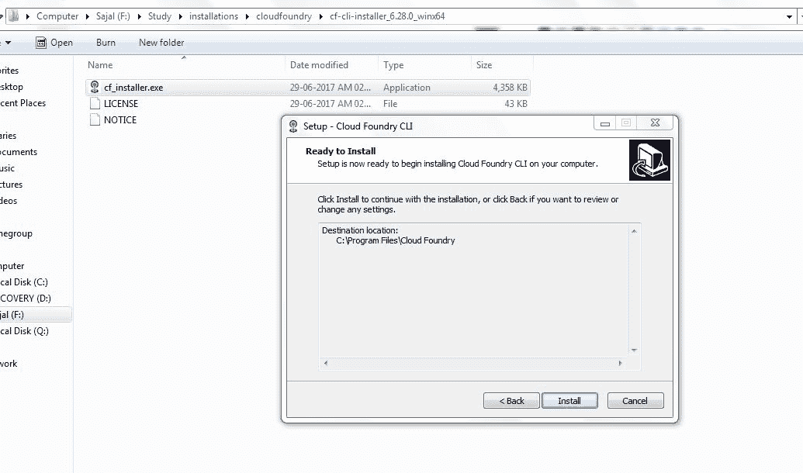
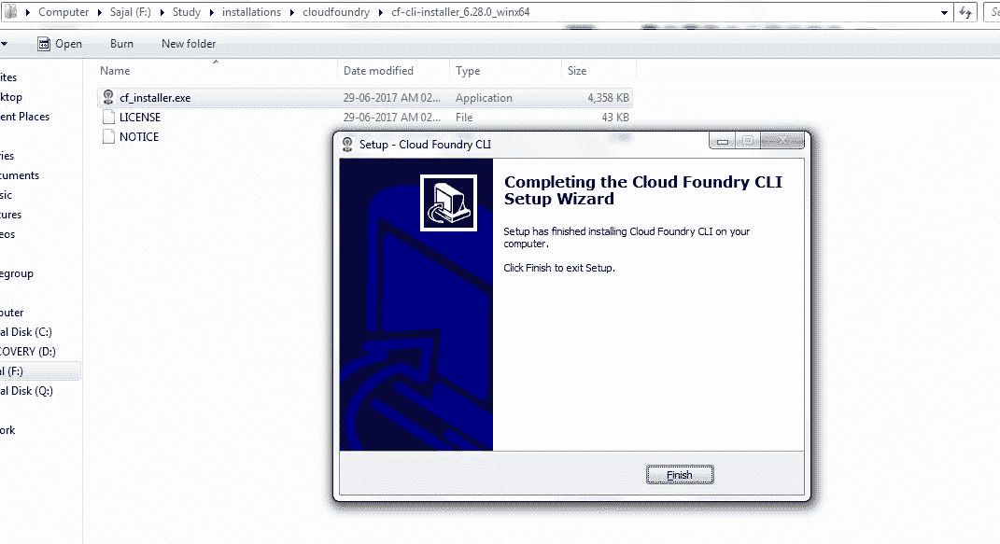
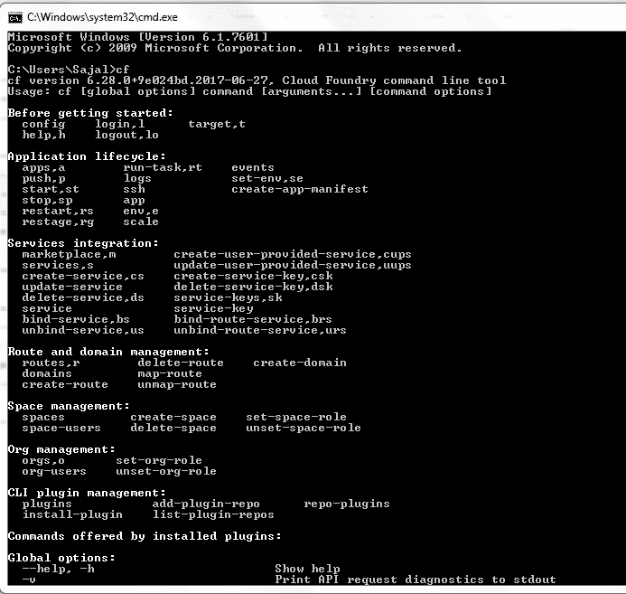
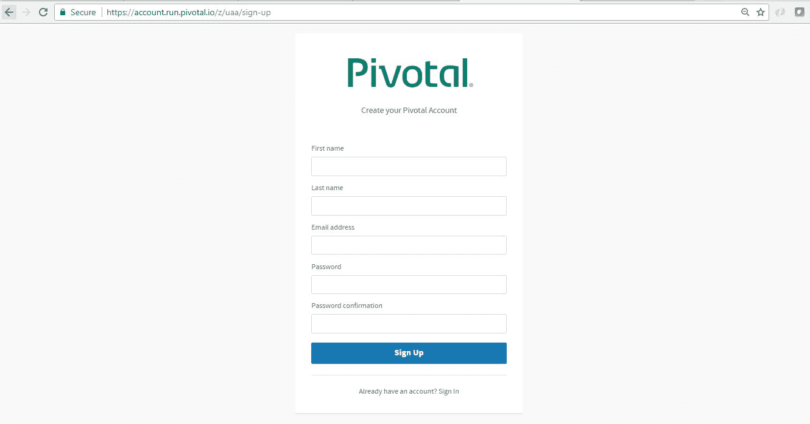
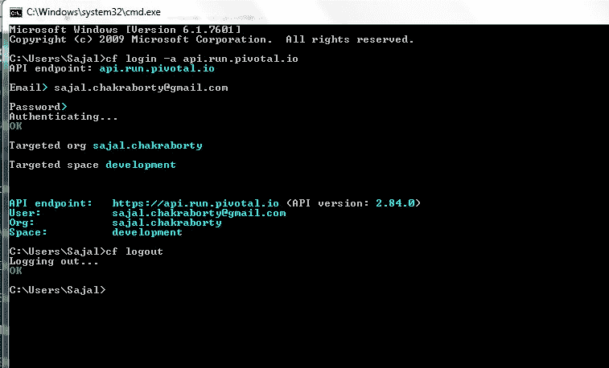
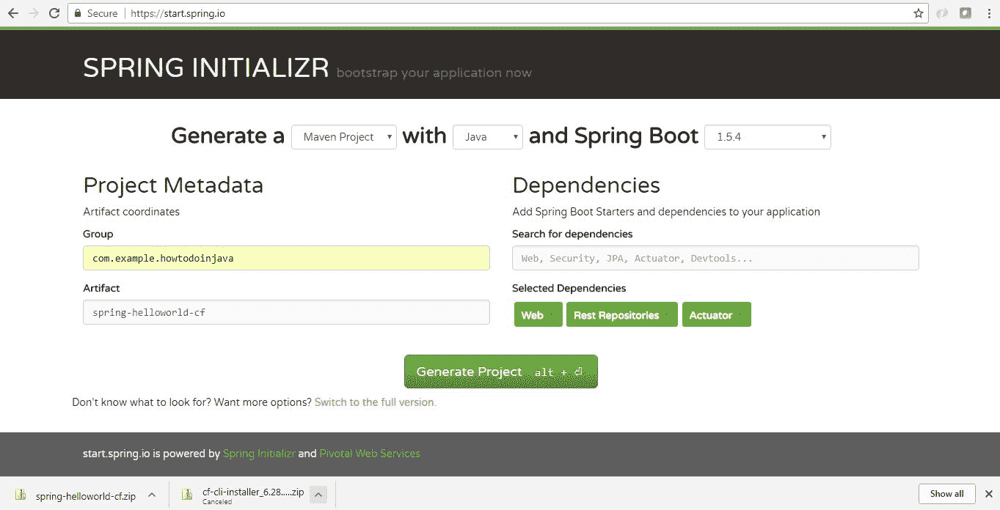
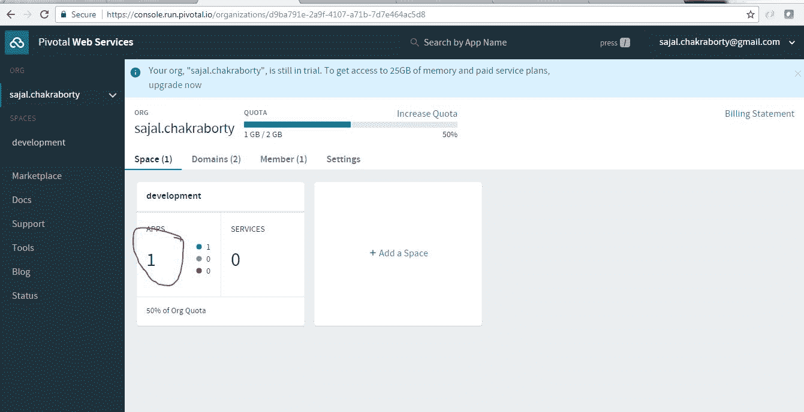

# 如何将 Spring Boot 应用程序部署到 Cloud Foundry 平台

> 原文： [https://howtodoinjava.com/spring-cloud/pivotal-cloud-foundry-spring-boot-example/](https://howtodoinjava.com/spring-cloud/pivotal-cloud-foundry-spring-boot-example/)

如今， [**云计算**](//howtodoinjava.com/cloud/java-cloud-development-introduction-and-tools/) 和 [**微服务**](//howtodoinjava.com/microservices/microservices-definition-principles-benefits/) 已经成为非常流行的概念，几乎所有组织都在对其进行快速投资和调整。 当前市场上只有少数流行的云提供商， **Cloud Foundry** 是其中之一。 这是 [PaaS 服务](https://en.wikipedia.org/wiki/Platform_as_a_service) ，我们可以在其中轻松部署和管理应用程序，Cloud Foundry 将负责其余基于云的产品，例如可伸缩性，高可用性等。

今天，我们将学习从在本地工作站中设置 Cloud Foundry 开始在 Cloud Foundry 中部署 Spring Boot 应用程序。 当前有许多可用的 Cloud Foundry 发行版，在本文中，我们将主要集中在称为 [Pivotal Web Services](https://run.pivotal.io/) 的 **Pivotal Cloud Foundry** 平台上。

## 什么是 Cloud Foundry

Cloud Foundry 是一个开源平台即服务（PaaS），可为您提供选择的云，开发人员框架和应用程序服务。 它是开源的，由 Cloud Foundry Foundation 管理。 最初的 Cloud Foundry 由 VMware 开发，目前由 GE，EMC 和 VMware 的合资公司 Pivotal 管理。

现在，由于 Cloud Foundry 是开源产品，因此许多受欢迎的组织当前单独提供了该平台，以下是当前经过认证的提供商的列表。

*   关键云铸造厂
*   IBM Bluemix
*   HPE Helion Stackato 4.0
*   源讯天幕
*   CenturyLink 应用程序迷雾
*   通用电气 Predix
*   华为 FusionStage
*   SAP Cloud 平台
*   Swisscom 应用程序云

## Windows 上的 Cloud Foundry 安装

这是 Windows 的安装步骤，对于其他操作系统，Cloud Foundry 拥有非常好的文档，我们可以轻松地遵循。

Cloud Foundry 在命令提示符下运行良好，Cloud Foundry 提供了一个名为`cf`的命令行工具，几乎可以为我们完成所有活动。 因此，要使该工具（cf 命令）在本地工作站中可用，首先我们需要安装并配置 Cloud Foundry 命令行（CLI）接口。

1.  下载 [CF Windows 安装程序](https://cli.run.pivotal.io/stable?release=windows64&source=github)。 它将提示您进行下载。 保存 zip 文件分发。
2.  Unpack the zip file to a suitable place in your workstation.

    

    Unzip Installer

3.  After successfully **unzip** operation, double cick on the cf CLI executable.

    

    CF Installer Location

4.  When prompted, click **Install**, then Close. Here are the sample steps for the same. This is very straight froward, you can select the default values.

    

    Step 1

    

    Step 2

    

    Step 3

    

    Step 4

5.  Verify the installation by opening a terminal window and type `cf`. If your installation was successful, the cf CLI help listing appears. This indicates that you are ready to go with any cloud foundry platform from your local workstation.

    

    Cloud Foundry Installation Verification

现在，我们将继续进行 Pivotal Web 服务帐户注册，并开发一个示例应用程序，并推送到 Cloud Foundry。

## 设置 PWS 控制台

现在，我们需要在 Pivotal 中创建一个帐户，以便在 Pivotal Cloud Foundry Platform 中部署我们的应用程序。 我们需要在下一页中[注册](https://account.run.pivotal.io/z/uaa/sign-up)才能开始注册过程。 它是免费的，它只会询问一些非常常见的问题，例如电子邮件地址，姓名等。

Pivotal web service console signup

注册完成后，我们可以通过枢纽 Web 服务控制台的[登录屏幕](https://login.run.pivotal.io/login)登录控制台。

成功提供登录凭据后，我们将进入**云铸造控制台**，在其中我们可以查看所有已部署的应用程序，可以监视这些应用程序并进行更多活动。 在这里，我们需要[添加 org 和 space](https://docs.cloudfoundry.org/concepts/roles.html) 等，这是非常简单和自我描述的。 下面是登录后的一个示例控制台屏幕。

目前尚未部署任何应用程序，因为我们尚未推送任何应用程序。

Console of PWS after login

#### 使用 CLI 从 PWS 控制台登录和注销

1.  **登录到 PWS** – 我们将使用`cf login -a api.run.pivotal.io`命令从本地工作站中安装的 CLI 工具登录到关键 Web 服务控制台。 它将 CLI 工具登录到 PWS 平台，以便我们可以从工作站部署和管理应用程序。 发出命令后，它将询问注册的电子邮件和密码，一旦成功提供，它将登录到平台。
2.  **从 PWS 控制台注销** – 一旦完成了该会话的所有工作，我们将使用命令`cf logout`从平台注销。

[PRE0]

这是从命令提示符登录和注销的样子。

Login logout with CF

## 创建 Spring Boot 应用程序

现在，我们将创建一个 Spring 运行应用程序，并将其部署到 PWS 控制台并从 Cloud Foundry 本身进行访问。 我们将创建一个应用程序，该应用程序将公开一个简单的 REST 端点，将其部署在 **Pivotal Web 服务平台**中后，将从我们的工作站进行测试。

#### 技术栈

我们将使用下面的技术栈进行 Spring Boot 应用程序的开发和测试。

*   SpringBoot
*   Spring REST
*   Maven
*   日食
*   Cloud Foundry CLI
*   网页浏览器

#### 生成 Spring Boot 应用程序

从 [spring boot 初始化程序门户](https://start.spring.io/)开始，这是创建任何基于 spring boot 的应用程序的一个很好的起点。 在这里，我们将仅选择 Config 服务器启动器 pom。 屏幕截图是这样的。 使用此配置，一旦我们生成了项目，便会下载一个 zip 文件，我们将其解压缩后直接导入 eclipse 中。

Spring Boot Project Generation

导入项目以将其作为现有 Maven 项目的蚀。 让 maven 为您下载依赖项和设置类路径条目。

#### 添加 REST 控制器和端点

我们需要添加简单的 REST 端点来测试从 Cloud Foundry 进行的部署。 自动化项目生成`SpringHelloworldCfApplication.java`已提供的开放启动应用程序类，并添加以下几行以添加一个简单的端点，该端点将根据输入内容进行回显。

最后一堂课如下。

[PRE1]

#### 项目配置

在`src\main\resources`目录的`bootstrap.properties`文件中添加上下文路径和必需的属性，并在其中添加两个属性。

[PRE2]

这将为应用程序设置一个上下文路径`/hello`，而`management.security.enabled=false`将禁用 Spring Boot 管理端点（如`/env, /refresh`等）的安全性。

#### 本地测试

最后，在嵌入式 tomcat 容器中的 Local 中构建和测试应用程序。 为此，将应用程序作为 spring boot 应用程序启动。

转到浏览器并输入`http://localhost:8080/hello?name=howtodoinjava`。 它应该回显该名称以及一些问候消息和响应过程时间。

REST API Output

现在，我们将在已注册的关键云铸造厂中推送[部署]应用程序。

## 在 Cloud Foundry 平台中部署 Spring Boot 应用程序

由于我们已经配置了 Cloud Foundry CLI，因此我们将使用 CLI `cf push`命令在 Cloud Foundry 控制台中部署应用程序。

#### 登录到 PWS 控制台

为此，请打开命令提示符并转到 Maven 应用程序的主目录，然后使用`cf login -a api.run.pivotal.io`命令登录到重要的 Web 服务控制台。

它将要求提供注册的凭据，最后登录到控制台。

#### 将应用程序推送到控制台

现在我们需要使用命令`cf push`推送应用程序。

[PRE3]

这会将应用程序部署到上一步中已登录的 PWS 控制台中。

Deployment by cf push

在[随附的日志文件](//howtodoinjava.com/wp-content/uploads/2017/07/Cf_push_Command_log.txt)中阅读有关 push 命令的完整控制台日志。

#### 验证应用程序部署

验证进入 PWS 控制台以检查是否显示了新部署的应用程序。 如果在前面的步骤中一切正常，则屏幕将如下所示。

Application deployed in PWS – count increased.

现在，单击上一步中突出显示的“应用程序”部分，以转到应用程序详细信息屏幕。 下面的视图将显示，并将以高亮显示将应用程序部署到的 URL。 请注意该 URL，以从浏览器进行测试。 在这种情况下，它将类似于`https://spring-helloworld-cf.cfapps.io/`。 此 URL 将根据我们选择的应用程序名称而更改。

Application URL published in PWS console.

#### 测试 REST 端点

现在访问浏览器，并使用 cf 控制台中发布的 url 主机访问应用程序。 对于此应用程序，URL 为`https://spring-helloworld-cf.cfapps.io/hello?name=howtodoinjava`。

Application accessed from cf directly

恭喜!! 您已成功将第一个 Spring Boot 应用程序部署到 Pivotal Cloud Foundry Platform 中。

## 总结

因此，我们已经能够在 Pivotal Cloud Foundry 控制台中成功开发和部署一个 Spring Boot 应用程序，并能够从我们的本地工作站访问该应用程序。 此外，我们进行了 cf CLI 配置并在 PWS 试用帐户中注册。

就是这个话题了。 我建议您现在将自己的应用程序部署在 Cloud Foundry 上并进行测试。

将我的问题放在评论部分。

[Download Source Code](//howtodoinjava.com/wp-content/uploads/2017/07/spring-helloworld-cf.zip)

学习愉快！