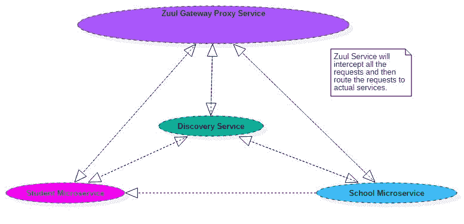
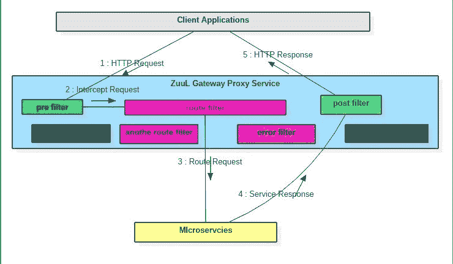
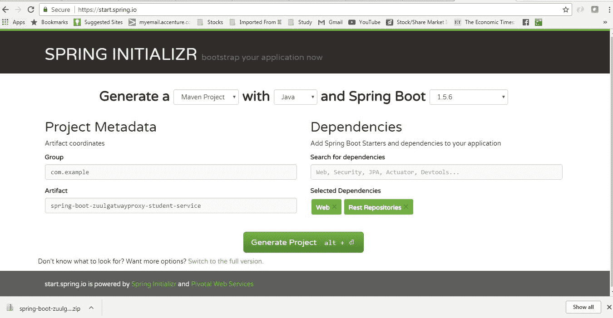

# Netflix Zuul 示例 – Zuul API 网关模式 – Spring Cloud 教程

> 原文： [https://howtodoinjava.com/spring-cloud/spring-cloud-api-gateway-zuul/](https://howtodoinjava.com/spring-cloud/spring-cloud-api-gateway-zuul/)

学习使用 **Netflix Zuul** 以及与 **Spring Cloud** 的牢固绑定来创建**负载均衡器**。 在这里，我们将主要关注 **API 网关模式**及其用法。 我们将构建一个 **netflix zuul 示例**，在此示例中，我们将创建一个微服务生态系统并测试其 **Zuul API 网关**在整个生态系统中的有效性和适用性。

这是一种非常常见的微服务模式，Zuul 的创建者 Netflix 大量智能地利用了这种模式，Netflix 声称所有 Netflix 流量首先进入 Zuul 集群，该集群主要负责基于不同的动态路由，监控，弹性和安全性。 基于 groovy 的自定义过滤器。

## 1\. Zuul 在微服务生态系统中是什么位置？

构建微服务时，一个常见的问题是为系统的客户端应用程序提供唯一的网关。 您的服务被划分为小型微服务应用程序，否则用户不应该看到它们，否则可能会导致大量的开发/维护工作。 此外，在某些情况下，整个生态系统网络流量可能会通过单个点，这可能会影响群集的性能。

为解决此问题，Netflix（微服务的主要采用者）创建并开放了其 **Zuul 代理服务器**，并在之后将其开源，Pivotal 下面的 Spring 将其收纳在 **Spring Cloud 技术栈**中， 只需几个简单的步骤即可轻松有效地使用 zuul。

Zuul 是一种边缘服务，代理对多个支持服务的请求。 它为您的生态系统提供了统一的“前门”，允许任何浏览器，移动应用程序或其他用户界面使用来自多个主机的服务。 您可以将 Zuul 与其他 Netflix 堆栈组件（例如 Hystrix 进行容错）和 Eureka 进行服务发现进行集成，或将其用于管理系统中的路由规则，过滤器和负载平衡。 最重要的是，所有这些组件都可以通过 spring boot / cloud 方法由 spring 框架很好地适应。



前端具有 Zuul 网关的微服务生态系统

## 2\. Zuul 组件

Zuul 主要具有四种类型的过滤器，使我们能够拦截任何特定事务在请求处理的不同时间轴上的流量。 我们可以为特定的网址格式添加任意数量的过滤器。

*   **前置过滤器** – 在路由请求之前被调用。
*   **后置过滤器** – 在路由请求后调用。
*   **路由过滤器** – 用于路由请求。
*   **错误过滤器** – 在处理请求时发生错误时调用。



Zuul 内部具有不同过滤器的请求处理流程

## 3\. netflix zuul 示例概述

现在，让我们使用 Zuul 代理创建一个简单而有意义的生态系统，以免脏污。 我们将创建以下工件来演示整个过程：

*   **学生微服务** – 基于 Spring Boot 的微服务，它将仅公开一个 URL 以启用某些搜索功能。 为简单起见，我们只返回硬编码的值，但在现实世界中，我们可以连接到此服务的任何位置以获取数据。
*   **Zuul 网关服务代理** – 将再次基于 Spring Boot，它将基本上拦截所有学生服务的流量并应用一系列请求过滤器，然后路由到基础服务，并在响应服务时再次路由， 它将应用一些响应过滤。 由于它是网关，因此我们可以有效地使用过滤器来采取许多有趣且有用的操作。

    网关服务的一些常见责任是：

    *   在网关层应用**微服务身份验证和安全性**以保护实际服务
    *   我们可以通过启用一些日志记录以获取边缘的有意义的数据和统计信息，从而对进入生态系统的所有流量进行**微服务洞察并监视**，以便为我们提供准确的生产视图。
    *   **动态路由**可以根据需要将请求路由到不同的后端群集。
    *   我们可以通过逐渐增加到新集群的流量来进行**运行时压力测试**，以便在许多情况下（例如， 群集具有新的硬件和网络设置，或者已部署了新版本的生产代码。
    *   我们可以进行**动态减载**，即为每种类型的请求分配容量，并丢弃超出限制的请求。
    *   我们可以应用**静态响应处理**，即直接在边缘构建一些响应，而不是将其转发到内部集群进行处理。

#### 技术栈和运行时

*   Java 1.8 和 Eclipse IDE 作为开发环境
*   Spring Cloud Zuul 作为网关代理供应器
*   Spring Boot 作为应用程序框架
*   Spring Rest 用于将微服务公开为 REST
*   Maven 作为构建工具

## 4\. 创建学生微服务

请按照以下步骤开发学生微服务，该服务将公开几个 REST 终结点，这些终结点以后可通过 zuul 代理进行访问。 稍后我们将研究 zuul 部分，让我们首先创建学生服务。

#### 4.1. 创建 Spring Boot 项目

从[ spring 初始化器页面](https://start.spring.io/)创建一个具有相关性（即`Web`和`Rest Repositories`）的 Spring Boot 项目。 给出其他 Maven GAV 坐标并下载项目。



学生服务 Maven 项目生成

将项目解压缩并将其作为`existing maven project`导入 Eclipse。 在此步骤中，使用命令`mvn clean install`重新构建 Maven，以便正确下载所有 Maven 依赖项。

#### 4.2. 添加一些 REST 端点

现在，我们将仅向该服务添加一些 REST 端点，以便稍后测试代理。 为此，我们需要通过添加注解`@RestController`来添加一个 REST 控制器。 为简单起见，我们将添加一个模型类`Student`。

完成所有更改后，该类将如下所示。

```java
package com.example.springboostudentservice;

import java.util.Date;
import org.springframework.boot.SpringApplication;
import org.springframework.boot.autoconfigure.SpringBootApplication;
import org.springframework.web.bind.annotation.PathVariable;
import org.springframework.web.bind.annotation.RequestMapping;
import org.springframework.web.bind.annotation.RestController;

@RestController
@SpringBootApplication
public class SpringBootStudentServiceApplication 
{
	@RequestMapping(value = "/echoStudentName/{name}")
	public String echoStudentName(@PathVariable(name = "name") String name) 
	{
		return "hello  <strong style=\"color: red;\">" + name + " </strong> Responsed on : " + new Date();
	}

	@RequestMapping(value = "/getStudentDetails/{name}")
	public Student getStudentDetails(@PathVariable(name = "name") String name) 
	{
		return new Student(name, "Pune", "MCA");
	}

	public static void main(String[] args) 
	{
		SpringApplication.run(SpringBootStudentServiceApplication.class, args);
	}
}

class Student 
{
	String name;
	String address;
	String cls;

	public Student(String name, String address, String cls) {
		super();
		this.name = name;
		this.address = address;
		this.cls = cls;
	}

	public String getName() {
		return name;
	}

	public String getAddress() {
		return address;
	}

	public String getCls() {
		return cls;
	}
}

```

#### 4.3. 应用配置

现在打开`application.properties`文件并添加这些条目。

```java
spring.application.name=student
server.port=8090

```

在这里，我们通过属性`spring.application.name=student`为该服务命名，并且通过`server.port=8090`定义默认端口。 我们需要覆盖默认端口，因为我们将在本地主机中运行不同微服务的多个实例。

#### 4.4. 验证学生服务

最后，使用命令`mvn clean install`进行 maven 构建，并通过运行命令`java -jar target\spring-boot-zuulgatwayproxy-student-service-0.0.1-SNAPSHOT.jar`作为 Spring Boot 应用程序启动该项目。 现在，一旦服务器启动，请转到浏览器并测试端点是否正常运行。

`http://localhost:8090/echoStudentName/Sajal`


浏览器输出

`http://localhost:8090/getStudentDetails/Sajal`


浏览器输出

现在，我们将使用 Zuul 创建实际的代理服务。

## 5\. 创建 Zuul 网关服务代理

这将再次是基于 Spring Boot 的微服务，但它具有特殊功能。 它将使用 zuul 创建一个 API 网关代理，该代理将代理学生服务。 稍后，我们可以添加任何数量的微服务，例如学生服务，并能够创建强大的微服务生态系统。

#### 5.1. 创建 Spring Boot 项目

从具有`Zuul`依赖关系的[ spring 初始化器页面](https://start.spring.io/)创建一个 Spring Boot 项目。 给出其他 Maven GAV 坐标并下载项目。


Zuul 代理服务 Maven 项目生成

将项目解压缩并将其作为现有的 maven 项目导入 Eclipse。 在此步骤中，使用命令`mvn clean install`重新构建 Maven，以便正确下载所有 Maven 依赖项。

#### 5.2. 启用 Zuul 服务代理

现在，在`src`文件夹中的 Spring 运行应用程序类上添加`@EnableZuulProxy`注解。 使用此注解，此工件将像 Zuul 服务代理一样工作，并将启用 API 网关层的所有功能，如前所述。 然后，我们将添加一些过滤器和路由配置。

```java
package com.example.springbootzuulgatwayproxy;

import org.springframework.boot.SpringApplication;
import org.springframework.boot.autoconfigure.SpringBootApplication;
import org.springframework.cloud.netflix.zuul.EnableZuulProxy;
import org.springframework.context.annotation.Bean;
import com.example.springbootzuulgatwayproxy.filters.ErrorFilter;
import com.example.springbootzuulgatwayproxy.filters.PostFilter;
import com.example.springbootzuulgatwayproxy.filters.PreFilter;
import com.example.springbootzuulgatwayproxy.filters.RouteFilter;

@SpringBootApplication
@EnableZuulProxy
public class SpringBootZuulgatwayproxyApplication {

	public static void main(String[] args) {
		SpringApplication.run(SpringBootZuulgatwayproxyApplication.class, args);
	}

	@Bean
	public PreFilter preFilter() {
		return new PreFilter();
	}
	@Bean
	public PostFilter postFilter() {
		return new PostFilter();
	}
	@Bean
	public ErrorFilter errorFilter() {
		return new ErrorFilter();
	}
	@Bean
	public RouteFilter routeFilter() {
		return new RouteFilter();
	}
}

```

#### 5.3. Zuul 路由配置

打开`application.properties`并添加以下条目：

```java
#Zuul routes. Here for /student path, we are routing to localhost:8090 with extra path after that.
zuul.routes.student.url=http://localhost:8090

#Ribbon is auto integrated with Zuul and for this exercise we are not using that.
ribbon.eureka.enabled=false

#Will start the gateway server @8080
server.port=8080

```

在这里，`zuul.routes.student.url`将路由所有请求`/student`的流量到实际的学生服务服务器。 这样，我们也可以将路由添加到其他服务。
`ribbon.eureka.enabled`与 Zuul 自动集成。
`server.port` – 需要覆盖默认端口，因为我们将在本地主机中运行不同微服务的多个实例。

#### 5.4. 添加 Zuul 过滤器

如我们已经描述的，我们现在将添加一些过滤器，Zuul 支持 4 种类型的过滤器，即`pre`，`post`，`route` 和`error`。 在这里，我们将创建每种类型的过滤器。

要编写过滤器，我们基本上需要执行以下步骤：

*   需要扩展`com.netflix.zuul.ZuulFilter`
*   需要覆盖`filterType`，`filterOrder`，`shouldFilter`和`run`方法。 这里`filterType`方法只能返回四个字符串 – `pre/post/route/error`中的任何一个。 依赖此值，过滤器将像特定过滤器一样工作。
*   `run`方法是根据我们的要求放置过滤器逻辑的地方。
*   同样，我们可以根据需要添加任意数量的任何特定过滤器，在这种类型的过滤器执行阶段，这种情况`filterOrder`将用于确定该过滤器的顺序。

**前置过滤器代码** – 我们将添加以下前置过滤器。 目前，出于测试目的，过滤器除了`println`以外无所作为。 但是实际上，这些功能足以执行前面提到的许多重要切面。

```java
package com.example.springbootzuulgatwayproxy.filters;

import javax.servlet.http.HttpServletRequest;
import com.netflix.zuul.ZuulFilter;
import com.netflix.zuul.context.RequestContext;

public class PreFilter extends ZuulFilter {

  @Override
  public String filterType() {
    return "pre";
  }

  @Override
  public int filterOrder() {
    return 1;
  }

  @Override
  public boolean shouldFilter() {
    return true;
  }

  @Override
  public Object run() {
    RequestContext ctx = RequestContext.getCurrentContext();
    HttpServletRequest request = ctx.getRequest();

    System.out.println("Request Method : " + request.getMethod() + " Request URL : " + request.getRequestURL().toString());
    return null;
  }
}

```

**后置过滤器**

```java
package com.example.springbootzuulgatwayproxy.filters;

import com.netflix.zuul.ZuulFilter;

public class PostFilter extends ZuulFilter {

  @Override
  public String filterType() {
    return "post";
  }

  @Override
  public int filterOrder() {
    return 1;
  }

  @Override
  public boolean shouldFilter() {
    return true;
  }

  @Override
  public Object run() {
   System.out.println("Inside Response Filter");

    return null;
  }
}

```

**路由过滤器**

```java
package com.example.springbootzuulgatwayproxy.filters;

import com.netflix.zuul.ZuulFilter;

public class RouteFilter extends ZuulFilter {

  @Override
  public String filterType() {
    return "route";
  }

  @Override
  public int filterOrder() {
    return 1;
  }

  @Override
  public boolean shouldFilter() {
    return true;
  }

  @Override
  public Object run() {
   System.out.println("Inside Route Filter");
    return null;
  }
}

```

**错误过滤器**

```java
package com.example.springbootzuulgatwayproxy.filters;

import com.netflix.zuul.ZuulFilter;

public class ErrorFilter extends ZuulFilter {

  @Override
  public String filterType() {
    return "error";
  }

  @Override
  public int filterOrder() {
    return 1;
  }

  @Override
  public boolean shouldFilter() {
    return true;
  }

  @Override
  public Object run() {
   System.out.println("Inside Route Filter");

    return null;
  }
}

```

#### 5.5. 注册 zuul 过滤器

创建这些过滤器的 Bean 定义以进行自动注册和启用。

```java
@Bean
public PreFilter preFilter() {
	return new PreFilter();
}
@Bean
public PostFilter postFilter() {
	return new PostFilter();
}
@Bean
public ErrorFilter errorFilter() {
	return new ErrorFilter();
}
@Bean
public RouteFilter routeFilter() {
	return new RouteFilter();
}

```

## 6\. Netflix Zuul 示例演示

因此，我们启用了 Zuul，添加了所需的配置并开发了过滤器。 因此，我们可以进行基本测试以了解整个过程。

使用命令`mvn clean install`进行 Maven 构建，并通过运行命令`java -jar target\spring-boot-zuulgatwayproxy-0.0.1-SNAPSHOT.jar`作为 Spring Boot 应用程序启动该项目。 现在，服务器启动后，进入浏览器并通过访问学生服务（名称为`/student`）来测试端点是否正常运行。

`http://localhost:8080/student/getStudentDetails/Sajal`


代理服务输出

`http://localhost:8080/student/echoStudentName/Sajal`


代理服务输出

## 7\. 总结

关于 netflix zuul 过滤器示例的全部内容。 我建议您自己做，添加更多基础服务，并通过代理路由请求，应用不同类型的过滤器，并在过滤器中添加真实的逻辑。

[下载源码](//howtodoinjava.com/wp-content/uploads/2017/07/apigateway_zuul.zip)

将我的问题放在评论部分。

学习愉快！