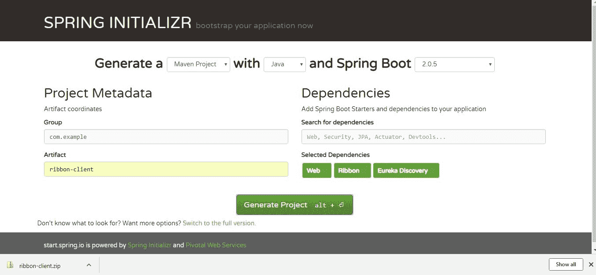

# Spring cloud ribbon 和 Eureka – 客户端负载均衡器示例

> 原文： [https://howtodoinjava.com/spring-cloud/spring-boot-ribbon-eureka/](https://howtodoinjava.com/spring-cloud/spring-boot-ribbon-eureka/)

在此 Spring 云教程中，学习在 Spring Boot / Cloud 项目中使用 Netflix Ribbon 使用**客户端负载平衡**。 学习构建基于微服务的应用程序，这些应用程序使用 **Ribbon** 作为客户端负载平衡器，并使用 **eureka** 作为注册表服务。 了解如何在负载均衡器下动态添加微服务的新实例。

## 1\. 传统的服务器端负载均衡

服务器端负载平衡涉及单片应用程序，在这些应用程序中，负载平衡器后面的应用程序实例数量有限。 我们将 war / ear 文件部署到多个服务器实例中，这些实例基本上是已部署了相同应用程序的服务器池，并在其前面放置了负载均衡器。

负载平衡器具有公共 IP 和 DNS。 客户端使用该公共 IP / DNS 发出请求。 负载平衡器决定将内部应用程序服务器请求转发到哪个请求。 它主要使用轮询或粘性会话算法。 我们称其为服务器端负载平衡。

#### 1.1. 微服务架构中的问题

通常，服务器端负载平衡是一项手动工作，我们需要手动将实例添加/删除到负载平衡器才能工作。 因此，理想情况下，我们要失去当今随需应变的可伸缩性，以自动发现和配置何时分拆任何新实例。

另一个问题是制定故障转移策略以为客户提供无缝的体验。 最后，我们需要一个单独的服务器来承载负载均衡器实例，这会对成本和维护产生影响。

## 2\. 客户端负载平衡

为了克服传统负载平衡的问题，客户端负载平衡成为了现实。 它们作为内置组件驻留在应用程序中，并与应用程序捆绑在一起，因此我们不必将它们部署在单独的服务器中。

现在，让我们可视化全局。 在微服务架构中，我们将不得不开发许多微服务，并且每个微服务在生态系统中可能具有多个实例。 为了克服这种复杂性，我们已经有了使用**服务发现模式**的流行解决方案。 在 SpringBoot 应用程序中，我们在服务发现空间中提供了两个选项，例如 Eureka，Consul，动物园管理员等。

现在，如果一个微服务想要与另一个微服务进行通信，则通常会使用发现客户端来查找服务注册表，并且 Eureka 服务器会将该目标微服务的所有实例返回给调用者服务。 然后，调用者服务负责选择要发送请求的实例。

在这里，客户端负载平衡成为现实，它会自动处理这种情况下的复杂性，并以负载平衡的方式委派给适当的实例。 注意，我们可以指定要使用的负载平衡算法。

## 3\. Netflix Ribbon – 客户端负载平衡器

Spring Cloud 系列的 Netflix Ribbon 提供了这种功能来设置客户端负载平衡以及服务注册表组件。 Spring Boot 具有非常好的配置 Ribbon 客户端负载平衡器的简便方法。 它提供以下功能

1.  负载均衡
2.  容错能力
3.  异步和响应模型中的多种协议（HTTP，TCP，UDP）支持
4.  缓存和批处理

要获取 Ribbon 二进制文件，请转到 [maven Central](https://search.maven.org/#search%7Cga%7C1%7Cribbon) 。 这是在 Maven 中添加依赖项的示例：

`pom.xml`

[PRE0]

## 4\. Netflix Ribbon 示例

#### 4.1. 技术栈

*   Java，Eclipse，Maven 作为开发环境
*   Spring-boot 和 Cloud 作为应用程序框架
*   Eureka 即服务注册表服务器
*   Ribbon 作为客户端负载均衡器

我们将创建以下组件，并查看整个生态系统如何在分布式环境中进行协调。

*   使用 Spring 运行的两个微服务。 一个需要根据业务需求调用另一个
*   Eureka 服务注册服务器
*   调用微服务中的 Ribbon 通过服务发现以负载平衡的方式调用其他服务
*   以负载平衡的方式调用服务，而无需发现服务

#### 4.2. 创建后端微服务

我们将使用 Spring boot 创建一个简单的微服务，并将公开简单的 REST 端点。 使用`spring-boot-web`和**服务发现客户端**依赖关系创建一个名为`ribbon-server`的简单 Spring Boot 项目，以将其托管在 Web 服务器中，并公开一个 Rest Controller 进行测试。

为此，我们需要转到 https://start.spring.io/ 并提供 Maven 坐标并选择依赖项。 下载包含框架项目的 zip 文件。 然后，一旦解压缩到合适的文件夹中，我们就需要将其导入 eclipse 中。

Project generated from Spring Initializer

###### 4.2.1. 创建 REST 端点

编写一个 Rest Controller，并如下所示公开一个 Rest Endpoint。

`MyRestController.java`

[PRE1]

###### 4.2.2 启用发现客户端

注册此服务到 eureka，我们需要在应用程序类中添加`@EnableDiscoveryClient`。 另外，我们需要在应用程序属性文件中添加以下条目。

`RibbonServerApplication.java`

[PRE2]

`application.properties`

[PRE3]

#### 4.3. Eureka 服务注册表服务器

创建服务发现服务器。 这也很容易。 只是我们需要使用 Eureka Server 作为依赖项来创建上述的 spring boot 项目，并执行以下配置。

###### 4.3.1. Eureka 服务器配置

准备好 Spring Boot 服务并将其导入 Eclipse 后，在 Spring Boot 应用程序类中添加`@EnableEurekaServer`注解，并在应用程序属性文件中添加以下配置。

`RibbonEurekaServerApplication.java`

[PRE4]

`application.properties`

[PRE5]

#### 4.4. 创建另一个微服务

遵循上一节的内容，创建另一个名为`ribbon-client`的服务，并增加了权限`spring-cloud-starter-netflix-ribbon`。 下载后，将项目导入 eclipse 中并执行以下配置。

###### 4.4.1. 碳带配置

在应用程序类中，添加两个注解`@RibbonClient`和`@EnableDiscoveryClient`，以启用 Ribbon 和 Eureka 客户端进行服务注册。

`RibbonClientApplication.java`

[PRE6]

在`application.properties`中，我们需要进行以下配置。 在这里`server.ribbon.listOfServers`被禁用，我们可以启用它以手动将服务器添加到此负载均衡器。 我们将在“测试”部分中对此进行检查。 其他属性不言自明。

`application.properties`

[PRE7]

现在，我们需要为 Ribbon 创建另一个配置类，以提及**负载平衡算法和运行状况检查**。 现在，我们将使用 Ribbon 所提供的默认值，但是在此类中，我们可以很好地覆盖它们并添加我们的自定义逻辑。

`RibbonConfiguration.java`

[PRE8]

## 5\. 测试应用程序

#### 5.1. 启动组件

执行最终的构建使用命令`mvn clean install`，并检查构建是否成功。 如果有任何错误，则需要进行修复。 一旦成功完成所有 Maven 项目的构建，我们将一个接一个地启动服务。

首先是 Eureka，然后是后端微服务，最后是前端微服务。

要启动每个微服务，我们将使用`'java -jar -Dserver.port=XXXX target/YYYYY.jar'`命令。

#### 5.2. 部署后端微服务的多个实例

为此，我们需要为此使用不同的端口，以在特定端口中启动服务，我们需要以这种方式传递该端口。
`java -jar -Dserver.port=XXXX target/YYYYY.jar`。 我们将在端口 9090、9091 和 9092 端口中创建此服务的 3 个实例。

#### 5.3. 验证 Eureka 服务器

现在，在浏览器中转到`http://localhost:8761/`，并检查 eureka 服务器正在运行，并且所有微服务都已注册了所需数量的实例。

#### 5.4. 检查客户端负载平衡是否正常

在前端微服务中，我们使用`RestTemplate`调用后端微服务。 使用`@LoadBalanced`注解，将剩余温度作为客户端负载平衡器启用。

现在转到浏览器，打开客户端微服务 REST 端点`http://localhost:8888/client/frontend`，看看响应来自任何后端实例。

要了解此后端服务器正在返回其运行端口，我们也在客户端微服务响应中也显示了该端口。 尝试刷新此 URL 几次，然后注意到后端服务器的端口不断变化，这意味着客户端负载平衡正在工作。 现在尝试添加更多后端服务器实例，并检查是否也在 eureka 服务器中注册并最终在 Ribbon 中考虑，因为一旦将在 eureka 中注册，Ribbon 也会自动将请求发送到新实例。

#### 5.5. 使用硬编码后端进行测试，而无需发现服务

转到前端微服务`application.properties`文件并启用它。

`application.properties`

[PRE9]

现在测试客户端网址。 您将仅从注册的实例获得响应。 现在，如果您在其他端口中启动后端微服务的新实例，Ribbon 将不会向新实例发送请求，除非我们在 Ribbon 中手动注册。

如果您在测试时遇到困难，我也建议您从所有应用程序中删除所有与 eureka 相关的配置，并停止 eureka 服务器。 希望您也不会在测试中遇到任何困难。

## 6\. 总结

因此，我们已经看到了在 SpringBoot 微服务开发中可以轻松地将 Ribbon 和 Eureka 一起使用。 因此，下次如果您需要这种要求，则可以使用这种方法。 如果您对此有任何疑问，请在下面评论。

[下载源码](https://howtodoinjava.com/wp-content/uploads/2018/10/spring-boot-ribbon.zip)

学习愉快！

参考文献：

[Spring Cloud Ribbon 文档](https://cloud.spring.io/spring-cloud-netflix/multi/multi_spring-cloud-ribbon.html)