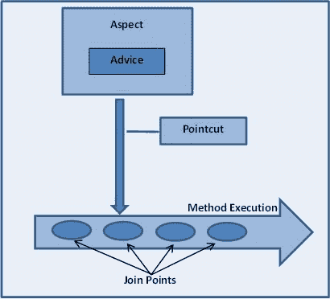

# Spring AOP – AspectJ 注释配置示例

> 原文： [https://howtodoinjava.com/spring-aop/spring-aop-aspectj-example-tutorial-using-annotation-config/](https://howtodoinjava.com/spring-aop/spring-aop-aspectj-example-tutorial-using-annotation-config/)

Spring 的关键组件之一是[面向方面编程（AOP）](https://docs.spring.io/spring/docs/current/spring-framework-reference/html/aop.html "spring aop")框架。 尽管 Spring IoC 容器不依赖于 AOP，这意味着您不需要时就不需要使用 AOP，但 AOP 是对 Spring IoC 的补充，可以提供功能强大的中间件解决方案。 就像 OOP 中模块化的关键单元是类，AOP 中模块化的单元是方面。 方面使关注点（也可以理解为横切关注点）实现模块化，例如跨多种类型和对象的事务管理。

AspectJ 已成长为一个完整且流行的 AOP 框架，Spring 支持在其 AOP 框架中使用以 [AspectJ](https://eclipse.org/aspectj/ "aspectj") 批注编写的 POJO 方面。 由于越来越多的 AOP 框架支持 AspectJ 注释，因此您的 AspectJ 样式的方面更有可能在支持 AspectJ 的其他 AOP 框架中重用。

**不幸的是，AOP 术语不是很直观，因此我将首先创建一个示例应用程序，然后将这些术语与示例中的用法相关联。**

## Spring AOP + AspectJ 示例

在编写任何代码之前，您将需要将 Spring AOP 依赖项导入到您的项目中。

```java
<dependency>
	<groupId>org.springframework</groupId>
	<artifactId>spring-context</artifactId>
	<version>4.1.4.RELEASE</version>
</dependency>
<dependency>
	<groupId>org.springframework</groupId>
	<artifactId>spring-context-support</artifactId>
	<version>4.1.4.RELEASE</version>
</dependency>
<dependency>
	<groupId>org.springframework</groupId>
	<artifactId>spring-aop</artifactId>
	<version>4.1.4.RELEASE</version>
</dependency>
<dependency>
	<groupId>org.aspectj</groupId>
	<artifactId>aspectjrt</artifactId>
	<version>1.6.11</version>
</dependency>
<dependency>
	<groupId>org.aspectj</groupId>
	<artifactId>aspectjweaver</artifactId>
	<version>1.6.11</version>
</dependency>

```

在此示例中，我采用`EmployeeManager`类的非常基本的实现，该实现具有一些方法集，这些方法应基本上将`EmployeeDTO`对象选择/修改为数据库。

**EmployeeDTO.java**

```java
public class EmployeeDTO {

	private Integer id;
	private String firstName;
	private String lastName;

	//Setters and Getters
}

```

**EmployeeManager.java**

```java
import java.util.ArrayList;
import java.util.List;

import org.springframework.stereotype.Component;

@Component
public class EmployeeManager 
{
	public EmployeeDTO getEmployeeById(Integer employeeId) {
		System.out.println("Method getEmployeeById() called");
		return new EmployeeDTO();
	}

	public List<EmployeeDTO> getAllEmployee() {
		System.out.println("Method getAllEmployee() called");
		return new ArrayList<EmployeeDTO>();
	}

	public void createEmployee(EmployeeDTO employee) {
		System.out.println("Method createEmployee() called");
	}

	public void deleteEmployee(Integer employeeId) {
		System.out.println("Method deleteEmployee() called");
	}

	public void updateEmployee(EmployeeDTO employee) {
		System.out.println("Method updateEmployee() called");
	}
}

```

然后，我创建了一个日志记录方面，它将记录执行了哪个方法。

**EmployeeCRUDAspect.java**

```java
@Aspect
public class EmployeeCRUDAspect {

	@Before("execution(* EmployeeManager.getEmployeeById(..))")
	public void logBeforeV1(JoinPoint joinPoint) 
	{
		System.out.println("EmployeeCRUDAspect.logBeforeV1() : " + joinPoint.getSignature().getName());
	}

	@Before("execution(* EmployeeManager.*(..))")
	public void logBeforeV2(JoinPoint joinPoint) 
	{
		System.out.println("EmployeeCRUDAspect.logBeforeV2() : " + joinPoint.getSignature().getName());
	}

	@After("execution(* EmployeeManager.getEmployeeById(..))")
	public void logAfterV1(JoinPoint joinPoint) 
	{
		System.out.println("EmployeeCRUDAspect.logAfterV1() : " + joinPoint.getSignature().getName());
	}

	@After("execution(* EmployeeManager.*(..))")
	public void logAfterV2(JoinPoint joinPoint) 
	{
		System.out.println("EmployeeCRUDAspect.logAfterV2() : " + joinPoint.getSignature().getName());
	}
}

```

`applicationContext.xml`文件具有以下配置，以使用注释配置来启用 AOP 和 IoC 容器。

```java
<aop:aspectj-autoproxy />

<context:component-scan base-package="com.howtodoinjava.demo.aop" />

<bean id="loggingAspect" class="com.howtodoinjava.demo.aop.EmployeeCRUDAspect" />

```

现在测试 AOP 配置和其他内容。

```java
import org.springframework.context.ApplicationContext;
import org.springframework.context.support.ClassPathXmlApplicationContext;

public class TestAOP
{
	@SuppressWarnings("resource")
	public static void main(String[] args) {

		ApplicationContext context = new ClassPathXmlApplicationContext("com/howtodoinjava/demo/aop/applicationContext.xml");
		EmployeeManager manager = context.getBean(EmployeeManager.class);

		manager.getEmployeeById(1);
		manager.createEmployee(new EmployeeDTO());
	}
}

Output:

EmployeeCRUDAspect.logBeforeV1() : getEmployeeById
EmployeeCRUDAspect.logBeforeV2() : getEmployeeById
Method getEmployeeById() called
EmployeeCRUDAspect.logAfterV1() : getEmployeeById
EmployeeCRUDAspect.logAfterV2() : getEmployeeById

EmployeeCRUDAspect.logBeforeV2() : createEmployee
Method createEmployee() called
EmployeeCRUDAspect.logAfterV2() : createEmployee

```

很好，AOP 配置成功。 现在继续学习 AOP 术语。

## AOP 关键条款

现在让我们定义一些中心的 AOP 概念和术语，并与上面的示例相关联。



**1）方面：**涉及多个类别的关注点的模块化。 事务管理是企业 Java 应用程序中横切关注的一个很好的例子。

在我们的示例中，我们创建了一个日志记录方面。 要创建方面，您需要在方面类上应用@Aspect 批注并将其注册到`applicationContext.xml`文件中。

```java
@Aspect
public class EmployeeCRUDAspect {
	...
}

```

这是您将方面注册到上下文中的方式。

```java
<bean id="loggingAspect" class="com.howtodoinjava.demo.aop.EmployeeCRUDAspect" />

```

请记住首先使用“ **&lt; aop：aspectj-autoproxy / &gt;** ”将 AOP 支持添加到您的上下文中。

**2）连接点：**在程序执行期间的点，例如方法的执行或异常的处理。 在 Spring AOP 中，连接点始终代表方法的执行。

在我们的示例中，`EmployeeManager`内部定义的所有方法都是联合点。

**3）建议：某个方面在特定连接点采取的**操作。 不同类型的建议包括“周围”，“之前”和“之后”建议。 许多 AOP 框架（包括 Spring）将建议建模为拦截器，并在联接点周围维护了一系列拦截器。

在我们的示例中，所有`logBefore()`和`logAfter()`方法都是建议。

**4）切入点：**与连接点匹配的谓词。 建议与切入点表达式关联，并在与该切入点匹配的任何连接点处运行（例如，执行具有特定名称的方法）。 切入点表达式匹配的连接点的概念是 AOP 的核心，默认情况下，Spring 使用 AspectJ 切入点表达语言。

在我们的示例中，在`@Before`和`@After`批注（即“ `execution(* EmployeeManager.getEmployeeById(..))`”）中传递的表达式是切入点。

**5）简介：**代表类型声明其他方法或字段。 Spring AOP 允许您向任何建议对象引入新接口（和相应的实现）。 例如，您可以使用简介使 Bean 实现 IsModified 接口，以简化缓存。

我将为此创建一个单独的示例。

**6）目标对象：**对象由一个或多个方面建议。 也称为建议对象。 由于 Spring AOP 是使用运行时代理实现的，因此该对象将始终是代理对象。

在我们的示例中，建议使用`EmployeeManager`对象，因此它是目标对象。

**7）AOP 代理：**由 AOP 框架创建的对象，用于实现方面协定（建议方法执行等）。 在 Spring 框架中，AOP 代理将是 JDK 动态代理或 CGLIB 代理。

在我们的示例中，当我们向`EmployeeManager`类的 bean 引用询问时，将创建一个代理对象。 您可以在下图中看到代理的类，该类是运行时调试器的屏幕截图。


因此，我们现在很好，可以将 spring AOP 的关键术语与实际代码关联起来。 现在，让我们进一步列出**类型的建议**，这些建议可在春季 AOP 中使用。

1.  **咨询之前：**咨询在连接点之前执行，但不具有阻止执行流程前进到连接点的能力（除非它引发异常）。 要使用此建议，请使用上面示例中使用的@Before 批注。
2.  **返回建议后：**在连接点正常完成后要执行的建议：例如，如果某个方法返回而没有引发异常。 要使用此建议，请使用@AfterReturning 批注。
3.  **引发建议后：**如果方法因引发异常而退出，则要执行的建议。 要使用此建议，请使用@AfterThrowing 批注。
4.  **之后的建议：**无论连接点退出的方式如何（正常或特殊返回），均应执行的建议。 要使用此建议，请在上面的示例中使用@After 注释。
5.  **建议周围：**围绕联接点的建议，例如方法调用。 这是最有力的建议。 要使用此建议，请使用@Around 批注。

周围建议可以在方法调用之前和之后执行自定义行为。 它还负责选择是返回连接点还是通过返回其自身的返回值或引发异常来捷径建议的方法执行。 周围的建议可以编写如下。

```java
@Around("execution(* EmployeeManager.getEmployeeById(..))")
public void logAround(ProceedingJoinPoint joinPoint) throws Throwable 
{
	System.out.println("Write code for before advise");

	joinPoint.proceed(); //continue to called method i.e. EmployeeManager.getEmployeeById()

	System.out.println("Write code for after advise");
}

```

这就是本入门教程的全部内容。 我将发布更多的教程，其中包含 **spring Aspectj aop 概念**的更多详细信息。

**祝您学习愉快！**

**参考**： [Spring Docs](https://docs.spring.io/spring/docs/current/spring-framework-reference/html/aop.html "spring aop")