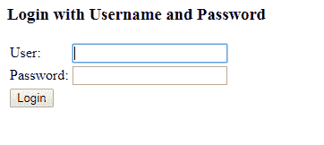
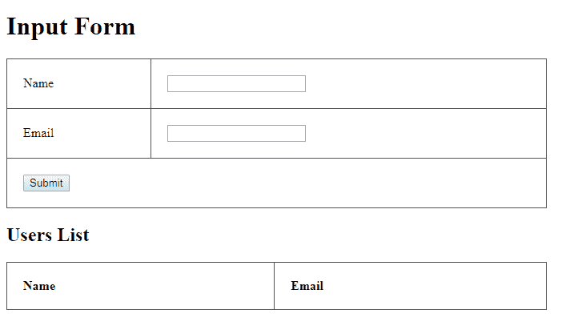

# Spring Security 5 – Java 配置

> 原文： [https://howtodoinjava.com/spring5/security5/security-java-config-enablewebsecurity-example/](https://howtodoinjava.com/spring5/security5/security-java-config-enablewebsecurity-example/)

**的 Java 示例借助`@EnableWebSecurity`注解和`WebSecurityConfigurerAdapter`类启用了 Spring Security Java 配置**。

此示例基于 [spring webmvc Hibernate 集成](https://howtodoinjava.com/spring5/webmvc/spring5-mvc-hibernate5-example/)示例构建。

## 1\. 包含 Spring Security 5 依赖项

包括 SpringSecurity 罐。 我正在使用 maven，因此为 **spring security 5** 添加了相应的依赖项。

`pom.xml`

```java
<properties>
		<failOnMissingWebXml>false</failOnMissingWebXml>
		<spring.version>5.0.7.RELEASE</spring.version>
</properties>	

<!-- Spring MVC Dependency -->
<dependency>
	<groupId>org.springframework</groupId>
	<artifactId>spring-webmvc</artifactId>
	<version>${spring.version}</version>
</dependency>

<!-- Spring Security Core -->
<dependency>
	<groupId>org.springframework.security</groupId>
	<artifactId>spring-security-core</artifactId>
	<version>${spring.version}</version>
</dependency>

<!-- Spring Security Config -->
<dependency>
	<groupId>org.springframework.security</groupId>
	<artifactId>spring-security-config</artifactId>
	<version>${spring.version}</version>
</dependency>

<!-- Spring Security Web -->
<dependency>
	<groupId>org.springframework.security</groupId>
	<artifactId>spring-security-web</artifactId>
	<version>${spring.version}</version>
</dependency>

```

## 2\. 创建 Spring Security 5 配置 – @EnableWebSecurity

我创建了这个简单的安全配置，并添加了两个演示用户“ `user`”和“ `admin`”。

`SecurityConfig.java`

```java
package com.howtodoinjava.demo.spring.config;

import org.springframework.beans.factory.annotation.Autowired;
import org.springframework.context.annotation.Bean;
import org.springframework.security.config.annotation.authentication.builders.AuthenticationManagerBuilder;
import org.springframework.security.config.annotation.web.builders.HttpSecurity;
import org.springframework.security.config.annotation.web.configuration.EnableWebSecurity;
import org.springframework.security.config.annotation.web.configuration.WebSecurityConfigurerAdapter;
import org.springframework.security.crypto.bcrypt.BCryptPasswordEncoder;
import org.springframework.security.crypto.password.PasswordEncoder;

@EnableWebSecurity
public class SecurityConfig extends WebSecurityConfigurerAdapter {

	@Autowired
	PasswordEncoder passwordEncoder;

	@Override
	protected void configure(AuthenticationManagerBuilder auth) throws Exception {
		auth.inMemoryAuthentication()
		.passwordEncoder(passwordEncoder)
		.withUser("user").password(passwordEncoder.encode("123456")).roles("USER")
		.and()
		.withUser("admin").password(passwordEncoder.encode("123456")).roles("USER", "ADMIN");
	}

	@Bean
	public PasswordEncoder passwordEncoder() {
		return new BCryptPasswordEncoder();
	}

	@Override
	protected void configure(HttpSecurity http) throws Exception {
		http.authorizeRequests()
		.antMatchers("/login").permitAll()
		.antMatchers("/admin/**").hasRole("ADMIN")
		.antMatchers("/**").hasAnyRole("ADMIN", "USER")
		.and().formLogin()
		.and().logout().logoutSuccessUrl("/login").permitAll()
		.and().csrf().disable();
	}
}

```

## 3\. 初始化 spring 安全

在 Spring 中，使用`DelegatingFilterProxy`实现安全性。 要使用 Java 配置的 spring 容器注册它，您应该使用[`AbstractSecurityWebApplicationInitializer`](https://docs.spring.io/spring-security/site/docs/4.2.4.RELEASE/apidocs/org/springframework/security/web/context/AbstractSecurityWebApplicationInitializer.html)。

Spring 将在应用程序启动期间检测到此类的实例，并在其他已注册过滤器之前注册`DelegatingFilterProxy`以使用`springSecurityFilterChain`。 它还注册了`ContextLoaderListener`。

`SpringSecurityInitializer.java`

```java
package com.howtodoinjava.demo.spring.config;

import org.springframework.security.web.context.AbstractSecurityWebApplicationInitializer;
public class SpringSecurityInitializer extends AbstractSecurityWebApplicationInitializer {
	//no code needed
}

```

另外，包括`SecurityConfig`至`AppInitializer`。

`AppInitializer.java`

```java
package com.howtodoinjava.demo.spring.config;

import org.springframework.web.servlet.support.AbstractAnnotationConfigDispatcherServletInitializer;

public class AppInitializer extends AbstractAnnotationConfigDispatcherServletInitializer {

   @Override
   protected Class<?>[] getRootConfigClasses() {
      return new Class[] { HibernateConfig.class, SecurityConfig.class };
   }

   @Override
   protected Class<?>[] getServletConfigClasses() {
      return new Class[] { WebMvcConfig.class };
   }

   @Override
   protected String[] getServletMappings() {
      return new String[] { "/" };
   }
}

```

## 4\. 验证安全性

启动应用程序并启动主页。 您将获得一个登录页面。 这意味着 SpringSecurity 装置已配置并正常工作。



Login Form

**使用用户名/密码登录-“用户”和“ 123456”**



Login Success

学习愉快！

[Sourcecode Download](https://github.com/lokeshgupta1981/spring-webmvc)