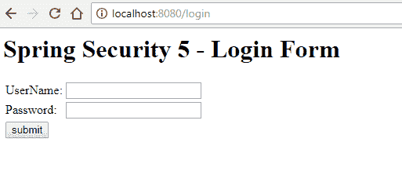
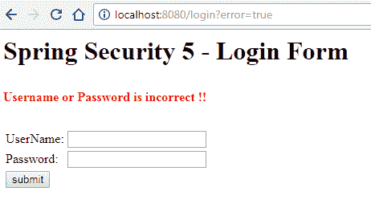
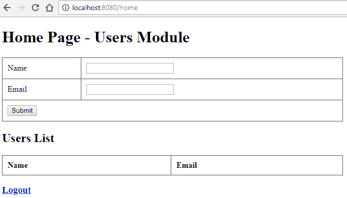
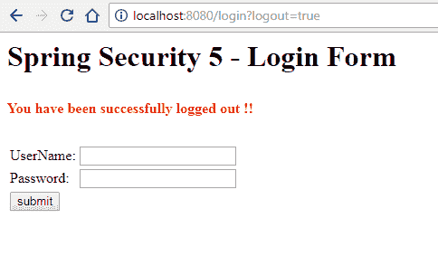

# Spring Security 5 登录表单示例

> 原文： [https://howtodoinjava.com/spring5/security5/login-form-example/](https://howtodoinjava.com/spring5/security5/login-form-example/)

在此 Spring Security 5 教程中，学习将基于**的自定义登录表单**的安全性添加到我们的 Spring WebMVC 应用程序中。 我正在使用 **Spring Security 5** 构建此示例。 本教程还讨论了从会话注销。

## 1.包含 Spring Security 5 依赖项

包括弹簧安全罐。 我正在使用 maven，因此为 **spring security version 5.0.7.RELEASE** 添加了相应的依赖项。

`pom.xml`

```java
<properties>
		<failOnMissingWebXml>false</failOnMissingWebXml>
		<spring.version>5.2.0.RELEASE</spring.version>
</properties>	

<!-- Spring MVC Dependency -->
<dependency>
	<groupId>org.springframework</groupId>
	<artifactId>spring-webmvc</artifactId>
	<version>${spring.version}</version>
</dependency>

<!-- Spring Security Core -->
<dependency>
	<groupId>org.springframework.security</groupId>
	<artifactId>spring-security-core</artifactId>
	<version>${spring.version}</version>
</dependency>

<!-- Spring Security Config -->
<dependency>
	<groupId>org.springframework.security</groupId>
	<artifactId>spring-security-config</artifactId>
	<version>${spring.version}</version>
</dependency>

<!-- Spring Security Web -->
<dependency>
	<groupId>org.springframework.security</groupId>
	<artifactId>spring-security-web</artifactId>
	<version>${spring.version}</version>
</dependency>

```

## 2.创建 Spring Security 配置

#### 2.1. 配置身份验证和 URL 安全

*   我创建了这个简单的安全配置，并添加了两个演示用户“ `user`”和“ `admin`”。
*   [`@EnableWebSecurity`](https://docs.spring.io/spring-security/site/docs/4.2.5.RELEASE/apidocs/org/springframework/security/config/annotation/web/configuration/EnableWebSecurity.html)启用 Spring Security 的网络安全支持，并提供 Spring MVC 集成。
*   [`WebSecurityConfigurerAdapter`](https://docs.spring.io/spring-security/site/docs/4.2.5.RELEASE/apidocs/org/springframework/security/config/annotation/web/configuration/WebSecurityConfigurerAdapter.html)提供了一组用于启用特定 Web 安全配置的方法。
*   `configure(HttpSecurity http)`用于保护需要安全性的不同 URL。
*   它**在 URL `/login`上配置自定义登录页面**。 如果用户名/密码匹配，则将请求重定向到`/home`，否则登录页面会刷新并显示相应的错误消息。
*   它还**配置从会话**注销。 注销后，用户将再次重定向到登录页面。

> 我已使用`auth.inMemoryAuthentication()`使用内存中身份验证。 您可以使用`auth.jdbcAuthentication()`配置 JDBC 身份验证，或使用`auth.ldapAuthentication()`配置 LDAP 身份验证。

`SecurityConfig.java`

```java
package com.howtodoinjava.demo.spring.config;

import org.springframework.beans.factory.annotation.Autowired;
import org.springframework.context.annotation.Bean;
import org.springframework.security.config.annotation.authentication.builders.AuthenticationManagerBuilder;
import org.springframework.security.config.annotation.web.builders.HttpSecurity;
import org.springframework.security.config.annotation.web.configuration.EnableWebSecurity;
import org.springframework.security.config.annotation.web.configuration.WebSecurityConfigurerAdapter;
import org.springframework.security.crypto.bcrypt.BCryptPasswordEncoder;
import org.springframework.security.crypto.password.PasswordEncoder;

@EnableWebSecurity
public class SecurityConfig extends WebSecurityConfigurerAdapter {

	@Autowired
	PasswordEncoder passwordEncoder;

	@Override
	protected void configure(AuthenticationManagerBuilder auth) throws Exception {
		auth.inMemoryAuthentication()
		.passwordEncoder(passwordEncoder)
		.withUser("user").password(passwordEncoder.encode("123456")).roles("USER")
		.and()
		.withUser("admin").password(passwordEncoder.encode("123456")).roles("USER", "ADMIN");
	}

	@Bean
	public PasswordEncoder passwordEncoder() {
		return new BCryptPasswordEncoder();
	}

	@Override
	protected void configure(HttpSecurity http) throws Exception {
		http.authorizeRequests()
		.antMatchers("/login")
			.permitAll()
		.antMatchers("/**")
			.hasAnyRole("ADMIN", "USER")
		.and()
			.formLogin()
			.loginPage("/login")
			.defaultSuccessUrl("/home")
			.failureUrl("/login?error=true")
			.permitAll()
		.and()
			.logout()
			.logoutSuccessUrl("/login?logout=true")
			.invalidateHttpSession(true)
			.permitAll()
		.and()
			.csrf()
			.disable();
	}
}

```

> 了解更多：[登录表单](https://howtodoinjava.com/spring-security/login-form-based-spring-3-security-example/)的 Spring Security XML Config

#### 2.2. 将 Spring Security 绑定到 Web 应用程序

在 Spring Web 应用程序中，使用`DelegatingFilterProxy`实现安全性。 要使用 Java 配置的 spring 容器注册它，您应该使用[`AbstractSecurityWebApplicationInitializer`](https://docs.spring.io/spring-security/site/docs/4.2.4.RELEASE/apidocs/org/springframework/security/web/context/AbstractSecurityWebApplicationInitializer.html)。

Spring 将在应用程序启动期间检测到此类的实例，并在其他已注册过滤器之前注册`DelegatingFilterProxy`以使用`springSecurityFilterChain`。 它还注册了`ContextLoaderListener`。

`SpringSecurityInitializer.java`

```java
package com.howtodoinjava.demo.spring.config;

import org.springframework.security.web.context.AbstractSecurityWebApplicationInitializer;
public class SpringSecurityInitializer extends AbstractSecurityWebApplicationInitializer {
	//no code needed
}

```

另外，包括`SecurityConfig`至`AppInitializer`。

`AppInitializer.java`

```java
package com.howtodoinjava.demo.spring.config;

import org.springframework.web.servlet.support.AbstractAnnotationConfigDispatcherServletInitializer;

public class AppInitializer extends AbstractAnnotationConfigDispatcherServletInitializer {

   @Override
   protected Class<?>[] getRootConfigClasses() {
      return new Class[] { HibernateConfig.class, SecurityConfig.class };
   }

   @Override
   protected Class<?>[] getServletConfigClasses() {
      return new Class[] { WebMvcConfig.class };
   }

   @Override
   protected String[] getServletMappings() {
      return new String[] { "/" };
   }
}

```

## 3.添加自定义登录表单

#### 3.1. 登录控制器

添加登录控制器方法来处理登录和注销请求。

`LoginController.java`

```java
package com.howtodoinjava.demo.spring.controller;

import javax.servlet.http.HttpServletRequest;
import javax.servlet.http.HttpServletResponse;

import org.springframework.security.core.Authentication;
import org.springframework.security.core.context.SecurityContextHolder;
import org.springframework.security.web.authentication.logout.SecurityContextLogoutHandler;
import org.springframework.stereotype.Controller;
import org.springframework.ui.Model;
import org.springframework.web.bind.annotation.RequestMapping;
import org.springframework.web.bind.annotation.RequestMethod;
import org.springframework.web.bind.annotation.RequestParam;

@Controller
public class LoginController 
{
	@RequestMapping(value = "/login", method = RequestMethod.GET)
    public String loginPage(@RequestParam(value = "error", required = false) String error, 
    						@RequestParam(value = "logout", required = false) String logout,
    						Model model) {
		String errorMessge = null;
		if(error != null) {
			errorMessge = "Username or Password is incorrect !!";
		}
		if(logout != null) {
			errorMessge = "You have been successfully logged out !!";
		}
		model.addAttribute("errorMessge", errorMessge);
        return "login";
    }

    @RequestMapping(value="/logout", method = RequestMethod.GET)
    public String logoutPage (HttpServletRequest request, HttpServletResponse response) {
        Authentication auth = SecurityContextHolder.getContext().getAuthentication();
        if (auth != null){    
            new SecurityContextLogoutHandler().logout(request, response, auth);
        }
        return "redirect:/login?logout=true";
    }
}

```

#### 3.2. login.jsp

创建将接受`username`和`password`的`login.jsp`文件； 并将它们发布到 URL `/login`。

`login.jsp`

```java
<%@ taglib prefix="c" uri="http://java.sun.com/jsp/jstl/core"%>
<html>
<body onload='document.loginForm.username.focus();'>
	<h1>Spring Security 5 - Login Form</h1>

	<c:if test="${not empty errorMessge}"><div style="color:red; font-weight: bold; margin: 30px 0px;">${errorMessge}</div></c:if>

	<form name='login' action="/login" method='POST'>
		<table>
			<tr>
				<td>UserName:</td>
				<td><input type='text' name='username' value=''></td>
			</tr>
			<tr>
				<td>Password:</td>
				<td><input type='password' name='password' /></td>
			</tr>
			<tr>
				<td colspan='2'><input name="submit" type="submit" value="submit" /></td>
			</tr>
		</table>
		<input type="hidden" name="${_csrf.parameterName}" value="${_csrf.token}" />
	</form>
</body>
</html>

```

## 4\. Spring Security 5 登录表单演示

1.  Start the application with maven run command `tomcat7:run`. Launch homepage `http://localhost:8080/home`. It will redirected to login page `http://localhost:8080/login`.

    

    Login Form

2.  Enter INCORRECT username or password. A login error message will be displayed.

    

    Incorrect username or password

3.  Enter CORRECT username and password combination. `user` and `123456`. Home page will be displayed.

    

    Home Page

4.  Click on logout button. The user will be logged out and redirected back to the login page.

    

    Logged Out

学习愉快！

[Sourcecode Download](https://github.com/lokeshgupta1981/spring-webmvc)