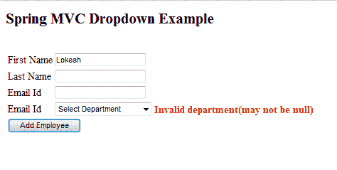

# Spring MVC 填充和验证下拉列表示例

> 原文： [https://howtodoinjava.com/spring-mvc/spring-mvc-populate-and-validate-dropdown-example/](https://howtodoinjava.com/spring-mvc/spring-mvc-populate-and-validate-dropdown-example/)

如果您正在使用 [**Spring MVC**](//howtodoinjava.com/category/frameworks/java-spring-tutorials/spring-mvc/) 开发的任何面向客户的 Web 应用程序，那么您可能还需要在应用程序 UI 中的某个位置使用下拉框。 本教程将帮助您显示预填充的下拉列表，然后验证用户在提交表单时是否选择了任何值。

这篇文章是我以前关于 [**spring mvc 验证（使用 JSR-303 注解**](//howtodoinjava.com/spring/spring-mvc/spring-bean-validation-example-with-jsr-303-annotations/) ）的继续。 我将修改相同的源代码。

**在此示例中**，我将显示一个用于向系统中添加新员工的表单。 该表格将有一个下拉列表，列出所有部门。 应用程序用户必须在提交表单之前从下拉列表中选择一个值。

Spring MVC 下拉菜单示例 – 空白表单

[**下载源码**](https://drive.google.com/file/d/0B7yo2HclmjI4NE9ILW1GNDBCUGM/view?usp=sharing)

[PRE0]

## 模型类

`DepartmentVO.java`

[PRE1]

`EmployeeVO.java`

此类具有`DepartmentVO`的关联属性。

[PRE2]

## 添加`PropertyEditorSupport`

我们不会在 UI 中将`DepartmentVO`显示为 java 对象，而是当用户提交绑定到`Department`字段的属性时，HTTP POST 中只会出现一个字符串值。 我们需要某种机制将字符串值转换回`DepartmentVO`实例并注入`EmployeeVO`实例。

Spring 为此提供了`PropertyEditorSupport`类。

`DepartmentEditor.java`

[PRE3]

可以，但是 spring 怎么会知道我们有此类用于转换目的。 为此，我们必须告诉 Spring。 我们可以通过以下方式在控制器类中进行操作。

[PRE4]

现在，每次将表单提交到`EmployeeController`且字段绑定到`department`的字段时，`DepartmentEditor`都会用于将字符串值转换为`DepartmentVO`实例。

`EmployeeController`的完整代码如下。

`EmployeeController.java`

[PRE5]

要了解有关此控制器中更多代码段的更多信息，请参考本 [**spring mvc 显示形式教程**](//howtodoinjava.com/spring/spring-mvc/spring-mvc-display-validate-and-submit-form-example/) 。

## 查看更改以显示下拉框

要显示下拉列表，您必须将部门的集合提供给 jsp 文件。 这是从控制器完成的。 请注意，在此示例中，我对集合进行了硬编码。 在生产类应用程序中，您将需要动态构建此集合。

[PRE6]

可以在`form:select`标记的 JSP 文件内部访问此`allDepartments`属性。

[PRE7]

## 下拉验证

为了验证下拉框，我们使用了以下内容。

1）我们在`EmployeeVO`内的**部门**字段中使用了`@NotNull`注解。 如果字段为`null`，使用 JSR-303 的 spring 验证将自动引发错误。

[PRE8]

2）由于具有`@NotNull`注解，因此我们要做的就是在`department`字段中为所有意外值设置`null`。 这是在`DepartmentEditor`内部完成的，因为在进入控制器代码之前，会调用`DepartmentEditor.setAsText()`来设置**部门**的正确值。

[PRE9]

**在上面的代码中**，仅当下拉选择值是 1,2 或 3 时； 那么只会设置部门的有效实例。 否则，部门将设置为`null`。 此`null`将引发错误。

## 测试下拉菜单

1）部署应用程序并输入 URL：`http://localhost:8080/springmvcexample/employee-module/addNew`

Spring MVC 下拉菜单示例 – 空白表达

2）填写名字并提交表格。 您将验证消息。

Spring MVC 下拉菜单示例 – 下拉菜单验证

3）从列表中选择一个部门并提交表格。 您将成功页面。

Spring MVC 表单示例 – 成功消息

[**下载源码**](https://drive.google.com/file/d/0B7yo2HclmjI4NE9ILW1GNDBCUGM/view?usp=sharing)

将我的问题放在评论框中。

**祝您学习愉快！**