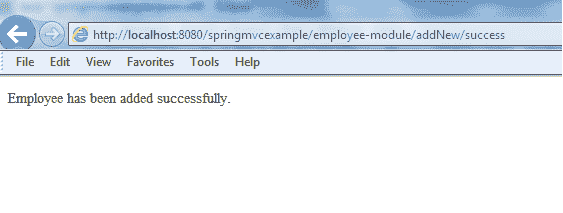

# Spring MVC 填充和验证下拉列表示例

> 原文： [https://howtodoinjava.com/spring-mvc/spring-mvc-populate-and-validate-dropdown-example/](https://howtodoinjava.com/spring-mvc/spring-mvc-populate-and-validate-dropdown-example/)

如果您正在使用 [**Spring MVC**](//howtodoinjava.com/category/frameworks/java-spring-tutorials/spring-mvc/) 开发的任何面向客户的 Web 应用程序，那么您可能还需要在应用程序 UI 中的某个位置使用下拉框。 本教程将帮助您显示预填充的下拉列表，然后验证用户在提交表单时是否选择了任何值。

这篇文章是我以前关于 [**spring mvc 验证（使用 JSR-303 批注**](//howtodoinjava.com/spring/spring-mvc/spring-bean-validation-example-with-jsr-303-annotations/) ）的继续。 我将修改相同的源代码。

**在此示例中**，我将显示一个用于向系统中添加新 Employee 的表单。 该表格将有一个下拉列表，列出所有部门。 应用程序用户必须在提交表单之前从下拉列表中选择一个值。

[](//howtodoinjava.com/wp-content/uploads/2015/02/Spring-MVC-Dropdown-Example-Blank-Form.png)

Spring MVC Dropdown Example – Blank Form

[**Sourcecode Download**](https://drive.google.com/file/d/0B7yo2HclmjI4NE9ILW1GNDBCUGM/view?usp=sharing)

```java
Table of Contents

Model Classes
Adding PropertyEditorSupport
View layer changes for displaying Dropdown box
Dropdown validation changes
Test The Application
```

## 模型类

`DepartmentVO.java`

```java
package com.howtodoinjava.demo.model;

public class DepartmentVO 
{
	public DepartmentVO(Integer id, String name) {
		super();
		this.id = id;
		this.name = name;
	}

	private Integer id;
	private String name;

	//Setters and Getters

	@Override
	public String toString() {
		return "DepartmentVO [id=" + id + ", name=" + name + "]";
	}
}

```

`EmployeeVO.java`

此类具有`DepartmentVO`的关联属性。

```java
package com.howtodoinjava.demo.model;

import java.io.Serializable;
import javax.validation.constraints.NotNull;
import org.hibernate.validator.constraints.NotEmpty;

public class EmployeeVO implements Serializable 
{
	private static final long serialVersionUID = 1L;

	private Integer id;

	@NotEmpty
	private String firstName;

	private String lastName;

	private String email;

	@NotNull
	private DepartmentVO department;

	//Setters and Getters

	@Override
	public String toString() {
		return "EmployeeVO [id=" + id + ", firstName=" + firstName
				+ ", lastName=" + lastName + ", email=" + email
				+ ", department=" + department + "]";
	}
}

```

## 添加 PropertyEditorSupport

我们不会在 UI 中将`DepartmentVO`显示为 java 对象，而是当用户提交绑定到 Department 字段的属性时，HTTP POST 中只会出现一个字符串值。 我们需要某种机制将字符串值转换回`DepartmentVO`实例并注入`EmployeeVO`实例。

Spring 为此提供了`PropertyEditorSupport`类。

`DepartmentEditor.java`

```java
package com.howtodoinjava.demo.convertor;

import java.beans.PropertyEditorSupport;
import com.howtodoinjava.demo.model.DepartmentVO;

public class DepartmentEditor extends PropertyEditorSupport 
{
	//This will be called when user HTTP Post to server a field bound to DepartmentVO
    @Override
    public void setAsText(String id) 
    {
    	DepartmentVO d;
    	switch(Integer.parseInt(id))
		{
			case 1: d = new DepartmentVO(1,  "Human Resource"); break;
			case 2: d = new DepartmentVO(2,  "Finance"); break;
			case 3: d = new DepartmentVO(3,  "Information Technology"); break;
			default: d = null;
		}
        this.setValue(d);
    }
}

```

可以，但是 spring 怎么会知道我们有此类用于转换目的。 为此，我们必须告诉 Spring。 我们可以通过以下方式在 Controller 类中进行操作。

```java
@InitBinder
public void initBinder(WebDataBinder binder) {
	binder.registerCustomEditor(DepartmentVO.class, new DepartmentEditor());
}

```

现在，每次将表单提交到`EmployeeController`且字段绑定到`department`的字段时，`DepartmentEditor`都会用于将字符串值转换为`DepartmentVO`实例。

`EmployeeController`的完整代码如下。

`EmployeeController.java`

```java
package com.howtodoinjava.demo.controller;

import java.util.ArrayList;
import java.util.List;
import java.util.Set;

import javax.validation.ConstraintViolation;
import javax.validation.Validation;
import javax.validation.Validator;
import javax.validation.ValidatorFactory;

import org.springframework.beans.factory.annotation.Autowired;
import org.springframework.stereotype.Controller;
import org.springframework.ui.Model;
import org.springframework.validation.BindingResult;
import org.springframework.validation.FieldError;
import org.springframework.web.bind.WebDataBinder;
import org.springframework.web.bind.annotation.InitBinder;
import org.springframework.web.bind.annotation.ModelAttribute;
import org.springframework.web.bind.annotation.RequestMapping;
import org.springframework.web.bind.annotation.RequestMethod;
import org.springframework.web.bind.annotation.SessionAttributes;
import org.springframework.web.bind.support.SessionStatus;

import com.howtodoinjava.demo.convertor.DepartmentEditor;
import com.howtodoinjava.demo.model.DepartmentVO;
import com.howtodoinjava.demo.model.EmployeeVO;
import com.howtodoinjava.demo.service.EmployeeManager;

@Controller
@RequestMapping("/employee-module/addNew")
@SessionAttributes("employee")
public class EmployeeController
{
	@Autowired
	EmployeeManager manager;

	private Validator validator;

	public EmployeeController()
	{
		ValidatorFactory validatorFactory = Validation.buildDefaultValidatorFactory();
		validator = validatorFactory.getValidator();
	}

	@InitBinder
    public void initBinder(WebDataBinder binder) {
        binder.registerCustomEditor(DepartmentVO.class, new DepartmentEditor());
    }

	@ModelAttribute("allDepartments")
    public List<DepartmentVO> populateDepartments() 
    {
        ArrayList<DepartmentVO> departments = new ArrayList<DepartmentVO>();
        departments.add(new DepartmentVO(-1,  "Select Department"));
        departments.add(new DepartmentVO(1,  "Human Resource"));
        departments.add(new DepartmentVO(2,  "Finance"));
        departments.add(new DepartmentVO(3,  "Information Technology"));
        return departments;
    }

	@RequestMapping(method = RequestMethod.GET)
	public String setupForm(Model model) {
		EmployeeVO employeeVO = new EmployeeVO();
		model.addAttribute("employee", employeeVO);
		return "addEmployee";
	}

	@RequestMapping(method = RequestMethod.POST)
	public String submitForm(@ModelAttribute("employee") EmployeeVO employeeVO,
			BindingResult result, SessionStatus status) {

		Set<ConstraintViolation<EmployeeVO>> violations = validator.validate(employeeVO);

		for (ConstraintViolation<EmployeeVO> violation : violations) 
		{
            String propertyPath = violation.getPropertyPath().toString();
            String message = violation.getMessage();
            // Add JSR-303 errors to BindingResult
            // This allows Spring to display them in view via a FieldError
            result.addError(new FieldError("employee", propertyPath, "Invalid "+ propertyPath + "(" + message + ")"));
        }

		if (result.hasErrors()) {
			return "addEmployee";
		}
		// Store the employee information in database
		// manager.createNewRecord(employeeVO);

		System.out.println(employeeVO);

		// Mark Session Complete
		status.setComplete();
		return "redirect:addNew/success";
	}

	@RequestMapping(value = "/success", method = RequestMethod.GET)
	public String success(Model model) {
		return "addSuccess";
	}
}

```

要了解有关此控制器中更多代码段的更多信息，请参考本 [**spring mvc 显示形式教程**](//howtodoinjava.com/spring/spring-mvc/spring-mvc-display-validate-and-submit-form-example/) 。

## 查看更改以显示下拉框

要显示下拉列表，您必须将部门的集合提供给 jsp 文件。 这是从控制器完成的。 请注意，在此示例中，我对集合进行了硬编码。 在生产类应用程序中，您将需要动态构建此集合。

```java
@ModelAttribute("allDepartments")
public List<DepartmentVO> populateDepartments() 
{
	ArrayList<DepartmentVO> departments = new ArrayList<DepartmentVO>();
	departments.add(new DepartmentVO(-1,  "Select Department"));
	departments.add(new DepartmentVO(1,  "Human Resource"));
	departments.add(new DepartmentVO(2,  "Finance"));
	departments.add(new DepartmentVO(3,  "Information Technology"));
	return departments;
}

```

可以在`form:select`标记的 JSP 文件内部访问此`allDepartments`属性。

```java
<%@ page contentType="text/html;charset=UTF-8"%>
<%@ taglib prefix="form" uri="http://www.springframework.org/tags/form"%>
<%@ taglib prefix="spring" uri="http://www.springframework.org/tags" %>

<html>
<head>
	<title>Add Employee Form</title>
	<style>
	.error 
	{
		color: #ff0000;
		font-weight: bold;
	}
	</style>
</head>

<body>
	<h2><spring:message code="lbl.page" text="Add New Employee" /></h2>
	<br/>
	<form:form method="post" modelAttribute="employee">
		<%-- <form:errors path="*" cssClass="error" /> --%>
		<table>
			<tr>
				<td><spring:message code="lbl.firstName" text="First Name" /></td>
				<td><form:input path="firstName" /></td>
				<td><form:errors path="firstName" cssClass="error" /></td>
			</tr>
			<tr>
				<td><spring:message code="lbl.lastName" text="Last Name" /></td>
				<td><form:input path="lastName" /></td>
				<td><form:errors path="lastName" cssClass="error" /></td>
			</tr>
			<tr>
				<td><spring:message code="lbl.email" text="Email Id" /></td>
				<td><form:input path="email" /></td>
				<td><form:errors path="email" cssClass="error" /></td>
			</tr>

			<!-- DROPDOWN code -->

			<tr>
				<td><spring:message code="lbl.department" text="Department" /></td>
				<td><form:select path="department" items="${allDepartments}" itemValue="id" itemLabel="name" /></td>
				<td><form:errors path="department" cssClass="error" /></td>
			</tr>

			<tr>
				<td colspan="3"><input type="submit" value="Add Employee"/></td>
			</tr>
		</table>
	</form:form>
</body>
</html>

```

## 下拉验证

为了验证下拉框，我们使用了以下内容。

1）我们在`EmployeeVO`内的**部门**字段中使用了`@NotNull`批注。 如果 field 为 null，使用 JSR-303 的 spring 验证将自动引发错误。

```java
@NotNull
private DepartmentVO department;

```

2）由于具有`@NotNull`批注，因此我们要做的就是在`department`字段中为所有意外值设置 null。 这是在`DepartmentEditor`内部完成的，因为在进入控制器代码之前，会调用`DepartmentEditor.setAsText()`来设置**部门**的正确值。

```java
public void setAsText(String id) 
{
	DepartmentVO d;
	switch(Integer.parseInt(id))
	{
		case 1: d = new DepartmentVO(1,  "Human Resource"); break;
		case 2: d = new DepartmentVO(2,  "Finance"); break;
		case 3: d = new DepartmentVO(3,  "Information Technology"); break;
		default: d = null;
	}
	this.setValue(d);
}

```

**在上面的代码中**，仅当下拉选择值是 1,2 或 3 时； 那么只会设置部门的有效实例。 否则，部门将设置为 null。 此 null 将引发错误。

## 测试下拉菜单

1）部署应用程序并输入 URL：`http://localhost:8080/springmvcexample/employee-module/addNew`


Spring MVC Dropdown Example – Blank Form

2）填写名字并提交表格。 您将验证消息。


Spring MVC Dropdown Example – Dropdown Validation

3）从列表中选择一个部门并提交表格。 您将成功页面。



Spring MVC Form Example – Success Message

[**Sourcecode Download**](https://drive.google.com/file/d/0B7yo2HclmjI4NE9ILW1GNDBCUGM/view?usp=sharing)

将我的问题放在评论框中。

**祝您学习愉快！**