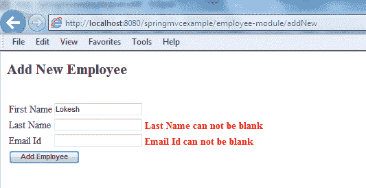

# Spring MVC 示例 – 显示，验证和提交表单

> 原文： [https://howtodoinjava.com/spring-mvc/spring-mvc-display-validate-and-submit-form-example/](https://howtodoinjava.com/spring-mvc/spring-mvc-display-validate-and-submit-form-example/)

在任何 **spring web mvc 应用程序**中，我们经常必须处理表单。 应用程序首先显示一个表单，然后用户填写该表单并将其提交给服务器。 在服务器上，应用程序需要捕获表单输入并处理输入（例如，存储在数据库中）并返回成功视图。 在此 **spring mvc 示例**中，我们将学习显示表单，然后学习处理提交的表单字段。

在此示例中，我们将创建具有添加员工功能的员工管理模块。 它具有以下功能：

1.  在初始页面加载时显示空白表格
2.  如果提交的表单具有空字段，则显示错误消息
3.  成功提交表单后，重定向到另一个屏幕，显示成功消息


Spring MVC Form Example – Blank Form

[Download Sourcecode](https://drive.google.com/file/d/0B7yo2HclmjI4bmVXdkhiVTJVejQ/view?usp=sharing)

```java
Table of Contents

1\. Create model data
2\. Create form views
3\. Create form controller
4\. Form validation
5\. Demo
```

让我们开始一个接一个地添加应用程序组件，然后记下重要的事情。

## 1\. Spring MVC 模型数据

对于此示例应用程序，`EmployeeVO`类用作模型。 它将保存数据，视图将使用这些数据来呈现并发布回控制器。

`EmployeeVO.java`

```java
package com.howtodoinjava.demo.model;

import java.io.Serializable;

public class EmployeeVO implements Serializable 
{
	private static final long serialVersionUID = 1L;

	private Integer id;
	private String firstName;
	private String lastName;
	private String email;

	//Getters and Setters

	@Override
	public String toString() {
		return "EmployeeVO [id=" + id + ", firstName=" + firstName
				+ ", lastName=" + lastName + ", email=" + email + "]";
	}
}

```

## 2\. Spring MVC 表单视图

该应用程序使用两个视图，即一个用于显示表单，另一个用于显示成功消息。

#### 2.1. 输入表单视图

`addEmployee.jsp`

```java
<%@ page contentType="text/html;charset=UTF-8"%>
<%@ taglib prefix="form" uri="http://www.springframework.org/tags/form"%>
<%@ taglib prefix="spring" uri="http://www.springframework.org/tags" %>

<html>
<head>
	<title>Add Employee Form</title>
</head>

<body>
	<h2><spring:message code="lbl.page" text="Add New Employee" /></h2>
	<br/>
	<form:form method="post" modelAttribute="employee">
		<table>
			<tr>
				<td><spring:message code="lbl.firstName" text="First Name" /></td>
				<td><form:input path="firstName" /></td>
			</tr>
			<tr>
				<td><spring:message code="lbl.lastName" text="Last Name" /></td>
				<td><form:input path="lastName" /></td>
			</tr>
			<tr>
				<td><spring:message code="lbl.email" text="Email Id" /></td>
				<td><form:input path="email" /></td>
			</tr>
			<tr>
				<td colspan="2"><input type="submit" value="Add Employee"/></td>
			</tr>
		</table>
	</form:form>
</body>
</html>

```

**要点：**

1.  Spring `<form:form>`标签声明了两个属性。 用于指示表单的`method="post"`属性在提交时执行 HTTP POST 请求。 并且用于表示表单数据的`modelAttribute="employee`属性被绑定到名为**员工**的模型。
2.  表单的各种`<form:input>`标签使用属性路径来指示它们绑定到的表单字段。 它们向用户显示该字段的原始值，该值要么是绑定的属性值，要么是由于绑定错误而被拒绝的值。 它们必须在`<form:form>`标签内使用，该标签定义了一种通过其名称绑定到`modelAttribute`的格式。
3.  最后，您可以找到标准的 HTML 标记`<input type="submit" />`，该标记会生成一个“提交”按钮，并触发向服务器发送数据，然后是关闭表单的标记。

请注意，`<spring:message>`标签用于显示类路径中存在的 [**消息资源文件**](//howtodoinjava.com/spring/spring-mvc/spring-mvc-resourcebundleviewresolver-configuration-example/) 的字段标签。 在我们的例子中，消息资源的内容如下：

`messages.properties`

```java
lbl.page=Add New Employee
lbl.firstName=First Name
lbl.lastName=Last Name
lbl.email=Email Id

```

#### 2.2. 成功页面视图

`addSuccess.jsp`

```java
<html>
	<head>
		<title>Add Employee Success</title>
	</head>
	<body>
		Employee has been added successfully.
	</body>
</html>

```

该文件非常简单，仅显示成功消息。

## 3\. Spring MVC 表单控制器

一个非常简单的 spring mvc 控制器，用于处理表单提交。

`EmployeeController.java`

```java
@Controller
@RequestMapping("/employee-module/addNew")
@SessionAttributes("employee")
public class EmployeeController 
{
	@Autowired
	EmployeeManager manager;

	@RequestMapping(method = RequestMethod.GET)
    public String setupForm(Model model) 
	{
		 EmployeeVO employeeVO = new EmployeeVO();
		 model.addAttribute("employee", employeeVO);
		 return "addEmployee";
    }

	@RequestMapping(method = RequestMethod.POST)
    public String submitForm(@ModelAttribute("employee") EmployeeVO employeeVO,
            				BindingResult result, SessionStatus status) 
	{
		//Store the employee information in database
		//manager.createNewRecord(employeeVO);

		//Mark Session Complete
		status.setComplete();
		return "redirect:addNew/success";
    }

	@RequestMapping(value = "/success", method = RequestMethod.GET)
    public String success(Model model) 
	{
		 return "addSuccess";
    }
}

```

**要点：**

1.  控制器首先使用标准`@Controller`注解以及`@RequestMapping`注解，该注解允许通过 URL `http://localhost:8080/springmvcexample/employee-module/addNew`访问控制器
2.  在浏览器中输入该 URL 时，它将向您的 Web 应用程序发送 HTTP GET 请求。 这进而触发`setupForm`方法的执行，该方法根据其`@RequestMapping`注解被指定为参加这种类型的请求。
3.  由于表单可能包含错误，因此丢失用户在以后每次提交时提供的任何有效数据可能会带来不便。 为了解决此问题，`@SessionAttributes`用于将员工字段保存到用户的会话中，以便将来对员工字段的任何引用实际上都是在相同的引用上进行的，无论表单是提交两次还是多次。
4.  `setupForm`方法将`Model`对象定义为输入参数，用于将模型数据发送到视图（即表单）。 在处理程序方法内部，创建了一个空的`EmployeeVO`对象，并将其作为属性添加到控制器的 Model 对象中。 然后，控制器将执行流程返回到`addEmployee`视图，在这种情况下，该视图解析为我们在上面看到的`addEmployee.jsp`。
5.  填写表单字段后，提交表单会触发 HTTP POST 请求，该请求又会调用`submitForm`方法。 `@ModelAttribute("employee") EmployeeVO employeeVO`用于引用员工对象。 包含用户新提交的数据的`BindingResult`对象。 如果需要访问用户的会话，则使用`SessionStatus`对象。
6.  在将用户重定向到成功页面之前，我们应该清除会话数据，因为现在它已无用。 这是通过在`SessionStatu`的对象上调用`setComplete()`方法来完成的。
7.  在数据库中创建员工后，`submitForm`方法返回名为 **redirect：addNew / success** 的视图。 视图名称中的`forward:`前缀用于避免称为重复表单提交的问题。

When you refresh the web page in the form success view, the form you just submitted is resubmitted again. To avoid this problem, you can apply the post/redirect/get design pattern, which recommends redirecting to another URL after a form submission is handled successfully, instead of returning an HTML page directly.

## 4\. Spring MVC 表单验证

到现在为止，我们的示例应用程序能够显示表单，并接收带有填充值的提交表单。 在现实生活中的应用中，用户在填写表格时会犯很多错误。 验证应该始终在客户端进行，但是为了保护数据完整性，您还应该在服务器端进行数据验证。

验证可以添加到应用程序中，分为两个步骤，即首先在视图层，然后在控制器代码。

#### 4.1. 修改后的`addEmployee.jsp`

```java
<%@ page contentType="text/html;charset=UTF-8"%>
<%@ taglib prefix="form" uri="http://www.springframework.org/tags/form"%>
<%@ taglib prefix="spring" uri="http://www.springframework.org/tags" %>

<html>
<head>
	<title>Add Employee Form</title>
	<style>
	.error 
	{
		color: #ff0000;
		font-weight: bold;
	}
	</style>
</head>

<body>
	<h2><spring:message code="lbl.page" text="Add New Employee" /></h2>
	<br/>
	<form:form method="post" modelAttribute="employee">
		<%-- <form:errors path="*" cssClass="error" /> --%>
		<table>
			<tr>
				<td><spring:message code="lbl.firstName" text="First Name" /></td>
				<td><form:input path="firstName" /></td>
				<td><form:errors path="firstName" cssClass="error" /></td>
			</tr>
			<tr>
				<td><spring:message code="lbl.lastName" text="Last Name" /></td>
				<td><form:input path="lastName" /></td>
				<td><form:errors path="lastName" cssClass="error" /></td>
			</tr>
			<tr>
				<td><spring:message code="lbl.email" text="Email Id" /></td>
				<td><form:input path="email" /></td>
				<td><form:errors path="email" cssClass="error" /></td>
			</tr>
			<tr>
				<td colspan="3"><input type="submit" value="Add Employee"/></td>
			</tr>
		</table>
	</form:form>
</body>
</html>

```

您还需要更新消息资源文件。

`messages.properties`

```java
lbl.page=Add New Employee
lbl.firstName=First Name
lbl.lastName=Last Name
lbl.email=Email Id

//Error messages
error.firstName=First Name can not be blank
error.lastName=Last Name can not be blank
error.email=Email Id can not be blank

```

#### 4.2. 修改的`SubmitForm()`方法

`EmployeeController.java`

```java
@RequestMapping(method = RequestMethod.POST)
public String submitForm(@ModelAttribute("employee") EmployeeVO employeeVO,
						BindingResult result, SessionStatus status) 
{
	//Validation code start
	boolean error = false;

	System.out.println(employeeVO); //Verifying if information is same as input by user

	if(employeeVO.getFirstName().isEmpty()){
		result.rejectValue("firstName", "error.firstName");
		error = true;
	}

	if(employeeVO.getLastName().isEmpty()){
		result.rejectValue("lastName", "error.lastName");
		error = true;
	}

	if(employeeVO.getEmail().isEmpty()){
		result.rejectValue("email", "error.email");
		error = true;
	}

	if(error) {
		return "addEmployee";
	}
	//validation code ends

	//Store the employee information in database
	//manager.createNewRecord(employeeVO);

	//Mark Session Complete
	status.setComplete();
	return "redirect:addNew/success";
}

```

## 5\. Spring MVC 示例 – 演示

在测试之前，请添加其他基本文件。

##### 5.1. Spring MVC 配置文件

`spring-servlet.xml`

```java
<beans xmlns="http://www.springframework.org/schema/beans"
	xmlns:xsi="http://www.w3.org/2001/XMLSchema-instance" xmlns:context="http://www.springframework.org/schema/context"
	xsi:schemaLocation="http://www.springframework.org/schema/beans
        http://www.springframework.org/schema/beans/spring-beans-3.0.xsd
        http://www.springframework.org/schema/context/
        http://www.springframework.org/schema/context/spring-context-3.0.xsd">

	<context:component-scan base-package="com.howtodoinjava.demo" />

	<bean class="org.springframework.web.servlet.mvc.annotation.AnnotationMethodHandlerAdapter" />
	<bean class="org.springframework.web.servlet.mvc.annotation.DefaultAnnotationHandlerMapping" />

	<bean class="org.springframework.web.servlet.view.InternalResourceViewResolver">
		<property name="prefix" value="/WEB-INF/views/" />
		<property name="suffix" value=".jsp" />
	</bean>

	<bean id="messageSource" class="org.springframework.context.support.ResourceBundleMessageSource">
	    <property name="basename" value="messages" />
	</bean>

</beans>

```

#### 5.2. `web.xml`

```java
<web-app id="WebApp_ID" version="2.4" 
	xmlns="http://java.sun.com/xml/ns/j2ee" 
	xmlns:xsi="http://www.w3.org/2001/XMLSchema-instance" 
	xsi:schemaLocation="http://java.sun.com/xml/ns/j2ee 
	http://java.sun.com/xml/ns/j2ee/web-app_2_4.xsd">

	<display-name>Spring Web MVC Hello World Application</display-name>

	<servlet>
		<servlet-name>spring</servlet-name>
			<servlet-class>
				org.springframework.web.servlet.DispatcherServlet
			</servlet-class>
		<load-on-startup>1</load-on-startup>
	</servlet>

	<servlet-mapping>
		<servlet-name>spring</servlet-name>
		<url-pattern>/</url-pattern>
	</servlet-mapping>

</web-app>

```

#### 5.3. `pom.xml`

```java
<project xmlns="http://maven.apache.org/POM/4.0.0" xmlns:xsi="http://www.w3.org/2001/XMLSchema-instance"
	xsi:schemaLocation="http://maven.apache.org/POM/4.0.0 http://maven.apache.org/maven-v4_0_0.xsd">
	<modelVersion>4.0.0</modelVersion>
	<groupId>com.howtodoinjava.demo</groupId>
	<artifactId>springmvcexample</artifactId>
	<packaging>war</packaging>
	<version>1.0-SNAPSHOT</version>
	<name>springmvcexample Maven Webapp</name>
	<url>http://maven.apache.org</url>
	<dependencies>

		<dependency>
			<groupId>junit</groupId>
			<artifactId>junit</artifactId>
			<version>4.12</version>
			<scope>test</scope>
		</dependency>

		<!-- Spring MVC support -->

		<dependency>
			<groupId>org.springframework</groupId>
			<artifactId>spring-webmvc</artifactId>
			<version>4.1.4.RELEASE</version>
		</dependency>

		<dependency>
			<groupId>org.springframework</groupId>
			<artifactId>spring-web</artifactId>
			<version>4.1.4.RELEASE</version>
		</dependency>

		<!-- Tag libs support for view layer -->
		<dependency>
			<groupId>javax.servlet</groupId>
			<artifactId>jstl</artifactId>
			<version>1.2</version>
			<scope>runtime</scope>
		</dependency>

		<dependency>
			<groupId>taglibs</groupId>
			<artifactId>standard</artifactId>
			<version>1.1.2</version>
			<scope>runtime</scope>
		</dependency>

	</dependencies>

	<build>
		<finalName>springmvcexample</finalName>
	</build>
</project>

```

现在测试应用程序。

**1）**输入 URL：`http://localhost:8080/springmvcexample/employee-module/addNew`：它将显示空白表格。


Spring MVC Form Example – Blank Form

**2）** **填写名字字段，然后单击“添加员工”按钮**。 这将列出不能将姓氏和电子邮件字段提交为空白的验证消息。



Spring MVC Form Example – Validation Messages

**3）**现在**正确填写所有三个值，并提交表格**。 现在您将能够看到成功消息。


Spring MVC Form Example – Success Message

以上就是这个基本但重要的 **spring mvc crud 示例**，它涉及在 Spring MVC 中提交**表单**。 让我继续发布有关您的疑问和建议的信息。

[**Download Sourcecode**](https://drive.google.com/file/d/0B7yo2HclmjI4bmVXdkhiVTJVejQ/view?usp=sharing)

学习愉快！